

# 📘 وثيقة تصميم الأعمال | منصة BMT لإدارة النقل الذكي

> **الوثيقة التجارية الرسمية للمنصة**
> **الجمهور المستهدف:** الملاك، المستثمرون، شركات النقل، الجامعات، المدارس، جهات النقل المؤسسي، الجهات الحكومية، ومتخذو القرار.
> **طبيعة الوثيقة:** وثيقة أعمال تشرح كيف تعمل المنصة تجاريًا وتشغيليًا — وليست وثيقة تقنية.

---

## 🧭 كيف تقرأ هذه الوثيقة

هذه الوثيقة تصف **ما هو مبنيّ فعليًا وقابل للتشغيل اليوم** في المنصة، وتفصله بوضوح عمّا هو **مخطط له مستقبلًا**. اعتمدنا رمزين ثابتين طوال الوثيقة:

- ✅ **موجود فعليًا** — ميزة مبنية ومتحقَّق منها في النظام (قاعدة بيانات + منطق عمل + واجهات).
- 🚧 **مخطط له مستقبلًا** — ميزة قيد التطوير أو مرحلة لاحقة، وُضعت في فصل «القيود وخارطة الطريق».

كل ميزة مذكورة تحت علامة ✅ تم التحقق منها فعليًا من خلال قاعدة البيانات، ومنطق الأعمال، والواجهات القائمة.

---

# 1. 🏁 الملخص التنفيذي

## ما هو النظام؟

**منصة BMT** هي منظومة رقمية متكاملة لإدارة عمليات النقل الجماعي والمشترك. تحوّل المنصة إدارة النقل من عمليات يدوية مبعثرة (مكالمات هاتفية، مجموعات واتساب، جداول ورقية، تحصيل نقدي غير موثّق) إلى منظومة رقمية موحّدة تُدار من مركز تحكم واحد، وتربط ثلاثة أطراف في تجربة واحدة متناسقة:

1. **فريق التشغيل والإدارة** عبر **لوحة تحكم** مركزية (مصدر الحقيقة الوحيد).
2. **الركاب / العملاء** عبر **تطبيق ركاب** لحجز المقاعد والدفع والتتبّع.
3. **السائقون / الكباتن** عبر **تطبيق كابتن** لتنفيذ الرحلات وإدارة الركاب ميدانيًا.

جميع هذه التطبيقات تعمل على **خلفية سحابية موحّدة** تضمن أن كل رقم وكل مقعد وكل جنيه يُسجَّل في مكان واحد، في الوقت الفعلي.

## ما المشكلة التي يحلّها؟

| المشكلة التقليدية | الحل في منصة BMT |
|---|---|
| الحجز عبر واتساب/الهاتف بلا سجل موثّق | حجز رقمي بمقعد محدّد وتذكرة لكل راكب |
| ازدواج الحجز على المقعد نفسه | **قفل مقعد لحظي** يمنع حجز مقعدين على نفس الكرسي |
| تحصيل نقدي غير مُراقَب | **تتبّع مالي كامل** ومراجعة إيصالات التحويل والدفع الإلكتروني |
| غياب الرؤية عن موقع الحافلة | **تتبّع مباشر** لموقع المركبة على الخريطة |
| صعوبة معرفة الإشغال والإيرادات | **لوحات مؤشرات وتقارير** لحظية للإشغال والإيراد |
| فوضى في توزيع السائقين والمركبات | **إدارة أسطول** منظّمة بقواعد إسناد صارمة |

## القيمة التجارية

- **زيادة الإيراد** عبر رفع نسبة إشغال المقاعد وتقليل الرحلات الفارغة.
- **حماية الإيراد** عبر تحصيل موثّق ومراجعة مالية تمنع التسرّب.
- **خفض التكلفة التشغيلية** عبر أتمتة الحجز والتوزيع والمتابعة.
- **رفع رضا العميل** بتجربة حجز سهلة وتتبّع مباشر وبرامج ولاء وإحالات.
- **تمكين القرار** ببيانات لحظية وتقارير للمالك والإدارة.

## أهم المميزات (نظرة سريعة — كلها ✅ موجودة فعليًا)

- إدارة كاملة للأسطول (سائقون، مركبات، إسنادات، مستندات).
- إنشاء المسارات والمحطات، وجدولة الرحلات، والتسعير المرن.
- حجز رقمي بمقعد محدّد مع **قفل مقعد لحظي**.
- منظومة **دفع متعددة القنوات** (بطاقة عبر بوابة Paymob، تحويل محفظة/إنستاباي بإيصال، نقدًا عند الركوب) مع **مراجعة مالية**.
- **اشتراكات وباقات** متعددة المدد مع تتبّع الاستهلاك والتجديد.
- **تتبّع مباشر** لموقع المركبة على الخريطة.
- **صعود الركاب** ميدانيًا عبر تطبيق الكابتن (قوائم الركاب + مسح رمز التذكرة).
- **برنامج ولاء** و**برنامج إحالات** و**أكواد خصم**.
- **مركز إشعارات** لحظي عبر التطبيقات وإشعارات الدفع (Push).
- **تقارير وتحليلات** ولوحة **نظرة المالك** للإيرادات والاشتراكات.
- **دعم فني وشكاوى** ومطالبات استرداد.

---

# 2. 🏢 نبذة عن النظام

## فكرة النظام

تقوم الفكرة على مبدأ **«لوحة التحكم هي مصدر الحقيقة»**: كل ما يخص التشغيل (المسارات، الرحلات، المركبات، السائقون، التسعير، الباقات) يُدار ويُملَك من لوحة التحكم المركزية. أما تطبيقا الركاب والكابتن فيستهلكان هذه البيانات وينفّذان عمليات محدّدة النطاق (حجز، دفع، صعود، تتبّع) دون امتلاك أي كيان تشغيلي.

هذا التصميم يمنح المؤسسة **سيطرة مركزية كاملة** مع **تجربة ميدانية مرنة**، ويضمن اتساق البيانات عبر جميع الأطراف في الوقت الفعلي.

## الفئة المستهدفة

- **شركات النقل والمواصلات** التي تدير أساطيل حافلات وخطوط سير منتظمة.
- **مشغّلو نقل الموظفين** بين المدن والمناطق الصناعية والمكاتب.
- **الجامعات والمدارس** التي تدير نقل الطلاب والكوادر.
- **الشركات والمصانع** التي توفّر نقلًا جماعيًا لموظفيها.
- **مشغّلو النقل الذكي** الباحثون عن رقمنة كاملة لعملياتهم.

## السيناريوهات التي يخدمها

- **النقل اليومي المنتظم** (تنقّل الموظفين/الطلاب على خطوط ثابتة بأوقات محددة).
- **الحجز الفردي لمرة واحدة** على رحلة متاحة.
- **الاشتراكات الدورية** (باقة أسبوعية/شهرية/ربع سنوية على مسار محدّد).
- **إدارة ذروة الطلب** عبر جدولة عدة رحلات على المسار نفسه.
- **التشغيل الميداني الكامل** من بدء الصعود حتى إنهاء الرحلة وتسجيل التقارير.

---

# 3. 🎯 أهداف النظام

| الهدف | كيف تحقّقه المنصة |
|---|---|
| **رفع كفاءة التشغيل** | أتمتة الجدولة، توليد المقاعد آليًا، توزيع منظّم للسائقين والمركبات |
| **تقليل الأخطاء** | قفل مقعد لحظي يمنع الازدواج، قواعد تحقّق صارمة قبل إنشاء الرحلة |
| **متابعة الرحلات** | تتبّع مباشر لموقع المركبة وحالة الرحلة لحظيًا |
| **إدارة الإيرادات** | تسجيل كل عملية دفع، مراجعة الإيصالات، لوحة إيرادات للمالك |
| **تحسين تجربة العملاء** | حجز سهل، تتبّع، إشعارات، ولاء وإحالات وأكواد خصم |
| **إدارة الأسطول** | سجل كامل للمركبات والسائقين والمستندات وتواريخ انتهائها |
| **متابعة السائقين** | حالة السائق، رحلاته، تقاريره الميدانية، وبلاغات الأعطال |
| **دعم اتخاذ القرار** | تقارير ومؤشرات أداء ورسوم بيانية تحليلية لحظية |

---

# 4. 👥 أنواع المستخدمين

يعمل النظام على نموذج أدوار واضح موزّع على ثلاثة تطبيقات. في **لوحة التحكم** يوجد دوران رئيسيان تم التحقق منهما فعليًا في النظام: **المالك (Admin)** و**خدمة العملاء (Support Agent)**.

## 4.1 مالك النظام / الإدارة (المالك — Admin)

- **المسؤوليات:** الإشراف الكامل على المنصة والتشغيل والمالية والإعدادات.
- **الصلاحيات:** ✅ وصول كامل إلى جميع الوحدات دون استثناء (الرئيسية، الحجوزات، الرحلات، المسارات، الأسطول، المالية، الاشتراكات، الإحالات، التقارير، نظرة المالك، الشكاوى، الصلاحيات، الإعدادات).
- **المهام اليومية:** متابعة مؤشرات الأداء والإيرادات، إدارة الأسطول والمسارات، إنشاء الرحلات والتسعير، مراجعة الاشتراكات، ضبط برامج الولاء والإحالات.
- **القيمة:** رؤية شاملة وسيطرة كاملة على الأعمال والقرار الاستراتيجي.

## 4.2 خدمة العملاء (Support Agent)

- **المسؤوليات:** التعامل اليومي مع الحجوزات والمدفوعات والشكاوى.
- **الصلاحيات (مضبوطة بنظام صلاحيات فعلي في الكود):** ✅ الحجوزات، الشكاوى/الدعم، التقارير، والتحقق من المدفوعات.
- **الحدود:** لا يصل إلى الإعدادات العليا أو مصفوفة الصلاحيات أو ضبط النظام.
- **المهام اليومية:** تأكيد/إلغاء الحجوزات، مراجعة إيصالات الدفع (قبول/رفض/طلب إعادة رفع)، متابعة الشكاوى والمحادثات مع العملاء.
- **القيمة:** خط الدفاع الأمامي لرضا العميل وتدفّق العمليات.

> 🚧 **ملاحظة:** توجد صلاحيات إضافية معرّفة في النظام (مثل مدير العمليات) مطبّقة على مستوى المنطق، لكن **واجهة تحرير مصفوفة الصلاحيات** من داخل اللوحة ما زالت مخطّطة (انظر فصل خارطة الطريق).

## 4.3 السائق / الكابتن (Driver / Captain)

- **المسؤوليات:** تنفيذ الرحلة ميدانيًا من الصعود حتى الوصول.
- **الصلاحيات:** ✅ عرض الرحلات المُسندة، بدء/إنهاء الرحلة، إدارة قائمة الركاب، مسح تذاكر الصعود، بثّ الموقع المباشر، الإبلاغ عن الحوادث/الأعطال، عرض سجل رحلاته والتواصل.
- **المهام اليومية:** استلام رحلة اليوم، بدء صعود الركاب، التحقق من الركاب، بثّ الموقع أثناء السير، إنهاء الرحلة.
- **القيمة:** تنفيذ منضبط وموثّق للرحلة، ومصدر البيانات الميدانية اللحظية.

## 4.4 العميل / الراكب (Client / Passenger)

- **المسؤوليات:** حجز الرحلات والدفع وإدارة اشتراكاته.
- **الصلاحيات:** ✅ استعراض المسارات والرحلات، اختيار المقعد، الحجز والدفع، شراء الاشتراكات، تتبّع الرحلة، الولاء والإحالات، الدعم والشكاوى، إدارة الملف الشخصي.
- **المهام اليومية:** البحث عن رحلة، اختيار مقعد، الدفع، التتبّع، إدارة الاشتراك.
- **القيمة:** تجربة تنقّل سلسة ومريحة ترفع الولاء وتكرار الاستخدام.

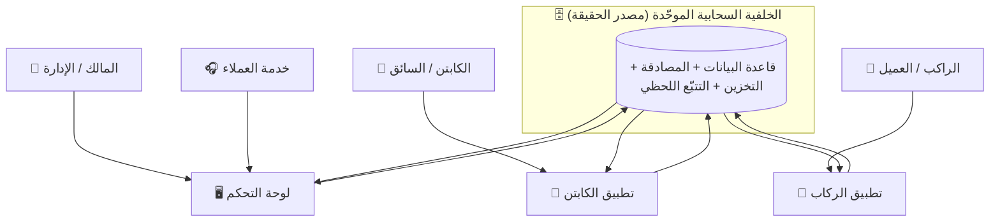

---

# 5. 🧍 رحلة العميل (الراكب)

رحلة العميل مصمّمة لتكون متصلة دون طرق مسدودة، من فتح التطبيق حتى إتمام الرحلة وسجلّها. جميع الخطوات التالية ✅ موجودة فعليًا.

1. **الدخول لأول مرة:** شاشة ترحيبية ثم **جولة تعريفية** (تظهر مرة واحدة).
2. **إنشاء الحساب / تسجيل الدخول:** بالبريد وكلمة المرور، مع استعادة كلمة المرور. ✅ ويمكن إدخال **كود إحالة اختياري** عند التسجيل.
3. **الصفحة الرئيسية والبحث:** نقطة انطلاق للبحث عن رحلة، ومسارات مقترحة.
4. **استعراض المسارات:** مركز المسارات لاكتشاف الخطوط المتاحة ومحطاتها.
5. **البحث عن رحلة:** تحديد نقطة الركوب والوجهة والتاريخ، ثم عرض الرحلات المتاحة.
6. **اختيار الرحلة والمركبة:** استعراض الرحلات وتفاصيل المركبة والمقاعد المتاحة.
7. **اختيار المقعد:** خريطة مقاعد حقيقية، و**قفل المقعد لحظيًا** لمنع حجزه من راكب آخر.
8. **الدفع:** ✅ بطاقة (عبر بوابة Paymob في نافذة دفع آمنة)، أو تحويل محفظة/إنستاباي مع رفع الإيصال، أو نقدًا عند الركوب. ✅ ويمكن تطبيق **كود خصم**.
9. **تأكيد الحجز:** شاشة تأكيد ببيانات الحجز وبطاقة الصعود.
10. **استلام الإشعارات:** إشعارات لحظية داخل التطبيق وإشعارات دفع (Push) بحالة الحجز والرحلة.
11. **تتبّع الرحلة:** ✅ خريطة مباشرة لموقع المركبة، مع تحديث دوري لحظي وخط زمني لحالة الرحلة.
12. **إتمام الرحلة:** إنهاء الرحلة من طرف الكابتن وتحديث الحالة.
13. **سجل الرحلات:** ✅ «رحلاتي» بكل الحجوزات وتفاصيلها وإمكانية التواصل والإلغاء.

**قيمة إضافية للعميل (كلها ✅ موجودة):** برنامج **الولاء** (فئات ونقاط ومكافآت قابلة للاستبدال)، برنامج **الإحالات** (كود شخصي ومكافآت ولوحة متصدّرين)، **الاشتراكات** وإدارتها، **مركز إفراغ المقاعد** لإدارة المقاعد اليومية غير المستخدمة، **الدعم** وفتح التذاكر ومطالبات الاسترداد.

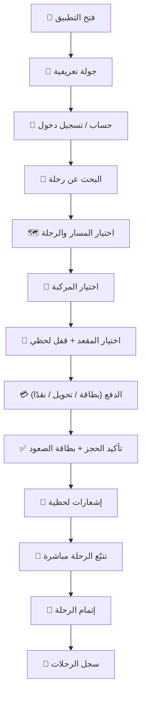

---

# 6. 🚌 رحلة السائق (الكابتن)

تطبيق الكابتن مصمّم ليكون بسيطًا وتشغيليًا. جميع الخطوات ✅ موجودة فعليًا.

1. **تسجيل الدخول:** دخول آمن خاص بالكابتن.
2. **استلام الرحلات المُسندة:** عرض رحلات اليوم المرتبطة بالكابتن ومركبته، محدَّثة لحظيًا.
3. **مراجعة الرحلة والمركبة:** تفاصيل المسار والمحطات وأوقات المغادرة وعدد الركاب.
4. **بدء الصعود وإدارة الركاب:** ✅ قائمة ركاب حية، مع تحديث حالة كل راكب (صعد / متأخر / لم يحضر / ملغى).
5. **مسح تذكرة الصعود:** ✅ ماسح رمز (QR) للتحقق من التذكرة عبر عملية تحقّق خادمية، مع **طابور دون اتصال** يعيد المزامنة عند عودة الشبكة.
6. **بدء الرحلة:** تحويل حالة الرحلة إلى «جارية».
7. **مشاركة الموقع المباشر:** ✅ خدمة موقع تعمل في الخلفية تبثّ إحداثيات المركبة لحظيًا للوحة التحكم والركاب.
8. **تحديث الحالة والإبلاغ:** ✅ تحديثات حالة الرحلة، و**الإبلاغ عن الحوادث/الأعطال** ميدانيًا.
9. **إنهاء الرحلة:** تحويل الحالة إلى «مكتملة» وإغلاق بثّ الموقع.
10. **سجل الرحلات والتقارير:** ✅ سجل رحلات الكابتن، والتواصل، ومركز الإشعارات الخاص به.

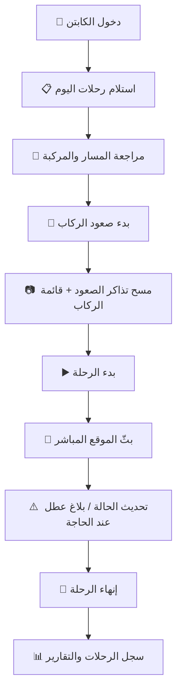

---

# 7. 🛠️ رحلة فريق التشغيل

فريق التشغيل يدير المنظومة كاملة من لوحة التحكم. جميع الوحدات ✅ موجودة فعليًا.

1. **إدارة الأسطول:** إضافة/إدارة **السائقين** و**المركبات** و**الإسنادات** و**المستندات** (رخص، وثائق مركبة) وتواريخ انتهائها، مع قاعدة صارمة: **إسناد نشط واحد فقط** لكل سائق أو مركبة في وقت واحد.
2. **إدارة المسارات:** إنشاء المسارات وترتيب **المحطات** (نقاط الركوب والنزول) وإحداثياتها وفروق التوقيت، وضبط صلاحية الركوب/النزول لكل محطة.
3. **إنشاء الرحلات:** جدولة رحلة بربط مسار + سائق + مركبة، مع **تحقّق من التعارض** (لا يمكن إسناد سائق لرحلتين متعارضتين)، و**توليد المقاعد آليًا** حسب سعة المركبة.
4. **التسعير:** ضبط أسعار مرنة لكل زوج (محطة انطلاق ← محطة وصول): سعر المرة، وأسعار الباقات (5 أيام/شهري…).
5. **متابعة الرحلات:** ✅ وحدة الرحلات تعرض حالة كل رحلة (قادمة/جارية/مكتملة) ومقاعدها وركابها في مكان واحد.
6. **إدارة الحجوزات:** عرض وإدارة الحجوزات (تأكيد/إلغاء/إعادة إسناد)، وعرض خرائط المقاعد.
7. **إدارة المدفوعات والتحقق:** ✅ طابور مراجعة إيصالات الدفع (قبول/رفض/طلب إعادة رفع)، ومتابعة المدفوعات والاسترداد.
8. **إدارة الاشتراكات:** ✅ متابعة الاشتراكات، تأكيد الدفع، تتبّع الاستهلاك والتجديد، وإدارة قوالب الباقات.
9. **الدعم والشكاوى:** ✅ نظام تذاكر ومحادثات لحل شكاوى العملاء.
10. **التقارير:** ✅ إصدار التقارير ومؤشرات الأداء التشغيلية والمالية.

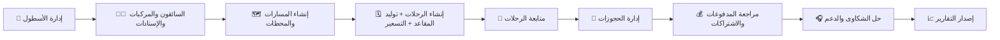

---

# 8. 👑 رحلة مالك النظام

المالك يستخدم اللوحة كأداة قرار استراتيجي. جميع العناصر التالية ✅ موجودة فعليًا (مبنية من بيانات حقيقية مجمّعة من جداول النظام).

1. **لوحة التحكم (الرئيسية):** مؤشرات أداء تشغيلية سريعة.
2. **نظرة المالك:** ✅ لوحة مخصّصة تعرض:
   - **إجمالي الإيرادات** (اشتراكات + حجوزات).
   - **إيراد الحجوزات** (اليوم / الشهر / الإجمالي).
   - **إيراد الاشتراكات**.
   - أعداد العملاء (نشط / منتهٍ / ملغى) و**الاشتراكات النشطة** و**إجمالي التجديدات**.
   - **اتجاه الإيراد** عبر الزمن (رسم بياني)، و**توزيع الإيراد حسب الباقة**.
3. **الاشتراكات والإيرادات:** رؤية مباشرة على قيمة الاشتراكات وتوزيعها.
4. **الحجوزات والرحلات والأسطول:** مؤشرات الإشغال والتشغيل.
5. **التقارير والإحصائيات:** ✅ رسوم بيانية ومؤشرات لدعم القرار.
6. **اتخاذ القرار:** رؤية موحّدة تربط التشغيل بالمال لتحديد الأسعار والمسارات والتوسّع.

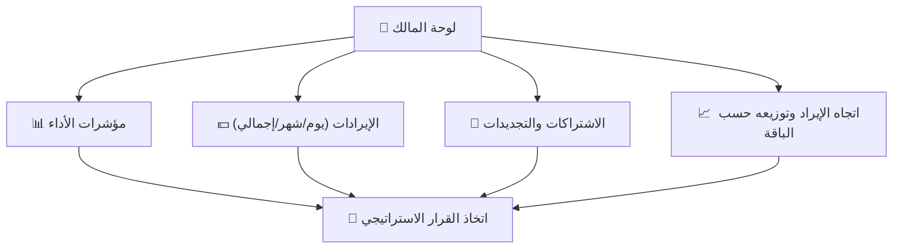

---

# 9. 🧩 شرح جميع وحدات النظام

فيما يلي جميع الوحدات **الموجودة فعليًا** في المنصة، مع هدف كل وحدة وطريقة عملها والمستفيد منها وعلاقتها بباقي النظام.

## 9.1 وحدة الأسطول (Fleet) ✅
- **الهدف:** إدارة المركبات والسائقين وربطهم عبر إسنادات ومتابعة مستنداتهم.
- **طريقة العمل:** تسجيل بيانات السائق (رخصة، حالة) والمركبة (لوحة، سعة، حالة)، ثم إسناد سائق لمركبة بإسناد نشط واحد فقط لكلٍّ منهما.
- **المستفيد:** الإدارة وفريق التشغيل.
- **العلاقة:** الأساس الذي تُبنى عليه الرحلات؛ لا رحلة بلا سائق ومركبة صالحين.
- **المؤشرات:** حالات المركبات/السائقين، الإسنادات النشطة، مستندات قاربت الانتهاء.

## 9.2 وحدة المسارات والمحطات (Routes & Stations) ✅
- **الهدف:** تعريف خطوط السير ونقاط الركوب والنزول.
- **طريقة العمل:** إنشاء مسار (مدينة بداية/نهاية، مسافة، مدة) وترتيب محطاته وإحداثياتها وفروق توقيت الوصول، مع دعم عرض المحطات على **خريطة**.
- **المستفيد:** الإدارة (بناء الشبكة)، والراكب (اكتشاف المسارات).
- **العلاقة:** المسار قالب تُولَّد منه الرحلات، وتُبنى عليه الباقات والاشتراكات.

## 9.3 وحدة الرحلات (Trips) ✅
- **الهدف:** تحويل المسار إلى رحلة قابلة للتشغيل في تاريخ ووقت محدّدين.
- **طريقة العمل:** ربط مسار + سائق + مركبة، توليد المقاعد آليًا حسب السعة، تهيئة مصفوفة التسعير، ثم فتح الحجز.
- **المستفيد:** الإدارة وفريق التشغيل.
- **العلاقة:** المحور المركزي الذي يربط الأسطول بالحجوزات والركاب والتتبّع.
- **دورة الحياة:** `مجدولة ← مفتوحة للحجز ← جارية ← مكتملة / ملغاة`.

## 9.4 وحدة التسعير (Trip Pricing) ✅
- **الهدف:** تسعير مرن لكل مقطع بين محطتين.
- **طريقة العمل:** لكل زوج (من محطة ← إلى محطة) سعر مرة واحدة وأسعار باقات، بعملة قابلة للضبط.
- **المستفيد:** الإدارة والمالك (استراتيجية السعر).
- **العلاقة:** يغذّي حساب قيمة الحجز والاشتراك.

## 9.5 وحدة الحجوزات (Bookings) ✅
- **الهدف:** إدارة حجوزات المقاعد وتذاكر الركاب.
- **طريقة العمل:** حجز مقعد بحالة، قفل لحظي، حالة دفع، وطريقة دفع، مع سير حالات واضح للحجز.
- **المستفيد:** العميل (إنشاء)، وخدمة العملاء (متابعة وتأكيد).
- **العلاقة:** تربط الراكب بالرحلة والمقعد وقناة الدفع.

## 9.6 وحدة المقاعد (Seats) ✅
- **الهدف:** تمثيل حالة كل مقعد في الرحلة.
- **طريقة العمل:** حالات المقعد: متاح / محجوز مؤقتًا / مدفوع / اشتراك / محظور. **لا توجد مقاعد VIP — كل المقاعد قياسية** (قاعدة عمل مثبّتة).
- **المستفيد:** العميل (اختيار)، والإدارة (حظر مقعد للصيانة مثلًا).
- **العلاقة:** جوهر منع الازدواج وضمان دقة الإشغال.

## 9.7 وحدة الدفع والتحقق (Payments & Verification) ✅
- **الهدف:** تحصيل المدفوعات والتحقق منها ومنع التسرّب.
- **طريقة العمل:** قنوات دفع متعددة (بطاقة عبر Paymob، تحويل محفظة/إنستاباي بإيصال، نقدًا)، ورفع الإيصالات إلى تخزين خاص وآمن، ثم طابور مراجعة (قبول/رفض/إعادة رفع).
- **المستفيد:** العميل (الدفع)، وخدمة العملاء والمالية (المراجعة).
- **العلاقة:** تحوّل الحجز إلى إيراد موثّق.

## 9.8 وحدة الاشتراكات والباقات (Subscriptions & Packages) ✅
- **الهدف:** بيع اشتراكات دورية على المسارات وإدارة استهلاكها.
- **طريقة العمل:** باقات متعددة المدد، تتبّع عدد الرحلات المستهلكة مقابل المسموح، تأكيد الدفع، التجديد، و**انتهاء تلقائي** عند تجاوز الصلاحية.
- **المستفيد:** العميل (تنقّل موفّر)، والمالك (إيراد متكرّر مستقر).
- **العلاقة:** قناة دفع بديلة للحجز، ومصدر إيراد رئيسي.

## 9.9 وحدة التتبّع المباشر (Live Tracking) ✅
- **الهدف:** رؤية موقع المركبة لحظيًا.
- **طريقة العمل:** الكابتن يبثّ الموقع من خدمة خلفية؛ اللوحة والراكب يريان الحركة على الخريطة، مع تحديث دوري لحظي.
- **المستفيد:** الراكب (طمأنينة)، والإدارة (انضباط المواعيد).
- **العلاقة:** يربط التنفيذ الميداني بتجربة الراكب ورقابة الإدارة.

## 9.10 وحدة صعود الركاب (Boarding / Check-in) ✅
- **الهدف:** التحقق من الركاب عند الصعود.
- **طريقة العمل:** قائمة ركاب حية للكابتن + مسح رمز التذكرة (QR) عبر تحقّق خادمي، مع طابور دون اتصال، وتحديث يدوي لحالة كل راكب.
- **المستفيد:** الكابتن والإدارة.
- **العلاقة:** تُحدِّث بيان الرحلة وتغذّي حساب عدم الحضور والإشغال الفعلي.

## 9.11 وحدة الإشعارات (Notifications) ✅
- **الهدف:** إبقاء جميع الأطراف على اطّلاع لحظي.
- **طريقة العمل:** إشعارات داخل التطبيق بفئات وأولويات وروابط عميقة، مع بنية جاهزة لإشعارات الدفع (FCM) وتفضيلات المستخدم.
- **المستفيد:** الجميع (عميل/كابتن/إدارة).
- **العلاقة:** العمود الفقري للتواصل عبر كل الأحداث.

## 9.12 وحدة الولاء (Loyalty) ✅
- **الهدف:** تحفيز تكرار الاستخدام.
- **طريقة العمل:** فئات عضوية (Bronze / Silver / Gold / Platinum) بنقاط ومزايا، وكتالوج مكافآت قابلة للاستبدال بأكواد خصم.
- **المستفيد:** العميل والمالك (زيادة الاحتفاظ).
- **العلاقة:** مرتبطة بالحجوزات والإحالات.

## 9.13 وحدة الإحالات (Referrals) ✅
- **الهدف:** نمو قاعدة العملاء عبر التوصية.
- **طريقة العمل:** كود إحالة تلقائي لكل مستخدم، ومنح مكافأة عند أول طلب مدفوع للمُحال، ولوحة متصدّرين وتحليلات. متوفّرة في تطبيق الركاب **وفي لوحة التحكم** (إدارة الإعدادات، سجل الإحالات، سجل المكافآت).
- **المستفيد:** العميل (مكافآت)، والمالك (نمو منخفض التكلفة).
- **العلاقة:** مرتبطة بالحساب والحجز الأول والولاء.

## 9.14 وحدة أكواد الخصم (Promo Codes) ✅
- **الهدف:** حملات ترويجية وتخفيضات.
- **طريقة العمل:** أكواد بخصم ثابت أو نسبي، بحدّ استخدام وتاريخ انتهاء، تُتحقَّق خادميًا عند الدفع.
- **المستفيد:** التسويق والمالك.
- **العلاقة:** تُطبَّق ضمن مسار الدفع.

## 9.15 وحدة الدعم والشكاوى (Support & Tickets) ✅
- **الهدف:** حل مشكلات العملاء ومطالبات الاسترداد.
- **طريقة العمل:** إنشاء تذاكر ومرفقات ومطالبات استرداد، ومحادثات دعم مرئية للوحة التحكم لمعالجتها.
- **المستفيد:** العميل وخدمة العملاء.
- **العلاقة:** مرتبطة بالحجوزات والرحلات والمدفوعات.

## 9.16 وحدة التقارير والتحليلات (Reports) ✅
- **الهدف:** تحويل البيانات إلى رؤى.
- **طريقة العمل:** مؤشرات ورسوم بيانية للإيراد والتشغيل، مبنية على بيانات حقيقية (منها عرض الإيراد اليومي).
- **المستفيد:** الإدارة والمالك.
- **العلاقة:** تُجمِّع مخرجات كل الوحدات.

## 9.17 وحدة المستخدمين (Users) ✅
- **الهدف:** استعراض حسابات العملاء وأدوارهم.
- **طريقة العمل:** قائمة المستخدمين وأدوارهم مع إمكانية تحديث الدور.
- **المستفيد:** الإدارة.
- **العلاقة:** ترتبط بالصلاحيات والحسابات.

## 9.18 وحدة الإعدادات (Settings) ✅ (أساسية)
- **الهدف:** ضبط تفضيلات النظام العامة (مثل المظهر/السمة).
- **الحالة:** أساسية وعاملة؛ توسّعها (إعدادات تشغيلية متقدمة) مدرج في خارطة الطريق.

---

# 10. 🔄 نموذج العمل (اليوم التشغيلي)

يعمل النظام يوميًا كحلقة متصلة تبدأ من التجهيز وتنتهي بالإيراد والتقارير:

1. **التجهيز (مرة واحدة/دوريًا):** تُنشأ المركبات والسائقون وتُسنَد، وتُبنى المسارات ومحطاتها.
2. **الجدولة اليومية:** تُنشأ رحلات اليوم بربط مسار + سائق + مركبة، وتُولَّد المقاعد، ويُضبط التسعير، ثم يُفتح الحجز.
3. **الطلب:** يبحث الركاب ويحجزون مقاعدهم مع قفل لحظي، ويدفعون عبر القناة المناسبة.
4. **المراجعة المالية:** تُراجَع إيصالات التحويل وتُعتمَد الحجوزات، فيتحوّل الحجز إلى إيراد موثّق.
5. **التنفيذ الميداني:** يبدأ الكابتن الصعود، يتحقّق من الركاب، يبثّ الموقع، ثم يُنهي الرحلة.
6. **الإغلاق:** تُسجَّل حالات الحضور/عدم الحضور، ويُستهلك رصيد الاشتراك، وتُقفل الرحلة.
7. **الإيراد والتقارير:** تُجمَّع الأرقام في لوحات المؤشرات ونظرة المالك لدعم القرار.

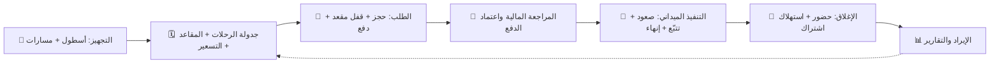

---

# 11. 💰 دورة الإيرادات

الإيراد في المنصة يأتي من مصدرين رئيسيين موثّقين بالكامل: **الحجوزات الفردية** و**الاشتراكات**، مع دعم **أكواد الخصم** و**مكافآت الإحالة/الولاء** كأدوات تسويقية.

1. **الحجوزات:** الراكب يحجز مقعدًا ويختار قناة دفع.
2. **المدفوعات:** بطاقة (Paymob)، أو تحويل بإيصال، أو نقدًا عند الركوب.
3. **التحقق:** مراجعة الإيصالات واعتماد الدفع (للقنوات اليدوية).
4. **الاشتراكات:** إيراد متكرّر عبر الباقات، مع تتبّع الاستهلاك والتجديد.
5. **الإيرادات:** تُجمَّع قيم الحجوزات المعتمدة والاشتراكات.
6. **التقارير:** تُلخَّص يوميًا وشهريًا وإجماليًا.
7. **لوحة المالك:** رؤية موحّدة للإيراد واتجاهه وتوزيعه حسب الباقة.

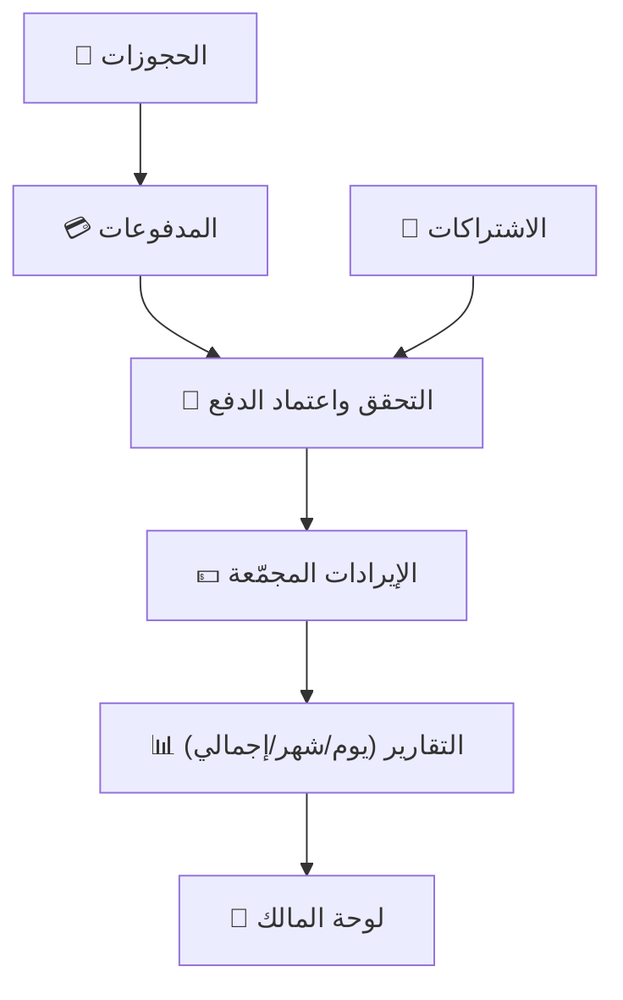

---

# 12. 📏 القواعد التجارية

القواعد التالية مثبّتة فعليًا في النظام وتضمن سلامة التشغيل والمال:

- **المقاعد:** لا توجد مقاعد VIP — **كل المقاعد قياسية**. حالات المقعد: متاح / محجوز مؤقتًا / مدفوع / اشتراك / محظور.
- **سعة المركبة:** المركبة تملك السعة وتخطيط المقاعد؛ تُولَّد مقاعد الرحلة آليًا حسب السعة.
- **الإسناد:** لا يجوز أن يكون لسائق أو مركبة أكثر من **إسناد نشط واحد** في وقت واحد.
- **إنشاء الرحلة:** تتطلّب مسارًا صالحًا + سائقًا + مركبة، مع **تحقّق من التعارض** الزمني للسائق.
- **قفل المقعد:** الحجز يقفل المقعد لحظيًا بعملية خادمية تمنع الازدواج؛ ويُحرَّر المقعد تلقائيًا عند انتهاء المهلة أو الرفض أو الإلغاء.
- **الحجز:** يمرّ بسير حالات واضح من الطلب حتى التأكيد، ولا يُؤكَّد نهائيًا إلا بدفع معتمد أو صعود مؤكَّد.
- **التحقق من المدفوعات:** الإيصالات اليدوية تُراجَع (قبول/رفض/إعادة رفع) قبل اعتماد الإيراد.
- **الدفع:** قنوات متعددة (بطاقة/تحويل/نقدًا/اشتراك)؛ أسرار بوابة الدفع لا توجد داخل التطبيق مطلقًا (تُدار خادميًا لأمان أعلى).
- **الاشتراكات:** تتبّع الاستهلاك مقابل المسموح، وتجديد يزيد الرصيد ويمدّد الصلاحية، و**انتهاء تلقائي** عند تجاوز التاريخ.
- **الاسترداد:** عند إلغاء الرحلة أو رفض الحجز، تُحرَّر المقاعد وتُعالَج الاستردادات وفق الحالة.
- **بداية/نهاية الرحلة:** انتقالات الحالة محكومة (مجدولة ← مفتوحة ← جارية ← مكتملة/ملغاة)، وبعض الإلغاءات صلاحية إدارية فقط.
- **عدم الحضور:** عند إنهاء الرحلة، يُسجَّل الركاب غير المؤكَّدين كـ«لم يحضر» تلقائيًا لأغراض التقارير.

---

# 13. 📊 التقارير والتحليلات

توفّر المنصة طبقة تحليلية مبنية على **بيانات حقيقية** (لا بيانات وهمية):

- **مؤشرات الأداء (KPIs):** الإشغال، الرحلات، الحجوزات، الإيراد.
- **الإيرادات:** إجمالي، يومي، شهري، مع اتجاه زمني ورسوم بيانية.
- **أداء الاشتراكات:** أعداد النشط/المنتهي/الملغى، التجديدات، والإيراد حسب الباقة.
- **أداء الرحلات والأسطول:** حالات التشغيل ومؤشرات الانضباط.
- **الإحالات:** معدّل التحويل، المكافآت الممنوحة، ولوحة المتصدّرين.
- **المؤشرات المالية:** رؤية موحّدة للإيراد في لوحة المالك.
- **دعم القرار:** ربط التشغيل بالمال لتحديد الأسعار والمسارات وخطط التوسّع.

> 🚧 **تصدير الملفات (PDF/Excel):** عرض التقارير ومؤشراتها متاح فعليًا، بينما **توليد ملفات التصدير الرسمية** مدرج في خارطة الطريق.

---

# 14. 🏆 المميزات التنافسية

| الميزة | لماذا تهمّ العميل المشتري |
|---|---|
| **منصة موحّدة (3 تطبيقات + خلفية واحدة)** | مصدر حقيقة واحد، بلا تعارض بيانات بين الأطراف |
| **قفل مقعد لحظي** | يمنع ازدواج الحجز ويحمي التجربة والإيراد |
| **متابعة مباشرة على الخريطة** | انضباط مواعيد وطمأنينة للركاب ورقابة للإدارة |
| **إدارة مالية ومراجعة إيصالات** | تحصيل موثّق يقلّل التسرّب المالي |
| **دفع متعدد القنوات (بطاقة/تحويل/نقدًا)** | يناسب كل شرائح العملاء وقنوات السوق المحلية |
| **اشتراكات وباقات** | إيراد متكرّر مستقر وولاء أعلى |
| **ولاء + إحالات + أكواد خصم** | أدوات نمو واحتفاظ مدمجة بلا أنظمة خارجية |
| **تقارير ونظرة مالك** | قرار مبني على بيانات لحظية |
| **إدارة أسطول ومستندات** | انضباط تشغيلي وامتثال (تواريخ انتهاء الرخص/الوثائق) |
| **بنية أدوار وصلاحيات** | فصل واضح للمسؤوليات وحماية العمليات الحسّاسة |
| **جاهزية مؤسسية وقابلية توسّع** | تطبيقات منفصلة لكل دور تدعم النمو |

---

# 15. 🎯 القطاعات المستهدفة

- **شركات النقل والمواصلات:** إدارة أساطيل وخطوط منتظمة وتحصيل موثّق.
- **الجامعات:** نقل الطلاب والكوادر على مسارات ثابتة باشتراكات دورية.
- **المدارس:** نقل منظّم وآمن مع متابعة مباشرة وقوائم صعود.
- **الشركات:** نقل الموظفين بين المناطق والمكاتب مع تقارير إشغال.
- **المصانع والمناطق الصناعية:** نقل العمالة بجداول ذروة وباقات.
- **الجهات الحكومية:** تشغيل نقل مؤسسي منضبط وموثّق.
- **مشغّلو النقل الذكي:** رقمنة كاملة للعمليات والتحصيل والتتبّع.

---

# 16. 🚧 القيود الحالية وخارطة الطريق المستقبلية

هذا الفصل يفصل بوضوح ما هو **مخطط له مستقبلًا** عن الميزات المكتملة. الميزات التالية **ليست جزءًا من الوظائف المكتملة**، وذُكرت هنا للشفافية الكاملة.

| # | الميزة | الحالة الحالية | مدى الاكتمال | سبب عدم الاكتمال | التأثير على النظام | التوصية المستقبلية |
|---|---|---|---|---|---|---|
| 1 | **رمز الصعود (QR) لدى الراكب** | 🚧 عرض تجريبي (لا يُشفِّر التذكرة الفعلية بعد) | جزئي | تطبيق الكابتن يملك ماسحًا فعليًا وتحقّقًا خادميًا، لكن رمز الراكب المعروض تمثيلي | لا يوقف الصعود؛ الكابتن يؤكّد الركاب يدويًا من القائمة الحية | ربط الرمز المعروض بالتذكرة الحقيقية ليكتمل مسار المسح الآلي |
| 2 | **واجهة تحرير الصلاحيات في اللوحة** | 🚧 شاشة مبدئية | جزئي | الصلاحيات مطبّقة في المنطق، دون واجهة تحرير للمصفوفة | لا يؤثر على الأمان (RBAC نشط) | بناء واجهة لإدارة الأدوار والصلاحيات بصريًا |
| 3 | **الحجز متعدد الركاب** | 🚧 واجهة فقط | جزئي | منطق الحجز يعالج راكبًا واحدًا لكل عملية | يحدّ من حجز المجموعات في عملية واحدة | توسعة منطق الحجز لقبول عدة ركاب وبيانات كلٍّ منهم |
| 4 | **صور المركبات** | 🚧 صور مبدئية | جزئي | لا يوجد مصدر صور فعلي للمركبات بعد | تجميلي فقط | ربط مصدر صور حقيقي للمركبات |
| 5 | **المكالمات داخل التطبيق (الدعم)** | 🚧 محاكاة صوتية | جزئي | الرسائل النصية فعلية، أما المكالمة الصوتية فتجريبية | لا يعطّل الدعم النصي | ربط خط دعم فعلي (اتصال مباشر) أو حل صوتي متكامل |
| 6 | **الأسئلة الشائعة والمحتوى القانوني** | 🚧 محتوى ثابت | جزئي | لا يوجد جدول محتوى قابل للتحرير بعد | لا يؤثر على التشغيل | نقل المحتوى إلى مصدر قابل للتحديث من اللوحة |
| 7 | **إدارة الجلسات عبر الأجهزة** | 🚧 الجلسة الحالية فقط | جزئي | لا يوجد سجل جلسات متعددة الأجهزة | أثر أمني محدود | إضافة إدارة/إنهاء الجلسات على الأجهزة الأخرى |
| 8 | **تسجيل الدخول الاجتماعي (Google/Apple)** | 🚧 غير مفعّل | غير مبني | لم يُفعّل مزوّدو الدخول الاجتماعي بعد | لا يؤثر (الدخول بالبريد فعّال) | تفعيل مزوّدي الدخول عند الحاجة |
| 9 | **تجديد الاشتراك التلقائي (خصم مباشر)** | 🚧 تجديد يدوي | جزئي | التجديد الحالي يدوي عبر الدفع | لا يعطّل الاشتراكات | ربط تجديد تلقائي ببوابة الدفع |
| 10 | **جدولة الرحلات المتكرّرة/الجماعية** | 🚧 إنشاء فردي | جزئي | تُنشأ الرحلات فرديًا حاليًا | يزيد الجهد اليدوي للجدولة الكثيفة | محرّك جدولة متكرّرة (نمط دوري) |
| 11 | **تصدير التقارير (PDF/Excel)** | 🚧 العرض متاح، التصدير قيد التطوير | جزئي | توليد ملفات التصدير الرسمية لم يكتمل | لا يؤثر على العرض والتحليل | إضافة توليد ملفات رسمية بترويسة المؤسسة |
| 12 | **الوضع متعدد المستأجرين (SaaS كامل)** | 🚧 نشر أحادي المؤسسة حاليًا | جزئي | البنية الحالية تخدم مؤسسة واحدة | يحدّ من الاستضافة المشتركة لعدة عملاء | إضافة عزل بيانات متعدد المستأجرين للتوسّع التجاري |

> ✅ **للتأكيد:** كل ما ورد في الفصول 1–15 تحت علامة ✅ هو **موجود فعليًا ومتحقَّق منه**. الجدول أعلاه هو **الوحيد** الذي يضم الميزات المخطّط لها مستقبلًا، وقد فُصل عمدًا عن الوظائف المكتملة.

---

# 🗺️ المخططات التجارية (Business Diagrams)

## دورة الحجز (Booking Cycle)

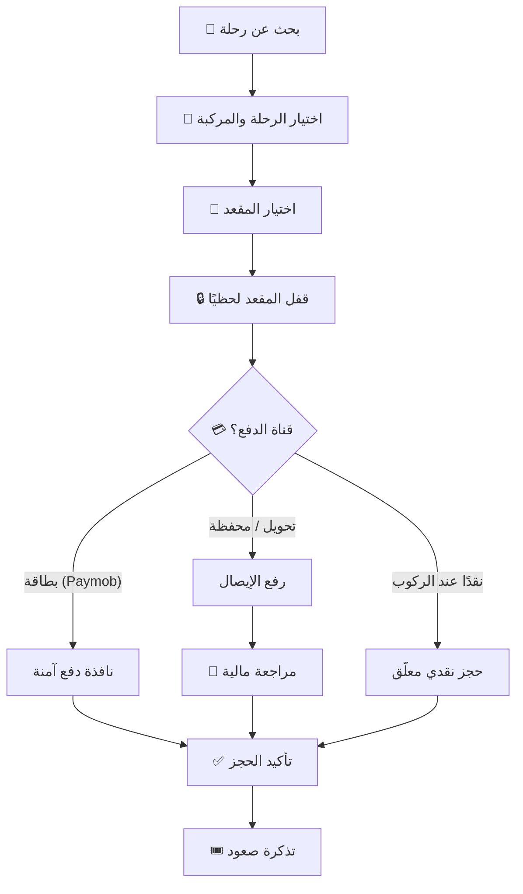

## دورة الرحلة (Trip Lifecycle)

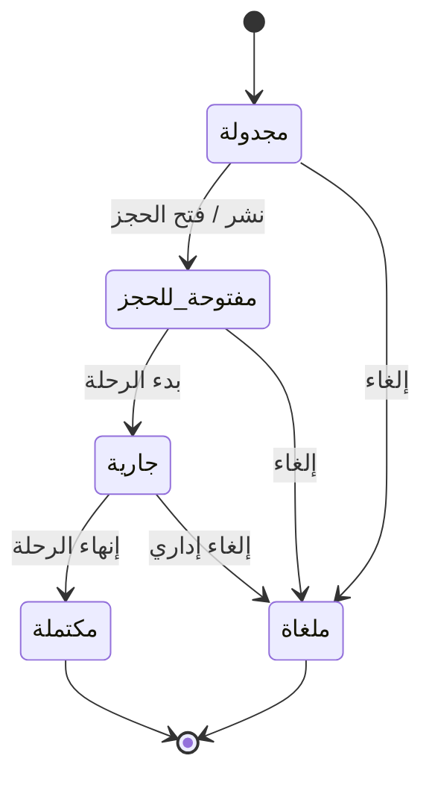

## دورة المدفوعات (Payment Cycle)

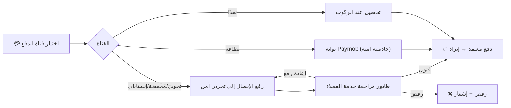

## رحلة العميل (Customer Journey)

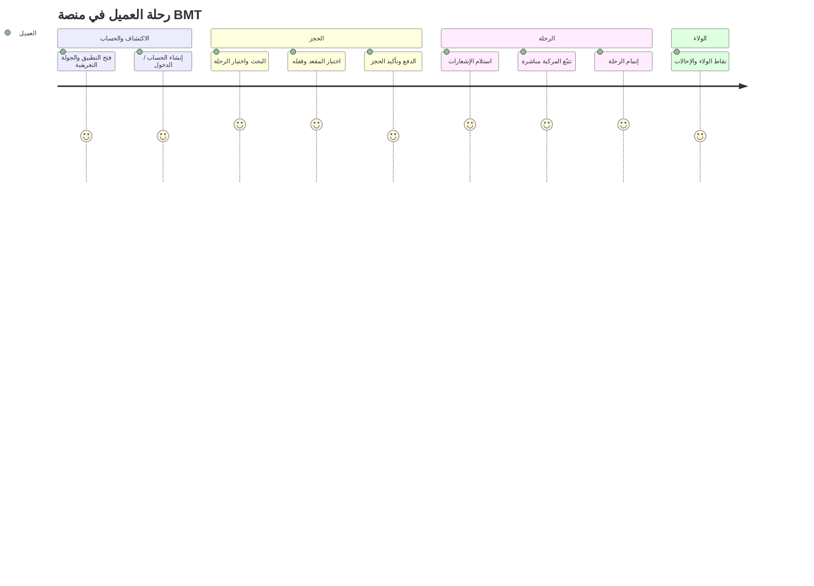

## رحلة السائق (Driver Journey)

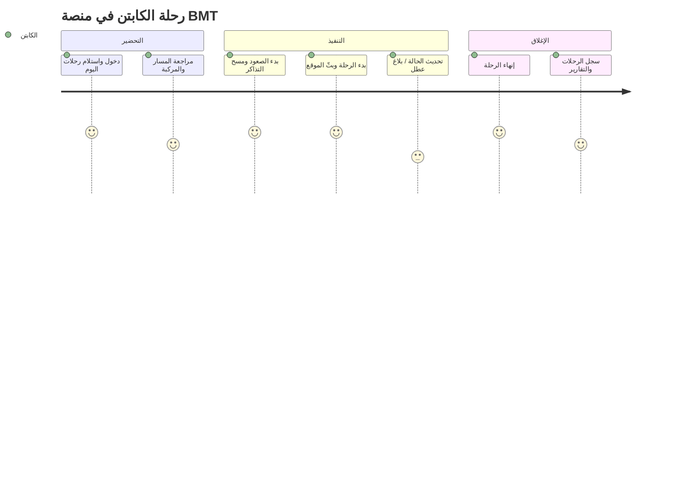

## رحلة الإدارة (Operations Journey)

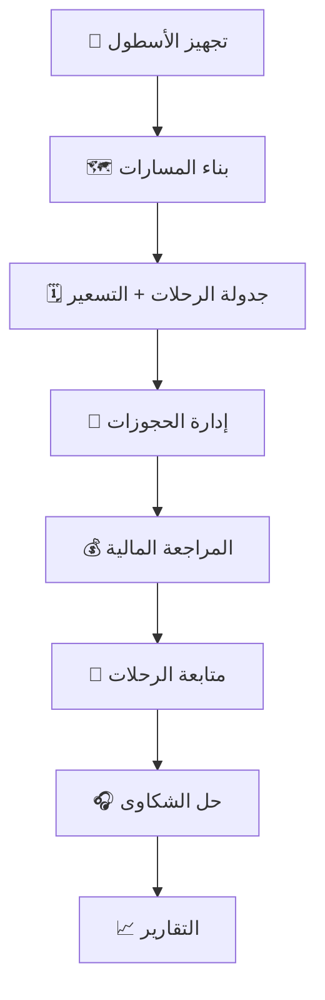

## رحلة المالك (Owner Journey)

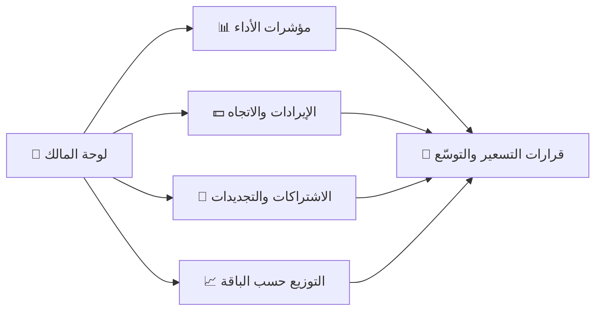

## دورة الإيرادات (Revenue Cycle)

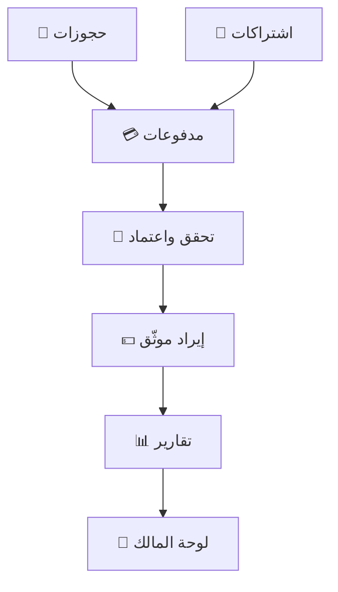

## مخطط سياق الأعمال (Business Context Diagram)

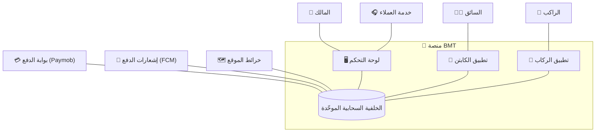

## مخطط علاقات كيانات الأعمال (Business Entity Relationship Diagram)

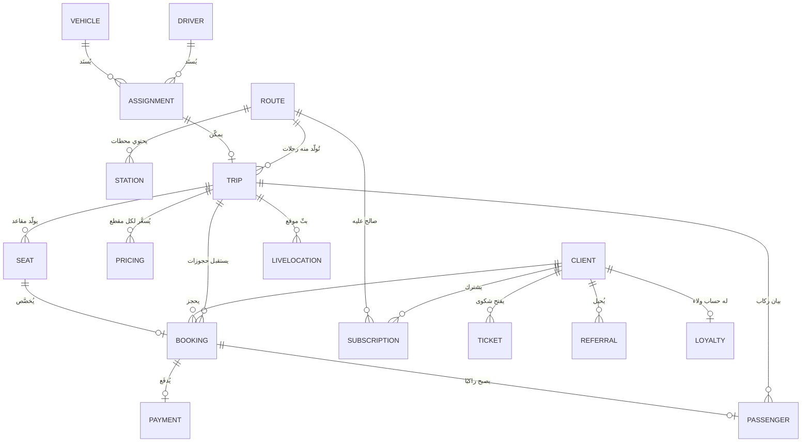

## العلاقات بين جميع الوحدات (Modules Relationship Map)

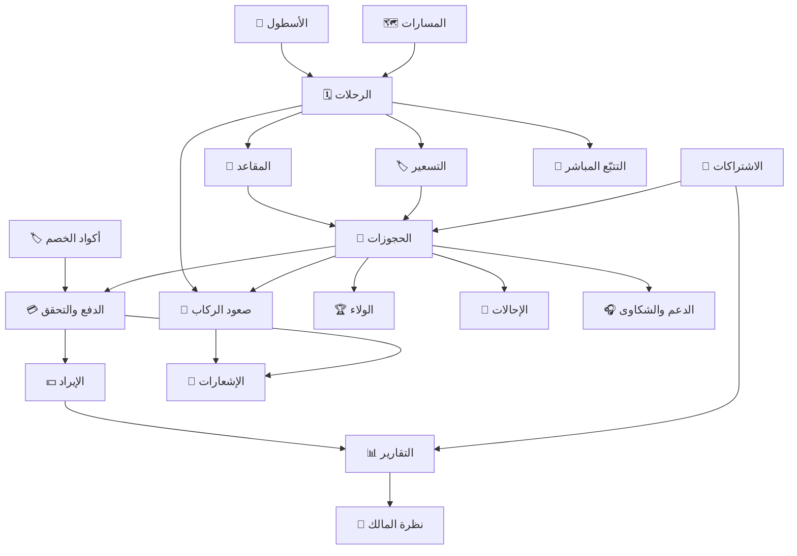

## تدفّق الأعمال الكامل (Complete Business Flow)

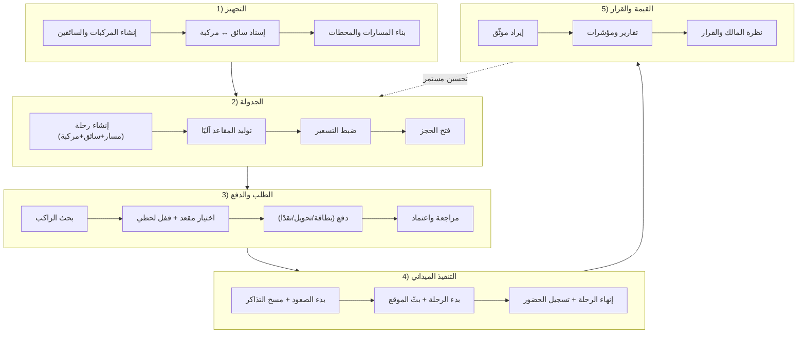

---

## 🚌 منصة BMT لإدارة النقل الذكي

**منظومة موحّدة — تشغيل منضبط — إيراد موثّق — قرار مبني على البيانات.**

*هذه الوثيقة تصف الوظائف المتحقَّق منها فعليًا في المنصة، وتفصلها بوضوح عن خارطة الطريق المستقبلية.*

