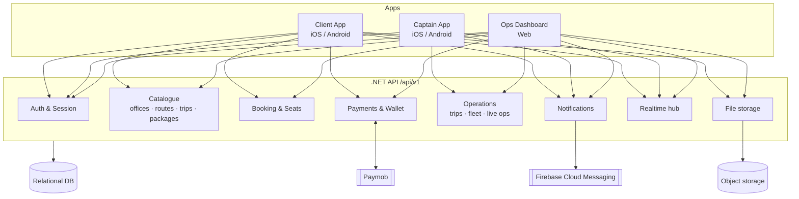
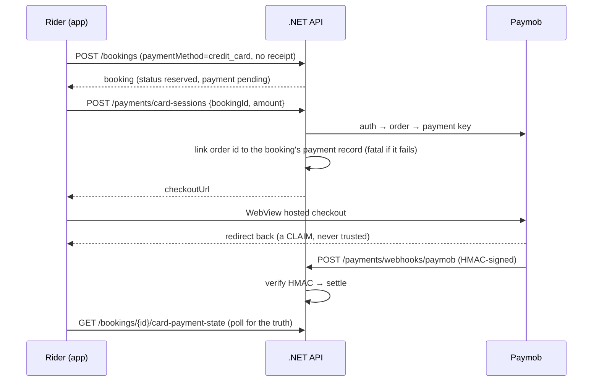
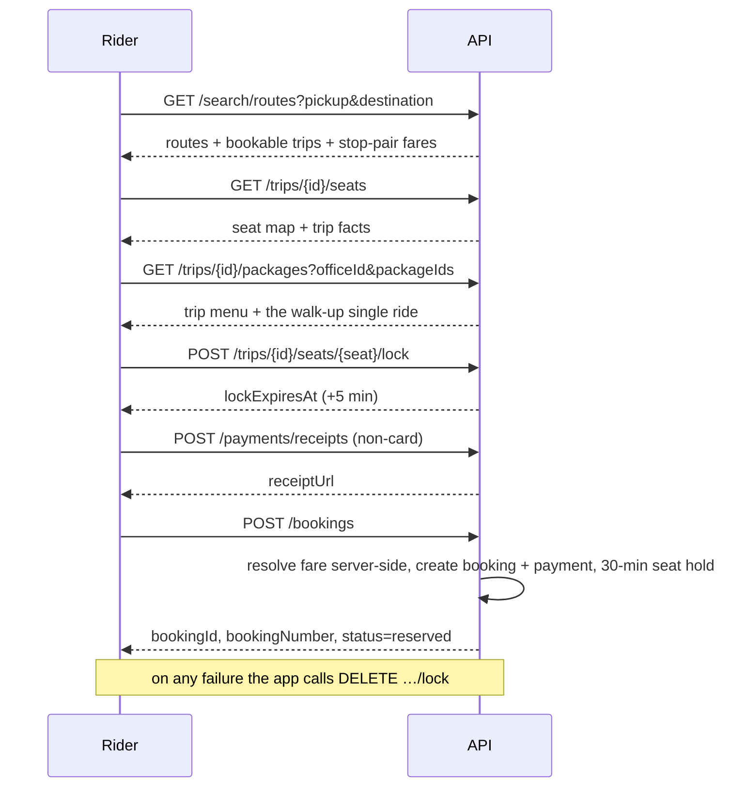

# EWT API Documentation

> **Source of truth:** this document was generated by reading the EWT Flutter
> repository (`bmt_app`, package name `bmt_app`) at commit `2cc1fba7`, branch
> `new-landing`. Every endpoint below exists because some Flutter code today
> performs the equivalent operation against Supabase. Nothing here is aspirational
> unless it is explicitly tagged.
>
> **Tags used throughout this document**
>
> | Tag | Meaning |
> |---|---|
> | `UNKNOWN` | The codebase does not answer this question. |
> | `NEEDS BACKEND DECISION` | A real decision the .NET team must take. |
> | `CURRENTLY SUPABASE-SPECIFIC` | Behaviour that exists only because Supabase provides it. |
> | `NOT YET IMPLEMENTED` | The Flutter code has a seam for it, but no implementation. |
> | `REQUIRES CONFIRMATION` | Inferred from code but should be confirmed with the product owner. |
> | `BACKEND RECOMMENDATION` | Not current behaviour; a suggested improvement, clearly marked. |

---

## 1. Purpose

### 1.1 Why this document exists

The EWT product is three Flutter applications (Client, Captain, Ops Dashboard)
built from a single Dart package. All three talk **directly to Supabase**: they
hold a Supabase publishable key, sign in through Supabase Auth, read PostgREST
tables and views, call ~110 PostgreSQL `SECURITY DEFINER` functions as RPCs,
subscribe to Supabase Realtime channels, upload to Supabase Storage, and invoke
four Supabase Edge Functions.

A new backend team is building a .NET / ASP.NET Core service over a relational
database. This document is the **API contract** the Flutter clients need that
service to satisfy. It describes, per application and per business domain:

* what operation the app performs today,
* what data it sends,
* what data it must get back for the existing screens to render,
* which business rules are currently enforced server-side (in SQL) and must be
  re-implemented in .NET,
* which authorisation boundary is currently enforced by Postgres Row Level
  Security (RLS) and must become explicit backend authorisation.

### 1.2 Current architecture (as built)

```
Flutter (one package, three flavors)
   │  supabase_flutter SDK  ── wrapped by a Dio http client adapter
   │      (lib/core/network/supabase_dio_adapter.dart)
   ▼
Supabase project  https://nbwzourpbnmewwklewyr.supabase.co
   ├── Auth (GoTrue)          email + password only, in all three apps
   ├── PostgREST              direct table/view reads and writes
   ├── RPC (SQL functions)    ~110 SECURITY DEFINER functions = the business layer
   ├── Realtime               Postgres CDC over WebSocket
   ├── Storage                4 buckets
   └── Edge Functions (Deno)  4 functions, two of which hold the service-role key
         ├── paymob-create-intention     (card checkout)
         ├── paymob-payment-callback     (gateway webhook, HMAC-verified)
         ├── platform-create-office      (platform admin onboarding)
         └── office-manage-user          (office staff provisioning)
External: Firebase Cloud Messaging (push), Paymob (card gateway),
          OpenStreetMap tiles via flutter_map, device GPS via geolocator.
```

The important structural fact for the backend team: **the business logic is not
in Flutter.** It lives in SQL functions. A Flutter datasource typically does one
of two things — a thin PostgREST read, or a single RPC call whose SQL body
contains the entire rule set (validation, state machine, seat accounting,
notifications, ledger entries). Section 20 maps each RPC to a proposed endpoint
and states what its body does.

### 1.3 Target architecture

```
Flutter Apps (Client / Captain / Dashboard)
        │  HTTPS, JSON, Bearer token
        ▼
   .NET / ASP.NET Core  —  /api/v1
        ├── Relational database        (NEEDS BACKEND DECISION: which one)
        ├── Object storage             (NEEDS BACKEND DECISION: provider)
        ├── Authentication / identity  (NEEDS BACKEND DECISION: strategy)
        ├── Realtime transport         (NEEDS BACKEND DECISION: SignalR vs polling)
        ├── Push notifications         (FCM stays; sending moves to backend)
        └── Payments                   (Paymob; secrets must stay server-side)
```

### 1.4 In scope

* Every backend operation performed by the Client app, the Captain app and the
  Ops Dashboard, as found in the current code.
* The request and response shapes those screens require.
* The business rules currently implemented in SQL that the backend must own.
* The authorisation boundaries currently enforced by RLS.
* Realtime, storage, notification and payment flows.
* Enumerations and status vocabularies, with their exact wire values.

### 1.5 Explicitly out of scope

* The .NET implementation itself.
* The database schema of the new system. This document describes an **API**, not
  tables. Where a Supabase table name appears it is a *provenance note*, not a
  schema instruction.
* The Flutter refactor that will replace the Supabase datasources.
* Data migration from Supabase to the new database.
* The marketing landing page (`lib/landing/`), which is static and makes no
  backend calls.
* `lib/features/component/` — a 2-file scratch directory with no backend usage.

### 1.6 One critical caveat about the current build

`lib/core/flavors/app_bootstrap.dart` currently has its flavor `switch`
commented out and always boots the **Dashboard**. `lib/main_client.dart`,
`lib/main_captain.dart` and `lib/main_dashboard.dart` all have their `main()`
functions commented out; only `lib/main.dart` (which reads the flavor from
`--dart-define`) is live. This is a temporary state of the working tree, not a
statement about which apps exist. All three apps are fully implemented and all
three are documented here.

---

## 2. System Overview

### 2.1 The three applications

| App | Flavor key | Bundle id | Platform | Who signs in | Sign-in credential |
|---|---|---|---|---|---|
| **Client** (EasyWay) | `client` | `com.bmt.client` | iOS / Android | Passengers | email + password |
| **Captain** (EasyWay Captain) | `captain` | `com.bmt.captain` | iOS / Android | Drivers | phone number only (no password typed) |
| **Ops Dashboard** (BMT Dashboard) | `dashboard` | `com.bmt.dashboard` | Web | Office staff + platform admins | username + password |

Flavor configuration lives in `lib/core/flavors/app_flavor.dart`. Each flavor can
override the backend URL via `--dart-define` (`CLIENT_SUPABASE_URL`,
`CAPTAIN_SUPABASE_URL`, `DASHBOARD_SUPABASE_URL`, falling back to
`SUPABASE_URL`). The new backend must offer the same per-flavor override hook.

### 2.2 The tenancy model

EWT is a **multi-tenant marketplace**. The tenant is an **office**
(a transport operator).

* An office owns its routes, trips, drivers, vehicles, packages, bookings,
  subscriptions, support tickets, wallets and staff.
* A **client (passenger) is not owned by an office.** The `clients` record is
  platform-wide; an office "has" a customer only through that customer's
  bookings/subscriptions with it. This is why the Dashboard's Customers module is
  read-only and goes entirely through RPCs that resolve the relationship
  server-side (§10.6).
* An office has two visibility axes, and they are independent:
  * **operational status** — `active | paused | suspended | archived`
  * **marketplace listing status** — `draft | listed | unlisted`
  Only `status = 'active' AND listing_status = 'listed'` offices are visible to
  passengers. A brand-new self-registered office is `active` + `draft`: its own
  dashboard works immediately, but no passenger can see it.
* A **platform admin** is a dashboard user with an extra flag; they administer
  offices, licensing plans and billing across the whole platform.

### 2.3 The licensing / entitlement layer

Every office holds a **license** bound to a **plan**. Plans grant **features**
(booleans, tiers) and **quotas** (`max_routes`, `max_captains`, `max_exports_per_month`,
`max_storage_mb`, …). Enforcement today is in the database — triggers and RPC
guards raise one of six refusal codes. The Dashboard reads the resolved
entitlement document via `office_entitlements()` and uses it only to decide what
to *offer*; the server is the boundary. See §10.14 and §18.9.

### 2.4 Architecture diagram



### 2.5 External services actually used

| Service | Used by | Purpose | Status after migration |
|---|---|---|---|
| Firebase Cloud Messaging | all three apps | push delivery | Keep. Token registration and sending move to the .NET API. |
| Paymob (`accept.paymob.com`) | Client only | card payments | Keep. Both Edge Functions must be reimplemented in .NET. |
| OpenStreetMap tiles (`flutter_map`) | Client, Captain, Dashboard | map rendering | No backend involvement. |
| Device GPS (`geolocator`) | Captain | position source | No backend involvement; the fixes it produces are POSTed. |
| `app_links` deep linking | Client | `easyway://reset-password/` password-reset return | The reset link the backend emails must use this scheme. |

There is **no SMS provider, no Google sign-in and no Apple sign-in** configured.
`PendingPhoneAuthDatasource` and `PendingSocialAuthDatasource` deliberately throw
`AuthMethodFailure.unavailable`. See §7.9 — `NOT YET IMPLEMENTED`.

---

## 3. API Conventions

### 3.1 Base URL

```
https://api.example.com/api/v1
```

`NEEDS BACKEND DECISION` — production and staging base URLs. The Flutter side
already supports per-flavor overrides via `--dart-define`, so the backend only has
to supply the values.

### 3.2 Content type

`application/json; charset=utf-8` for every endpoint except file upload
(`multipart/form-data`, §13).

All text content includes Arabic. UTF-8 is mandatory end to end. Many operator-facing
error messages in the apps are Arabic strings mapped **client-side** from machine
error codes — see §3.6.

### 3.3 Authentication — what the apps do today

All three apps use **Supabase Auth email + password**, even where the user never
types an email:

| App | What the user types | What is actually sent to Auth |
|---|---|---|
| Client | email + password | the same |
| Captain | phone number, nothing else | a synthetic email + a server-issued secret, both returned by the `resolve_captain_login` RPC before the sign-in call |
| Dashboard | username + password | `<username>@office.ewt.internal` + the typed password; the email is resolved by the `resolve_office_user_login` RPC |

`office.ewt.internal` is a synthetic domain that receives no mail. It exists only
because Supabase Auth requires an email identifier.

**`CURRENTLY SUPABASE-SPECIFIC`.** The two-step "resolve then sign in" dance exists
solely to work around that requirement. The new backend should expose a single
login endpoint per identity kind (§7). The Flutter layer will need modification
either way; the contract below describes the clean target.

Session handling today:

* The Supabase SDK persists the session (access token + refresh token) itself and
  refreshes it transparently. There is **no** app-level refresh code.
* `lib/core/network/app_interceptors.dart` attaches
  `Authorization: Bearer <session.accessToken>` to every outgoing request, plus a
  static `apikey: <publishable key>` header set in `DioFactory`.
* All three apps listen to `auth.onAuthStateChange` and react to sign-out by
  routing to the login screen.
* **All three apps share one session store per device** (same Supabase client,
  same storage). This has caused real bugs: a driver session restored inside the
  Client app produced a "passenger" with no `clients` row, and booking failed on a
  foreign key. `ClientAccountGuard.ensureClientSession()` exists purely to detect
  and evict that case. The new backend should issue **audience-scoped tokens** so a
  captain token is simply not accepted by client endpoints.

Token expectations:

* `UNKNOWN` — access-token lifetime. The Supabase default (1 h) was never
  configured in this repo.
* `NEEDS BACKEND DECISION` — JWT claim set. The apps currently read
  `auth.currentUser.id` (subject) and `auth.currentUser.userMetadata['full_name' | 'phone' | 'role']`.
  Anything the backend wants the app to read from the token must be in those
  positions or the Flutter code must change.
* `NEEDS BACKEND DECISION` — refresh-token strategy (rotation, absolute lifetime,
  revocation on sign-out).

Unauthenticated requests: the marketplace browse surface is readable without a
session today (offices, routes, trips, packages, prices, stations, aggregate
driver/vehicle ratings). Everything else requires a session. §19 is the full
matrix.

### 3.4 Request headers

| Header | Required | Description |
|---|---|---|
| `Authorization` | for authenticated endpoints | `Bearer <access token>` |
| `Content-Type` | on requests with a body | `application/json` |
| `Accept` | recommended | `application/json` |
| `Accept-Language` | `BACKEND RECOMMENDATION` | Not sent today. The apps are Arabic-first (Dashboard and Captain are Arabic-only; the Client has `ar`/`en`). If the backend is to localise messages it needs this header; otherwise it must return machine codes and let the app localise (§3.6 — the current model). |
| `X-Request-Id` | `BACKEND RECOMMENDATION` | Not sent today. Useful for support correlation. |
| `apikey` | **drop** | `CURRENTLY SUPABASE-SPECIFIC`. Remove entirely. |

### 3.5 Idempotency

The wallet and refund RPCs already take a client-generated idempotency key
(`p_request_key`, a UUID) and reject a reuse of the same key with different
arguments (`request_key_conflict`). That pattern should become a standard
`Idempotency-Key` header for all money-moving endpoints. See §22.

### 3.6 Error vocabulary — the single most important convention to preserve

The current system uses **machine error codes**, raised by SQL as bare exception
names, that the Flutter layer maps to Arabic sentences. Example, from
`SupabaseWalletDatasource`:

```
server raises:  'amount_exceeds_policy'
Flutter shows:  'المبلغ يتجاوز الحد المسموح للعملية الواحدة في إعدادات المكتب.'
```

There are **more than 120 such codes** in the apps today, and the mapping tables
live in the Flutter datasources. This is a deliberate design: SQL cannot localise,
and each code names a *specific control that fired*, which is what makes a refusal
actionable.

**The new backend must keep returning these exact codes.** If it returns different
strings, every one of those Arabic messages silently degrades to a generic
fallback. Sections 7–10 name the codes per endpoint; §21 lists them all.

---

## 4. Standard Response Format

### 4.1 What exists today

`CURRENTLY SUPABASE-SPECIFIC` — there is **no project-wide envelope**. PostgREST
returns bare rows or arrays; RPCs return whatever `jsonb` the SQL function built.
Individual RPCs are inconsistent: some return `{"success": true, ...}`, some return
a bare value (`office_join_code` returns a `text`), some return `null`
(`captain_session_context` when signed out), some return a count
(`platform_broadcast_notification` returns an `integer`).

`lib/core/network/api_result.dart` defines a `Success<T>` / `Failure(message, code, technicalDetails)`
sealed pair, and `api_error_handler.dart` maps Dio status codes onto it — but
these are used only by the (currently empty) Retrofit `ApiService`. **No Supabase
datasource uses them.** They are a seam prepared for exactly this migration.

### 4.2 Proposed convention

`NEEDS BACKEND DECISION` — the shape below is a proposal, not existing behaviour.
What is *not* negotiable is the presence of a stable machine `code` on every error
(§3.6).

**Success — single resource** (`200` / `201`): the resource object at the top
level, no envelope.

```json
{ "id": "6f1c…", "bookingNumber": "BK-3A9F12C4", "status": "reserved" }
```

**Success — collection** (`200`):

```json
{
  "items": [ { "id": "…" } ],
  "page": { "offset": 0, "limit": 50, "total": 431, "hasMore": true }
}
```

**Success — no content**: `204`, empty body.

**Error** — every non-2xx:

```json
{
  "error": {
    "code": "amount_exceeds_policy",
    "message": "Human-readable English fallback.",
    "details": { "limit": 5000, "used": 5200, "planKey": "basic" },
    "traceId": "0HMV…"
  }
}
```

`error.code` is the contract. `error.message` is a fallback only; the apps render
their own Arabic text keyed off `code`. `error.details` carries the structured
payload the licensing refusals already send (today via Postgres `DETAIL`) — see
§10.14.

### 4.3 Status codes

| Status | Meaning | When |
|---|---|---|
| `200 OK` | success with body | all reads, most mutations that return the updated resource |
| `201 Created` | resource created | booking creation, staff creation, office onboarding |
| `204 No Content` | success, nothing to return | mark-as-read, seat-lock release |
| `400 Bad Request` | malformed request | unparseable body, missing required field |
| `401 Unauthorized` | no/expired/invalid token | `not_authenticated` |
| `403 Forbidden` | authenticated but not allowed | `not_authorized`, `dashboard_admin_required`, `platform_admin_required`, `not_your_trip`, `not_your_booking`, and every licensing refusal |
| `404 Not Found` | resource does not exist or is not visible to the caller | `booking_not_found`, `trip_not_found`, `refund_not_found`, `client_not_found` |
| `409 Conflict` | state conflict | `seat_unavailable`, `duplicate_active_booking`, `username_taken`, `slug_taken`, `request_key_conflict`, `already_reversed` |
| `422 Unprocessable Entity` | semantically invalid or illegal transition | `invalid_transition`, `invalid_amount`, `invalid_rating`, `trip_not_publishable:<reason>`, `booking_already_confirmed`, `lock_expired` |
| `429 Too Many Requests` | rate limited | `adjustment_rate_limited`, and Supabase Auth's own rate limit on password reset (the Client maps it to the literal `RateLimit`) |
| `500 Internal Server Error` | unexpected failure | — |

`NEEDS BACKEND DECISION` — the 403/422 split. The current system raises everything
as a Postgres exception with no status distinction; the app matches on the message
substring. The mapping above is a proposal. **Whatever is chosen, the `code` must
stay stable**, because that is what the apps actually match on.

---

## 5. Pagination

### 5.1 What is paginated today

Only three surfaces take real paging parameters, and all three are Dashboard RPCs
that take `p_limit` / `p_offset` and return a total:

| Surface | RPC | Default limit | Flutter caller |
|---|---|---|---|
| Wallet customer directory | `office_wallet_directory` | 50 | `SupabaseWalletDatasource.fetchDirectory` |
| Wallet ledger | `office_wallet_ledger` | 100 | `…fetchLedger` |
| Customer directory | `office_customer_directory` | 25 | `SupabaseCustomersDatasource.fetchDirectory` |
| Customer trips | `office_customer_trips` | 20 | `…fetchTrips` |
| Customer payments | `office_customer_payments` | 20 | `…fetchPayments` |
| Office invoices | `office_invoices` | 50 | `SupabaseOfficeBillingDatasource.getInvoices` |
| Platform licensing audit | `platform_audit_log` | 100 | `…audit` |

**These use offset paging with a server-computed total.** Keep that shape.

### 5.2 What is capped but not paginated

`lib/apps/dashboard/core/query/dashboard_query_caps.dart` defines row ceilings for
the Dashboard's list modules. The contract it documents is explicit and must be
preserved: *a capped query returns the **newest** rows, ordered descending on a
time column, and the screen tells the operator the view is a window.*

| Cap constant | Value | Applied to |
|---|---|---|
| `bookings` | 2000 | `operation_bookings` list |
| `trips` | 1500 | `operation_trips` list |
| `tickets` | 1000 | `support_tickets` list |
| `subscriptions` | 1500 | `subscriptions` list |
| `reviews` | 1500 | `trip_reviews` list |
| `financeLedger` | 3000 | finance payment/refund/subscription ledgers |

`BACKEND RECOMMENDATION` — replace these caps with real server-side paging plus
server-side totals. The code comment in that file says so itself
("Server-side paging with server-side tallies is the end state"). Until then, the
backend must reproduce the cap **and** the ordering, or the numbers on screen
change meaning.

### 5.3 Other hard limits found in the code

| Limit | Value | Where |
|---|---|---|
| Client home upcoming trips | 50 | `SupabaseHomeDatasource.getHomeData` |
| Client home own bookings | 10 | same |
| Trips per route in search | 100 | `SupabaseBookingSearchDatasource._maxTripsPerRoute` |
| Search result routes returned | 8 | `…getRoutes` (after ranking) |
| Popular routes | 10 | `…getPopularRoutes` |
| Route-catalog availability probe | 400 | `SupabaseRoutesDirectoryDatasource._maxUpcomingTrips` |
| Office trips on office profile | 30 | `SupabaseOfficesDatasource.fetchOfficeTrips` |
| Notifications (client & captain) | 100 | notification datasources |
| Operational alerts (dashboard) | 100 | `SupabaseOperationalAlertsDatasource` |
| Booking reassignment targets | 100 | `SupabaseBookingsDatasource.fetchReassignmentTargets` |
| Refund queue | 300 | `SupabaseWalletDatasource.fetchRefundQueue` |
| Subscription creation client picker | 200 | `…fetchCreationOptions` |
| Referral leaderboard | 50 (dashboard) / 10 (client) | referral datasources |
| Client support "related booking" picker | 10 | `SupabaseSupportDatasource` |

### 5.4 Endpoints that are unbounded today

`BACKEND RECOMMENDATION` — these read the whole table for the office and will not
scale:

* `SupabaseFinanceDatasource.getRevenueMetrics` — deliberately uncapped, because
  it computes sums and a sum over a truncated set would be a lie. It narrows cost
  by selecting three columns. **The right fix is a server-computed aggregate
  endpoint** (§10.7).
* `SupabaseFleetDatasource.fetchWorkspace` — loads the office's entire fleet plus
  a trailing-365-day trip history in one call.
* `SupabaseTripsDatasource.fetchTripPricing`, `fetchTripEvents`,
  `SupabaseRoutesDatasource.fetchRoutes` — per-office, unbounded.
* `SupabaseSubscriptionsDatasource.fetchTrips` / `fetchRideUsage` — per-office,
  unbounded.
* Dashboard Home and Business Overview: both are **composition roots** over 8–10
  other use cases; they issue 8–10 unbounded reads and aggregate in Dart. See
  §10.1 — the single highest-value backend improvement available.

---

## 6. Filtering and Sorting

### 6.1 Filters that exist server-side today

| Endpoint area | Parameter | Values | Provenance |
|---|---|---|---|
| Client route search | `pickup`, `destination` (free text), `routeId` | — | `BookingSearchQuery` |
| Client packages | `officeId` | uuid | `getPackages({officeId})` |
| Client trips list | none — returns all of the caller's bookings | — | `getTrips()` |
| Client tracking | `bookingId` **or** `tripId`, else "current active" | — | `TrackingTripQuery.findBooking` |
| Dashboard customer directory | `search`, `subscription`, `upcoming`, `activity`, `status`, `sort` | see §10.6 | `office_customer_directory` |
| Dashboard wallet directory | `search` | free text | `office_wallet_directory` |
| Dashboard wallet ledger | `filters` (jsonb) | `UNKNOWN` — assembled by the cubit; see §10.5 | `office_wallet_ledger` |
| Dashboard refund queue | `statuses[]` | `RefundStatus` values | table read |
| Dashboard reports | `startDate`, `endDate`, `routeCode`, `driverName`, `vehiclePlate`, `packageName` | see §10.10 | `ReportFilter` |
| Dashboard live ops | fixed: trips in `boarding`/`in_progress`, incidents in `pending`/`acknowledged` | — | `SupabaseLiveOpsDatasource` |
| Platform licensing billing | `officeId`, `status` | — | `platform_billing_overview` |
| Platform licensing audit | `filters` (jsonb), `limit`, `offset` | `UNKNOWN` shape | `platform_audit_log` |

### 6.2 Filters that are applied *in Dart* today

These are **not** server parameters now. Moving them server-side is a behaviour
change (usually a desirable one) and must be agreed, not assumed:

* Dashboard Bookings: status, payment status, date, search, queue tab — all client-side over the capped 2000 rows.
* Dashboard Trips, Routes, Fleet, Subscriptions, Tickets, Reviews: same pattern.
* Reports `routeCode` / `driverName` / `vehiclePlate` / `packageName`: matched in Dart after the fetch (`_matches`).
* Client route-search relevance scoring and ranking: entirely in Dart
  (`_textSimilarity`, `_ScoredRoute`) over the routes the server returned.
* Client station search across all routes: `lib/core/search` normalises Arabic text in Dart.

`BACKEND RECOMMENDATION` — the Dashboard list modules all wear one composition
(`header + KPI → filter bar → results header → table → pager`). Giving each list
endpoint the same `search / status / dateFrom / dateTo / sort / order / offset /
limit` parameter set would let every one of them drop its cap.

### 6.3 Sorting rules that must be preserved

There is one repository-wide trap worth stating loudly:

> **`.order(col)` in the Supabase Dart client defaults to DESCENDING.**

Every ordering below is written as the code actually behaves:

| Collection | Order |
|---|---|
| Public offices (directory) | `rating` desc, then `name` asc |
| Routes (catalogue) | `name` asc |
| Route stations | `sort_order` asc |
| Trips (client-facing) | `trip_date` asc, then `departure_time` asc |
| Trips (dashboard) | `trip_date` desc, then `departure_time` desc |
| Trip seats | `seat_row` asc, then `seat_column` asc |
| Trip route points / station progress | `point_order` / `sequence` asc |
| Bookings (client) | `created_at` desc |
| Bookings (dashboard) | `created_at` desc |
| Notifications / alerts | `created_at` desc |
| Trip events (client tracking) | `created_at` desc |
| Trip events (dashboard) | `event_time` desc |
| Drivers | `full_name` asc |
| Vehicles | `vehicle_code` asc |
| Assignments | `assigned_at` desc |
| Packages | `display_order` asc |
| Reviews | `created_at` desc |
| Refunds | `created_at` desc |
| Wallet ledger | `created_at` desc (and `seq` is the authoritative chain order) |

---

## 7. Authentication APIs

Three identity kinds share one user store today (Supabase `auth.users`) and are
distinguished by which profile row exists: `clients`, `drivers` or `office_users`.
Because the store is shared and the token is shared per device, the apps each run
a guard on start-up to evict a session belonging to the wrong kind.

> `NEEDS BACKEND DECISION` — **audience-scoped tokens.** The cleanest fix is for
> the backend to issue tokens carrying the audience (`client` | `captain` |
> `dashboard`) and to reject cross-audience use. That deletes
> `ClientAccountGuard`, `CaptainIdentityProvider`'s fallback paths and the
> Dashboard's `not_an_office_user` recovery branch. This document documents both
> the current guards and the target.

### 7.1 [POST] /api/v1/auth/client/register

#### Purpose
Creates a passenger account and its profile row, optionally attaching a referral code.

#### Used By
- Client

#### Authentication
Public.

#### Authorization
None.

#### Request Body
```json
{
  "fullName": "Ahmed Hassan",
  "email": "ahmed@example.com",
  "phone": "01012345678",
  "password": "secret123",
  "referralCode": "BMT-8F2A19C0"
}
```

#### Response — 201
```json
{
  "session": { "accessToken": "…", "refreshToken": "…", "expiresIn": 3600 },
  "user": {
    "id": "0c8e…",
    "email": "ahmed@example.com",
    "fullName": "Ahmed Hassan",
    "phone": "01012345678"
  }
}
```

#### Response Fields
| Field | Type | Nullable | Description |
|---|---|---|---|
| `session.accessToken` | string | no | Bearer token. |
| `session.refreshToken` | string | no | `NEEDS BACKEND DECISION` — see §3.3. |
| `user.id` | uuid | no | Becomes `clients.id`; every `client_id` foreign key in the system. |
| `user.fullName` | string | no | Read from user metadata today at booking time (§8.7). |
| `user.phone` | string | no | Same. |

#### HTTP Status Codes
| Status | Meaning |
|---|---|
| 201 | Account created and signed in. |
| 400 | Validation failure (see below). |
| 409 | Email or phone already registered. |

#### Business Rules
* The app pre-checks the phone with `check_phone_exists` (§7.2) and refuses with
  *"This phone number is already registered."* before calling register. That
  pre-check **fails open** — a failed check lets sign-up proceed. The backend must
  therefore enforce phone uniqueness itself.
* A database trigger (`handle_new_client_user`) creates the `clients` row from
  user metadata. The app *also* upserts the profile immediately afterwards
  (`ClientAccountGuard.upsertProfile`) as a best-effort belt-and-braces, and
  swallows any failure. The backend should create the profile atomically with the
  account and the app-side upsert can be deleted.
* `referralCode` is passed as user metadata (`referral_code`) and consumed by the
  `handle_new_user_referral` trigger, which calls `redeem_referral_code`.
* `handle_new_user_notification_prefs` seeds notification preferences.
* If email confirmation is enabled, Supabase returns no session. The Client app
  does not currently handle that branch explicitly (the Dashboard does — §7.6).
  `REQUIRES CONFIRMATION` — is email confirmation on in production?

#### Validation Rules
From `SupabaseClientAuthDatasource.signUpWithEmail`:
* `fullName.trim().length >= 2`
* `email` matches `ContactValidation.isValidEmail`
* `phone.trim()` non-empty
* `password.length >= 6` (enforced on the password-update path; Supabase's own
  minimum applies at sign-up)
* `referralCode` is trimmed and upper-cased before sending.

#### Side Effects
Creates the auth account; creates the `clients` profile; seeds notification
preferences; redeems a referral code when supplied; generates the user's own
referral code (`generate_unique_referral_code`).

#### Related Flutter Code
- `lib/apps/client/features/auth/data/datasources/supabase_client_auth_datasource.dart`
- `lib/apps/client/features/auth/data/datasources/client_account_guard.dart`
- `lib/core/validation/contact_validation.dart`

---

### 7.2 [GET] /api/v1/auth/client/phone-available

#### Purpose
Tells the sign-up form whether a phone number already belongs to a passenger, so
it can say "sign in instead" before creating anything.

#### Used By
- Client

#### Authentication
Public.

#### Query Parameters
| Parameter | Type | Required | Description |
|---|---|---|---|
| `phone` | string | yes | Raw as typed; the server normalises (Egyptian formats). |

#### Response — 200
```json
{ "registered": true }
```

#### HTTP Status Codes
| Status | Meaning |
|---|---|
| 200 | Answered. |

#### Business Rules
* Replaces `check_phone_exists(p_phone)`, which returns a bare boolean.
* **Fails open in the app**: any error is treated as "not registered" and sign-up
  proceeds. Do not rely on this endpoint as the uniqueness boundary.
* Normalisation uses `normalize_egyptian_phone` server-side, so `+2010…`,
  `0020 10…` and `010…` all resolve to the same number.
* `REQUIRES CONFIRMATION` — this endpoint discloses whether a phone number is
  registered, which is a user-enumeration surface. It exists today; the backend
  team may wish to rate-limit it.

#### Related Flutter Code
- `lib/apps/client/features/auth/data/datasources/client_account_guard.dart` (`phoneRegistered`)

---

### 7.3 [POST] /api/v1/auth/client/login

#### Purpose
Signs a passenger in with email and password.

#### Used By
- Client

#### Authentication
Public.

#### Request Body
```json
{ "email": "ahmed@example.com", "password": "secret123" }
```

#### Response — 200
Same shape as §7.1.

#### HTTP Status Codes
| Status | Meaning |
|---|---|
| 200 | Signed in. |
| 401 | Invalid credentials. |
| 403 | The account exists but is not a passenger account. |

#### Business Rules
* After a successful sign-in the app calls `ClientAccountGuard.assertRegistered()`,
  which looks for a `clients` row for the new user id. **If there is none it signs
  the user straight back out** and throws *"This account is not registered as a
  client. Use the correct app for your account type."* The backend should return
  `403 not_a_client` instead and never issue the token.
* On app start-up with a cached session the app calls `ensureClientSession()`,
  which does the same check but **fails open** on a network error, so a flaky
  connection never evicts a real passenger.

#### Related Flutter Code
- `lib/apps/client/features/auth/data/datasources/supabase_client_auth_datasource.dart`
- `lib/apps/client/client_app.dart` (session bootstrap, FCM registration on sign-in)

---

### 7.4 [POST] /api/v1/auth/client/password-reset

#### Purpose
Emails the passenger a password-reset link.

#### Used By
- Client

#### Authentication
Public.

#### Request Body
```json
{ "email": "ahmed@example.com" }
```

#### Response — 204
No body.

#### HTTP Status Codes
| Status | Meaning |
|---|---|
| 204 | Accepted (whether or not the address exists). |
| 400 | Malformed email — the app validates first and never sends one. |
| 429 | Rate limited. |

#### Business Rules
* The reset link must return to the app at **`easyway://reset-password/`**
  (currently passed as Supabase's `redirectTo`). The link must carry whatever the
  backend needs to authorise the subsequent password change.
* The app maps a rate-limit refusal to the literal string `RateLimit`, matching on
  `'rate limit'` or `'security purposes'` in the message. The backend should return
  `429` with `code: "rate_limited"`; the Flutter mapping will need a one-line update.
* On returning to the app, `ResetPasswordCubit` waits for a session to exist before
  enabling the form — it explicitly refuses to call the update endpoint with
  nothing to attach the change to.

#### Related Flutter Code
- `lib/apps/client/features/auth/data/datasources/supabase_client_auth_datasource.dart` (`sendPasswordResetEmail`)
- `lib/apps/client/features/auth/presentation/cubit/reset_password_cubit.dart`
- `lib/apps/client/features/auth/presentation/screens/auth_success_screen.dart`

---

### 7.5 [PUT] /api/v1/auth/client/password

#### Purpose
Sets a new password for the signed-in (or reset-link-authorised) passenger.

#### Used By
- Client

#### Authentication
Authenticated — including the short-lived session created by the reset link.

#### Request Body
```json
{ "newPassword": "newsecret123" }
```

#### Response — 204

#### HTTP Status Codes
| Status | Meaning |
|---|---|
| 204 | Password changed. |
| 400 | `password_too_short` — the app enforces a 6-character minimum locally. |
| 401 | No valid session. |

#### Business Rules
After a successful reset the app signs the user out
(`ResetPasswordCubit` calls `signOut()`), so they log in with the new password.

#### Related Flutter Code
- `lib/apps/client/features/auth/data/datasources/supabase_client_auth_datasource.dart` (`updatePassword`)

---

### 7.6 [POST] /api/v1/auth/captain/login

#### Purpose
Signs a driver in **with a phone number only** — no password is ever typed in the
Captain app.

#### Used By
- Captain

#### Authentication
Public.

#### Request Body
```json
{ "phone": "01012345678" }
```

#### Response — 200
```json
{
  "session": { "accessToken": "…", "refreshToken": "…" },
  "identity": {
    "driverId": "8e44…",
    "officeId": "1af0…",
    "officeName": "شركة النيل للنقل",
    "fullName": "محمود علي",
    "phone": "01012345678",
    "employeeCode": "DRV-014",
    "licensing": {
      "driverApp": true,
      "liveTracking": true,
      "inFlight": false,
      "blocked": false,
      "messageAr": null
    }
  }
}
```

#### Response Fields
| Field | Type | Nullable | Description |
|---|---|---|---|
| `identity.driverId` | uuid | no | The `drivers` row id. Every captain query is scoped by it. |
| `identity.officeId` | uuid | no | The office employing this driver. |
| `identity.officeName` | string | yes (`""`) | Shown in the profile header. |
| `identity.employeeCode` | string | yes (`""`) | Shown in the profile. |
| `identity.licensing.driverApp` | bool | no | `false` ⇒ the app shows a licensing gate instead of the home screen. Defaults to `true` when absent. |
| `identity.licensing.liveTracking` | bool | no | `false` ⇒ GPS publishing is disabled for this office. |
| `identity.licensing.inFlight` | bool | no | Office licence is mid-transition. |
| `identity.licensing.blocked` | bool | no | Hard block; the gate offers only sign-out. |
| `identity.licensing.messageAr` | string | yes | Arabic explanation rendered by the gate. |

#### HTTP Status Codes
| Status | Meaning |
|---|---|
| 200 | Signed in. |
| 404 | `captain_phone_not_registered` — no active driver with that phone. |
| 429 | Too many attempts. |

#### Business Rules — what the three current RPCs do
The app performs a **three-step dance** today. The backend should collapse it into
this one endpoint, but must preserve every rule:

1. `resolve_captain_login(p_phone)` — normalises the phone
   (`normalize_egyptian_phone`), finds an **active** driver with that phone, and
   returns `{outcome, login_email, login_secret, full_name, employee_code}`.
   `outcome != 'ready'` ⇒ the app throws `CaptainPhoneNotRegisteredException`.
   **The RPC hands the client a password.** This is the single most
   security-relevant thing in the current auth design and must not be reproduced.
2. `auth.signInWithPassword(login_email, login_secret)`; on
   `invalid login credentials` the app calls `auth.signUp` with the same pair and
   metadata `{full_name, employee_code, role: 'driver'}` — i.e. **first login
   provisions the auth account**.
3. `link_current_captain_driver(p_phone)` — binds `auth.uid()` to the `drivers`
   row and returns the identity document above.

The backend replacement should: look up the active driver by normalised phone,
issue a captain-audience token bound to that driver, and return the identity. No
secret should ever travel to the device.

* A driver whose `status` is not `active` must not be able to sign in.
* `REQUIRES CONFIRMATION` — phone-only sign-in with no OTP means anyone who knows
  a driver's number can sign in as them. This is the existing design (documented
  in the project's Captain onboarding notes as a deliberate no-SMS model), but the
  backend team should confirm it is intended to survive migration.

#### Side Effects
Creates the driver's login account on first use; binds the account to the driver row.

#### Related Flutter Code
- `lib/apps/captain/features/auth/data/datasources/captain_auth_datasource.dart`
- `lib/apps/captain/core/session/captain_office_session.dart`
- `lib/apps/captain/core/session/captain_licensing_gate.dart`

---

### 7.7 [GET] /api/v1/captain/session

#### Purpose
Restores the captain's identity for a session loaded from device storage, so the
app knows which driver and which office it is running as before issuing any query.

#### Used By
- Captain

#### Authentication
Authenticated (captain).

#### Response — 200
The `identity` object from §7.6.

#### HTTP Status Codes
| Status | Meaning |
|---|---|
| 200 | Identity resolved. |
| 204 / 200 `null` | No captain identity for this session — **the app treats this as "not a captain" and shows the login screen.** |
| 401 | No session. |

#### Business Rules
* Replaces `captain_session_context()`, which returns `null` when `auth.uid()` is
  null and a document otherwise.
* The app treats **an empty `driverId` or an empty `officeId` as "no identity"**
  and falls back to login (`CaptainIdentityProvider._restore`).
* Calls are de-duplicated in the app: a second `ensure()` while one is in flight
  joins the first.
* The licensing sub-document is re-resolved on every call, so a licence suspended
  mid-session takes effect on the next restore.

#### Related Flutter Code
- `lib/apps/captain/core/session/captain_identity_provider.dart`

---

### 7.8 [POST] /api/v1/auth/dashboard/login

#### Purpose
Signs an office operator (or platform admin) in with **username + password** and
returns their office context in one round trip.

#### Used By
- Dashboard

#### Authentication
Public.

#### Request Body
```json
{ "username": "nile.ops", "password": "…" }
```

#### Response — 200
```json
{
  "session": { "accessToken": "…", "refreshToken": "…" },
  "context": {
    "officeId": "1af0…",
    "officeName": "شركة النيل للنقل",
    "officeSlug": "nile-transport",
    "role": "dashboard_admin",
    "username": "nile.ops",
    "fullName": "محمود علي",
    "logoUrl": "https://…/office-logos/…",
    "listingStatus": "listed",
    "isPlatformAdmin": false
  }
}
```

#### Response Fields
| Field | Type | Nullable | Description |
|---|---|---|---|
| `officeId` | uuid | no | **Every** office-scoped query reads this. It is never typed in or routed. |
| `officeName` | string | yes (`""`) | Shell header. |
| `officeSlug` | string | yes (`""`) | Marketplace identity. |
| `role` | enum | no | `dashboard_admin` \| `support_agent`. Unknown values fall back to `support_agent`. |
| `username` | string | yes (`""`) | Login name; shown when no full name exists. |
| `fullName` | string | yes (`""`) | Display name. |
| `logoUrl` | string | yes | Office logo. |
| `listingStatus` | enum | no | `draft` \| `listed` \| `unlisted`. Defaults to `listed` if absent. |
| `isPlatformAdmin` | bool | no | Shell hint only — every platform RPC re-checks server-side. |

#### HTTP Status Codes
| Status | Meaning |
|---|---|
| 200 | Signed in with a valid office context. |
| 401 | Bad username or password. |
| 403 | `office_suspended` — the office is not active. |
| 404 | `not_an_office_user` — the account belongs to no office. |

#### Business Rules
* Today: `resolve_office_user_login(p_username)` maps the name to
  `<username>@office.ewt.internal`, then `signInWithPassword`, then
  `current_office_context()`.
* `current_office_context()` **refuses to build a context for a non-active
  office**, raising `office_suspended`. `listingStatus` is therefore an
  independent axis: a context always implies `status = 'active'`.
* Special recovery branch: if the context fails with `not_an_office_user`, the app
  calls `register_office()` with no arguments once and retries. This covers an
  operator who signed up but whose office creation failed. If that also fails the
  app signs out and rethrows. `REQUIRES CONFIRMATION` — keep or drop this branch.
* The Dashboard then loads the entitlement document (§10.14) and opens four
  realtime subscriptions.
* Arabic error strings are produced **in Flutter** from the codes above.

#### Related Flutter Code
- `lib/apps/dashboard/features/auth/data/datasources/dashboard_auth_datasource.dart`
- `lib/apps/dashboard/core/session/office_context.dart`
- `lib/apps/dashboard/core/permissions/dashboard_role.dart`

---

### 7.9 [POST] /api/v1/auth/dashboard/register

#### Purpose
Self-service office registration: creates an operator account **and** their office
in one flow, then signs them in.

#### Used By
- Dashboard

#### Authentication
Public.

#### Request Body
```json
{ "email": "owner@nile.example", "password": "…", "officeName": "شركة النيل للنقل" }
```

#### Response — 201
Same shape as §7.8.

#### HTTP Status Codes
| Status | Meaning |
|---|---|
| 201 | Office and owner created, signed in. |
| 400 | `invalid_office_name` (< 3 chars), `office_name_too_long`, `invalid_email`, `weak_password` (< 8 chars per the app's message). |
| 409 | Email already registered; `already_registered` (this account already owns an office). |
| 403 | `driver_cannot_register_office`. |

#### Business Rules
* The office name is written to user metadata (`pending_office_name`) **as well as**
  passed to the creation call, specifically so that if email confirmation is on and
  no session comes back, the name is not lost. The app then shows: *"Account
  created. Activate the link sent to your email, then sign in to finish creating
  the office."*
* The created office is `status = 'active'` (its own dashboard works at once) and
  `listing_status = 'draft'` (invisible to passengers until the platform publishes it).
* The creating user becomes the office's `dashboard_admin`.
* A join code is generated for the office (used by captains to self-enrol, §9.2).
* This path uses **no service-role key** — unlike platform-admin onboarding (§10.12).

#### Related Flutter Code
- `lib/apps/dashboard/features/auth/data/datasources/dashboard_auth_datasource.dart` (`signUp`)

---

### 7.10 [GET] /api/v1/dashboard/session

#### Purpose
Rebuilds the office context for a restored session on app start.

#### Used By
- Dashboard

#### Authentication
Authenticated (dashboard).

#### Response — 200
The `context` object from §7.8.

#### HTTP Status Codes
| Status | Meaning |
|---|---|
| 200 | Context loaded. |
| 401 | No session. |
| 403 | `office_suspended`. |
| 404 | `not_an_office_user`. |

#### Business Rules
Replaces `current_office_context()`. The Dashboard calls this whenever
`hasCachedSession` is true on boot.

#### Related Flutter Code
- `lib/apps/dashboard/features/auth/data/datasources/dashboard_auth_datasource.dart` (`loadContext`, `hasCachedSession`)

---

### 7.11 [POST] /api/v1/auth/logout

#### Purpose
Ends the session.

#### Used By
- Client, Captain, Dashboard

#### Authentication
Authenticated.

#### Response — 204

#### Business Rules
* The Client wraps sign-out in a try/catch and, on failure, retries with a
  **local-only** scope so the device is signed out even when the server is
  unreachable. The backend should tolerate a sign-out for an already-invalid token
  (return 204, not 401).
* The Captain clears `CaptainOfficeSession` in a `finally`, so the local session is
  cleared even if the server call throws.
* Before signing out, all three apps call §14.3 to deactivate the device push token.
* **Remember Me** (Captain) is a *separate local cache* and is deliberately **not**
  cleared by sign-out.

#### Related Flutter Code
- `lib/apps/client/features/auth/data/datasources/supabase_client_auth_datasource.dart`
- `lib/apps/captain/features/auth/data/datasources/captain_auth_datasource.dart`
- `lib/apps/captain/core/storage/remember_me_store.dart`
- `lib/core/notifications/fcm_service.dart` (`deactivateToken`)

---

### 7.12 [POST] /api/v1/auth/refresh

#### Purpose
Exchanges a refresh token for a new access token.

#### Used By
- Client, Captain, Dashboard (transparently)

#### Authentication
Public, authenticated by the refresh token in the body.

#### Request Body
```json
{ "refreshToken": "…" }
```

#### Response — 200
```json
{ "accessToken": "…", "refreshToken": "…", "expiresIn": 3600 }
```

#### Business Rules
`CURRENTLY SUPABASE-SPECIFIC` — **there is no refresh code in this repository at
all.** The Supabase SDK does it internally. The Flutter layer will need new code
for this endpoint regardless of shape.

`NEEDS BACKEND DECISION` — rotation policy, absolute lifetime, and behaviour on
reuse of a rotated token.

---

### 7.13 Authentication methods that exist as seams but are NOT implemented

`NOT YET IMPLEMENTED` — these have full repository/use-case/cubit/DI wiring and a
deliberately-throwing datasource. They are documented so the backend team knows
the shape the app already expects if they are turned on.

| Method | Datasource | Behaviour today |
|---|---|---|
| Phone OTP sign-in | `PendingPhoneAuthDatasource` | throws `AuthMethodFailure.unavailable` — "No SMS provider is configured in this build." |
| Google sign-in | `PendingSocialAuthDatasource` | throws `unavailable` |
| Apple sign-in | `PendingSocialAuthDatasource` | throws `unavailable` |

If phone OTP is implemented the app expects two calls — `sendOtp(phone) →
OtpChallenge{resendAfterSeconds, expiresAt}` and `verifyOtp(phone, code) →
session` — and the code comments record two requirements: the app must be able to
distinguish `invalidCode` from `expiredCode` (which needs the challenge's own
`expiresAt`, because the current provider returns the same error for both), and a
phone that already belongs to an email/password account must resolve to the *same*
passenger record rather than creating a second one.

`AuthMethodFailure` values the app already handles: `unavailable`, `cancelled`,
`invalidCode`, `expiredCode`, `unknown`.

---

## 8. Client APIs

The Client app browses a multi-office marketplace, books a seat on a specific
trip, pays for it (usually by uploading a transfer receipt), tracks the vehicle,
and reviews the trip afterwards.

### 8.0 The one rule that governs every discovery surface

`lib/apps/client/core/utils/bookable_trip.dart` is the single definition of "a
rider can take a seat on this", and every client-facing trip query filters through
it:

* `status == 'open_for_booking'` — the **only** status the booking call accepts.
  The public trip surface exposes five statuses (`open_for_booking`, `boarding`,
  `in_progress`, `completed`, and historically `scheduled`) because a rider must
  still be able to read a trip they already booked while it runs and after it ends.
  Only the first can be **sold**.
* `trip_date >= today` (a trip with no date is treated as upcoming).
* Seats-left is computed from the **seat rows**, not from a counter:
  `count(seats where state == 'available')`. The denormalised `booked_seats`
  column **is not maintained** and has read 0 since the booking flow was rewritten;
  it survives only as a fallback for a row fetched without the seat list.
* A **sold-out but still open** trip is deliberately still shown, with its CTA
  disabled — "a rider sees that the bus exists and fills up".

> **Backend requirement.** Every trip list/detail response for the Client must
> carry a trustworthy `availableSeats` derived from seat state, and a `status`
> from the vocabulary in §18.1.

### 8.1 Offices

| Endpoint | Purpose |
|---|---|
| `GET /api/v1/offices` | Marketplace directory. |
| `GET /api/v1/offices/{officeId}` | Office profile. |
| `GET /api/v1/offices/{officeId}/routes` | The office's active corridors. |
| `GET /api/v1/offices/{officeId}/trips` | What the office is selling now. |

---

#### [GET] /api/v1/offices

##### Purpose
Returns the public office directory the passenger browses, best-rated first, each
card carrying the size of the operator's network.

##### Used By
- Client

##### Authentication
Public.

##### Authorization
Only offices with `status = 'active'` **and** `listing_status = 'listed'` are
returned. This is currently the `public_offices` view; it also strips every private
column (join code, internal phone/email, timestamps).

##### Query Parameters
None today.

##### Response — 200
```json
{
  "items": [
    {
      "id": "1af0…",
      "name": "شركة النيل للنقل",
      "slug": "nile-transport",
      "logoUrl": "https://…",
      "description": "خدمة يومية بين القاهرة وبنها",
      "serviceAreas": ["القاهرة", "القليوبية"],
      "rating": 4.6,
      "ratingsCount": 128,
      "routesCount": 7
    }
  ]
}
```

##### Response Fields
| Field | Type | Nullable | Description |
|---|---|---|---|
| `id` | uuid | no | Office id. |
| `name` | string | no | Display name. |
| `slug` | string | yes | Marketplace slug. |
| `logoUrl` | string | yes | Public URL. |
| `description` | string | yes | Marketplace blurb. |
| `serviceAreas` | string[] | yes | Free-text areas. |
| `rating` | number | yes | Maintained by review triggers. |
| `ratingsCount` | integer | yes | — |
| `routesCount` | integer | no | Count of the office's **active** routes. |

##### Business Rules
* Sort: `rating` **descending**, then `name` ascending — unrated newcomers keep a
  stable alphabetical order.
* `routesCount` is **not a column**. The app currently issues a second query over
  all active routes and tallies in Dart, precisely to avoid one request per card.
  The backend must compute it in the same response.

##### Related Flutter Code
- `lib/apps/client/features/offices/data/datasources/supabase_offices_datasource.dart`
- `lib/apps/client/features/offices/data/models/office_summary_model.dart`

---

#### [GET] /api/v1/offices/{officeId}/routes

##### Purpose
The corridors one office runs, for the office-profile screen.

##### Used By
- Client

##### Authentication
Public.

##### Authorization
Active routes of a listed, active office only.

##### Path Parameters
| Parameter | Type | Required | Description |
|---|---|---|---|
| `officeId` | uuid | yes | — |

##### Response — 200
```json
{ "items": [ { "id": "aa11…", "name": "القاهرة — بنها", "startCity": "القاهرة", "endCity": "بنها" } ] }
```

##### Business Rules
Sorted by `name` ascending. Only `status = 'active'` routes.

##### Related Flutter Code
- `…/offices/data/datasources/supabase_offices_datasource.dart` (`fetchOfficeRoutes`)

---

#### [GET] /api/v1/offices/{officeId}/trips

##### Purpose
The seats this office is selling right now, soonest first — the office profile's
"shop window".

##### Used By
- Client

##### Authentication
Public.

##### Response — 200
```json
{
  "items": [
    {
      "id": "cc22…",
      "routeId": "aa11…",
      "tripDate": "2026-09-15",
      "departureTime": "07:30:00",
      "capacity": 14,
      "availableSeats": 9,
      "ticketPrice": 45,
      "currency": "EGP",
      "status": "open_for_booking",
      "route": { "id": "aa11…", "name": "القاهرة — بنها", "startCity": "القاهرة", "endCity": "بنها", "duration": "1h 20m" },
      "pricing": [ { "oneTimePrice": 45, "currency": "EGP", "isActive": true } ]
    }
  ]
}
```

##### Business Rules
* Only `status = 'open_for_booking'` and `trip_date >= today`, ordered
  `trip_date` asc then `departure_time` asc, **limit 30**.
* `availableSeats` must be seat-state-derived (§8.0).
* `duration` is a **free-text string** on the route (e.g. `"1h 20m"`), not a number.

##### Related Flutter Code
- `…/offices/data/datasources/supabase_offices_datasource.dart` (`fetchOfficeTrips`)
- `lib/apps/client/core/utils/bookable_trip.dart`

---

### 8.2 Routes and stations

#### [GET] /api/v1/routes

##### Purpose
The full route catalogue across every listed office, each route carrying its
stations, its operator identity, and a booking-availability summary — this is what
lets the app answer "which routes pass through Banha?" without a query per keystroke.

##### Used By
- Client

##### Authentication
Public.

##### Response — 200
```json
{
  "items": [
    {
      "id": "aa11…",
      "name": "القاهرة — بنها",
      "startCity": "القاهرة",
      "endCity": "بنها",
      "distance": "48 km",
      "duration": "1h 20m",
      "stops": [ { "id": "s1", "name": "رمسيس", "sortOrder": 1 } ],
      "office": { "id": "1af0…", "name": "شركة النيل للنقل", "logoUrl": "https://…" },
      "availability": "available"
    }
  ]
}
```

##### Response Fields
| Field | Type | Nullable | Description |
|---|---|---|---|
| `stops` | array | no | `id`, `name`, `sortOrder` only — the full station record comes from route details. |
| `availability` | enum | no | `available` \| `none` \| `unknown`. See below. |

##### Business Rules
* Only `status = 'active'` routes; sorted by `name` ascending.
* `availability` is derived from the route's upcoming bookable departures. The
  current implementation probes up to **400** soonest-first trips across all routes
  in one query, then buckets by route.
* **`unknown` is a distinct, meaningful value.** If the availability probe fails,
  the catalogue still renders but no card may claim anything about availability.
  The backend must be able to express "I could not determine this" rather than
  defaulting to "none".
* `distance` and `duration` are free-text strings.

##### Related Flutter Code
- `lib/apps/client/features/routes/data/datasources/supabase_routes_directory_datasource.dart`
- `lib/apps/client/features/routes/data/models/route_availability_model.dart`
- `lib/core/search/` (Arabic-normalising station search, all in Dart)

---

#### [GET] /api/v1/routes/{routeId}

##### Purpose
One route's full record plus its ordered stops, for the Route Details timeline.

##### Used By
- Client

##### Authentication
Public.

##### Response — 200
```json
{
  "id": "aa11…",
  "name": "القاهرة — بنها",
  "startCity": "القاهرة",
  "endCity": "بنها",
  "distance": "48 km",
  "duration": "1h 20m",
  "status": "active",
  "office": { "id": "1af0…", "name": "…", "slug": "…", "logoUrl": "…", "description": "…", "serviceAreas": ["…"], "rating": 4.6, "ratingsCount": 128 },
  "stops": [
    {
      "id": "s1",
      "name": "رمسيس",
      "area": "وسط البلد",
      "arrivalOffset": "00:00",
      "departureOffset": "00:05",
      "locationDescription": "أمام محطة مترو الشهداء",
      "notes": "",
      "latitude": 30.0626,
      "longitude": 31.2497,
      "pickupAllowed": true,
      "dropoffAllowed": false,
      "estimatedArrivalTime": "07:30:00",
      "sortOrder": 1
    }
  ]
}
```

##### HTTP Status Codes
| Status | Meaning |
|---|---|
| 200 | Found. |
| 404 | Not found **or** not active — the query filters `status = 'active'` and uses a single-row fetch, so an inactive route reads as missing. |

##### Business Rules
* Stops ordered by `sortOrder` ascending.
* `latitude`/`longitude` are **optional** — a stop is a *name*; GPS is optional.
  The app validates coordinates before using them (finite, in range, not 0/0).
* `pickupAllowed` / `dropoffAllowed` default to `true` when absent, and drive which
  stops the search offers as an origin vs a destination.

##### Related Flutter Code
- `…/routes/data/datasources/supabase_routes_directory_datasource.dart` (`fetchRouteDetails`)
- `…/routes/data/models/route_stop_model.dart`

---

#### [GET] /api/v1/search/routes

##### Purpose
The booking search: given a free-text pickup and destination (and optionally a
route id), returns the corridors that serve the journey, each with its bookable
departures, per-departure vehicle profile, starting price, price range, and the
stop-pair fare matrix the wizard needs to price the rider's exact legs.

##### Used By
- Client

##### Authentication
Public.

##### Query Parameters
| Parameter | Type | Required | Description |
|---|---|---|---|
| `pickup` | string | no | Free text; matched against station names. |
| `destination` | string | no | Free text. |
| `routeId` | uuid | no | Restricts to one corridor (used from Route Details). |

##### Response — 200
```json
{
  "items": [
    {
      "id": "aa11…",
      "routeName": "القاهرة — بنها",
      "pickup": "رمسيس",
      "destination": "بنها الجديدة",
      "distance": "48 km",
      "duration": "1h 20m",
      "availableSeats": 21,
      "startingPrice": "EGP 45",
      "priceRange": "EGP 45 - 60",
      "matchQuality": "exact",
      "office": { "id": "1af0…", "name": "…", "logoUrl": "…" },
      "points": [
        { "id": "s1", "name": "رمسيس", "order": 1, "pickupAllowed": true, "dropoffAllowed": false,
          "latitude": 30.0626, "longitude": 31.2497, "arrivalOffset": "00:00", "departureOffset": "00:05" }
      ],
      "availableTrips": [
        {
          "id": "cc22…",
          "tripDate": "2026-09-15",
          "departureTime": "07:30:00",
          "arrivalTime": "08:50:00",
          "availableSeats": 9,
          "vehicleType": "Hiace",
          "price": "EGP 45",
          "stopPricing": [
            { "fromPointId": "s1", "toPointId": "s4", "oneTimePrice": 45, "currency": "EGP", "isActive": true,
              "packagePrices": [ { "packageId": "p1", "price": 158, "note": "" } ] }
          ],
          "vehicle": { "plateNumber": "…", "brand": "…", "model": "…", "capacity": 14, "imageUrl": "…",
                       "rating": 4.4, "ratingCount": 51,
                       "driver": { "fullName": "…", "profileImageUrl": "…", "rating": 4.8, "ratingCount": 90 } }
        }
      ]
    }
  ]
}
```

##### Response Fields
| Field | Type | Nullable | Description |
|---|---|---|---|
| `matchQuality` | enum | no | `exact` \| `partial` \| `suggested`. Drives the section headings. |
| `startingPrice` | string | no | Pre-formatted `"<CUR> <amount>"`, or the literal `"Price pending"`. |
| `priceRange` | string | no | `"<CUR> min - max"`, collapsing to a single value when min == max, or `"Price pending"`. |
| `stopPricing[]` | array | no | The trip's fare matrix, keyed by **trip route point ids**. Empty when the operator has not priced the trip. |
| `points[].id` | string | yes | Empty for a synthesised start/end point when a route has no stations. |

##### Business Rules
* Only bookable trips are included: `open_for_booking`, date ≥ today, **seats > 0**,
  **and a published fare** — "Search only ever offers a departure a rider can complete".
* At most **100 trips per route** and the top **8 routes** after ranking.
* Ranking, `matchQuality` and the text-similarity scoring are **all done in Dart
  today**. `BACKEND RECOMMENDATION` — move them server-side; if not, the backend
  must return enough routes for the client scoring to remain meaningful.
* Price candidates come from `trip_pricing.one_time_price` (active rows only) and
  the trip's own `ticket_price`, whichever is cheapest.
* When a route has no stations, the app synthesises a two-point corridor from
  `startCity`/`endCity` with `pickupAllowed` on the first and `dropoffAllowed` on
  the last. A backend that always returns real stations makes that fallback dead code.

##### Related Flutter Code
- `lib/apps/client/features/booking/data/datasources/supabase_booking_search_datasource.dart`
- `lib/core/pricing/trip_stop_pair_price_mapper.dart`
- `lib/apps/client/features/booking/domain/entities/booking_option.dart`

---

#### [GET] /api/v1/search/options

##### Purpose
Fills the search form's pickup / destination / departure-time suggestion lists.

##### Used By
- Client

##### Authentication
Public.

##### Response — 200
```json
{
  "pickupPoints": ["بنها الجديدة", "رمسيس"],
  "destinations": ["التجمع الخامس", "مدينة نصر"],
  "departureTimes": ["7:30 AM", "9:00 AM"]
}
```

##### Business Rules
* `pickupPoints` = distinct station names with `pickupAllowed = true` on active
  routes; `destinations` = same with `dropoffAllowed = true`. Both sorted ascending.
* `departureTimes` are **12-hour formatted strings** (`h:mm AM/PM`) derived from
  bookable trips, de-duplicated and sorted **as strings** (so `10:00 AM` sorts
  before `7:30 AM`). That is current behaviour; reproducing or fixing it is a
  product call.

##### Related Flutter Code
- `…/booking/data/datasources/supabase_booking_search_datasource.dart` (`getSearchOptions`)

---

#### [GET] /api/v1/search/map-pins

##### Purpose
Map pins for the pickup and destination pickers.

##### Used By
- Client

##### Query Parameters
| Parameter | Type | Required | Description |
|---|---|---|---|
| `kind` | enum | yes | `pickup` \| `destination`. |

##### Response — 200
```json
{ "items": [ { "label": "رمسيس", "subtitle": "Pickup station", "latitude": 30.0626, "longitude": 31.2497 } ] }
```

##### Business Rules
* Stations on active routes with the matching allow-flag, **de-duplicated by name**
  (first coordinate wins), sorted by label.
* A station is skipped entirely unless its coordinates are finite, within
  `[-90,90]`/`[-180,180]` and not exactly `(0,0)`.

##### Related Flutter Code
- `…/booking/data/datasources/supabase_booking_search_datasource.dart` (`getPickupMapPins`, `getDestinationMapPins`)

---

### 8.3 Trips (discovery)

#### [GET] /api/v1/trips

##### Purpose
Bookable departures, optionally narrowed to one route — backs the "daily booking"
and "vehicle list" screens.

##### Used By
- Client

##### Authentication
Public.

##### Query Parameters
| Parameter | Type | Required | Description |
|---|---|---|---|
| `routeId` | uuid | no | Restricts to one corridor. |

##### Response — 200
Trip objects as in §8.1 plus the embedded route and pricing.

##### Business Rules
* Same bookability filter as §8.0, plus — for the vehicle list — **a positive
  price**, because that screen's entire content is a fare and a Book button.
* Capacity falls back through `trip.capacity → vehicle.capacity → 14`.

##### Related Flutter Code
- `lib/apps/client/features/booking/data/datasources/supabase_vehicle_booking_datasource.dart`
- `lib/apps/client/features/booking/data/datasources/supabase_daily_booking_datasource.dart`

---

#### [GET] /api/v1/trips/{tripId}/seats

##### Purpose
The seat map and the trip facts the seat-selection screen renders around it.

##### Used By
- Client

##### Authentication
Public (the screen is reachable before sign-in; booking is not).

##### Response — 200
```json
{
  "tripId": "cc22…",
  "pricePerSeat": 45,
  "pickupPoint": "القاهرة",
  "destination": "بنها",
  "tripDate": "2026-09-15",
  "departureTime": "07:30:00",
  "arrivalTime": "08:50:00",
  "vehicleNumber": "…",
  "vehicleName": "Toyota",
  "vehicleType": "Hiace",
  "vehicleModel": "Hiace 2021",
  "vehicleImageUrl": "https://…",
  "driverName": "محمود علي",
  "driverRating": 4.8,
  "driverImageUrl": "https://…",
  "seats": [
    { "id": "st1", "seatLabel": "A1", "seatNumber": 1, "row": 1, "column": 1, "availability": "available" }
  ]
}
```

##### Response Fields
| Field | Type | Nullable | Description |
|---|---|---|---|
| `seats[].availability` | enum | no | The app collapses five DB states into **two**: `available` when `state == 'available'`, otherwise `reserved`. A row with no state is treated as `reserved` (fail-closed). |
| `seats[].seatNumber` | integer | no | Digits parsed out of `seatLabel`, falling back to the 1-based index. |
| `pricePerSeat` | number | no | `trip.ticketPrice`, else the first active pricing row's `oneTimePrice`, else `0`. |

##### HTTP Status Codes
| Status | Meaning |
|---|---|
| 200 | Loaded. |
| 404 | `trip_not_found` — *"Trip details could not be found."* |
| 409 | `trip_not_open` — *"This trip is no longer open for booking."* (the app re-checks bookability here). |
| 422 | `no_seats_configured` — *"No seats are registered for this trip. Please contact support."* |

##### Business Rules
Seats ordered by `row` asc then `column` asc. The layout is rendered by the shared
seat renderer in `lib/core/widgets/vehicle_seats`, which holds **no business
rules** — it draws whatever state it is given.

##### Related Flutter Code
- `lib/apps/client/features/seat_selection/data/datasources/supabase_seat_selection_datasource.dart`
- `lib/core/widgets/vehicle_seats/`

---

### 8.4 Packages and pricing

A **package** is a fare product: `rideCount` rides valid for `durationDays` days.
A package with `durationDays <= 1 && rideCount == 1` is the **walk-up single ride**
— its price is the trip's own fare, never a package price row.

#### [GET] /api/v1/packages

##### Purpose
The browsable package marketplace.

##### Used By
- Client

##### Authentication
Public.

##### Query Parameters
| Parameter | Type | Required | Description |
|---|---|---|---|
| `officeId` | uuid | no | Filter to one operator. |

##### Response — 200
```json
{
  "items": [
    {
      "id": "p1",
      "nameAr": "باقة ٢٠ رحلة",
      "nameEn": "20-ride pack",
      "packageType": "monthly",
      "durationDays": 30,
      "rideCount": 20,
      "price": 800,
      "descriptionAr": "…",
      "descriptionEn": "…",
      "office": { "id": "1af0…", "name": "…", "logoUrl": "…", "rating": 4.6, "ratingsCount": 128, "description": "…", "serviceAreas": ["…"] }
    }
  ]
}
```

##### Business Rules
* `active = true` only.
* **Catalogue packages only**: a package carrying a `tripId` belongs to one trip's
  fare menu and is never browsable on its own.
* Sorted by `displayOrder` ascending.
* The office identity is embedded from the public office surface. A package whose
  seller has left the marketplace comes back with **no office**, and the repository
  treats that as "not for sale".

##### Related Flutter Code
- `lib/apps/client/features/packages/data/datasources/supabase_packages_datasource.dart`
- `lib/apps/client/features/packages/data/models/package_plan_model.dart`

---

#### [GET] /api/v1/trips/{tripId}/packages

##### Purpose
The fare **menu for one trip**: the packages the operator priced on this departure,
**plus** the walk-up single ride.

##### Used By
- Client

##### Authentication
Public.

##### Query Parameters
| Parameter | Type | Required | Description |
|---|---|---|---|
| `officeId` | uuid | yes (today) | The trip's office. `BACKEND RECOMMENDATION` — derive it from `tripId` and drop the parameter. |
| `packageIds` | uuid[] | no | The ids found in the trip's pricing matrix. |

##### Response — 200
Same package objects as above.

##### Business Rules
This is the subtlest query in the Client app and the rule must be reproduced exactly:

> The trip's own menu is `packageIds`, **plus the walk-up single-ride package,
> which is deliberately NOT in the pricing matrix** — its fare is the trip's
> `one_time_price`. It therefore has to be asked for **by shape**, not by id:
> `trip_id IS NULL AND duration_days <= 1 AND ride_count = 1`.
> Without that clause a rider could not buy a single ride at all.

Filters: `active = true`, same office, sorted by `displayOrder`.

##### Related Flutter Code
- `…/packages/data/datasources/supabase_packages_datasource.dart` (`getTripPackages`)

---

#### Pricing model — read this before implementing fares

There is **ONE price input per trip**: the ticket price (the single-ride fare for
the full corridor). Everything else is derived:

* `trip_pricing` holds one row **per ordered stop pair** of the trip
  (`from_point_id`, `to_point_id` → `one_time_price`), expanded from that one fare.
* `trip_package_prices` holds, **per stop pair and per package**, the package price
  and an optional per-trip note.
* Package prices are **flat multiples** of the pair fare (historically ×3.5 /
  ×3.75 / ×4 / ×4.5), **not** `rides × fare`.
* A note on `trip_package_prices` applies to an exact `(pair, package)` combination.

Do **not** add a second price input. See §16.2 for how a booking resolves its
amount.

---

### 8.5 Booking

The booking flow is **lock → confirm**, as two separate transactions, with an
app-side compensating release.

#### [POST] /api/v1/trips/{tripId}/seats/{seatId}/lock

##### Purpose
Takes a five-minute hold on a specific seat so the rider can complete checkout
without losing it.

##### Used By
- Client

##### Authentication
Authenticated (client).

##### Authorization
The lock is stamped with the caller's own id. The current RPC takes `p_client_id`
as a parameter — **the backend must take it from the token instead.**

##### Response — 200
```json
{ "success": true, "seatId": "st1", "lockExpiresAt": "2026-09-14T09:35:00Z" }
```

##### HTTP Status Codes
| Status | Meaning |
|---|---|
| 200 | Seat locked. |
| 409 | `seat_unavailable` — "Seat is no longer available for booking". |
| 409 | `duplicate_active_booking` — this rider already holds a `reserved` or `confirmed` booking on this trip. |
| 422 | `trip_not_bookable` — "This trip is not open for booking". |

##### Business Rules
* Hold duration: **5 minutes** (`lock_expires_at = now() + interval '5 minutes'`).
* The duplicate-booking check fires **before** the seat is touched, deliberately:
  the confirm call raises the same error, but by then the lock would already be
  committed and no rollback could undo it.
* The lock is a **single atomic UPDATE** that only succeeds when the seat is
  `available` — Postgres serialises concurrent updates on the row, which is what
  prevents double-booking. The .NET implementation needs equivalent row-level
  serialisation (see §22).
* **Self-healing**: the update also accepts a seat that is `reserved` with an
  expired lock *and* has no live booking attached, so an abandoned checkout does
  not strand a seat.
* One rider may hold at most one active booking per trip.

##### Side Effects
Moves the seat to `reserved` with `passenger_id` and `lock_expires_at` set.

##### Related Flutter Code
- `lib/apps/client/features/seat_selection/data/datasources/supabase_seat_selection_datasource.dart` (`lockTripSeat`)
- `lib/apps/client/features/seat_selection/domain/usecases/place_seat_booking_usecase.dart`

---

#### [DELETE] /api/v1/trips/{tripId}/seats/{seatId}/lock

##### Purpose
Hands an unused hold back. Called by the app as a **compensating action** when the
confirm step throws.

##### Used By
- Client

##### Authentication
Authenticated (client).

##### Response — 200
```json
{ "success": true, "released": true }
```

##### HTTP Status Codes
| Status | Meaning |
|---|---|
| 200 | Always, including when nothing was released. |

##### Business Rules
* Releases only when **all** of: the seat is `reserved`, held by this caller,
  `hold_expires_at IS NULL` (i.e. not yet promoted to a payment hold), and **no
  live booking references it**. Anything else is a no-op that still returns 200.
* This is why "once the booking row exists the release RPC no-ops, so a seat that
  was actually booked keeps its hold".
* The app swallows every error from this call.

##### Related Flutter Code
- `…/supabase_seat_selection_datasource.dart` (`releaseTripSeatLock`)

---

#### [POST] /api/v1/bookings

##### Purpose
Turns a held seat into a booking, resolving the fare server-side and putting the
payment into review (or confirming it outright when paid from a subscription).

##### Used By
- Client

##### Authentication
Authenticated (client).

##### Authorization
The booking is created **for the caller**. The current RPC takes `p_client_id` and
refuses when `auth.uid() <> p_client_id`; the backend must take it from the token.

##### Request Body
```json
{
  "tripId": "cc22…",
  "seatId": "st1",
  "seatLabel": "A1",
  "pickupPointId": "s1",
  "dropoffPointId": "s4",
  "pickupPointName": "رمسيس",
  "dropoffPointName": "بنها الجديدة",
  "route": "رمسيس → بنها الجديدة",
  "tripDate": "2026-09-15",
  "tripTime": "07:30:00",
  "packageId": "p1",
  "planStartDate": "2026-09-15",
  "subscriptionId": null,
  "paymentMethod": "instapay",
  "paymentAmount": 45,
  "receiptUrl": "https://…signed…",
  "paymentReference": "TXN-9931",
  "payerPhone": "01099887766",
  "passengerName": "Ahmed Hassan",
  "phone": "01012345678"
}
```

##### Request Fields
| Field | Type | Required | Description |
|---|---|---|---|
| `tripId` | uuid | yes | Must be `open_for_booking`. |
| `seatId` | uuid | yes | Must already be locked by this caller. |
| `seatLabel` | string | yes | Stored on the booking as `seat`. |
| `pickupPointId` / `dropoffPointId` | uuid | no | **Route station ids.** The server translates them to this trip's snapshot point ids to look up the fare. Null when the rider picked a stop off the map. |
| `pickupPointName` / `dropoffPointName` | string | yes | Denormalised onto the booking and the manifest. |
| `route` | string | yes | The stored `"<from> → <to>"` label. **Never rendered directly** — see §23.5. |
| `tripDate` | date | no | Falls back to the trip's own date. |
| `tripTime` | string | yes | `HH:mm[:ss]`. |
| `packageId` | uuid | conditionally | Required unless `subscriptionId` is present. |
| `planStartDate` | date | no | Defaults to the trip date; the plan window is `planStartDate … planStartDate + (durationDays - 1)`. |
| `subscriptionId` | uuid | no | Pay from an existing subscription's remaining rides. |
| `paymentMethod` | enum | yes | `credit_card` \| `instapay` \| `vodafone_cash` \| `bank_transfer`. |
| `paymentAmount` | number | no | **Sent but ignored.** The server resolves the authoritative amount. Keep accepting it for compatibility or drop it — the app will keep sending it until the Flutter layer is reworked. |
| `receiptUrl` | string | conditionally | Required for every non-card method when no subscription is used. |
| `paymentReference` / `payerPhone` | string | no | Transfer metadata for the reviewing operator. |
| `passengerName` / `phone` | string | yes | The app fills them from the account's own metadata when the caller leaves them blank. |

##### Response — 201
```json
{
  "success": true,
  "bookingId": "bb33…",
  "bookingNumber": "BK-3A9F12C4",
  "tripId": "cc22…",
  "seatLabel": "A1",
  "paymentAmount": 45,
  "status": "reserved"
}
```

##### Response Fields
| Field | Type | Nullable | Description |
|---|---|---|---|
| `bookingId` | uuid | no | The app stores this and uses it for tracking, cancellation and card checkout. |
| `bookingNumber` | string | no | Format `BK-XXXXXXXX` (8 upper-case hex). Shown as the rider's reference. |
| `paymentAmount` | number | no | **The server-resolved amount**, which may differ from what was sent. The app renders this. |
| `status` | enum | no | `reserved` normally, `confirmed` when paid from a subscription. |

##### HTTP Status Codes
| Status | Meaning |
|---|---|
| 201 | Booking created. |
| 401 | `not_authorized`. |
| 409 | `duplicate_active_booking`, `seat_unavailable`, `seat_or_booking_already_exists`, `trip_full`. |
| 422 | `trip_not_available`, `payment_method_not_allowed`, `payment_receipt_required`, `subscription_not_usable`, `package_not_available`, `fare_unavailable`, `lock_expired`, `seat_not_found`, `seat_not_locked`, `seat_locked_by_other`. |

##### Business Rules — the fare resolution algorithm
This is the heart of the system. Reproduce it exactly.

1. Caller must be the booking's client.
2. `paymentMethod` must be one of the four allowed values.
3. If no `subscriptionId` **and** method is not `credit_card`, a non-empty
   `receiptUrl` is **required** (`payment_receipt_required`).
4. Trip must exist and be `open_for_booking` (`trip_not_available`).
5. **If `subscriptionId` is present:** the subscription must belong to the caller,
   be `active`, have `remaining_rides > 0` and not be expired
   (`subscription_not_usable`). Amount = **0**.
6. **Otherwise:**
   a. The package must exist and be `active` (`package_not_available`).
   b. Translate the rider's route-station ids into this trip's snapshot point ids.
      (A caller that already passes snapshot ids keeps working — `coalesce`.)
   c. Look for an **active** pricing row for this trip and that exact ordered pair.
   d. If found: for the **walk-up shape** (`durationDays <= 1 && rideCount == 1`)
      the amount is `one_time_price`; otherwise it is the `trip_package_prices`
      row for `(pricingRow, packageId)`.
   e. If nothing was resolved or it is `<= 0`, fall back to the package's own
      catalogue `price`.
   f. `NULL` or negative ⇒ `fare_unavailable`.
   > **Known trap (fixed 2026-08-19):** if the pricing read is not visible to the
   > caller, step (c) silently misses and the rider is quoted the catalogue price
   > while the receipt charges the real one. The backend must make the pricing read
   > and the fare resolution use the *same* authority.
7. Reject if the caller already has a `reserved` or `confirmed` booking on this
   trip (`duplicate_active_booking`).
8. The seat must be `reserved`, held by this caller (`seat_unavailable`), and its
   lock must not have expired (`lock_expired`).
9. Create the booking:
   * `status`: `confirmed` via subscription, otherwise `reserved`.
   * `paymentStatus`: `approved` via subscription; `pending` for `credit_card`;
     `submitted` for every other method.
   * `paymentReviewStatus`: `reviewed` via subscription, else `pending`.
   * Plan window computed as in the field table.

##### Side Effects
**Subscription path:** decrements `remaining_rides` (status becomes `exhausted` at
zero); seat → `paid`; a `trip_passengers` manifest row is created with status
`reserved`; the rider is notified *"تم تأكيد حجزك"* (`type: booking_received`).

**Payment path:** a payment record is created (`status` `pending` for card,
`submitted` otherwise); the seat gets a **30-minute payment hold**
(`hold_expires_at = now() + 30 min`) and its checkout lock is cleared; office
reviewers are notified *"مراجعة دفع جديدة"* (`type: payment_review`, **not** sent
for card payments); the rider is notified *"تم استلام الحجز"*
(`type: booking_received`) with card-specific or receipt-specific wording.

Both paths carry `data: { booking_id, trip_id }` on the notification, which is
what the app's notification routing reads (§14.4).

##### Related Flutter Code
- `lib/apps/client/features/seat_selection/data/datasources/supabase_seat_selection_datasource.dart` (`confirmSeatBooking`)
- `lib/apps/client/features/booking/presentation/utils/wizard_booking_params.dart` — **the single place the wizard's answers become request fields**
- `lib/apps/client/features/payments/presentation/screens/payment_processing_screen.dart` — the older, non-wizard call site
- `lib/apps/client/features/seat_selection/domain/usecases/place_seat_booking_usecase.dart`

---

#### [PATCH] /api/v1/bookings/{bookingId}/payment

##### Purpose
Settles payment on a booking the wizard already created — the path a rider takes
when their first attempt failed at the gateway or their receipt was rejected.

##### Used By
- Client

##### Authentication
Authenticated (client).

##### Request Body
```json
{
  "paymentMethod": "instapay",
  "receiptUrl": "https://…",
  "paymentReference": "TXN-9932",
  "payerPhone": "01099887766"
}
```

##### Response — 200
`UNKNOWN` — the RPC returns a `jsonb` map that the Flutter layer passes through
without reading any specific key. `REQUIRES CONFIRMATION` on the intended shape;
returning the updated booking would be the natural choice.

##### Business Rules
Replaces `update_existing_booking_payment`. The app does **not** map any error
codes for this call — it rethrows the raw failure.

##### Related Flutter Code
- `…/supabase_seat_selection_datasource.dart` (`updateExistingBookingPayment`)
- `…/booking/presentation/utils/wizard_booking_params.dart` (`wizardUpdatePaymentParams`)

---

#### [POST] /api/v1/bookings/{bookingId}/cancel

##### Purpose
The rider's own escape hatch: cancels a booking and hands its seat back, **but only
before the office has approved the payment**.

##### Used By
- Client

##### Authentication
Authenticated (client).

##### Authorization
Ownership, not admin — the caller must be the booking's client.

##### Request Body
```json
{ "reason": "غيرت خطتي" }
```

##### Response — 200
```json
{ "success": true, "bookingId": "bb33…", "status": "cancelled", "alreadyCancelled": false }
```

##### HTTP Status Codes
| Status | Meaning |
|---|---|
| 200 | Cancelled, or already cancelled (idempotent). |
| 403 | `not_authorized` — *"You can only cancel your own bookings."* |
| 404 | `booking_not_found` — *"This booking no longer exists."* |
| 422 | `booking_already_confirmed` — *"This booking is already paid and confirmed, so it can no longer be cancelled from the app. Please contact support."* |

##### Business Rules
* **Idempotent**: cancelling an already-cancelled booking returns success with
  `alreadyCancelled: true`.
* Refused when `paymentStatus == 'approved'` **or** `status ∈ {confirmed, boarded, completed}`.
* Reason is optional and is trimmed; empty becomes null.

##### Side Effects
Booking → `cancelled` with `payment_status = 'cancelled'`,
`payment_review_status = 'reviewed'`, `cancellation_reason`, `cancelled_at`;
any non-approved payment record → `cancelled` (taking it off the office's review
queue); the seat is released to `available` and fully unheld; the manifest row is
**deleted**; the rider is push-notified *"تم إلغاء الحجز"*.

##### Related Flutter Code
- `lib/apps/client/features/trips/data/datasources/supabase_trips_datasource.dart` (`cancelBooking`)

---

### 8.6 The rider's own trips

#### [GET] /api/v1/me/bookings

##### Purpose
Every booking this rider has ever made, with its trip, driver, vehicle and a flag
for whether it has been reviewed — the My Trips list.

##### Used By
- Client

##### Authentication
Authenticated (client).

##### Response — 200
```json
{
  "items": [
    {
      "id": "bb33…",
      "tripId": "cc22…",
      "reference": "BK-3A9F12C4",
      "status": "upcoming",
      "bookingState": "reserved",
      "paymentStatus": "pending",
      "pickup": "رمسيس",
      "destination": "بنها الجديدة",
      "dateLabel": "2026-09-15",
      "timeLabel": "07:30",
      "fare": "45",
      "seats": ["A1"],
      "officeName": "شركة النيل للنقل",
      "isReviewed": false,
      "cancellationReason": null,
      "completedAt": null,
      "driver": { "name": "محمود علي", "phone": "…", "rating": 4.8, "ratingCount": 90, "photoUrl": "…" },
      "vehicle": { "name": "Toyota", "type": "Hiace", "plate": "…", "code": "…", "model": "…",
                   "color": "أبيض", "year": 2021, "seatCapacity": 14, "seatLayout": "3-1",
                   "rating": 4.4, "ratingCount": 51, "imageUrls": ["…"] }
    }
  ]
}
```

##### Response Fields
| Field | Type | Nullable | Description |
|---|---|---|---|
| `status` | enum | no | **Derived from the trip**: `upcoming` \| `inProgress` \| `completed` \| `cancelled`. |
| `bookingState` | enum | no | **Derived from the booking**: `reserved` \| `confirmed` \| `completed` \| `cancelled`. |
| `paymentStatus` | enum | no | `paid` \| `pending` \| `underReview` \| `refunded` \| `failed` \| `cancelled`. |
| `isReviewed` | bool | no | Whether this booking already has a review. |

##### Business Rules
* Ordered `created_at` descending.
* **Three independent axes.** The code comment is emphatic about this: folding the
  booking axis into the trip axis meant that 17 of 32 live bookings sat at
  `reserved`/`pending` and every one rendered as a plain "Upcoming" trip, with no
  hint that the seat was only held. All three must be returned separately.
* Driver and vehicle ratings are the **real maintained averages** — "the screen
  shows those, or nothing".

##### Related Flutter Code
- `lib/apps/client/features/trips/data/datasources/supabase_trips_datasource.dart` (`getTrips`)
- `lib/apps/client/features/trips/data/mappers/trip_mapper.dart`
- `lib/apps/client/features/trips/domain/entities/trip_status.dart`

---

#### [GET] /api/v1/me/bookings/{bookingId}

##### Purpose
One booking in full: the list shape plus the trip's seat map and its ordered stops,
with the rider's own two stops flagged.

##### Used By
- Client

##### Authentication
Authenticated (client).

##### Response — 200
The list item above, plus:

```json
{
  "seatMap": [ { "seatLabel": "A1", "row": 1, "column": 1, "state": "paid", "isMine": true } ],
  "stops": [
    { "id": "trp1", "routePointId": "s1", "name": "رمسيس", "order": 1,
      "arrivalOffset": "00:00", "departureOffset": "00:05",
      "latitude": 30.06, "longitude": 31.24,
      "isBoarding": true, "isDropoff": false }
  ]
}
```

##### Business Rules
* Stops come from the trip's **own snapshot** of the corridor, not from the route —
  so a corridor re-drawn after the ticket was sold still describes the journey the
  rider bought.
* The rider's stops are matched by **point id first, name second** (trips created
  before ids were recorded still carry riders).
* Both sub-objects are **best-effort**: a failure to load the seat map or the stops
  degrades to an empty list rather than failing the screen. The backend should
  prefer returning partial data over a 500.

##### Related Flutter Code
- `…/supabase_trips_datasource.dart` (`getTripById`, `_loadSeatMap`, `_loadStops`)
- `…/trips/data/mappers/trip_stop_mapper.dart`

---

#### [GET] /api/v1/me/home

##### Purpose
One call that fills the Client home screen: the departure board, the rider's live
bookings, their active package, and the search-form suggestion lists.

##### Used By
- Client

##### Authentication
Optional — an anonymous visitor gets the public half.

##### Response — 200
```json
{
  "userName": "Ahmed Hassan",
  "upcomingTrips": [ { "id": "cc22…", "routeName": "…", "tripDate": "…", "departureTime": "…",
                       "availableSeats": 9, "officeName": "…", "price": 45,
                       "bookedStatus": "reserved", "bookedSeats": 1 } ],
  "bookings": [ { "id": "bb33…", "tripId": "cc22…", "bookingNumber": "BK-…", "status": "reserved",
                  "seat": "A1", "tripDate": "…", "tripTime": "…", "route": "…",
                  "paymentAmount": 45, "pickupPointName": "…", "dropoffPointName": "…",
                  "tripStatus": "open_for_booking" } ],
  "activePackage": { "packageName": "باقة ٢٠ رحلة", "routeName": "…", "startDate": "…", "endDate": "…" },
  "pickupSuggestions": ["القاهرة"],
  "destinationSuggestions": ["بنها"],
  "timeSuggestions": ["07:30:00"]
}
```

##### Business Rules
* `upcomingTrips`: every bookable departure (**limit 50**), ordered date then time,
  each tagged with this rider's own booking on it and how many seats they hold.
  "Every bookable departure is carried, not a teaser slice: Home is where riders
  browse."
* `bookings`: the rider's **live commitments** only — status in
  `reserved | confirmed | boarded`, `trip_date >= today`, **limit 10**, ordered by
  date then time. *"A booking under payment review is `reserved`, and it must reach
  Home so the rider can see it rather than wonder whether it went through."*
* `activePackage`: the subscription the rider **already pays for** — the single
  most recent `active` one. Never the catalogue.
* `userName` falls back through user metadata `full_name → name → "User"`.
* The suggestion lists are distinct `start_city` / `end_city` of active routes and
  distinct `departure_time` of the returned trips.
* When no user is signed in, `bookings` and `activePackage` are empty/null.

##### Related Flutter Code
- `lib/apps/client/features/home/data/datasources/supabase_home_datasource.dart`
- `lib/apps/client/features/home/data/models/home_data_model.dart`

---

#### [GET] /api/v1/me/seat-release

##### Purpose
Backs the "release a seat" screen: the rider's active package, their upcoming
trips, and how many seats they have released this month.

##### Used By
- Client

##### Authentication
Authenticated (client).

##### Response — 200
```json
{
  "packageName": "باقة ٢٠ رحلة",
  "packageRoute": "…",
  "startDate": "01/09/2026",
  "endDate": "30/09/2026",
  "packageStatus": "Active",
  "remainingDays": 16,
  "releasedSeatsThisMonth": 2,
  "upcomingTrips": [ { "id": "bb33…", "date": "Tomorrow", "pickup": "رمسيس",
                       "destination": "بنها", "departureTime": "07:30", "seatNumber": "A1" } ]
}
```

##### Business Rules
* Upcoming = bookings in `reserved | confirmed | boarded` with `trip_date >= today`, **limit 10**.
* `releasedSeatsThisMonth` = count of this rider's `cancelled` bookings with
  `trip_date >= firstOfMonth`.
* `successfullyRebookedSeats` and `totalCompensationEarned` are **hard-coded to 0**
  and `pastReleases` is always empty — `NOT YET IMPLEMENTED`. The release reasons
  list is a **hard-coded English array in Dart**, not backend data.
* Date labels (`Today`, `Tomorrow`, `Mon 15/9`) and the `→`-splitting of the stored
  route string all happen in Dart.

##### Related Flutter Code
- `lib/apps/client/features/seat_release/data/datasources/supabase_seat_release_datasource.dart`

---

### 8.7 Payments (Client side)

#### [GET] /api/v1/payments/methods

##### Purpose
The payment methods the checkout screen offers, with the transfer details and
instructions each one needs.

##### Used By
- Client

##### Authentication
Public.

##### Response — 200
```json
{
  "items": [
    {
      "type": "instapay",
      "title": "InstaPay",
      "subtitle": "Transfer and attach the receipt",
      "recommended": true,
      "transferAccount": "01099887766",
      "accountHolder": "شركة النيل للنقل",
      "gateway": null,
      "integrationId": null,
      "iframeId": null,
      "supportedChannels": ["instapay"],
      "instructions": "حوّل المبلغ ثم ارفع صورة الإيصال"
    }
  ]
}
```

##### Response Fields
| Field | Type | Nullable | Description |
|---|---|---|---|
| `type` | enum | no | `creditCard` \| `instapay` \| `bankTransfer` \| `vodafoneCash` \| `walletBalance`. **A row whose type does not parse is dropped silently.** |
| `title` / `subtitle` | string | yes | Fall back to English defaults per type. |
| `recommended` | bool | no | — |
| `transferAccount`, `accountHolder`, `gateway`, `integrationId`, `iframeId`, `supportedChannels`, `instructions` | — | yes | All read from a `metadata` object today. |

##### Business Rules
* `is_active = true`, ordered by `sort_order` ascending.
* The type parser accepts many aliases: `credit_card|card|visa|mastercard`,
  `instapay|insta_pay`, `bank_transfer|bank`, `vodafone_cash|mobile_wallet|wallet_transfer`,
  `wallet_balance|user_balance|balance`. It reads `type`, then `method_type`, then `code`.
* **A missing table is not an error**: the app maps PostgREST `PGRST205` / `42P01`
  to an empty list, so checkout degrades gracefully. The backend should return an
  empty array, never a 500.
* ⚠️ `integrationId` and `iframeId` are **Paymob merchant identifiers being served
  to the client**. The card checkout function ignores anything the client sends and
  resolves the merchant wiring server-side from the booking's office — so these
  fields are unused for the actual charge. **They should not be exposed at all.**
  See §15.5.

##### Related Flutter Code
- `lib/apps/client/features/payments/data/datasources/supabase_payment_datasource.dart`
- `lib/apps/client/features/payments/domain/entities/payment_models.dart`

---

#### [GET] /api/v1/promo-codes/{code}

##### Purpose
Validates a promo code and returns its discount.

##### Used By
- Client

##### Authentication
Public.

##### Response — 200
```json
{ "valid": true, "discountAmount": 20, "discountType": "fixed" }
```

##### Business Rules
* Code is trimmed and upper-cased before lookup.
* Valid when `is_active = true` **and** (`expires_at IS NULL` **or** `expires_at > now()`)
  **and** (`max_uses IS NULL` **or** `use_count < max_uses`).
* ⚠️ **Known defect, reproduced verbatim from the code:** the app returns
  `discountAmount` regardless of `discountType`, so a `percentage` code is applied
  as a *flat amount*. `REQUIRES CONFIRMATION` — fix in the backend or preserve.
* Any failure returns `0` (no discount), never an error.
* The discount is applied **client-side** to the checkout total
  (`totalForDiscount(promoDiscount)`), and the resulting amount is sent as
  `paymentAmount` — **which the booking endpoint ignores** (§8.5). So a promo code
  currently changes what the rider is *shown*, not what they are *charged*.
  `REQUIRES CONFIRMATION` — this is almost certainly a bug the backend should close
  by resolving promo discounts inside the booking call.

##### Related Flutter Code
- `…/payments/data/datasources/supabase_payment_datasource.dart` (`validatePromoCode`)
- `…/payments/domain/entities/payment_models.dart` (`totalForDiscount`)

---

#### [POST] /api/v1/payments/receipts

##### Purpose
Uploads the rider's transfer receipt image and returns a URL the booking can carry.

##### Used By
- Client

##### Authentication
Authenticated (client).

##### Request
`multipart/form-data`

| Part | Type | Required | Description |
|---|---|---|---|
| `file` | binary | yes | The receipt image. |
| `bookingOrTripId` | string | yes | Used in the object path. |

##### Response — 201
```json
{ "url": "https://…?token=…", "expiresAt": "2027-09-14T00:00:00Z" }
```

##### Business Rules
* Current object path: `{userId}/{bookingOrTripId}/{epochMillis}_{safeFileName}`,
  where `safeFileName` replaces anything outside `[A-Za-z0-9._-]` with `_`.
* Bucket: `payment-receipts`. **Private**; the app requests a **signed URL with a
  365-day expiry** (`60*60*24*365`).
* `upsert: false` — a repeated upload creates a new object.
* The returned URL is stored on the booking as the receipt and is what the
  Dashboard's payment reviewer opens.
* `NEEDS BACKEND DECISION` — a one-year signed URL stored in a database column is a
  long-lived bearer capability. Consider serving receipts through an authenticated
  endpoint instead (§13.4).

##### Related Flutter Code
- `…/payments/data/datasources/supabase_payment_datasource.dart` (`uploadReceipt`)

---

#### [POST] /api/v1/payments/card-sessions

##### Purpose
Creates a Paymob checkout session for a card payment and returns the URL the app
opens in a WebView.

##### Used By
- Client

##### Authentication
Authenticated (client).

##### Request Body
```json
{
  "bookingId": "bb33…",
  "amount": 45,
  "currency": "EGP",
  "tripId": "cc22…",
  "route": "رمسيس → بنها الجديدة",
  "seat": "A1"
}
```

> The app also sends a `customer` object (`email`, `name`, `phone`) read from the
> signed-in account's metadata. The backend should take these from the identity it
> already holds and ignore the client's copy.

##### Response — 200
```json
{ "checkoutUrl": "https://accept.paymob.com/api/acceptance/iframes/…?payment_token=…",
  "gatewayReference": "220145566",
  "orderId": 220145566 }
```

##### Response Fields
| Field | Type | Nullable | Description |
|---|---|---|---|
| `checkoutUrl` | string | no | Opened in `PaymobCheckoutWebViewScreen`. **Empty ⇒ the app throws "Paymob checkout URL was not returned."** |
| `gatewayReference` | string | no | The app falls back through `gateway_reference → order_id → intention_id → bookingId`. |

##### HTTP Status Codes
| Status | Meaning |
|---|---|
| 200 | Session created. |
| 400 | Any failure — the current function returns 400 with `{"error": "<message>"}` for everything. |

##### Business Rules
Reproduce the current Edge Function exactly:

1. **Merchant credentials are never taken from the client.** Each office collects
   its own money; the integration id, iframe id and API key are resolved
   **server-side from the booking's office**. *"Trusting a caller-supplied
   integration id would let a rider route another office's payment — or their own —
   to a merchant account of their choosing."*
2. Paymob flow: auth token → create order → create payment key → build the iframe URL.
3. **The order id is linked to the booking's payment record before the rider is
   handed over, and a failure there is fatal on purpose** — *"sending the rider to a
   checkout whose result could never be matched back to their booking would take
   their money and lose their seat."*
4. Amounts are sent to Paymob in **cents**.
5. A per-office merchant config falls back to platform-level environment defaults.

##### Side Effects
Stamps `gateway = 'paymob'` and the gateway order id onto the booking's payment
record (currently `link_paymob_order`, service-role only).

##### Related Flutter Code
- `…/payments/data/datasources/supabase_payment_datasource.dart` (`createCardPaymentSession`)
- `…/payments/presentation/screens/payment_processing_screen.dart`
- `supabase/functions/paymob-create-intention/index.ts`

---

#### [GET] /api/v1/bookings/{bookingId}/card-payment-state

##### Purpose
Lets the app poll whether a card payment actually settled, after the WebView closes.

##### Used By
- Client

##### Authentication
Authenticated (client).

##### Response — 200
```json
{
  "bookingId": "bb33…",
  "bookingStatus": "confirmed",
  "paymentStatus": "approved",
  "gatewayStatus": "approved",
  "settled": true,
  "failed": false
}
```

##### Response Fields
| Field | Type | Nullable | Description |
|---|---|---|---|
| `settled` | bool | no | `paymentStatus == 'approved'`. |
| `failed` | bool | no | `paymentStatus ∈ {failed, rejected}`. |

##### HTTP Status Codes
| Status | Meaning |
|---|---|
| 200 | State returned. |
| 404 | `booking_not_found`. |

##### Business Rules
**The app must never decide that a card payment succeeded.** It sees the gateway
through a WebView whose redirect URL any rider can edit, so `success=true` on the
way back is a claim, not a fact. Only the HMAC-verified gateway callback (§15.3)
settles a payment. This endpoint exists so the app can *observe* the outcome.

##### Related Flutter Code
- `…/payments/data/datasources/supabase_payment_datasource.dart` (`getCardPaymentState`)
- `supabase/migrations/20260720090000_paymob_card_settlement.sql`

---

### 8.8 Live tracking (Client side)

#### [GET] /api/v1/me/tracking

##### Purpose
Everything the tracking screen renders in one assembled document: the trip, the
corridor, the last known vehicle position, the trip's event log, the rider's own
manifest line, whether they have already reviewed it, and the station board.

##### Used By
- Client

##### Authentication
Authenticated (client).

##### Query Parameters
| Parameter | Type | Required | Description |
|---|---|---|---|
| `bookingId` | uuid | no | Track a specific booking. |
| `tripId` | uuid | no | Track the caller's booking on a specific trip. |

With neither, the server picks the caller's most recent **trackable** booking.

##### Response — 200
```json
{
  "tripId": "cc22…",
  "bookingId": "bb33…",
  "bookingStatus": "confirmed",
  "trip": { "id": "cc22…", "tripCode": "TR-0912", "status": "in_progress",
            "tripDate": "2026-09-15", "departureTime": "07:30:00", "arrivalTime": "08:50:00",
            "routeName": "القاهرة — بنها",
            "driver": { "fullName": "…", "profileImageUrl": "…", "rating": 4.8, "ratingCount": 90 },
            "vehicle": { "plateNumber": "…", "vehicleType": "Hiace", "brand": "…", "model": "…",
                         "color": "…", "capacity": 14, "imageUrl": "…", "rating": 4.4, "ratingCount": 51 } },
  "routePoints": [ { "id": "trp1", "routePointId": "s1", "pointName": "رمسيس", "pointOrder": 1,
                     "latitude": 30.06, "longitude": 31.24,
                     "arrivalOffset": "00:00", "departureOffset": "00:05" } ],
  "lastFix": { "latitude": 30.05, "longitude": 31.26, "heading": 118.4,
               "speed": 12.5, "accuracy": 8.0, "recordedAt": "2026-09-15T07:42:11Z" },
  "events": [ { "title": "غادرت الرحلة", "createdAt": "2026-09-15T07:35:02Z" } ],
  "passenger": { "seatLabel": "A1", "pickupPointId": "s1", "pickupPointName": "رمسيس",
                 "dropoffPointId": "s4", "dropoffPointName": "بنها الجديدة", "status": "reserved" },
  "hasReview": false,
  "stations": [ { "id": "sp1", "routePointId": "s1", "pointName": "رمسيس", "sequence": 1,
                  "status": "departed",
                  "expectedArrivalAt": "2026-09-15T07:30:00Z",
                  "expectedDepartureAt": "2026-09-15T07:35:00Z",
                  "minDwellSeconds": 120,
                  "actualArrivalAt": "2026-09-15T07:31:40Z",
                  "actualDepartureAt": "2026-09-15T07:36:10Z",
                  "expectedBoardings": 4, "boardedCount": 4, "pendingCount": 0, "noShowCount": 0 } ]
}
```

##### Response Fields
| Field | Type | Nullable | Description |
|---|---|---|---|
| `lastFix.speed` | number | yes | **metres per second.** The Dashboard converts to km/h for display; the Client does not. |
| `lastFix.heading` | number | yes | degrees; null when the device reported none. |
| `stations[].status` | enum | no | `upcoming` \| `arriving` \| `waiting_for_passengers` \| `departed`. Unknown ⇒ `upcoming`. |
| `stations[].minDwellSeconds` | integer | no | Seconds. Feeds the departure gate. |
| `events[]` | array | yes | Newest first. |

##### HTTP Status Codes
| Status | Meaning |
|---|---|
| 200 | Tracking document, or an explicit "nothing to track" (the app has a `TrackingTripData.none()` state). |
| 401 | No session. |

##### Business Rules — the trackability boundary
> **A booking is only trackable once its payment has actually been approved.**
> `status ∈ { confirmed, boarded, completed }` — never `draft`, never `reserved`
> (payment pending), never `cancelled` (payment rejected).

This is enforced in **two independent places** today: the app checks it so the
failure is early and legible, and the database's `can_read_trip_fixes` policy
admits a passenger only for a booking in that same status set. *"Keep the two
lists in step — this one exists to fail early and legibly, not to be the thing
standing between a stranger and a vehicle's position."* **The backend must be the
real boundary.**

Two more rules worth stating:
* A rider **stops** being able to read positions the moment their booking flips to
  `boarded` — they are on the bus; every other rider still waiting keeps reading it.
* `stations` is **empty until the trip starts boarding**. Before that the published
  schedule on the trip's route points is all there is, and the screen degrades to
  exactly that. Returning an empty array is correct, not an error.
* `passenger`, `events`, `stations` and `hasReview` are each **individually
  best-effort** in the app — a failure on any one degrades that section rather than
  the screen.

##### Related Flutter Code
- `lib/apps/client/features/tracking/data/datasources/tracking_trip_query.dart`
- `lib/apps/client/features/tracking/data/datasources/supabase_tracking_datasource.dart`
- `lib/apps/client/features/tracking/data/models/tracking_trip_assembler.dart`
- `lib/core/tracking/progress/station_board_mapper.dart`

---

#### [GET] /api/v1/trips/{tripId}/live-position

##### Purpose
The vehicle's latest position. Used as the **catch-up poll** that runs only while
the realtime link is unhealthy.

##### Used By
- Client (fallback), Dashboard (fallback and first paint)

##### Authentication
Authenticated.

##### Authorization
Same boundary as §8.8 — a passenger with a `confirmed`/`boarded`/`completed`
booking on the trip, the operating office, or the trip's own captain.

##### Response — 200
```json
{ "latitude": 30.05, "longitude": 31.26, "heading": 118.4, "speed": 12.5,
  "accuracy": 8.0, "recordedAt": "2026-09-15T07:42:11Z" }
```

##### HTTP Status Codes
| Status | Meaning |
|---|---|
| 200 | Latest fix. |
| 204 | No fix recorded yet. |
| 403 | Caller may not read this trip's positions. |

##### Business Rules
* Returns exactly **one** row — the newest by `recordedAt`.
* The client polls this **only while the realtime link reports unhealthy**
  (`reconnectPollInterval = 8 s`); while connected there are no periodic queries at
  all. See §12.4.
* Re-emitting an already-seen fix is harmless: the progress engine rejects any fix
  not strictly newer than the last one folded in.

##### Related Flutter Code
- `lib/apps/client/features/tracking/data/datasources/tracking_trip_query.dart` (`latestLocation`)
- `lib/core/tracking/live_tracking_config.dart`

---

#### [POST] /api/v1/bookings/{bookingId}/boarding-confirmation

##### Purpose
The rider's "نعم، صعدت" button — records that this passenger is aboard.

##### Used By
- Client

##### Authentication
Authenticated (client).

##### Authorization
The caller must own the booking.

##### Response — 200
```json
{ "success": true, "unchanged": false, "bookingId": "bb33…" }
```

##### HTTP Status Codes
| Status | Meaning |
|---|---|
| 200 | Boarded, or already boarded (`unchanged: true`). |
| 401 | `not_authenticated`. |
| 403 | `not_your_booking` — *"لا يمكنك تأكيد صعود حجز لا يخصك"* |
| 404 | `booking_not_found`. |
| 422 | `booking_not_boardable:<status>` — *"حالة حجزك لا تسمح بتأكيد الصعود"* |
| 422 | `trip_not_running:<status>` — *"لم تبدأ الرحلة بعد"* |
| 422 | `vehicle_not_at_station` — *"لم تصل السيارة إلى محطتك بعد"* |
| 422 | `not_your_station` — *"السيارة الآن في محطة أخرى — انتظر وصولها إلى محطتك"* |

##### Business Rules
*"The app checks nothing here — the rider owns this booking, the vehicle is at
their station, the booking is paid for, and none of that is decided in Dart."*

1. Authenticated.
2. Booking exists and belongs to the caller.
3. **Idempotent**: already `boarded` ⇒ success with `unchanged: true`.
4. Booking must be exactly `confirmed`.
5. Trip must be `boarding` or `in_progress`.
6. The station board is materialised if it does not exist yet.
7. **The vehicle must actually be standing somewhere** — there must be a station
   with an arrival and no departure. *"Without this a rider could confirm boarding
   from home and disappear out of their station's tally before the bus ever got there."*
8. **It must be their station** — matched on the manifest's pickup point id,
   falling back to the point name for older trips.

##### Side Effects
Booking → `boarded`; the manifest row's status is updated; the station's boarding
tallies change, which the captain's board and every other rider's screen observe
over realtime.

##### Related Flutter Code
- `lib/apps/client/features/tracking/data/datasources/supabase_tracking_datasource.dart` (`confirmBoarding`)
- `supabase/migrations/20260811090000_station_boarding_authority.sql`

---

### 8.9 Reviews

#### [GET] /api/v1/me/bookings/{bookingId}/review

##### Purpose
Reads the caller's own review for a booking, so a completed trip only offers the
review flow when there is still one to leave.

##### Used By
- Client

##### Authentication
Authenticated (client) — **required**, and this is a privacy guard, not a
convenience: the reviews table currently grants read to the anonymous role so the
Dashboard (which had no login gate at the time) could read the queue, so an
unauthenticated caller would read *everyone's* reviews.

##### Response — 200
```json
{ "bookingId": "bb33…", "officeRating": 5, "driverRating": 5, "vehicleRating": 4,
  "routeRating": 4, "comment": "رحلة ممتازة", "createdAt": "2026-09-15T10:02:00Z" }
```

##### HTTP Status Codes
| Status | Meaning |
|---|---|
| 200 | Review exists. |
| 204 | No review yet. |
| 401 | `not_authenticated`. |

##### Related Flutter Code
- `lib/apps/client/features/trips/data/datasources/supabase_trip_reviews_datasource.dart`

---

#### [POST] /api/v1/bookings/{bookingId}/review

##### Purpose
Submits or amends the rider's review of a completed trip.

##### Used By
- Client

##### Authentication
Authenticated (client).

##### Request Body
```json
{ "officeRating": 5, "driverRating": 5, "vehicleRating": 4, "routeRating": 4, "comment": "رحلة ممتازة" }
```

##### Response — 200
`UNKNOWN` — the RPC's return value is not read by the app.

##### HTTP Status Codes
| Status | Meaning |
|---|---|
| 200 | Recorded. |
| 401 | `not_authenticated` |
| 403 | `not_authorized` — not the caller's booking |
| 404 | `booking_not_found` |
| 422 | `trip_not_completed`, `booking_cancelled`, `invalid_rating` |

##### Business Rules
*"The RPC — not this call — decides whether the review is allowed: it checks the
booking is the caller's, the trip actually finished, and that a second submission
**amends** the first rather than duplicating it."*

##### Side Effects
Updates the maintained averages for the **driver**, the **vehicle** and the
**office** (`refresh_driver_rating`, `refresh_vehicle_rating`,
`refresh_office_rating`). Those averages are **public**; the individual reviews,
comments and the route rating are **dashboard-owner-only** (§10.11).

##### Related Flutter Code
- `…/trips/data/datasources/supabase_trip_reviews_datasource.dart` (`submitReview`)
- `…/trips/data/mappers/trip_review_failure_mapper.dart`

---

### 8.10 Profile

#### [GET] /api/v1/me/profile

##### Purpose
The profile hub: identity, active package, and two trip counts.

##### Used By
- Client

##### Authentication
Authenticated (client).

##### Response — 200
```json
{
  "id": "0c8e…",
  "fullName": "Ahmed Hassan",
  "email": "ahmed@example.com",
  "phone": "01012345678",
  "createdAt": "2026-03-02T12:00:00Z",
  "activePackage": { "packageName": "باقة ٢٠ رحلة", "routeName": "…", "endDate": "2026-09-30" },
  "completedTrips": 12,
  "upcomingTrips": 2
}
```

##### Business Rules
The two counts are **counted by the trip's status, not the booking's**, and this
distinction is load-bearing:

> *"`operation_bookings.status` only tracks payment/boarding and never actually
> reaches `boarded` or `completed` in practice — completion stamps the trip, not
> the booking — so counting by the booking's own status always reads zero."*

* `upcomingTrips` = non-cancelled bookings whose **trip** is in
  `scheduled | open_for_booking | boarding | in_progress`. *"A trip that has started
  boarding or is already in progress must still count as 'upcoming' for the rider —
  it hasn't happened yet from their seat."*
* `completedTrips` = non-cancelled bookings whose **trip** is `completed`.
* Both are **server-side counts**, not row fetches.
* `activePackage` is the single most recent `active` subscription, or null.

##### Related Flutter Code
- `lib/apps/client/features/profile/data/datasources/profile_queries.dart`
- `lib/apps/client/features/profile/data/datasources/supabase_profile_datasource.dart`

---

#### [PATCH] /api/v1/me/profile

##### Purpose
Updates the passenger's name, email and phone.

##### Used By
- Client

##### Authentication
Authenticated (client).

##### Request Body
```json
{ "fullName": "Ahmed Hassan", "email": "ahmed@example.com", "phone": "01012345678" }
```

##### Response — 200
The full profile (§8.10).

##### HTTP Status Codes
| Status | Meaning |
|---|---|
| 200 | Saved. |
| 409 | Duplicate phone or email — *"That phone number or email is already used by another account."* (currently detected as Postgres `23505`). |
| 401 | `not_authenticated`. |

##### Business Rules
The app writes the profile row **and then** mirrors `full_name`/`phone` into the
auth account's metadata, swallowing any failure of that second write. The backend
should keep the two in sync atomically, because the **booking call reads the name
and phone from the auth metadata**, not from the profile row.

##### Related Flutter Code
- `…/profile/data/datasources/supabase_profile_datasource.dart` (`updateProfile`)

---

### 8.11 Wallet (Client side — read only)

#### [GET] /api/v1/me/wallets

##### Purpose
The rider's balances, one per office, with each wallet's ledger.

##### Used By
- Client

##### Authentication
Authenticated (client).

##### Response — 200
```json
{
  "totalBalance": 120.00,
  "generatedAt": "2026-09-14T09:00:00Z",
  "wallets": [
    {
      "walletId": "w1",
      "officeId": "1af0…",
      "officeName": "شركة النيل للنقل",
      "officeLogoUrl": "https://…",
      "balance": 120.00,
      "availableBalance": 120.00,
      "status": "active",
      "entryCount": 4,
      "updatedAt": "2026-09-13T18:22:00Z",
      "entries": [
        { "id": "e1", "seq": 4, "kind": "refund", "category": "trip_cancelled",
          "amount": 45.00, "balanceAfter": 120.00, "status": "posted",
          "reason": "إلغاء الرحلة", "createdAt": "2026-09-13T18:22:00Z" }
      ]
    }
  ]
}
```

##### Response Fields
| Field | Type | Nullable | Description |
|---|---|---|---|
| `wallets[].status` | enum | no | `active` \| `frozen`. |
| `entries[].kind` | enum | no | See §18.6. |
| `entries[].amount` | number | no | **Signed** — credits positive, debits negative. |
| `entries[].seq` | integer | no | The ledger chain position; the authoritative order. |
| `officeName` | string | no | Falls back to the literal `"مكتب"` when blank. |

##### Business Rules
* **A rider who books with three offices holds three wallets** and sees three
  labelled balances. Value collected by one office is not spendable at another —
  there is no clearing mechanism between them. Do not aggregate them into one
  balance beyond the `totalBalance` display figure.
* The office **name must be resolved by the server**, because the client-facing
  office surface only admits *listed* offices — an office that left the marketplace
  would otherwise show a real balance beside a blank name.
* Numeric values may arrive as `num`, `int` or `String` from Postgres `numeric`;
  the app parses defensively. Return proper JSON numbers.
* This surface is **read-only for the rider**. There is no top-up and no spend
  endpoint in the Client app — `wallet_spend` and `wallet_topup` exist in the
  vocabulary but are marked reserved for V2 and are never emitted.

##### Related Flutter Code
- `lib/apps/client/features/wallet/data/datasources/supabase_client_wallet_datasource.dart`
- `lib/apps/client/features/wallet/domain/entities/client_wallet.dart`

---

### 8.12 Loyalty

#### [GET] /api/v1/me/loyalty

##### Purpose
The loyalty snapshot: account, points history, tier ladder and redeemable rewards.

##### Used By
- Client

##### Authentication
Authenticated (client).

##### Response — 200
```json
{
  "account": { "points": 340, "walletBalance": 0, "tier": "silver" },
  "transactions": [ { "title": "Trip completed", "points": 20, "isEarned": true, "createdAt": "…" } ],
  "tiers": [ { "name": "silver", "pointsRequiredVal": 200 } ],
  "rewards": [ { "id": "r1", "title": "خصم 20 ج.م", "description": "…", "pointsCost": 200,
                 "couponCode": "…", "valueLabel": "20 EGP", "isActive": true } ]
}
```

##### Business Rules
* Transactions newest first; tiers ascending by points required; rewards ascending
  by cost, **active only**.
* **A missing table is not an error**: transactions, tiers and rewards each degrade
  to an empty list. Only the account read is mandatory.
* `UNKNOWN` — the exact column set of `loyalty_accounts`/`loyalty_tiers` is passed
  through opaquely by the models; the fields shown are those the code names.

##### Related Flutter Code
- `lib/apps/client/features/loyalty/data/datasources/supabase_loyalty_datasource.dart`

---

#### [POST] /api/v1/me/loyalty/redemptions

##### Purpose
Spends points on a reward.

##### Used By
- Client

##### Authentication
Authenticated (client).

##### Request Body
```json
{ "rewardTitle": "خصم 20 ج.م", "pointsCost": 200 }
```

##### Response — 200
`UNKNOWN` — the app returns void.

##### HTTP Status Codes
| Status | Meaning |
|---|---|
| 200 | Redeemed. |
| 409 | *"Your points balance changed. Please try again."* |
| 422 | *"Insufficient points balance to redeem this reward."* |

##### Business Rules — ⚠️ this is currently implemented client-side
The app today does the whole thing itself: read the balance, compare it, then a
**compare-and-set** update (`update … where points = <the value just read>`), and
if that matches no row it reports the conflict. It then inserts a negative points
transaction as a **separate, unguarded write**.

> `BACKEND RECOMMENDATION` — this must become one transactional endpoint. The
> current shape can debit points and then fail to record the transaction, and it
> takes the reward **title** as a free-text string rather than a reward id, so the
> price is client-asserted. The backend should take a `rewardId` and derive
> `pointsCost` itself.

##### Related Flutter Code
- `…/loyalty/data/datasources/supabase_loyalty_datasource.dart` (`redeemReward`)

---

### 8.13 Referrals

#### [GET] /api/v1/me/referrals

##### Purpose
The rider's referral code, their invite history, and the leaderboard.

##### Used By
- Client

##### Authentication
Authenticated (client).

##### Response — 200
```json
{
  "referralCode": "BMT-8F2A19C0",
  "totalInvites": 5,
  "successfulReferrals": 2,
  "pendingReferrals": 3,
  "earnedRewardsTotal": 100,
  "walletBalance": 0,
  "history": [ { "name": "Guest", "date": "2026-08-02", "status": "Reward Granted", "rewardAmount": 50 } ],
  "vouchers": [ { "id": "r1", "title": "…", "description": "…", "promoCode": "…", "amount": "20 EGP" } ],
  "leaderboard": [ { "rank": 1, "name": "Member", "successfulCount": 9, "totalRewards": 450, "isCurrentUser": false } ]
}
```

##### Business Rules
* ⚠️ **The referral code is fabricated in Dart**, not read from the backend:
  `'BMT-' + first 8 chars of the user id, hyphens removed, upper-cased`. There *is*
  a `referral_codes` table with a generator (`generate_unique_referral_code`), and
  the Dashboard reads it — **the Client app ignores it.** `REQUIRES CONFIRMATION`:
  this means the code the rider shares may not be the code the system recognises.
  The backend should return the real code and the Flutter fallback should be deleted.
* A referral counts as successful when its status is `completed`,
  `first_order_completed` or `reward_granted`; everything else is pending.
* `walletBalance` here is the **loyalty** account's wallet balance, not the
  wallet-subsystem balance of §8.11. Two different things with the same name.
* History, leaderboard and vouchers each degrade to empty on failure.
* Leaderboard: top 10 by successful count.

##### Related Flutter Code
- `lib/apps/client/features/referrals/data/datasources/supabase_referral_rewards_datasource.dart`

---

### 8.14 Support (Client side)

#### [GET] /api/v1/me/support/tickets

##### Purpose
The rider's own tickets.

##### Used By
- Client

##### Authentication
Authenticated (client).

##### Response — 200
```json
{ "items": [ { "id": "t1", "ticketNumber": "#TK-4839201", "category": "booking",
               "title": "…", "description": "…", "priority": "medium", "status": "submitted",
               "createdAt": "…", "updatedAt": "…", "resolvedAt": null, "closedAt": null } ] }
```

##### Business Rules
Ordered `created_at` descending.

---

#### [POST] /api/v1/me/support/tickets

##### Purpose
Files a support ticket, routed to a specific office.

##### Used By
- Client

##### Authentication
Authenticated (client).

##### Request Body
```json
{
  "category": "booking",
  "title": "لم يصل السائق",
  "description": "…",
  "officeId": "1af0…",
  "relatedBookingId": "bb33…",
  "relatedTripId": "cc22…"
}
```

##### Response — 201
The created ticket.

##### Business Rules
* **Clients no longer choose a priority** — triage is the support team's job. Every
  client-filed ticket lands as `medium` and the Dashboard raises it from there.
* Status on creation is `submitted`.
* `ticketNumber` is **generated in Dart** today as
  `'#TK-' + millisecondsSinceEpoch.substring(7)`. `BACKEND RECOMMENDATION` — this
  is not collision-proof; generate it server-side.
* **`officeId` routing matters.** Tickets filed without one landed invisible to
  every office; the fix was a client-side office picker plus a server-side trigger
  that honours the chosen office. The backend must keep the office attribution.

##### Related Flutter Code
- `lib/apps/client/features/support/data/datasources/supabase_support_datasource.dart`

---

#### [GET] /api/v1/support/offices

##### Purpose
The offices a rider may direct a complaint to.

##### Used By
- Client

##### Authentication
Authenticated (client).

##### Response — 200
```json
{ "items": [ { "id": "1af0…", "name": "شركة النيل للنقل" } ] }
```

##### Business Rules
The same sanitised marketplace surface the rider already browses — active, listed
offices only, which is exactly the set the server accepts as a routing target.
Sorted by name.

---

#### [GET] /api/v1/me/support/booking-options

##### Purpose
The "related booking" picker on the create-ticket form.

##### Used By
- Client

##### Authentication
Authenticated (client).

##### Response — 200
```json
{ "items": [ { "id": "bb33…", "tripId": "cc22…", "route": "رمسيس → بنها الجديدة",
               "tripDate": "2026-09-15", "seat": "A1", "officeId": "1af0…" } ] }
```

##### Business Rules
The caller's **10 most recent** bookings. *"A complaint is about a recent trip, not
booking history."* `officeId` is included so the form can preselect the office.

---

#### [GET] /api/v1/me/support/tickets/{ticketId}

##### Purpose
One ticket's detail.

##### Authentication
Authenticated (client); the caller must own the ticket.

##### HTTP Status Codes
| Status | Meaning |
|---|---|
| 200 | Found. |
| 404 | Not found or not the caller's. |

---

#### [GET] /api/v1/support/tickets/{ticketId}/attachments

##### Purpose
Files attached to a ticket.

##### Used By
- Client, Dashboard

##### Response — 200
```json
{ "items": [ { "id": "a1", "fileUrl": "https://…", "fileName": "receipt.jpg",
               "fileType": "jpg", "fileSize": 184320, "createdAt": "…" } ] }
```

##### Business Rules
Ordered `created_at` **ascending** (chronological, unlike almost everything else).

---

#### [POST] /api/v1/support/tickets/{ticketId}/attachments

##### Purpose
Attaches a file to a ticket.

##### Used By
- Client

##### Authentication
Authenticated (client).

##### Request
`multipart/form-data` with a `file` part.

##### Response — 201
The attachment record.

##### Business Rules
* Current object path: `tickets/{ticketId}/{uuidv4}_{originalFileName}` in the
  `support-attachments` bucket.
* ⚠️ **That bucket is public-read today** — a code comment in the trust-hardening
  migration flags it as an open item: *"Closing it requires signed URLs."*
  `NEEDS BACKEND DECISION` — ticket attachments can contain receipts and personal
  documents and should not be world-readable by URL.
* `fileType` is derived from the filename extension in Dart, and `fileSize` from
  the local file. The backend should derive both itself.

##### Related Flutter Code
- `…/support/data/datasources/supabase_support_datasource.dart` (`uploadAttachment`)

---

### 8.15 Support conversations (a second, separate support surface)

The Client app has **two** support features backed by two different tables:
`support_tickets` (above) and `operation_complaints` (a threaded conversation).
They are not linked. `REQUIRES CONFIRMATION` — is the conversation feature still
wanted, or should it be folded into tickets?

#### [GET] /api/v1/me/conversations

##### Response — 200
```json
{ "items": [ { "id": "c1", "category": "…", "status": "…", "priority": "…", "description": "…",
               "assignedTo": "…", "createdAt": "…", "updatedAt": "…",
               "conversation": [ { "id": "1726303…", "sender": "client", "message": "…",
                                   "type": "text", "isRead": true, "createdAt": "…" } ] } ] }
```
Ordered `updated_at` descending; scoped to the caller.

#### [GET] /api/v1/me/conversations/{id}
Same object; 404 when not the caller's.

#### [POST] /api/v1/me/conversations/{id}/messages

##### Request Body
```json
{ "text": "شكراً على المتابعة" }
```

##### Business Rules — ⚠️ implemented client-side today
The whole thread is stored as a single JSON array column, and PostgREST cannot
express an append. So the app **reads the array, extends it, and writes it back**,
guarded by the `updated_at` it read — a compare-and-set, retried up to **3** times.
If all three rounds lose the race it throws *"Your message could not be sent."*

The message object the app builds:
`{ id: microsecondsSinceEpoch, sender: 'client', message, type: 'text', is_read: true, created_at }`.

> `BACKEND RECOMMENDATION` — make this a real append endpoint. The current design
> can drop an agent's reply if two writes interleave badly.

##### Related Flutter Code
- `lib/apps/client/features/communication/data/datasources/supabase_communication_datasource.dart`

---

### 8.16 Notifications (Client)

See §14 for the full notification contract. The Client endpoints are:

| Endpoint | Purpose |
|---|---|
| `GET /api/v1/me/notifications` | Inbox, newest first, **limit 100**. |
| `GET /api/v1/me/notifications/unread-count` | Badge count. |
| `PATCH /api/v1/me/notifications/{id}` | `{ "isRead": true }`. |
| `POST /api/v1/me/notifications/read-all` | Marks every unread one read. |

---

## 9. Captain APIs

The Captain app is the driver's operational tool: see today's assigned trips, work
the station board, check passengers in, publish GPS, and report incidents. It is
Arabic-only and every refusal it renders comes from a machine code the server
raised.

Everything below is scoped to **the signed-in driver** (`driverId` from §7.7) and
that driver's office. No captain endpoint should accept a driver id as a parameter.

### 9.1 Trips

#### [GET] /api/v1/captain/trips

##### Purpose
The driver's work board: the trips they are assigned to that are still live, plus
today's completed ones.

##### Used By
- Captain

##### Authentication
Authenticated (captain).

##### Authorization
`driver_id = <caller's driver>`.

##### Response — 200
```json
{
  "items": [
    {
      "id": "cc22…",
      "route": "القاهرة — بنها",
      "vehicleCode": "V-12",
      "plateNumber": "ا ب ج 1234",
      "departureTime": "2026-09-15T07:30:00",
      "expectedArrivalTime": "2026-09-15T08:50:00",
      "status": "boarding",
      "passengerCount": 11,
      "boardedCount": 4,
      "arrivedStationsCount": 1,
      "stops": [ { "id": "trp1", "name": "رمسيس", "latitude": 30.06, "longitude": 31.24 } ]
    }
  ]
}
```

##### Response Fields
| Field | Type | Nullable | Description |
|---|---|---|---|
| `status` | enum | no | `scheduled` \| `openForBooking` \| `boarding` \| `inProgress` \| `completed`. Unknown ⇒ `scheduled`. |
| `passengerCount` | integer | no | All manifest rows on the trip. |
| `boardedCount` | integer | no | Manifest rows with status `confirmed` **or** `completed`. |
| `arrivedStationsCount` | integer | no | Derived from the trip's event log — see below. |
| `route` | string | no | The route's own name; falls back to `"<start> - <end>"` joined with a **neutral hyphen, never an arrow** (§23.5). |

##### Business Rules
* Filter: `status ∈ {scheduled, open_for_booking, boarding, in_progress}`
  **OR** (`status = 'completed'` AND `trip_date = today`).
* Ordered `trip_date` asc, then `departure_time` asc.
* `departureTime` / `expectedArrivalTime` are composed in Dart from the trip's
  **date** plus its **time** columns, with out-of-range hours/minutes clamped to 0.
  `BACKEND RECOMMENDATION` — return proper timestamps.
* `arrivedStationsCount` is counted by **matching event titles** in Dart
  (`countStationArrivalEvents`), then floored against the stop count. This is a
  workaround for the station board not always existing. `BACKEND RECOMMENDATION` —
  return the number directly from the station board.

##### Related Flutter Code
- `lib/apps/captain/features/assigned_trips/data/datasources/captain_trip_remote_datasource.dart`
- `lib/core/tracking/progress/arrival_events.dart`

---

#### [GET] /api/v1/captain/trips/history

##### Purpose
The driver's completed trips.

##### Used By
- Captain

##### Authentication
Authenticated (captain).

##### Response — 200
```json
{ "items": [ { "id": "cc22…", "route": "…", "tripDate": "2026-09-14",
               "departureTime": "2026-09-14T07:30:00", "arrivalTime": "2026-09-14T08:50:00",
               "passengerCount": 11, "boardedCount": 10,
               "vehicleCode": "V-12", "plateNumber": "…" } ] }
```

##### Business Rules
`status = 'completed'` only, ordered `trip_date` **desc** then `departure_time`
desc. **Unbounded** today — `BACKEND RECOMMENDATION`: paginate.

##### Related Flutter Code
- `lib/apps/captain/features/trip_history/data/datasources/trip_history_datasource.dart`

---

#### [GET] /api/v1/captain/trips/{tripId}/stops

##### Purpose
The trip's ordered stops with their scheduled times, for the history detail view.

##### Response — 200
```json
{ "items": [ { "name": "رمسيس", "order": 1, "scheduledTime": "00:00" } ] }
```

##### Business Rules
`scheduledTime` is the arrival offset when non-empty, otherwise the departure
offset. Ordered by `point_order` ascending.

---

#### [GET] /api/v1/captain/trips/{tripId}/snapshot

##### Purpose
The live counters the trip-execution screen shows: status, passenger and boarded
counts, arrived stations, and the last GPS fix.

##### Used By
- Captain

##### Authentication
Authenticated (captain).

##### Response — 200
```json
{
  "status": "inProgress",
  "passengerCount": 11,
  "boardedCount": 9,
  "arrivedStationsCount": 2,
  "lastLocation": { "latitude": 30.05, "longitude": 31.26, "recordedAt": "2026-09-15T07:42:11Z" }
}
```

##### Business Rules
* `boardedCount` counts manifest status `confirmed` or `completed`.
* `lastLocation` is the newest position row, or null.
* The app re-fetches this snapshot on every realtime change, **debounced by 250 ms**
  (§12.3). It swallows snapshot errors so the screen never breaks mid-trip.

##### Related Flutter Code
- `lib/apps/captain/features/trip_execution/data/datasources/trip_execution_datasource.dart`

---

#### [POST] /api/v1/captain/trips/{tripId}/status

##### Purpose
Moves the trip forward through its lifecycle — the captain's three buttons: start
boarding, start the trip, complete the trip.

##### Used By
- Captain

##### Authentication
Authenticated (captain).

##### Authorization
Must be **this trip's** driver. The server checks; the app does not.

##### Request Body
```json
{ "status": "in_progress", "reason": null }
```

##### Request Fields
| Field | Type | Required | Description |
|---|---|---|---|
| `status` | enum | yes | The captain may only set `boarding`, `in_progress`, `completed`. |
| `reason` | string | no | Accepted by the underlying function; unused by the app. |

##### Response — 200
```json
{ "tripId": "cc22…", "status": "inProgress" }
```

##### HTTP Status Codes
| Status | Meaning |
|---|---|
| 200 | Transitioned. |
| 403 | `not_your_trip`, `not_a_captain`, `status_not_allowed_for_captain` — *"غير مصرح لك بتعديل هذه الرحلة"* |
| 404 | `trip_not_found` — *"الرحلة غير موجودة"* |
| 422 | `invalid_transition` — *"حالة الرحلة لا تسمح بهذا الانتقال"* |

##### Business Rules
The trip state machine is shared with the Dashboard and is authoritative in the
database — **a direct status write raises `trip_status_direct_update_forbidden`**.
Legal transitions (§18.1):

```
scheduled        → open_for_booking | cancelled
open_for_booking → boarding         | cancelled
boarding         → in_progress      | cancelled
in_progress      → completed        | cancelled
completed        → (terminal)
cancelled        → (terminal)
```

A captain may only drive the three forward steps from `open_for_booking` onward.
`scheduled → open_for_booking` and every cancellation belong to the office.

##### Side Effects
`update_trip_status` also notifies the trip's passengers (`notify_trip_passengers`).

##### Related Flutter Code
- `lib/apps/captain/features/trip_execution/data/datasources/trip_execution_datasource.dart`
- `lib/apps/dashboard/features/trips/shared/domain/entities/trip_lifecycle.dart`

---

### 9.2 The station board

The station board is the heart of the Captain app and of the client's tracking
screen. It is one row per stop per trip, carrying planned and actual times, a
minimum dwell, and the boarding tally at that stop.

#### [GET] /api/v1/captain/trips/{tripId}/station-board

##### Purpose
The board, re-read whenever any of its rows change.

##### Used By
- Captain

##### Authentication
Authenticated (captain).

##### Response — 200
```json
{
  "items": [
    { "id": "sp1", "tripId": "cc22…", "routePointId": "s1", "pointName": "رمسيس",
      "sequence": 1, "status": "departed",
      "expectedArrivalAt": "2026-09-15T07:30:00Z", "expectedDepartureAt": "2026-09-15T07:35:00Z",
      "minDwellSeconds": 120,
      "actualArrivalAt": "2026-09-15T07:31:40Z", "actualDepartureAt": "2026-09-15T07:36:10Z",
      "expectedBoardings": 4, "boardedCount": 4, "pendingCount": 0, "noShowCount": 0 }
  ]
}
```

##### Business Rules
* Ordered by `sequence` ascending.
* **The tallies are read from the row, never recomputed from the manifest** —
  *"a rider may only read their own manifest line, so the database denormalises
  them precisely so both apps can show the same numbers."*
* The same column set and the same mapper are shared by the Captain and the Client
  (`lib/core/tracking/progress/station_board_mapper.dart`), deliberately: *"Two
  mappers that disagree by one field — a dwell parsed as minutes here and seconds
  there — would put the two apps into different answers to 'can the vehicle leave?'."*
* All timestamps are UTC ISO-8601 and are localised once, in the mapper.

##### Related Flutter Code
- `lib/apps/captain/features/station_progress/data/datasources/station_progress_datasource.dart`
- `lib/core/tracking/progress/station_board.dart`

---

#### [POST] /api/v1/captain/trips/{tripId}/stations/arrive

##### Purpose
Reports reaching the current station.

##### Used By
- Captain

##### Authentication
Authenticated (captain).

##### Request Body
Empty.

##### Response — 200
`{ "success": true }` (shape not read by the app).

##### HTTP Status Codes
| Status | Meaning |
|---|---|
| 200 | Arrival recorded, or already standing at a station (idempotent). |
| 403 | `not_your_trip` / `not_a_captain` — *"غير مصرح لك بتعديل هذه الرحلة"* |
| 422 | `trip_not_running` — *"حالة الرحلة لا تسمح بتسجيل الوصول"* |
| 422 | `no_pending_station` — *"لا توجد محطات متبقية في هذه الرحلة"* |

##### Business Rules — read this carefully
> **This endpoint takes no station argument at all.** The server picks the trip's
> next un-departed stop.

The reason is explicit in the code: this used to insert the arrival event directly,
which meant *the caller named the station* — so a captain could file arrivals for
stops the vehicle had not reached, and file them without the board advancing.
*"Which station the vehicle has reached is not the app's to assert."*

* Idempotent: already standing at a station (arrival set, departure not) ⇒ success,
  nothing advances.
* Materialises the station board if it does not exist yet.
* The trip must be `boarding` or `in_progress`.

##### Side Effects
Writes `actual_arrival_at` on the station row and files the matching trip event.
This is what unlocks the rider's "confirm boarding" button (§8.8).

##### Related Flutter Code
- `lib/apps/captain/features/trip_execution/data/datasources/trip_execution_datasource.dart` (`markStationArrived`)
- `lib/apps/captain/features/station_progress/data/datasources/station_progress_datasource.dart` (`arriveAtStation`)

---

#### [POST] /api/v1/captain/trips/{tripId}/stations/depart

##### Purpose
Leaves the current station.

##### Used By
- Captain

##### Authentication
Authenticated (captain).

##### Response — 200
`{ "success": true }`

##### HTTP Status Codes
| Status | Meaning |
|---|---|
| 200 | Departed. |
| 403 | `not_your_trip`, `not_a_captain` |
| 422 | `trip_not_running` |
| 422 | `no_current_station` — nothing to leave (also covers a retried request) |
| 422 | `passengers_not_boarded:<count>` — riders are still expected here |
| 422 | `departure_time_not_reached:<HH:mm>` — the dwell or the published time has not passed |

##### Business Rules — the refusals *are* the feature
> *"A captain who taps 'متابعة' one second before the vehicle is due out gets
> `departureTimeNotReached`, and the screen has to say so rather than showing a
> generic failure and leaving them to guess."*

**The colon-suffixed detail is part of the contract.** The app parses it:
`passengers_not_boarded:3` renders "3 riders still expected";
`departure_time_not_reached:07:35` renders "you can leave at 07:35". An unrecognised
code stays `unknown` and is **never guessed at** — *"a refusal the app does not
understand must not be rendered as one it does."*

As of migration `20260819120000`, departure is gated on **boarding only** (the
`passengers_not_boarded` check), not on the clock as well.
`REQUIRES CONFIRMATION` — confirm which gate is live in production.

##### Side Effects
Stamps `actual_departure_at`; advances the board to the next station; files the
departure event; notifies passengers.

##### Related Flutter Code
- `…/station_progress/data/datasources/station_progress_datasource.dart` (`departStation`)
- `…/station_progress/domain/entities/station_action_failure.dart`

---

### 9.3 The passenger manifest

#### [GET] /api/v1/captain/trips/{tripId}/passengers

##### Purpose
Everyone on the trip, with their seat, stops and boarding status.

##### Used By
- Captain

##### Authentication
Authenticated (captain); the trip must be theirs.

##### Response — 200
```json
{
  "items": [
    { "id": "tp1", "name": "Ahmed Hassan", "seat": "A1",
      "pickupPoint": "رمسيس", "destination": "بنها الجديدة",
      "pickupTime": "00:05", "phone": "01012345678", "status": "pending" }
  ]
}
```

##### Response Fields
| Field | Type | Nullable | Description |
|---|---|---|---|
| `status` | enum | no | The app collapses the DB vocabulary into four: `confirmed`/`boarded` ⇒ **boarded**; `no_show`/`absent` ⇒ **absent**; `cancelled` ⇒ **cancelled**; `reserved` and anything else ⇒ **pending**. |
| `pickupTime` | string | yes | Derived by matching the passenger's pickup **name** against the trip's stops and taking the departure offset (falling back to arrival offset). |
| `name` | string | no | Falls back to the literal `"Unknown"`. |

##### Business Rules
Ordered `created_at` ascending. The pickup-time lookup is a second query joined in
Dart — `BACKEND RECOMMENDATION`: return it inline.

##### Related Flutter Code
- `lib/apps/captain/features/passenger_manifest/data/datasources/passenger_manifest_datasource.dart`

---

#### [GET] /api/v1/captain/trips/{tripId}/stations/{routePointId}/passengers

##### Purpose
Everyone due to board at one station — the boarding sheet.

##### Used By
- Captain

##### Query Parameters
| Parameter | Type | Required | Description |
|---|---|---|---|
| `pointName` | string | yes (today) | Fallback match when `routePointId` is unknown. |

##### Response — 200
```json
{ "items": [ { "id": "tp1", "name": "Ahmed Hassan", "seatLabel": "A1",
               "phone": "01012345678", "status": "pending" } ] }
```

##### Business Rules
> Matched on **pickup point id when the manifest carries one, falling back to the
> point name** — the same two-step match the database makes, *"because trips
> created before the point id was recorded still have riders on them."*

Ordered by `seatLabel` ascending.

---

#### [PATCH] /api/v1/captain/trip-passengers/{tripPassengerId}

##### Purpose
Marks a rider boarded, or puts them back on the waiting list.

##### Used By
- Captain

##### Request Body
```json
{ "status": "confirmed" }
```

Allowed values from the app: `confirmed` (boarded), `reserved` (back to pending),
`cancelled`.

##### Response — 204

##### Business Rules
> **`no_show` is deliberately NOT accepted here.** Marking a rider boarded is the
> captain's own observation and is a direct write. Marking them absent removes them
> from a station's boarding requirement — *"the one thing standing between a captain
> and driving off without a passenger who paid"* — so it goes through its own
> endpoint that demands a reason. The current RLS policy no longer admits `no_show`
> as a value the captain may write, *"so this is not a convention that could be
> sidestepped by an older build."* **The backend must reproduce that refusal.**

---

#### [POST] /api/v1/captain/trip-passengers/{tripPassengerId}/no-show

##### Purpose
Records a passenger as a no-show, with a reason, stamped with the captain's identity.

##### Used By
- Captain

##### Request Body
```json
{ "reason": "did_not_arrive", "note": null }
```

##### Request Fields
| Field | Type | Required | Description |
|---|---|---|---|
| `reason` | enum | yes | `did_not_arrive` \| `cancelled_by_passenger` \| `passenger_requested` \| `other`. |
| `note` | string | conditionally | **Required when `reason == 'other'`** — the app refuses to send without it. |

##### Response — 200

##### HTTP Status Codes
| Status | Meaning |
|---|---|
| 200 | Recorded. |
| 403 | `not_your_trip` |
| 422 | `no_show_note_required` |
| 422 | `passenger_not_pending` — the rider is no longer in a state that can become a no-show |

##### Side Effects
Removes the rider from the station's boarding requirement, which is what unblocks
`POST …/stations/depart`.

##### Related Flutter Code
- `…/station_progress/data/datasources/station_progress_datasource.dart` (`resolveNoShow`)
- `…/passenger_manifest/data/datasources/passenger_manifest_datasource.dart` (`updatePassengerStatus`)

---

### 9.4 Live location publishing — the exact contract

This is the producer half of live tracking. Reproduce the numbers exactly; they are
derived, not arbitrary (`lib/core/tracking/live_tracking_config.dart`).

#### [POST] /api/v1/captain/trips/{tripId}/locations

##### Purpose
Publishes one GPS fix for the trip the captain is running.

##### Used By
- Captain

##### Authentication
Authenticated (captain).

##### Authorization
* The caller must be the trip's driver. Today this is enforced two ways: the app
  resolves the vehicle by querying the trip **filtered on both `id` and
  `driver_id`**, and a trigger (`enforce_live_location_authorship`) **stamps the
  driver id server-side regardless of what was sent**.
* Live tracking must be licensed for the office (`liveTracking` in §7.6, and
  `trip_tracking_licensed` server-side).

##### Request Body
```json
{
  "latitude": 30.0512,
  "longitude": 31.2611,
  "accuracy": 8.0,
  "heading": 118.4,
  "speed": 12.5,
  "recordedAt": "2026-09-15T07:42:11.000Z",
  "vehicleId": "vv11…",
  "driverId": "8e44…"
}
```

##### Request Fields — exact, no invented fields
| Field | Type | Required | Unit | Description |
|---|---|---|---|---|
| `latitude` | double | yes | degrees | — |
| `longitude` | double | yes | degrees | — |
| `accuracy` | double | yes | **metres** | The device's reported horizontal accuracy. |
| `heading` | double | no | **degrees** | `null` when the device reported a negative value ("no reading"). |
| `speed` | double | no | **metres per second** | `null` when negative. |
| `recordedAt` | timestamp | yes | UTC ISO-8601 | The **device's** timestamp, converted to UTC before sending. |
| `vehicleId` | uuid | yes | — | Resolved from the trip's assignment. Sent because the column is NOT NULL. |
| `driverId` | uuid | yes | — | *"included because the column is NOT NULL, not because the value is trusted"* — the server overwrites it. |

> `BACKEND RECOMMENDATION` — derive `vehicleId` and `driverId` server-side from the
> trip and the token, and drop both from the body.

##### Response — 201
```json
{ "tripId": "cc22…", "latitude": 30.0512, "longitude": 31.2611, "recordedAt": "2026-09-15T07:42:11Z" }
```

##### HTTP Status Codes
| Status | Meaning |
|---|---|
| 201 | Fix recorded. |
| 403 | Not this trip's driver, or tracking not licensed. |
| 422 | No driver/vehicle assigned — *"لا يمكن إرسال الموقع: لم يتم تعيين سائق ومركبة لهذه الرحلة."* |

##### Business Rules — cadence, throttling and heartbeat
| Rule | Value | Why (from the code) |
|---|---|---|
| **Publish interval (throttle floor)** | **10 s** | The marker engine renders a gap of ≤ 6 s as continuous motion; at the old 30 s cadence the marker glided 6 s then froze for 24. Also: a bus at 80 km/h crosses a stop's 300 m arrival radius in 13.5 s, so at 30 s it could enter and leave between fixes. At 10 s it covers 222 m per window and lands a fix inside the radius, making arrival **observed** rather than inferred. |
| **Heartbeat interval** | **30 s** | The device's distance filter means a stationary vehicle emits no stream events at all, so without a heartbeat a parked bus reads as a tracking failure. |
| **Distance filter** | **10 m** | Suppresses standing-still jitter. |
| **Minimum accuracy** | `TrackingConfig.defaultMaxAccuracyMeters` | Fixes with worse (larger) accuracy are **never published** — shared with the consumer's threshold so producer and consumer cannot disagree about what a usable fix is. |
| **Client staleness threshold** | **45 s** | Deliberately *not* a multiple of the publish interval: at 3× it would be 30 s, and one tunnel would announce a tracking failure. |
| **Reconnect poll** | **8 s**, only while the socket is unhealthy | — |
| **ETA refresh** | **30 s**, no network | An ETA decays on its own. |

The pipeline is: **device GPS stream → validity filter → 10 s throttle + 30 s
heartbeat → POST**. Acquiring and publishing are deliberately separate classes.

##### Side Effects
Appends a position row. The realtime fan-out delivers it to the rider's tracking
screen and the Dashboard's live board.

`REQUIRES CONFIRMATION` — retention. A pruning function (`prune_trip_live_locations`)
exists in the migrations; the schedule that drives it is `UNKNOWN` from this repo.
At 10 s cadence this table grows ~360 rows per trip-hour.

##### Related Flutter Code
- `lib/apps/captain/features/live_location/data/datasources/supabase_location_datasource.dart`
- `lib/apps/captain/features/live_location/data/datasources/device_gps_datasource.dart`
- `lib/core/tracking/live_tracking_config.dart`
- `lib/core/tracking/vehicle_fix.dart`

---

#### Captain in-app map — no backend involvement

`lib/apps/captain/features/trip_map/` renders the captain's own device position
locally for display; the 10 s publisher remains the **sole** writer. No endpoint.

---

### 9.5 Trip events

#### [POST] /api/v1/captain/trips/{tripId}/events

##### Purpose
Files a free-form progress event ("السائق في الطريق", "غادرت الرحلة", …).

##### Used By
- Captain

##### Request Body
```json
{
  "title": "غادرت الرحلة",
  "description": "أبلغ السائق بانطلاق الرحلة.",
  "done": false,
  "eventTime": "2026-09-15T07:35:02.000Z"
}
```

##### Business Rules
The six event kinds and their **exact Arabic strings** are defined in Dart:

| Kind | `title` | `description` | `done` |
|---|---|---|---|
| `headingToPickup` | السائق في الطريق | أبلغ السائق أنه في الطريق إلى نقطة الانطلاق. | false |
| `arrivedPickup` | وصل السائق لنقطة الانطلاق | أبلغ السائق بالوصول إلى نقطة الانطلاق. | false |
| `boarding` | صعود الركاب | بدأ السائق استقبال وصعود الركاب. | false |
| `departed` | غادرت الرحلة | أبلغ السائق بانطلاق الرحلة. | false |
| `arrivedDestination` | وصلت الرحلة للوجهة | أبلغ السائق بالوصول إلى الوجهة. | false |
| `completed` | اكتملت الرحلة | أبلغ السائق باكتمال الرحلة. | **true** |

⚠️ **The titles are semantically load-bearing.** `arrival_events.dart` counts
arrival events by matching titles, and the client's tracking screen infers trip
state from the newest event. `BACKEND RECOMMENDATION` — add a stable
`eventCode` field so nothing depends on Arabic string matching. (The project's own
notes list "tracking event_code" as an open item.)

##### Related Flutter Code
- `lib/apps/captain/features/trip_status_updates/data/datasources/trip_status_datasource.dart`
- `lib/core/tracking/progress/arrival_events.dart`

---

### 9.6 Incidents

#### [POST] /api/v1/captain/trips/{tripId}/incidents

##### Purpose
Reports an operational problem to the office's Live Ops desk.

##### Used By
- Captain

##### Authentication
Authenticated (captain).

##### Request Body
```json
{ "reportType": "vehicle_issue", "description": "عطل في الفرامل" }
```

##### Request Fields
| Field | Type | Required | Description |
|---|---|---|---|
| `reportType` | enum | yes | `passenger_issue` \| `vehicle_issue` \| `delay` \| `emergency` \| `route_blockage` \| `other`. |
| `description` | string | yes | Free text. |

##### Response — 201

##### Business Rules
Status on creation is **`pending`**. The driver id is resolved server-side from the
signed-in account (the app currently looks it up itself and throws
*"لم يتم العثور على ملف السائق"* if it cannot).

##### Side Effects
Appears on the Dashboard's Live Ops incident queue (§10.9).

##### Related Flutter Code
- `lib/apps/captain/features/incidents/data/datasources/supabase_incident_datasource.dart`

---

### 9.7 Captain profile

#### [GET] /api/v1/captain/profile

##### Purpose
The driver's own record plus their lifetime counters and current vehicle.

##### Used By
- Captain

##### Authentication
Authenticated (captain).

##### Response — 200
```json
{
  "id": "8e44…",
  "name": "محمود علي",
  "phone": "01012345678",
  "employeeCode": "DRV-014",
  "licenseNumber": "…",
  "licenseExpiryDate": "2027-04-01",
  "hireDate": "2025-02-10",
  "photoUrl": "https://…",
  "averageRating": 4.8,
  "totalTrips": 214,
  "totalPassengers": 1988,
  "accountStatus": "active",
  "officeName": "شركة النيل للنقل",
  "vehicleCode": "V-12",
  "plateNumber": "…",
  "vehicleModel": "Hiace 2021",
  "vehicleCapacity": 14
}
```

##### Response Fields
| Field | Type | Nullable | Description |
|---|---|---|---|
| `accountStatus` | enum | no | `active` \| `suspended` \| `archived`. Unknown ⇒ `active`. |
| `averageRating` | number | no | The real maintained average from reviews. |
| `totalTrips` | integer | no | Count of the driver's **completed** trips. |
| `totalPassengers` | integer | no | Sum of manifest rows across those trips. |
| `vehicle*` | — | yes | Taken from the driver's **most recent trip by date**, not from the assignment. |

##### Business Rules
The two counters are currently computed by **fetching every completed trip with its
manifest** and reducing in Dart. `BACKEND RECOMMENDATION` — return them as
server-side aggregates; this is an unbounded read that grows with the driver's career.

The vehicle shown is from the latest trip rather than the active assignment;
`REQUIRES CONFIRMATION` on which is intended.

##### Related Flutter Code
- `lib/apps/captain/features/profile/data/datasources/driver_profile_datasource.dart`

---

### 9.8 Captain onboarding (self-service enrolment)

A driver with no record can request to join an office, and the office approves or
rejects from the Dashboard (§10.13).

#### [GET] /api/v1/captain/onboarding/offices

##### Purpose
The offices a captain may request to join.

##### Authentication
Public.

##### Response — 200
```json
{ "items": [ { "id": "1af0…", "name": "شركة النيل للنقل", "logoUrl": "…", "description": "…" } ] }
```

Sorted by `name` ascending; active + listed offices only.

---

#### [POST] /api/v1/captain/onboarding/requests

##### Purpose
Submits a join request, either by picking an office or by entering the office's
**join code**.

##### Authentication
Public.

##### Request Body
```json
{ "fullName": "محمود علي", "phone": "01012345678", "officeId": "1af0…", "officeCode": null }
```

Exactly one of `officeId` / `officeCode` is expected.

##### Response — 201
```json
{ "outcome": "submitted", "phone": "01012345678" }
```

##### Response Fields
| Field | Type | Description |
|---|---|---|
| `outcome` | enum | `submitted` \| `pending` (a request already exists) \| `already_active` (this phone is already an active driver). Any other value is read as `submitted`. |
| `phone` | string | The **normalised** phone; the app stores this and polls with it. |

##### Business Rules
Phone normalisation is server-side (`normalize_egyptian_phone`), and the app relies
on getting the normalised form back.

---

#### [GET] /api/v1/captain/onboarding/requests

##### Purpose
Polls the status of a submitted request — the app's activation screen.

##### Authentication
Public.

##### Query Parameters
| Parameter | Type | Required | Description |
|---|---|---|---|
| `phone` | string | yes | — |

##### Response — 200
```json
{ "status": "approved", "fullName": "محمود علي", "phone": "01012345678",
  "rejectionReason": null, "driverId": "8e44…", "employeeCode": "DRV-014" }
```

##### HTTP Status Codes
| Status | Meaning |
|---|---|
| 200 | Status returned. |
| 204 | **No request for this phone** — the app treats a null response as "none". |

##### Response Fields
| Field | Type | Description |
|---|---|---|
| `status` | enum | `pending` \| `approved` \| `rejected`. Unknown ⇒ `pending`. |
| `driverId` | uuid? | Present once approved. |
| `rejectionReason` | string? | Shown when rejected. |

##### Business Rules
⚠️ **This endpoint is polled on an unauthenticated, phone-keyed basis** and returns
the person's name and employee code. `REQUIRES CONFIRMATION` — acceptable, or should
it be rate-limited / require a one-time token?

##### Related Flutter Code
- `lib/apps/captain/features/onboarding/data/datasources/captain_onboarding_datasource.dart`
- `lib/apps/captain/features/onboarding/domain/entities/captain_onboarding_models.dart`

---

### 9.9 Captain notifications

Same contract as §14, filtered to `targetApp ∈ {captain, all}`:

| Endpoint | Purpose |
|---|---|
| `GET /api/v1/captain/notifications` | Inbox, newest first, **limit 100**, `targetApp ∈ {captain, all}`. |
| `GET /api/v1/captain/notifications/unread-count` | Badge. |
| `PATCH /api/v1/captain/notifications/{id}` | `{ "isRead": true }`. |
| `POST /api/v1/captain/notifications/read-all` | — |

> ⚠️ The captain app filters `targetApp` **in Dart** on its realtime stream, but
> asks the server for it on the one-shot read. The backend should filter on both.

There is **no captain chat** — it was deleted by the owner's decision, and the
ops-broadcast snackbar went with it. Captains are reached only through the
notifications bell.

---

## 10. Dashboard APIs

The Ops Dashboard is a web console with 24 feature modules. Two facts govern
everything in this section:

1. **Every read is office-scoped, and the office is never a parameter.** The
   Dashboard holds the office id in session state (`DashboardSession`) and applies
   it as a query filter; the database independently enforces the same boundary
   through RLS. The wallet and customer RPCs go further and **refuse to accept an
   office id at all**, resolving it server-side — *"there is therefore no office id
   to get wrong, and no cross-office request this class is capable of making."*
   **The new backend must take the office from the token, not the request.**

2. **Every state change goes through an RPC, never a direct table write** —
   bookings, trips, wallets, refunds, subscriptions, staff, licensing. For the
   money and lifecycle tables there is literally no write policy for any role, so
   the RPC is the only path that exists. Section 20 enumerates them.

Two roles exist (§18.8): `dashboard_admin` (المالك) and `support_agent` (خدمة
العملاء). The client-side permission table is in
`lib/apps/dashboard/core/permissions/dashboard_permission.dart` and is reproduced
in §19.3.

### 10.1 Dashboard Home and Business Overview

#### [GET] /api/v1/dashboard/home  — `BACKEND RECOMMENDATION`

##### Purpose
The console's landing summary.

##### Current implementation
`DashboardHomeCubit` is a **composition root**: it takes eight use cases
(`GetOperationTripsUseCase`, `GetOperationBookingsUseCase`,
`GetRevenueMetricsUseCase`, `GetFleetWorkspaceUseCase`, `GetCaptainRequestsUseCase`,
`GetReviewsUseCase`, `GetTicketsUseCase`, `GetSubscriptionsUseCase`) and aggregates
their results in Dart. `BusinessOverviewCubit` does the same over a similar set.

That means **one visit to Home issues eight large, mostly-unbounded reads** — the
full trip list, the capped booking list, the whole revenue scan, the entire fleet
workspace with a year of trip history, and so on — to render a page of counters
and sparklines.

##### Recommendation
Two aggregate endpoints (`/dashboard/home`, `/dashboard/overview`) returning
pre-computed KPI tiles, trend series and attention lists. This is the single
highest-value backend improvement available.

##### Constraints that must survive
* **Every KPI series must match its own tile's counting rule.** A sparkline whose
  series is counted differently from the number above it is a defect this project
  has already fixed once.
* The overview surface has explicit **honesty rules**: it may not invent a trend
  where it has no data, and each feed loads tolerantly — one failing panel must not
  blank the page.
* KPIs on an overview screen are **never foldable**, and no relative-age label
  ("2 minutes ago") may sit on the live board.

##### Related Flutter Code
- `lib/apps/dashboard/features/dashboard_home/presentation/cubit/dashboard_home_cubit.dart`
- `lib/apps/dashboard/features/business_overview/domain/entities/`

---

### 10.2 Trips

| Method | Endpoint | Purpose |
|---|---|---|
| GET | `/api/v1/dashboard/trips` | List (capped 1500). |
| GET | `/api/v1/dashboard/trips/{tripId}` | One trip with everything. |
| POST | `/api/v1/dashboard/trips` | Create. |
| PATCH | `/api/v1/dashboard/trips/{tripId}` | Edit driver/vehicle/times/price. |
| DELETE | `/api/v1/dashboard/trips/{tripId}` | Delete (narrowly allowed). |
| POST | `/api/v1/dashboard/trips/{tripId}/status` | Lifecycle transition. |
| POST | `/api/v1/dashboard/trips/{tripId}/cancel` | Cancel with a reason. |
| POST | `/api/v1/dashboard/trips/{tripId}/close-stale` | Close a departure whose day passed. |
| PATCH | `/api/v1/dashboard/trips/{tripId}/seats/{seatId}` | Change seat state. |
| PATCH | `/api/v1/dashboard/trip-passengers/{id}` | Edit name/phone/status. |
| POST | `/api/v1/dashboard/trip-passengers/{id}/cancel` | Cancel a passenger, free the seat. |
| POST | `/api/v1/dashboard/trip-passengers/{id}/move` | Move to another seat. |
| GET | `/api/v1/dashboard/trips/{tripId}/pricing` | The fare matrix. |
| PUT | `/api/v1/dashboard/trips/{tripId}/pricing/{pairId}` | Upsert one stop pair's fares. |
| PATCH | `/api/v1/dashboard/trip-pricing/{pricingId}` | Activate/deactivate a pair. |
| GET | `/api/v1/dashboard/trips/{tripId}/events` | Event log. |
| GET | `/api/v1/dashboard/packages/pricable` | Catalogue packages that can be priced. |
| GET | `/api/v1/dashboard/trips/{tripId}/packages` | Trip-scoped packages. |
| POST | `/api/v1/dashboard/trips/{tripId}/packages` | Create a trip-scoped package. |
| GET | `/api/v1/dashboard/trips/schedulable-drivers` | Drivers with their paired vehicle. |
| GET | `/api/v1/dashboard/drivers/{driverId}/assignment` | Pre-flight pairing check. |
| GET | `/api/v1/dashboard/trips/conflicts` | Resource conflicts in a time window. |

---

#### [GET] /api/v1/dashboard/trips

##### Purpose
The operations board.

##### Used By
- Dashboard (`trips` permission — admin only)

##### Authentication / Authorization
Authenticated dashboard user; office-scoped; `DashboardPermission.trips`.

##### Response — 200
Array of trips, each carrying its route, driver, vehicle, route points, seats,
passengers and events (see the entity in §17.6).

##### Business Rules
Ordered `trip_date` **desc** then `departure_time` desc; **capped at 1500**
(§5.2). The screen must be told when the cap is reached.

##### Related Flutter Code
- `lib/apps/dashboard/features/trips/trip_management/data/datasources/supabase_trips_datasource.dart`

---

#### [POST] /api/v1/dashboard/trips

##### Purpose
Creates a trip and materialises its stops and seats in one transaction.

##### Used By
- Dashboard

##### Request Body
```json
{
  "routeId": "aa11…",
  "driverId": "8e44…",
  "tripDate": "2026-09-20",
  "departureTime": "07:30",
  "arrivalTime": "08:50",
  "ticketPrice": 45,
  "currency": "EGP",
  "notes": ["تم إنشاء الرحلة ونمذجة المحطات والمقاعد تلقائياً"],
  "routePoints": [
    { "routePointId": "s1", "pointName": "رمسيس", "pointOrder": 1,
      "arrivalOffset": "00:00", "departureOffset": "00:05",
      "latitude": 30.06, "longitude": 31.24 }
  ]
}
```

##### Response — 201
```json
{ "tripId": "cc22…" }
```
The app immediately re-fetches the full trip.

##### Business Rules
* **A trip takes a DRIVER only.** The vehicle is **derived from the driver's active
  assignment** — this is a deliberate authority rule (see §10.3). Do not accept a
  vehicle id here.
* `routePoints` is **a snapshot of the route's stations at creation time**, built by
  the app from `route_stations` and optionally overridden per stop by the planner
  (`customStationTimes`). Once written, it is what the trip's journey means, even if
  the route is later re-drawn.
* The app refuses to create a trip for a route with no stations
  (*"لا يمكن إنشاء رحلة لمسار ليس له محطات."*).
* The RPC also generates the trip code (`next_office_trip_code`) and seeds the seat
  rows from the vehicle's seat configuration (`vehicle_trip_seats`).
* `BACKEND RECOMMENDATION` — the app builds `routePoints` client-side from a
  separate read. A backend that derives them from `routeId` + overrides would be
  simpler and safer.

##### Error Codes
`package_trip_office_mismatch`, plus the shared trip codes in §21.3.

---

#### [POST] /api/v1/dashboard/trips/{tripId}/status

##### Purpose
Drives the trip lifecycle from the office side — in particular **publishing** a
trip (`scheduled → open_for_booking`).

##### Request Body
```json
{ "status": "open_for_booking", "reason": null }
```

##### HTTP Status Codes
| Status | Meaning |
|---|---|
| 200 | Transitioned. |
| 403 | `not_authorized` |
| 404 | `trip_not_found` |
| 422 | `invalid_transition`, `trip_locked`, `trip_status_direct_update_forbidden`, `cancellation_reason_required` |
| 422 | **`trip_not_publishable:<reason>`** |

##### Business Rules — the publish gate
`trip_not_publishable` carries one of five reasons, and the app turns each into an
instruction rather than an error:

| Code suffix | Arabic shown | Meaning |
|---|---|---|
| `no_driver` | لا يوجد سائق معيّن لهذه الرحلة. | — |
| `no_vehicle` | لا توجد مركبة معيّنة لهذه الرحلة. | — |
| `no_seats` | لم يتم تجهيز مقاعد لهذه الرحلة. | — |
| `no_pricing` | لم يتم ضبط أسعار الرحلة — لا يمكن بيع مقاعد بدون سعر. | Added because a trip with no pricing rows reached the marketplace and was **sold at the package catalogue price instead of the operator's fare**. |
| `past_date` | تاريخ الرحلة قد فات بالفعل. | — |

The app evaluates the same five checks locally so it can explain the block *before*
the click — *"the server refuses either way, but only this turns the refusal into an
instruction."* The server remains the authority.

##### Related Flutter Code
- `lib/apps/dashboard/features/trips/shared/domain/entities/trip_lifecycle.dart`

---

#### [POST] /api/v1/dashboard/trips/{tripId}/cancel

##### Request Body
```json
{ "reason": "عطل في المركبة" }
```

##### Business Rules
**A reason is mandatory** and the server refuses without one
(`cancellation_reason_required`). The app knows the reason is *required* only when
the trip is `boarding` or `in_progress` — *"cancelling a trip that is boarding or
already running strands passengers who are at the stop or aboard"* — but it sends
one in every case.

##### Side Effects
Cancels the trip, releases seats, notifies riders. Refunds are **not** automatic —
they are raised separately from the wallet module (§10.5, `refundTripBatch`).

---

#### [POST] /api/v1/dashboard/trips/{tripId}/close-stale

##### Purpose
Closes a departure whose day passed while it was still open for booking.

##### Request Body
```json
{ "outcome": "operated", "reason": null }
```

| `outcome` | Meaning |
|---|---|
| `operated` | It ran and nobody closed it. Walks the real machine to `completed`, **with rider notifications suppressed** so a week-old departure is not replayed to them. |
| `cancelled` | It never departed. Cancels normally, so riders are told and seats are released. |

##### HTTP Status Codes
| Status | Meaning |
|---|---|
| 200 | Closed. |
| 422 | `trip_never_published` — *"لم يتم نشر هذه الرحلة أصلاً، فلا يمكن اعتبارها منفَّذة. ألغِها بدلاً من ذلك."* |
| 422 | `trip_already_closed` — *"تم إغلاق هذه الرحلة بالفعل."* |

##### Business Rules
**There is no expiry cron and there must not be one.** By the owner's explicit
decision, the client only ever sells trips with `trip_date >= today`, and past-dated
open trips are **flagged for the operator** ("فات موعدها") rather than auto-closed.

---

#### [DELETE] /api/v1/dashboard/trips/{tripId}

##### Business Rules
Only a trip that is `scheduled` **and has no passengers** may be deleted; the
database enforces this (`trip_delete_forbidden`). The app pre-checks the same rule.
Everything else must be **cancelled**, so its riders are told and its seats released.

Error text distinguishes the two causes: *"لا يمكن حذف رحلة عليها حجوزات — ألغِها
بدلاً من ذلك."* vs *"لا يمكن حذف رحلة تم نشرها — ألغِها بدلاً من ذلك."*

---

#### [GET] /api/v1/dashboard/trips/{tripId}/pricing  ·  [PUT] …/pricing/{pairId}

##### Purpose
Reads and writes the trip's fare matrix: one row per ordered stop pair, each with a
single-ride fare and a per-package price + note.

##### Response — 200
```json
{
  "items": [
    { "id": "pr1", "tripId": "cc22…",
      "fromPointId": "trp1", "toPointId": "trp4",
      "fromPointName": "رمسيس", "toPointName": "بنها الجديدة",
      "fromPointOrder": 1, "toPointOrder": 4,
      "oneTimePrice": 45, "currency": "ج.م", "isActive": true,
      "packagePrices": { "p1": 158.0 },
      "packageNotes":  { "p1": "صالحة أيام العمل فقط" },
      "createdAt": "…", "updatedAt": "…" }
  ]
}
```

##### Business Rules
* Ordered by `fromPointOrder` ascending.
* On upsert the app **replaces this pair's package prices wholesale** (delete then
  insert) rather than diffing — *"simpler and just as correct, since nothing else
  references a package-price row by its own id."* The backend should accept the
  whole set for the pair in one call, which is what the `PUT` above expresses.
* Every pricing write also appends a trip event
  (*"تحديث التسعير"*, *"تفعيل/تعطيل التسعير"*).
* See §8.4 for the pricing model. **Do not add a second price input.**

---

#### [GET] /api/v1/dashboard/trips/schedulable-drivers

##### Purpose
The planner's driver picker — each driver carrying the vehicle they operate.

##### Response — 200
```json
{
  "items": [
    { "id": "8e44…", "name": "محمود علي", "phone": "…",
      "assignedVehicle": { "id": "vv11…", "plateNumber": "…", "vehicleCode": "V-12",
                           "vehicleType": "Hiace", "brand": "Toyota", "model": "…",
                           "capacity": 14, "status": "active" } }
  ]
}
```

##### Business Rules — the pairing rule
* Filter: office's drivers, `status = 'active'`, and **`license_expiry_date >= today`**.
* One round trip with the assignment and vehicle embedded. *"The planner used to
  make two — the whole driver list and the whole vehicle list — and then let the
  operator combine them freely, which is the pairing bug this shape removes."*
* **Drivers with no assignment are still returned**, with `assignedVehicle: null` —
  *"the planner has to be able to show them and say why they cannot be scheduled,
  rather than hiding them and leaving the operator wondering where their driver went."*
* Sorted by name ascending.
* ⚠️ Implementation note for the backend: the assignment filter is applied **after**
  the fetch, because a server-side filter on the embedded relation would drop the
  *parent* row — exactly the drivers the planner needs to name. A .NET
  implementation must use an outer join, not an inner one.

---

#### [GET] /api/v1/dashboard/trips/conflicts

##### Purpose
Pre-flight check: does this driver or vehicle already have a trip overlapping this
window?

##### Query Parameters
| Parameter | Type | Required | Description |
|---|---|---|---|
| `date` | date | yes | — |
| `departureTime` | time | yes | — |
| `arrivalTime` | time | no | Empty ⇒ the window is assumed **1 hour**. |

##### Response — 200
```json
{ "items": [ { "driverId": "8e44…", "vehicleId": "vv11…", "tripCode": "TR-0912",
               "tripDate": "2026-09-20", "departureTime": "07:00", "arrivalTime": "08:20" } ] }
```

##### Business Rules
* The window is `[departure, arrival + 30 minutes)` — a **30-minute turnaround
  buffer** is added.
* An arrival that is not after the departure is assumed to be **next day**
  (overnight trips).
* Excludes `cancelled` trips.
* Today this is a range-overlap query against a stored service window.

---

### 10.3 Fleet — drivers, vehicles, assignments, documents

| Method | Endpoint | Purpose |
|---|---|---|
| GET | `/api/v1/dashboard/fleet` | The whole fleet workspace in one call. |
| POST/PATCH/DELETE | `/api/v1/dashboard/drivers[/{id}]` | Driver CRUD. |
| PATCH | `/api/v1/dashboard/drivers/{id}/status` | Status change. |
| POST/PATCH/DELETE | `/api/v1/dashboard/vehicles[/{id}]` | Vehicle CRUD. |
| PATCH | `/api/v1/dashboard/vehicles/{id}/status` | Status change. |
| POST | `/api/v1/dashboard/assignments` | Pair a driver with a vehicle. |
| PATCH | `/api/v1/dashboard/assignments/{id}` | Re-assign to a different vehicle. |
| DELETE | `/api/v1/dashboard/assignments/{id}` | End the assignment. |
| POST/PATCH/DELETE | `/api/v1/dashboard/{drivers\|vehicles}/{ownerId}/documents[/{docId}]` | Documents. |
| POST | `/api/v1/dashboard/files` | Upload a document/photo (§13). |

---

#### [GET] /api/v1/dashboard/fleet

##### Purpose
Everything the fleet module renders: drivers, vehicles, assignments, upcoming
duties, a year of trip history, documents, and the derived health/attention lists.

##### Response — 200
A workspace object containing `drivers[]`, `vehicles[]`, `assignments[]`,
`duties[]`, `documents[]`, plus per-driver and per-vehicle trip history and
completed/cancelled counts.

##### Business Rules
* Drivers and vehicles: office-scoped, **`status != 'archived'`**, sorted by
  `full_name` / `vehicle_code` ascending.
* Assignments: office-scoped, sorted `assigned_at` descending.
* **Duties** = trips with a vehicle, status in
  `scheduled|open_for_booking|boarding|in_progress`, `trip_date >= yesterday`,
  sorted date then time ascending.
* **History** = `completed|cancelled` trips within a **trailing 365 days**, newest
  first. The bound is deliberate and labelled: *"a business-scale office can
  accumulate thousands of trips over its lifetime, and 'last year' is a defensible,
  clearly-labelled figure rather than an unbounded query."*
* Documents are fetched per owner-id batch.
* The whole thing is **one workspace object today**. `BACKEND RECOMMENDATION` —
  split it, or at least make the history window a parameter.

##### Related Flutter Code
- `lib/apps/dashboard/features/fleet/data/datasources/supabase_fleet_datasource.dart`

---

#### Driver and vehicle writes

##### Request Body (driver)
Whitelisted fields only — the datasource filters the payload to this exact set:
`employee_code, full_name, phone, emergency_phone, address, national_id,
profile_image_url, license_number, license_expiry_date, hire_date, notes, status`.

##### Request Body (vehicle)
`vehicle_code, plate_number, vehicle_type, brand, model, manufacture_year, color,
capacity, seat_layout_type, image_url, notes, status, seat_configuration`.

##### Business Rules
* `officeId` is **stamped at the insert call site, deliberately outside the payload
  builder**, because the whitelist would silently drop it — *"an easy way to create
  unowned rows."* In the new backend it comes from the token.
* **Setting a driver to `archived` or `suspended`, or a vehicle to anything other
  than `active`, automatically ends that party's active assignment.** The app does
  this as a follow-up call; the database also has a trigger
  (`end_assignments_on_fleet_status_change`). The backend should do it atomically.
* **Delete is refused when the party has trip history.** The app pre-checks and
  shows *"لا يمكن حذف السائق لارتباطه بـ N رحلة مسجّلة. استخدم 'أرشفة' للحفاظ على
  السجل التشغيلي."* A database trigger (`enforce_fleet_delete_guard`) enforces it.
* Deleting a driver cascades: assignments, then documents, then the driver.
* `seat_configuration` is a JSON seat layout. The shared seat renderer holds **no
  business rules** and draws whatever it is given. A Hiace stays at 14 seats.
* ⚠️ **Known gap:** the project's own audit records an *open* fleet-RLS role gap.
  The backend must define fleet write authority explicitly rather than inheriting it.

##### Related Flutter Code
- `lib/apps/dashboard/features/fleet/data/datasources/supabase_fleet_datasource.dart`
- `lib/apps/dashboard/features/fleet/shared/domain/entities/`

---

#### Assignments

##### Business Rules
* An assignment is created `active` with a history entry
  (*"تم إنشاء التعيين"*).
* **Re-assignment is end-then-create**, not an update: the old row is set `ended`
  with `ended_at` and a history entry, and a new active row is inserted.
* Removing an assignment sets `ended` + `ended_at` + a history entry — it is never
  a hard delete from the UI (a `DELETE` method exists on the datasource but is not
  the path the UI takes).
* `history` is a JSON array of `{title, date, description}` built in Dart.
  `BACKEND RECOMMENDATION` — make this a real audit table.
* A database trigger (`enforce_assignment_integrity`) enforces the pairing rule;
  the project notes record that the rule is **INSERT-only**, which is a known trap.

---

#### Documents

##### Request Body
```json
{ "type": "driver_license", "fileUrl": "https://…", "expiryDate": "2027-04-01", "status": "valid" }
```

##### Business Rules
* `type` wire values (§18.11): `driver_license`, `national_id_front`,
  `national_id_back`, `criminal_record`, `employment_contract`, `vehicle_license`,
  `insurance`, `inspection`, `other`.
* `status` values: `valid` \| `expiringSoon` \| `expired`. `REQUIRES CONFIRMATION` —
  the exact DB strings come from `documentStatusToDbString`; the backend should
  ideally **derive** status from `expiryDate` rather than store it.
* Driver documents and vehicle documents are two separate collections today.
* The Assignments and Documents **tabs** were removed from the UI in 2026-08 and
  folded into the driver/vehicle forms; the underlying writes are unchanged.

---

### 10.4 Bookings

| Method | Endpoint | Purpose |
|---|---|---|
| GET | `/api/v1/dashboard/bookings` | The board (capped 2000). |
| GET | `/api/v1/dashboard/bookings/{id}` | One booking. |
| POST | `/api/v1/dashboard/bookings/{id}/approve-payment` | Approve. |
| POST | `/api/v1/dashboard/bookings/{id}/reject-payment` | Reject with a reason. |
| POST | `/api/v1/dashboard/bookings/{id}/request-review` | Ask the rider to re-upload. |
| POST | `/api/v1/dashboard/bookings/{id}/reassign` | Move to another trip. |
| POST | `/api/v1/dashboard/bookings/{id}/notes` | Add an operator note. |
| GET | `/api/v1/dashboard/bookings/reassignment-targets` | Candidate trips. |

---

#### [GET] /api/v1/dashboard/bookings

##### Response — 200
Booking objects (§17.4) with `package`, `trip.route`, `trip.driver`, `trip.vehicle`
joined on.

##### Business Rules
Ordered `created_at` desc, **capped 2000**; the ordering is what makes the cap a
decision rather than an accident. The board must say when the cap is reached.

---

#### [POST] /api/v1/dashboard/bookings/{id}/approve-payment

##### Request Body
```json
{ "note": "تم التأكد من التحويل" }
```

##### HTTP Status Codes
| Status | Meaning |
|---|---|
| 200 | Approved; the updated booking is returned. |
| 403 | `not_authorized` / licensing refusal. |
| 422 | `booking_not_pending` — the booking is not `reserved`, or has no submitted payment. |

##### Business Rules
* The underlying function **refuses a booking that is not `reserved`** and one with
  no submitted payment, and *"updates seat/passenger/notification rows in the same
  transaction."*
* The app pre-empts that refusal: `canReviewPayment = awaitingReview && !status.isClosed`,
  *"so a cancelled booking whose receipt happened to be uploaded"* no longer shows
  three enabled review buttons.
* **Bulk approve is N sequential calls today**, not a batch. `BACKEND RECOMMENDATION`
  — a real bulk endpoint; the board already coalesces its realtime refresh for
  exactly this case.

##### Side Effects
Booking → `confirmed`, payment → `approved`; the seat becomes `paid`; a manifest
row is created; the rider is notified; the subscription mirror is updated where
applicable (§18.7). The revenue figures in Finance change.

---

#### [POST] /api/v1/dashboard/bookings/{id}/reject-payment

##### Request Body
```json
{ "reason": "الإيصال غير واضح" }
```

##### Business Rules
Reason is required and trimmed. Rejection is **not terminal**: a rejected payment
may return to `submitted` when the rider uploads a better receipt — *"a passenger
whose receipt was unreadable uploads a better one, and that must not require a new
booking."*

---

#### [POST] /api/v1/dashboard/bookings/{id}/reassign

##### Request Body
```json
{ "newTripId": "cc99…", "newSeatLabel": null }
```

##### Business Rules
* Both bookings and trips must belong to the **same office**; the function asserts
  both and refuses a cross-office move.
* The app only offers this for bookings in `draft | reserved | confirmed` —
  *"once the passenger has boarded or the trip is complete there is no seat left to
  release, and a cancelled booking holds none to begin with."*
* Candidate trips (`/reassignment-targets`): status `scheduled | open_for_booking`,
  `trip_date >= today`, ordered date then time, **limit 100**.

---

#### [POST] /api/v1/dashboard/bookings/{id}/notes

##### Request Body
```json
{ "note": "اتصلنا بالعميل" }
```

##### Business Rules — ⚠️ a known defect to fix in the backend
This is **the one write in the bookings module that is not an RPC**, and it is a
read-modify-write of a JSON array: the app reads `notes`, prepends, and writes the
whole array back. *"Two operators noting the same booking within the same second
can lose one of the notes."* The code names the fix: an append-in-one-statement
endpoint. **Implement it as a real append.**

Notes are stored newest-first.

---

### 10.5 Wallet and refunds

This module is the money subsystem. Five laws govern it, and the backend must
reproduce all five:

1. **The ledger is append-only and hash-chained.** Each entry carries a `seq` and a
   hash of the previous entry; `office_wallet_verify_chain` re-walks it.
2. **No table writes exist for anyone.** Neither wallets nor wallet transactions
   carry an INSERT/UPDATE/DELETE policy for any role. RLS alone denies every
   mutation from the client. *"The only path to money movement is a SECURITY DEFINER
   RPC, which is what makes the guards — capability, self-dealing, caps, cumulative
   refund limits, the wallet lock — unbypassable rather than merely present."*
3. **The office id is never sent.** Every RPC resolves it server-side and refuses to
   accept one as a parameter.
4. **A balance cannot change without a ledger entry** (`wallet_balance_requires_ledger_entry`).
5. **A refund is not a wallet operation.** Offices refund to InstaPay, to a card, and
   in cash, and those refunds never touch the wallet. **Only `settlement = 'wallet'`
   also posts a ledger entry**, linked both ways. All four settlement methods produce
   a refund record and all four reduce revenue.

| Method | Endpoint | Purpose |
|---|---|---|
| GET | `/api/v1/dashboard/wallet/overview` | Office-level position + policy. |
| GET | `/api/v1/dashboard/wallet/customers` | Paged customer directory with balances. |
| GET | `/api/v1/dashboard/wallet/customers/{clientId}` | One customer's wallet summary. |
| GET | `/api/v1/dashboard/wallet/ledger` | Paged, filtered ledger. |
| POST | `/api/v1/dashboard/wallet/adjustments` | Cashback / manual credit / manual debit. |
| POST | `/api/v1/dashboard/wallet/transactions/{id}/reverse` | Reverse an entry. |
| PATCH | `/api/v1/dashboard/wallet/customers/{clientId}/status` | Freeze / unfreeze. |
| GET | `/api/v1/dashboard/wallet/customers/{clientId}/verify-chain` | Integrity check. |
| GET | `/api/v1/dashboard/refunds` | The refund queue. |
| GET | `/api/v1/dashboard/wallet/customers/{clientId}/refundable-bookings` | Refund targets. |
| GET | `/api/v1/dashboard/refunds/cancelled-trips` | Trips with refundable bookings. |
| POST | `/api/v1/dashboard/refunds` | File a refund. |
| POST | `/api/v1/dashboard/refunds/{id}/decision` | Approve / reject. |
| POST | `/api/v1/dashboard/refunds/trip-batch` | Refund a whole cancelled trip. |

---

#### [POST] /api/v1/dashboard/wallet/adjustments

##### Purpose
Posts a cashback, a manual credit or a manual debit to a customer's wallet.

##### Authentication / Authorization
`dashboard_admin` for adjustments (`walletAdjustments`); `support_agent` may read
wallets but not adjust them (§19.3).

##### Request Headers
| Header | Required | Description |
|---|---|---|
| `Idempotency-Key` | yes | UUID. Currently sent as `p_request_key`. |

##### Request Body
```json
{
  "kind": "cashback",
  "clientId": "0c8e…",
  "amount": 25.00,
  "category": "compensation",
  "reason": "تعويض عن تأخير الرحلة",
  "notes": null
}
```

##### Request Fields
| Field | Type | Required | Description |
|---|---|---|---|
| `kind` | enum | yes | `cashback` \| `manual_credit` \| `manual_debit`. **Only these three.** `refund`, `reversal`, `wallet_spend`, `wallet_topup` are produced by other flows. |
| `amount` | number | yes | Positive; the sign is implied by `kind`. |
| `category` | enum | yes | Must be in the allowlist **for that kind** (§18.6). |
| `reason` | string | yes | Required; the server refuses without one. |

##### Response — 200
The posted transaction, including its new `balanceAfter` and `seq`.

##### HTTP Status Codes
| Status | Meaning |
|---|---|
| 200 | Posted. |
| 403 | `not_authorized`, `self_adjustment_denied`, `cross_office_denied` |
| 404 | `client_not_in_office`, `wallet_not_found` |
| 409 | `request_key_conflict` |
| 422 | `invalid_amount`, `amount_exceeds_policy`, `reason_required`, `invalid_category`, `wallet_frozen`, `insufficient_wallet_balance` |
| 429 | `adjustment_rate_limited`, `daily_cap_exceeded` |

##### Business Rules
* **Self-dealing is denied**: an operator cannot adjust their own balance
  (*"يجب أن ينفّذها مستخدم آخر"*).
* Per-transaction cap, hourly rate limit and a daily incentive cap per operator.
* A frozen wallet cannot be debited.
* A debit cannot exceed the available balance.
* The category allowlist is enforced server-side (`wallet_category_allowed`) and
  mirrored in Dart *"so an invalid combination is unbuildable in Dart before it is
  unwritable in SQL."*

##### Related Flutter Code
- `lib/apps/dashboard/features/wallet/data/datasources/supabase_wallet_datasource.dart`
- `lib/apps/dashboard/features/wallet/domain/entities/wallet_vocabulary.dart`

---

#### [POST] /api/v1/dashboard/wallet/transactions/{id}/reverse

##### Request Body
```json
{ "reason": "عملية مكررة", "category": "duplicate" }
```
with an `Idempotency-Key` header.

##### HTTP Status Codes
| Status | Meaning |
|---|---|
| 200 | Reversed; the reversal entry is returned. |
| 404 | `transaction_not_found` |
| 422 | `already_reversed`, `cannot_reverse_reversal` |

##### Business Rules
A reversal is itself a ledger entry of kind `reversal`. **A reversal cannot be
reversed.** The ledger is never edited — *"wallet_ledger_immutable"*.

---

#### [POST] /api/v1/dashboard/refunds

##### Request Body
```json
{
  "bookingId": "bb33…",
  "amount": 45.00,
  "category": "trip_cancelled",
  "reason": "إلغاء الرحلة",
  "notes": null,
  "settlementMethod": "wallet"
}
```
with an `Idempotency-Key` header.

##### HTTP Status Codes
| Status | Meaning |
|---|---|
| 200 | Refund filed. |
| 404 | `booking_not_found` |
| 422 | `refund_exceeds_payment` — *"المبلغ أكبر من المتبقي القابل للرد على هذا الحجز."* |
| 422 | `guest_booking_no_wallet` — *"هذا الحجز بدون حساب عميل — لا توجد محفظة. اختر طريقة تسوية أخرى."* |
| 422 | `invalid_settlement_method` |

##### Business Rules
* The **cumulative** refunded amount per booking is capped at what was paid.
* A booking with no client account cannot be refunded **to a wallet**; another
  settlement method must be chosen.
* The client-initiated request and the office-initiated refund are **the same
  record at different stages** — one pipeline, one audit trail, one queue.

---

#### [POST] /api/v1/dashboard/refunds/{id}/decision

##### Request Body
```json
{ "decision": "approve", "approvedAmount": 45.00, "settlementMethod": "wallet", "reason": null }
```

##### Business Rules
* `decision` is `approve` or `reject`.
* `approvedAmount` may differ from the requested amount. **Every settled refund has
  one, which is what makes the revenue query trustworthy** — revenue must be reduced
  by `approvedAmount`, never by `amount`.
* `refund_not_actionable` when already decided.
* Settlement methods (§18.6): `wallet`, `original_method`, `cash`, `bank_transfer`.

---

#### [POST] /api/v1/dashboard/refunds/trip-batch

##### Purpose
Refunds every refundable booking on a cancelled trip in one operation.

##### Request Body
```json
{ "tripId": "cc22…", "category": "trip_cancelled", "reason": "إلغاء الرحلة", "settlementMethod": "wallet" }
```

##### Response — 200
A batch result: the batch id and per-booking outcomes.

##### Business Rules
**Every refund produced by one batch is stamped with the same `batchId`**, so the
operator can see, verify and if necessary reverse the batch as a unit.

---

#### [GET] /api/v1/dashboard/refunds

##### Query Parameters
| Parameter | Type | Required | Description |
|---|---|---|---|
| `status` | enum[] | yes | `pending` \| `approved` \| `settled` \| `rejected` \| `failed` \| `cancelled`. |

##### Response — 200
Refund records (§17.12) with the client and booking number joined on.

##### Business Rules
Office-scoped, ordered `created_at` desc, **limit 300**. `source` is `client` or
`dashboard` — which side filed it.

---

### 10.6 Customers (العملاء) — read-only by design

Seven endpoints, all reads, all RPC-backed today. The module is **read-only on
purpose**: a passenger record is platform-wide and belongs to no office.

| Method | Endpoint | Source RPC |
|---|---|---|
| GET | `/api/v1/dashboard/customers/overview` | `office_customers_overview` |
| GET | `/api/v1/dashboard/customers` | `office_customer_directory` |
| GET | `/api/v1/dashboard/customers/{clientId}` | `office_customer_profile` |
| GET | `/api/v1/dashboard/customers/{clientId}/trips` | `office_customer_trips` |
| GET | `/api/v1/dashboard/customers/{clientId}/subscriptions` | `office_customer_subscriptions` |
| GET | `/api/v1/dashboard/customers/{clientId}/payments` | `office_customer_payments` |
| GET | `/api/v1/dashboard/customers/{clientId}/activity` | `office_customer_activity` |

#### [GET] /api/v1/dashboard/customers

##### Query Parameters
| Parameter | Type | Required | Description |
|---|---|---|---|
| `search` | string | no | Name/phone. Empty string is sent as null. |
| `subscription` | enum | no | `active` \| `none` |
| `upcoming` | enum | no | `has` \| `none` |
| `activity` | enum | no | `active` \| `dormant` |
| `status` | string | no | The client account status. |
| `sort` | enum | no | default `recent`. Other values `UNKNOWN` from Dart; defined in SQL. |
| `limit` | int | no | default 25 |
| `offset` | int | no | default 0 |

##### Response — 200
```json
{ "items": [ … ], "total": 431 }
```

##### HTTP Status Codes
| Status | Meaning |
|---|---|
| 200 | — |
| 403 | `not_authorized` — *"هذا العميل لا يتبع مكتبك، أو لا تملك صلاحية عرض العملاء."* |
| 404 | `client_not_found` — *"لم يعد هذا العميل موجوداً."* |

##### Business Rules
> *"A customer is assembled from six office-scoped tables plus the client record,
> which carries no office id at all. Doing that join from the client would mean
> fetching every booking, payment and subscription the office has ever taken in
> order to render twelve rows."*

**A client id belonging to another office comes back as `not_authorized`, not as
data.** That is the whole authorisation model of this module and must be preserved
exactly — it is what tells the operator they are looking at the wrong record rather
than that the console is broken.

##### Related Flutter Code
- `lib/apps/dashboard/features/customers/data/datasources/supabase_customers_datasource.dart`

---

### 10.7 Finance (read-only reporting)

**Finance is money reporting only.** It performs no verification and no approval —
but it *does* name queues and hand off to the modules that do.

| Method | Endpoint | Purpose |
|---|---|---|
| GET | `/api/v1/dashboard/finance/payments` | Every money movement on a booking. |
| GET | `/api/v1/dashboard/finance/revenue-metrics` | Office-wide revenue totals. |
| GET | `/api/v1/dashboard/finance/refunds` | Refund ledger. |
| GET | `/api/v1/dashboard/finance/subscriptions` | Subscription ledger. |
| GET | `/api/v1/dashboard/finance/wallet-position` | Wallet liability + movements. |

#### [GET] /api/v1/dashboard/finance/payments

##### Business Rules — four traps that produced live wrong numbers
1. **The list is deliberately unfiltered by payment state.** An earlier revision
   selected only `submitted/underReview/approved/rejected/refunded`, which silently
   dropped every `pending` and `cancelled` row — on a live office that was the
   single largest category of uncollected fare, so "قيد التحصيل" reported a fraction
   of what was owed. *"A ledger that decides in the query which money is worth
   knowing about is not a ledger."*
2. **The one payment state that means the office has the money is `approved`.**
3. Capped at 3000 rows, ordered `created_at` desc.
4. Four large JSON blobs on the booking row are deliberately **not** selected.

#### [GET] /api/v1/dashboard/finance/revenue-metrics

##### Response — 200
```json
{ "todayRevenue": 1250, "weeklyRevenue": 8300, "monthlyRevenue": 31200,
  "activeSubscriptions": 42,
  "totalBookingsRevenue": 184000, "totalSubscriptionsRevenue": 62000 }
```

##### Business Rules
* **Deliberately uncapped** — *"these are sums, and a sum over the newest three
  thousand rows presented as the total is precisely the silent truncation the caps
  exist to forbid."* Cost is bounded by selecting three narrow columns instead.
* Bookings count only when `payment_status = 'approved'`.
* Subscriptions: `cancelled` and `pending_payment` are excluded; the amount counted
  is **what arrived (`paid_amount`), not what was invoiced (`total_price`)** —
  *"a package can go active on a deposit, and `total_price` counts the unpaid balance
  as revenue."*
* Windows: today = calendar day start; weekly = last 7 days; monthly = last 30 days.
  These are **rolling windows**, not calendar periods.

##### `BACKEND RECOMMENDATION`
Make this a real server-side aggregate. Also note the **still-open divergence**
between these figures and `revenue_daily_view` (used by the revenue report, §10.10)
— they can disagree, and the project's own notes record it as unresolved.

#### [GET] /api/v1/dashboard/finance/wallet-position

##### Response — 200
```json
{ "currentLiability": 18400.00,
  "movements": [ { "date": "…", "kind": "refund", "amount": 45.00 } ],
  "refunds":   [ { "settledAt": "…", "amount": 45.00, "toWallet": true } ] }
```

##### Business Rules
* `currentLiability` is the office's outstanding wallet balance — **money it owes
  its customers**. This is the three-statement accounting model that replaced a
  single "net revenue" figure.
* Movements: `status = 'posted'` only, capped 3000.
* Refunds: `status = 'settled'` only, capped 3000; `toWallet` distinguishes a
  ledger-posting refund from an external one.

##### Related Flutter Code
- `lib/apps/dashboard/features/finance/data/datasources/supabase_finance_datasource.dart`
- `lib/apps/dashboard/features/finance/data/mappers/finance_row_mapper.dart`

---

### 10.8 Subscriptions

| Method | Endpoint | Purpose |
|---|---|---|
| GET | `/api/v1/dashboard/subscriptions` | List (capped 1500). |
| GET | `/api/v1/dashboard/subscriptions/{id}` | One. |
| POST | `/api/v1/dashboard/subscriptions` | Create (operator-sold). |
| POST | `/api/v1/dashboard/subscriptions/{id}/cancel` | Cancel. |
| POST | `/api/v1/dashboard/subscriptions/{id}/renew` | Request renewal. |
| POST | `/api/v1/dashboard/subscriptions/{id}/confirm-payment` | Confirm payment. |
| POST | `/api/v1/dashboard/subscriptions/{id}/consume-ride` | Mark a ride used. |
| GET | `/api/v1/dashboard/subscriptions/creation-options` | Pickers. |
| GET | `/api/v1/dashboard/subscriptions/ride-usage` | The ride ledger. |
| GET/POST/PATCH/DELETE | `/api/v1/dashboard/packages[/{id}]` | The office's package catalogue. |

#### Business Rules that must not be lost

* **Expiry is swept on read.** The list and detail endpoints both call
  `office_expire_overdue_subscriptions` *first*, which flips overdue rows to
  `expired`. `BACKEND RECOMMENDATION` — a scheduled job would be cleaner, but the
  read-triggered sweep must not simply disappear or subscriptions will render stale.
* **There are two subscription worlds and they are not the same table.**
  `transport_subscriptions` is what the *booking flow* consumes (§8.5 step 5);
  `subscriptions` is what this tab reads. Payment confirmation mirrors into
  `subscriptions`. A .NET redesign should unify them — but until it does, both must
  behave as they do now.
* A created subscription starts `pending_payment` with `paid_amount = 0` and
  `remaining_amount = total_price`.
* **Renewal creates a new subscription row** and returns its id; the app then
  re-reads that row.
* `consume-ride` decrements the ride count and writes a `subscription_ride_usage`
  entry, optionally linked to a trip.
* ⚠️ A historical `office_id NOT NULL` bug hit **both** subscription tables; one
  migration fixed only the mirror, a later one fixed the ride ledger and the card
  path. The backend must make office attribution a derived, not-nullable invariant
  from the start.
* Package CRUD writes `transport_packages` filtered to `trip_id IS NULL` — the
  **office catalogue only**. *"Listing a per-trip offer here would make it look like
  a permanent catalog entry."*

##### Related Flutter Code
- `lib/apps/dashboard/features/subscriptions/data/datasources/supabase_subscriptions_datasource.dart`
- `lib/apps/dashboard/features/subscriptions/plans/data/datasources/subscription_plans_datasource.dart`

---

### 10.9 Live Ops

| Method | Endpoint | Purpose |
|---|---|---|
| GET | `/api/v1/dashboard/live-ops/trips` | Active trips with their tracking health. |
| GET | `/api/v1/dashboard/live-ops/fixes` | Latest position per active trip. |
| GET | `/api/v1/dashboard/live-ops/incidents` | The open incident queue. |
| PATCH | `/api/v1/dashboard/live-ops/incidents/{id}` | Acknowledge / resolve / dismiss. |

#### [GET] /api/v1/dashboard/live-ops/trips

##### Response — 200
```json
{ "items": [ { "id": "cc22…", "tripDate": "2026-09-15", "departureTime": "07:30:00",
               "status": "in_progress", "capacity": 14, "actualStartTime": "07:36:10",
               "route": { "name": "…" },
               "driver": { "fullName": "…", "phone": "…" },
               "vehicle": { "plateNumber": "…", "vehicleCode": "V-12" },
               "seats": [ { "state": "paid" } ],
               "fix": { "latitude": 30.05, "longitude": 31.26, "heading": 118.4,
                        "speedKph": 45.0, "recordedAt": "2026-09-15T07:42:11Z" } } ] }
```

##### Business Rules
* Active = `status ∈ {boarding, in_progress}`, ordered `departure_time` ascending.
* **`speed` is metres/second on the wire and km/h on this screen.** The conversion
  (`× 3.6`) is done once in a shared mapper precisely so the realtime path and the
  backfill path cannot disagree.
* **A row missing latitude, longitude or `recordedAt` is skipped, never guessed at.**
* **A positions failure is swallowed** — *"a desk that can still see which trips are
  running with their tracking marked unknown is far more useful than an error screen."*
* Tracking health (`LIVE` / `STALE` / `OFFLINE` / `UNKNOWN`) is derived **in Dart**
  from fix age against the 45 s threshold. `BACKEND RECOMMENDATION` — return it.

#### [GET] /api/v1/dashboard/live-ops/incidents

##### Business Rules
* Open = `status ∈ {pending, acknowledged}`. **`acknowledged` is included
  deliberately** — *"a report someone is actively working must stay on the board, or
  the operator handling it loses the thread the moment they claim it."*
* Ordered `created_at` desc, with the trip, route, driver and vehicle joined on.

#### [PATCH] /api/v1/dashboard/live-ops/incidents/{id}

##### Request Body
```json
{ "status": "acknowledged", "note": "تم التواصل مع السائق" }
```

##### Business Rules
* `acknowledged` stamps `acknowledged_at` + `acknowledged_by`;
  `resolved` and `dismissed` stamp `resolved_at` + `resolved_by`;
  `pending` stamps nothing.
* The actor is the signed-in user.
* A non-empty trimmed note is written to `resolution_note`.
* **Unknown status values read as `pending` rather than being dropped** — *"an
  incident the desk cannot classify must still be visible and actionable."*
* Requires `liveOpsIncidentAction` (admin only, §19.3).

##### Related Flutter Code
- `lib/apps/dashboard/features/live_ops/data/datasources/supabase_live_ops_datasource.dart`
- `lib/apps/dashboard/features/live_ops/domain/entities/trip_incident.dart`

---

### 10.10 Reports and exports

#### [GET] /api/v1/dashboard/reports/{type}

##### Path Parameters
| Parameter | Values |
|---|---|
| `type` | `revenue` \| `trips` \| `bookings` \| `drivers` \| `vehicles` \| `subscriptions` \| `complaints` |

##### Query Parameters
| Parameter | Type | Applies to | Description |
|---|---|---|---|
| `startDate` / `endDate` | date | trips, bookings | Period bounds. |
| `routeCode` | string | trips, bookings | Matched in Dart today. |
| `driverName` | string | drivers | Matched in Dart today. |
| `vehiclePlate` | string | vehicles | Matched in Dart today. |
| `packageName` | string | subscriptions | Matched in Dart today. |

##### Response — 200
```json
{ "type": "revenue",
  "kpis": { "إيراد الحجوزات": "…", "عدد الحجوزات": "…" },
  "rows": [ … ],
  "trends": [ { "key": "2026-09-01", "value": 1250.0 } ],
  "occupancyTrends": [ … ] }
```

##### Business Rules
Two different kinds of source sit behind the seven reports, and the difference
decides what each can be filtered by:

* **Lifetime roll-up views** — drivers, vehicles, complaints (and revenue's daily
  view). These have **no date dimension**, so the reports built on them declare
  `usesDateRange == false` *"rather than showing a date range they quietly ignore."*
  Three of them additionally carry a server-side `reports` licence gate.
* **Base tables** — trips, bookings, subscriptions. Genuinely period-bounded and
  genuinely filterable.

Two date-handling rules:
* `trip_date` is a **DATE** and is bounded with plain calendar days — *"shifting a
  date into UTC can move it a day and silently drop the edges of the range."*
* `created_at` is a timestamp and is bounded with UTC instants (`startOfDay`,
  `endOfDay` at 23:59:59).

Money rules:
* **Trip revenue is summed from the trip's own approved bookings, never from the
  trip's `revenue` column — that column is not maintained.**
* Booking revenue counts statuses `approved | confirmed | completed`.
* The vehicles view reports occupancy as a ratio in some rows and a percentage in
  others; the app normalises to 0–1 *"so the column and the KPI cannot disagree."*
  **The backend should return one consistent unit.**
* ⚠️ The project's own audit records that the reports read **four view columns that
  never existed**. `REQUIRES CONFIRMATION` on which report rows are actually correct.

##### Related Flutter Code
- `lib/apps/dashboard/features/reports/data/datasources/supabase_reports_datasource.dart`

---

#### [POST] /api/v1/dashboard/exports

##### Purpose
Consumes one unit of the office's export quota **before** a file is generated.

##### Request Body
```json
{ "format": "pdf" }
```
`format` ∈ `pdf` \| `excel` \| `csv`.

##### Response — 200
```json
{ "allowed": true, "remaining": 41 }
```

##### HTTP Status Codes
| Status | Meaning |
|---|---|
| 200 | Allowed and metered. |
| 403 | `feature_not_licensed` or `quota_exceeded` (§10.14). |

##### Business Rules
> *"PDF, Excel and CSV are produced entirely in the Flutter layer, from rows the
> office is already licensed to read. There is no row to gate and no request to
> intercept, so an `if (entitlements.allows(...))` in the toolbar would be the only
> gate."*

The endpoint moves both the decision and the meter server-side. It asserts
`export_pdf` / `export_excel` and consumes one unit of `max_exports_per_month` in
the same transaction. It honestly **cannot** stop an operator who already holds the
data from writing their own file — it gates the *product feature* and *meters the
usage*.

##### Related Flutter Code
- `lib/apps/dashboard/core/entitlements/licensed_export.dart`

---

### 10.11 Reviews

| Method | Endpoint | Purpose |
|---|---|---|
| GET | `/api/v1/dashboard/reviews` | The office's review feed (capped 1500). |

##### Response — 200
```json
{ "items": [ { "id": "rv1", "bookingId": "bb33…", "bookingNumber": "BK-…",
               "clientName": "…", "driverId": "8e44…", "driverName": "…",
               "vehicleName": "…", "routeLabel": "…",
               "driverRating": 5, "vehicleRating": 4, "routeRating": 4,
               "comment": "…", "createdAt": "…" } ] }
```

##### Business Rules
* Ordered `created_at` desc, capped 1500.
* **Driver and vehicle averages are PUBLIC** (they appear on client trip cards).
  **Individual reviews, comments and the route rating are dashboard-owner-only** —
  the التقييمات tab is `admin`, not `supportAgent` (§19.3).
* ⚠️ The current read grants the anonymous role SELECT on reviews, dating from when
  the dashboard had no login gate. **The backend must scope this feed to the office
  and require an authenticated owner.**

##### Related Flutter Code
- `lib/apps/dashboard/features/reviews/data/datasources/supabase_reviews_datasource.dart`

---

### 10.12 Platform administration (platform admins only)

| Method | Endpoint | Purpose |
|---|---|---|
| GET | `/api/v1/platform/offices` | Every office with its counts. |
| GET | `/api/v1/platform/offices/{officeId}` | One office in depth. |
| GET | `/api/v1/platform/analytics` | Cross-platform analytics. |
| POST | `/api/v1/platform/offices` | Onboard an office + its first admin. |
| PATCH | `/api/v1/platform/offices/{officeId}/listing` | `draft` / `listed` / `unlisted`. |
| PATCH | `/api/v1/platform/offices/{officeId}/status` | `active` / `paused` / `suspended` / `archived`. |

#### [POST] /api/v1/platform/offices

##### Request Body
```json
{
  "name": "شركة النيل للنقل",
  "slug": "nile-transport",
  "description": "…",
  "logoUrl": "https://…",
  "phone": "…",
  "email": "…",
  "serviceAreas": ["القاهرة"],
  "adminUsername": "nile.ops",
  "adminFullName": "محمود علي",
  "adminPassword": null
}
```

##### Response — 201
```json
{
  "office": { "office_id": "1af0…", "name": "…", "slug": "…", "join_code": "NILE42",
              "listing_status": "draft", "username": "nile.ops" },
  "login_username": "nile.ops",
  "temporary_password": "…"
}
```

##### Business Rules
* `temporary_password` is **present only when the server generated it**. When the
  caller supplied one, echoing it back *"would put a known secret on the wire for no
  reason."* It is returned **exactly once**, never logged, never persisted.
* Authorisation is re-checked server-side; the current split is: SQL does everything
  transactional under the **caller's** identity, and the service-role key is used for
  exactly two calls (create the auth user, delete it again on failure).
* **Compensating delete**: if the transactional part fails after the auth user was
  created, the auth user is deleted. *"A leaked auth user with no membership row can
  sign in to nothing, but it would hold the login address hostage."*
* Collidable names are pre-checked before anything is created.
* Errors: `platform_admin_required`, `slug_taken`, `username_taken`,
  `admin_user_already_assigned`, `invalid_username`, `invalid_slug`,
  `invalid_office_name`, `office_name_too_long`, `invalid_logo_url` (*must start with
  `https://`*), `invalid_email`, `invalid_phone`, `description_too_long`,
  `too_many_service_areas`, `invalid_service_area`, `weak_password` (**min 10 chars**),
  `auth_user_creation_failed`, `join_code_generation_failed`, `onboarding_failed`.

#### [PATCH] …/listing

##### Business Rules
`office_profile_incomplete` — *"أكمل وصف المكتب ومناطق الخدمة قبل عرضه في السوق."*
`office_not_active` — an inactive office cannot be listed.

#### [GET] /api/v1/platform/analytics

##### Query Parameters
| Parameter | Type | Default | Description |
|---|---|---|---|
| `windowDays` | int | 30 | Rolling window for the "recent" figures. |

##### Response — 200
A three-part document: `totals`, a day-by-day `trend` array
(`{day, bookings, revenue}`), and a per-office `offices` array. The exact field set
is large; see `PlatformTotals` and `PlatformOfficeMetrics` in
`lib/apps/dashboard/features/platform_admin/domain/entities/platform_analytics.dart`
— ~30 and ~28 fields respectively, all integers/decimals/dates, every one of which
the console renders.

##### Related Flutter Code
- `lib/apps/dashboard/features/platform_admin/data/datasources/supabase_platform_admin_datasource.dart`
- `supabase/functions/platform-create-office/index.ts`

---

### 10.13 Captain requests (office side)

| Method | Endpoint | Purpose |
|---|---|---|
| GET | `/api/v1/dashboard/captain-requests` | The queue. |
| POST | `/api/v1/dashboard/captain-requests/{id}/approve` | Approve, binding to a driver. |
| POST | `/api/v1/dashboard/captain-requests/{id}/reject` | Reject with a reason. |

##### Approve — Request Body
```json
{ "driverId": "8e44…" }
```

##### Business Rules
* Approving binds a captain account to a driver row — **this is the transition
  metered by the `max_captains` quota**, so a refusal here is a *plan limit*, not a
  database error, and must carry the licensing verdict (§10.14).
* Both approve and reject stamp `reviewed_by` (the signed-in user) and `reviewed_at`.
* The queue is ordered `created_at` desc and is realtime-backed.
* ⚠️ These are **direct table writes** today, not RPCs — the one mutation path in the
  Dashboard that is not. `BACKEND RECOMMENDATION` — make them endpoints with the
  same quota and audit guarantees as the rest.

##### Related Flutter Code
- `lib/apps/dashboard/features/captain_requests/data/datasources/supabase_captain_requests_datasource.dart`

---

### 10.14 Entitlements, licensing and billing

#### [GET] /api/v1/dashboard/entitlements

##### Purpose
The resolved entitlement document for the signed-in office: which features are on,
which limits apply, and how much of each is used.

##### Response — 200
A document the console parses into an `EntitlementContext`. Shape is
`UNKNOWN`-in-detail from Dart (it is passed to a parser), but it must at minimum
carry per-feature values and per-quota `limit`/`used` pairs.

##### Business Rules
* **Never throws in the app.** A failure leaves the context at `unknown`, **which
  allows everything**, *"because this object is a UX hint and the server is the
  boundary — a network blip must not silently hide half the console."*
* Refreshed on six events: sign-in, a licensing refusal, an explicit reload, and
  realtime changes on the office's licence, its feature overrides, plan features,
  and the platform feature catalogue (§12.5).

#### Licensing refusals — the six codes

Every refusal carries a structured verdict, today via Postgres `DETAIL`. **This must
become `error.details` in the new API** (§4.2), or the console's upgrade card loses
its numbers.

| Code | Arabic shown | Meaning |
|---|---|---|
| `not_authorized` | ليس لديك صلاحية تنفيذ هذه العملية. تواصل مع مالك المكتب. | Role axis, not licensing. |
| `feature_not_licensed` | هذه الميزة غير متاحة في باقتك الحالية. | — |
| `feature_dependency_blocked` | هذه الميزة تتطلب تفعيل ميزة أخرى أولًا. | — |
| `quota_exceeded` | وصلت إلى حد الباقة لهذا العنصر. | Carries `limit`, `used`, `featureKey`, `featureNameAr`, `planKey`. |
| `license_suspended` | حساب المكتب في وضع القراءة فقط بسبب حالة الاشتراك. ما هو قائم يكمل كالمعتاد. | Read-only mode. |
| `license_expired` | انتهى ترخيص المكتب. جدّد الاشتراك لاستئناف الإنشاء. | — |

> *"The whole point of keeping `role ∧ entitlement ∧ quota` as three separate
> predicates is that when an action is refused the system knows which one said no —
> and 'you don't have permission' when the truth is 'your plan doesn't include this'
> is the difference between a support ticket and a sale."*

⚠️ A licensing refusal can also arrive from **Storage** (the storage-quota trigger)
and from **an Edge Function** (the staff-creation quota). In both cases the code
survives but the numbers may not. The backend should carry `details` on every path.

#### Office billing (the office's own view)

| Method | Endpoint | Purpose |
|---|---|---|
| GET | `/api/v1/dashboard/billing/invoices` | The office's invoice history, paged (`limit` 50, `offset` 0), drafts excluded. |

##### Business Rules
The meter rows shown alongside the plan use the rule `isPublic && enforced` — a
meter that is neither public nor enforced must not be drawn, which is what removed
a screen full of «0 / 0» rows. `meter_kind` must be returned and parsed. **An
invoice load that fails must not take the plan display down with it.**

#### Platform licensing console (platform admins)

| Method | Endpoint | Source RPC |
|---|---|---|
| GET | `/api/v1/platform/licensing/features` | `platform_feature_catalog` |
| PUT | `/api/v1/platform/licensing/features` | `platform_upsert_feature` (`payload`) |
| PATCH | `/api/v1/platform/licensing/features/{key}/status` | `platform_set_feature_status` (`status`) |
| GET | `/api/v1/platform/licensing/plans` | `platform_list_plans` |
| GET | `/api/v1/platform/licensing/plans/{planId}` | `platform_plan_detail` |
| PUT | `/api/v1/platform/licensing/plans` | `platform_save_plan` (`payload`) |
| POST | `/api/v1/platform/licensing/plans/{planId}/clone` | `platform_clone_plan` (`newKey`, `newName`) |
| POST | `/api/v1/platform/licensing/plans/compare` | `platform_compare_plans` (`planIds[]`) |
| GET | `/api/v1/platform/licensing/plans/{planId}/preview` | `platform_preview_plan` |
| GET | `/api/v1/platform/licensing/licenses` | `platform_list_licenses` |
| GET | `/api/v1/platform/licensing/offices/{officeId}/license` | `platform_office_license` |
| POST | `/api/v1/platform/licensing/offices/{officeId}/plan` | `platform_assign_plan` (`planId`, `cycle`, `options`) |
| PATCH | `/api/v1/platform/licensing/offices/{officeId}/license/status` | `platform_set_license_status` (`status`, **`reason` required**) |
| POST | `/api/v1/platform/licensing/offices/{officeId}/trial` | `platform_start_trial` (`planId`, `days`) |
| POST | `/api/v1/platform/licensing/offices/{officeId}/trial/extend` | `platform_extend_trial` (`days`, **`reason`**) |
| PUT | `/api/v1/platform/licensing/offices/{officeId}/overrides/{key}` | `platform_set_override` (`value`, **`reason`**, `expiresAt`) |
| DELETE | `/api/v1/platform/licensing/offices/{officeId}/overrides/{key}` | `platform_clear_override` (**`reason`**) |
| GET | `/api/v1/platform/licensing/billing` | `platform_billing_overview` (`officeId`, `status`) |
| POST | `/api/v1/platform/licensing/offices/{officeId}/invoices` | `platform_issue_invoice` (`options`) |
| POST | `/api/v1/platform/licensing/invoices/{invoiceId}/payments` | `platform_record_payment` (`method`, `reference`) |
| POST | `/api/v1/platform/licensing/invoices/{invoiceId}/void` | `platform_void_invoice` (**`reason`**) |
| GET | `/api/v1/platform/licensing/usage` | `platform_usage_report` |
| GET | `/api/v1/platform/licensing/audit` | `platform_audit_log` (`filters`, `limit`, `offset`) |
| GET | `/api/v1/platform/licensing/health` | `platform_licensing_health` |
| GET | `/api/v1/platform/licensing/settings` | `platform_settings_read` |
| PUT | `/api/v1/platform/licensing/settings` | `platform_update_settings` (`payload`) |
| POST | `/api/v1/platform/licensing/lifecycle/run` | `platform_run_licensing_lifecycle` |
| POST | `/api/v1/platform/licensing/billing/run` | `platform_run_billing_cycle` |

##### Business Rules
* **No table reads and no table writes.** Every licensing table has SELECT policies
  but **no INSERT/UPDATE/DELETE policy at all, for anyone**, so the only write path
  is an auditing function. Reading through the same functions *"keeps the console and
  the audit trail describing the same events."*
* **`reason` is mandatory** on the operations marked above, minimum **8 characters**
  (`reason_required` — *"السبب مطلوب (٨ أحرف على الأقل)"*).
* **The audit log is append-only** (`audit_is_append_only`).
* **A paid invoice cannot be voided** — *"عكس مبلغ محصَّل استرداد وليس تعديلًا"*
  (`invoice_not_voidable`, `invoice_not_payable`).
* An archived plan cannot be assigned (`plan_archived`).
* Feature-value validation codes: `unknown_feature`, `feature_key_required`,
  `feature_value_null` (*delete the row instead*), `feature_value_type_mismatch`,
  `feature_value_invalid_limit`, `feature_value_below_min`, `feature_value_above_max`,
  `feature_value_not_allowed`, `feature_schema_incomplete`, `feature_dependency_cycle`.
* Enforcement has been **live in production since 2026-08-07**; the shadow period was
  deliberately skipped after 99/99 checks passed. There is a **one-row kill switch**.

##### Related Flutter Code
- `lib/apps/dashboard/features/platform_licensing/data/datasources/supabase_platform_licensing_datasource.dart`
- `lib/apps/dashboard/core/entitlements/` (service, guard, failure, licensed export)

---

### 10.15 Office profile, staff and settings

| Method | Endpoint | Purpose |
|---|---|---|
| GET | `/api/v1/dashboard/office` | The office's own record. |
| PATCH | `/api/v1/dashboard/office` | Edit name/description/contact/areas/logo. |
| POST | `/api/v1/dashboard/office/logo` | Upload the logo. |
| GET | `/api/v1/dashboard/office/join-code` | The captain join code + when it rotated. |
| POST | `/api/v1/dashboard/office/join-code/rotate` | Issue a new one. |
| GET | `/api/v1/dashboard/staff` | The staff directory. |
| POST | `/api/v1/dashboard/staff` | Create a login for a colleague. |
| PATCH | `/api/v1/dashboard/staff/{id}/role` | Change role. |
| PATCH | `/api/v1/dashboard/staff/{id}/status` | Enable / disable. |
| POST | `/api/v1/dashboard/staff/{id}/password-reset` | Reset a colleague's password. |
| GET | `/api/v1/dashboard/staff/me/role` | The caller's own role. |

#### [GET] /api/v1/dashboard/office

##### Response — 200
```json
{ "id": "1af0…", "name": "…", "slug": "…", "description": "…",
  "serviceAreas": ["…"], "status": "active", "listingStatus": "listed",
  "rating": 4.6, "ratingsCount": 128, "logoUrl": "…", "phone": "…", "email": "…",
  "joinCode": "NILE42", "joinCodeRotatedAt": "2026-08-30T10:00:00Z",
  "joinCodeReadFailed": false,
  "createdAt": "…", "updatedAt": "…" }
```

##### Business Rules
* **`listingStatus` is readable but not writable by the office.** *"An office may see
  why it is not on the marketplace and may not publish itself out of it."* Only a
  platform admin changes it (§10.12).
* **The join code is read through its own call**, not as a column — currently because
  table-wide SELECT was revoked and re-granted column by column, deliberately leaving
  the join code out. Reproduce the separation: the code is a credential.
* `joinCodeReadFailed` is a distinct state from "no code issued". *"The join code is
  one card on a screen whose main job is the marketplace profile, so losing it must
  not lose the screen — but 'we could not read it' and 'no code has been issued' are
  different sentences and the card says whichever is true."*
* Rotation loops until the value is **unique platform-wide** and stamps the rotation
  time; it is `dashboard_admin` only (`dashboard_admin_required` —
  *"تدوير كود الانضمام متاح لحساب المالك فقط."*).
* Editing is `dashboard_admin` only; a non-admin's update currently matches no row
  and the app reports *"لا تملك صلاحية تعديل بيانات المكتب."* **Return 403.**

#### [POST] /api/v1/dashboard/office/logo

##### Business Rules
Bucket `office-logos`, **public read**, **2 MB limit**, MIME restricted to
`image/png`, `image/jpeg`, `image/webp`. The path's **first segment is the office id
and that is the tenant boundary**. Filenames are slugified in Dart (Arabic names and
spaces become a safe slug) because *"storage object keys are URL path segments"*.
Content type is sent explicitly because a default of `application/octet-stream`
would be rejected by the bucket's own check *"rather than by anything the operator
could act on"*.

#### Staff provisioning

##### [POST] /api/v1/dashboard/staff — Request Body
```json
{ "username": "nile.support", "fullName": "سارة أحمد", "role": "support_agent", "password": null }
```

##### Response — 201
```json
{ "staff": { … }, "login_username": "nile.support", "temporary_password": "…" }
```

##### Business Rules
* `username`: `^[a-z0-9][a-z0-9._-]*$`, **3–32 chars**, lower-cased.
* `fullName`: max **120** chars.
* `role`: `dashboard_admin` or `support_agent`. **An absent role must never mean
  "owner"** — it defaults to `support_agent`.
* `password`: optional; if supplied, **minimum 10 characters**. If omitted the server
  generates one and returns it **once**.
* **Three lockout rules**, enforced server-side:
  * `cannot_change_own_role` — *"لا يمكنك تغيير دورك بنفسك."*
  * `cannot_disable_self`
  * `last_admin_required` — *"لا يمكن ترك المكتب بلا مالك نشط."*
* **Removal is a disable, not a delete.**
* Creating a staff account is metered by the office's user quota; the refusal must
  carry the licensing verdict through (§10.14).
* Only `dashboard_admin` may manage staff (`dashboard_admin_required`).
* The current split — SQL owns membership and authorisation, an Edge Function owns
  the auth user — exists only because the Auth Admin API needs the service-role key.
  **In .NET this is one endpoint.**
* The app enforces a **30-second timeout** on the create call and, on timeout,
  deliberately does **not** phrase it as a failure: *"the request may well have
  succeeded on the far side, and telling the owner to retry blindly is how an office
  ends up with two accounts — or a 'username taken' refusal for a name it just took
  itself."* The backend should make this idempotent.
* An unmapped machine code is shown to the operator **verbatim** if it matches
  `^[a-z0-9_]{1,48}$` — *"it is what turns 'I don't understand the error' into a
  support ticket somebody can act on."* So: **keep error codes in that shape.**

##### Related Flutter Code
- `lib/apps/dashboard/features/office_profile/data/datasources/supabase_office_profile_datasource.dart`
- `lib/apps/dashboard/features/users/data/datasources/users_datasource.dart`
- `supabase/functions/office-manage-user/index.ts`

---

### 10.16 Tickets (support desk)

| Method | Endpoint | Purpose |
|---|---|---|
| GET | `/api/v1/dashboard/tickets` | The queue (capped 1000). |
| PATCH | `/api/v1/dashboard/tickets/{id}/status` | Change status. |
| PATCH | `/api/v1/dashboard/tickets/{id}/internal-note` | Save an internal note. |
| POST | `/api/v1/dashboard/tickets/{id}/contacted` | Mark the customer contacted. |
| POST | `/api/v1/dashboard/tickets/{id}/close` | Close. |
| PATCH | `/api/v1/dashboard/tickets/{id}/assignee` | Assign an agent. |
| GET | `/api/v1/dashboard/tickets/{id}/attachments` | Attachments. |
| GET | `/api/v1/dashboard/tickets/agents` | Assignable agents. |

##### Business Rules
* Ordered `created_at` desc, capped 1000, with the client name/phone joined on.
* `contacted` stamps `customer_contacted_at` **and** sets status to `contacted`.
* `close` stamps `closed_at` **and** sets status `closed`.
* Assignment writes both `assigned_agent_id` and a denormalised `assigned_agent_name`.
  `BACKEND RECOMMENDATION` — return the name from the join instead.
* ⚠️ `GET /agents` currently reads a legacy platform-wide role table
  (`user_roles`, `role != 'client'`) — **it is not office-scoped**. This is a real
  leak: it lists agents from other offices. **The backend must scope it to the office.**
* SLA fields (`slaDueAt`, `slaBreached`) exist on the entity; `UNKNOWN` whether they
  are populated.

##### Related Flutter Code
- `lib/apps/dashboard/features/tickets/data/datasources/supabase_tickets_datasource.dart`

---

### 10.17 Routes and stations (office side)

| Method | Endpoint | Purpose |
|---|---|---|
| GET | `/api/v1/dashboard/routes` | Routes with stations. |
| POST | `/api/v1/dashboard/routes` | Create with stations. |
| PUT | `/api/v1/dashboard/routes/{id}` | Update, syncing stations. |
| DELETE | `/api/v1/dashboard/routes/{id}` | Delete. |
| POST | `/api/v1/dashboard/routes/{id}/stations` | Add a station. |
| PATCH | `/api/v1/dashboard/routes/{id}/stations/{stationId}` | Edit. |
| DELETE | `/api/v1/dashboard/routes/{id}/stations/{stationId}` | Delete and re-number. |
| PUT | `/api/v1/dashboard/routes/{id}/stations/order` | Reorder. |

##### Business Rules — the route builder's law
> **A stop is a NAME. GPS is optional.** The map is a dialog, not the primary
> input. The old "armed picking" mode is gone for good.

* Route status: `active` \| `paused` \| `draft` \| `archived` (§18.10). Unknown ⇒ `draft`.
* Stations are `sort_order` 1..N and are **renumbered contiguously** on delete and
  reorder.
* The update path performs a **three-way sync**: stations the operator dropped are
  deleted, new ones inserted, the rest updated. **Rows that did not change are
  skipped**, so a status-only write (pause, archive) — which passes the full station
  list along — does not rewrite every stop. The backend should accept the full
  station list and diff it the same way, or expose a partial update.
* `estimated_arrival_time` is written **only when it matches `HH:mm[:ss]`**,
  otherwise null.
* `notes` is a string array.
* Route writes are licence-gated on `routes` and `max_routes`, both trigger-enforced.
* ⚠️ Reorder currently issues **one UPDATE per station**. `BACKEND RECOMMENDATION` —
  a single ordered-list endpoint.

##### Related Flutter Code
- `lib/apps/dashboard/features/routes/data/datasources/supabase_routes_datasource.dart`

---

### 10.18 Dashboard notifications and operational alerts

| Method | Endpoint | Purpose |
|---|---|---|
| POST | `/api/v1/dashboard/notifications` | Send one notification to one user. |
| POST | `/api/v1/platform/notifications/broadcast` | Platform-wide broadcast. |
| GET | `/api/v1/dashboard/alerts` | The operational-alerts inbox (limit 100). |
| GET | `/api/v1/dashboard/alerts/unread-count` | Bell badge. |
| PATCH | `/api/v1/dashboard/alerts/{id}` | Mark read. |
| POST | `/api/v1/dashboard/alerts/read-all` | Mark all read. |

#### [POST] /api/v1/dashboard/notifications

##### Request Body
```json
{ "userId": "0c8e…", "title": "…", "body": "…", "category": "booking",
  "targetApp": "client", "actionUrl": null, "data": { "booking_id": "bb33…" } }
```

##### Business Rules
> *"This used to be a direct insert under a policy that let **any office user
> address any user id on the platform**, with no office scoping and no licensing at
> all. The policy is gone."*

The endpoint must enforce three things the insert never could:
1. the `push_notifications` entitlement,
2. **that the recipient actually belongs to this office**,
3. that the office is not in a read-only licence state.

#### [GET] /api/v1/dashboard/alerts

##### Business Rules
* `operational_alerts` is the **dashboard's own** feed, distinct from the per-user
  `notifications` table the Client and Captain read. Office-scoped by the server.
* The badge count is a **server-side exact count of all unread**, not a count of the
  loaded page. The previous shape — an unfiltered stream counted in Dart — *"pulled
  the office's entire alert history into memory on every sign-in."*
* Feed limit 100, newest first.

##### Related Flutter Code
- `lib/apps/dashboard/features/notifications/data/datasources/supabase_notifications_dispatch_datasource.dart`
- `lib/apps/dashboard/features/notifications/data/datasources/supabase_operational_alerts_datasource.dart`

---

### 10.19 Referrals (office side)

| Method | Endpoint | Purpose |
|---|---|---|
| GET | `/api/v1/dashboard/referrals/config` | Reward configuration. |
| PUT | `/api/v1/dashboard/referrals/config` | Update it. |
| GET | `/api/v1/dashboard/referrals/analytics` | Funnel figures. |
| GET | `/api/v1/dashboard/referrals/leaderboard` | Top referrers (limit 50). |
| GET | `/api/v1/dashboard/referrals` | Referral records. |
| GET | `/api/v1/dashboard/referrals/transactions` | Reward transactions. |

##### Config fields
`enabled`, `rewardType`, `rewardValue`, `referredValue`, `currency`, `couponCode`.
Stored today as **a single row with `id = 1`** — i.e. **platform-wide, not
per-office**. `REQUIRES CONFIRMATION` — should referral rewards be per-office?

##### Business Rules
* Referral statuses: `pending_registration`, `registered`, `first_order_completed`,
  `reward_granted` (the client also accepts `completed`).
* Reward transactions carry a `role` of `referrer` or `referred`.
* **Every read degrades to empty when the relation is not provisioned**
  (`42P01` / `PGRST205` / `42703`), *"so the screen stays usable before the migration
  is applied."* The backend should return empty collections rather than 500s.
* Analytics mixes a view's own figures with counts recomputed in Dart, and prefers
  the recomputed conversion rate when the view's is zero.

##### Related Flutter Code
- `lib/apps/dashboard/features/referrals/data/datasources/supabase_referral_datasource.dart`

---

## 11. Endpoint Index

Sections 7–10 already document every endpoint in the required per-endpoint format
(Purpose · Used By · Authentication · Authorization · Parameters · Request · Response ·
Response Fields · Status Codes · Business Rules · Validation · Side Effects ·
Related Flutter Code), organised by the application and module that actually needs
them — which is how a backend developer will read this document. **This section is
the flat index**, so nothing can go missing and every route can be found in one place.

Legend: **C** = Client, **K** = Captain, **D** = Dashboard, **P** = Platform admin.

### 11.1 Authentication (§7) — 13 endpoints

| # | Method | Path | Used by | § |
|---|---|---|---|---|
| 1 | POST | `/api/v1/auth/client/register` | C | 7.1 |
| 2 | GET | `/api/v1/auth/client/phone-available` | C | 7.2 |
| 3 | POST | `/api/v1/auth/client/login` | C | 7.3 |
| 4 | POST | `/api/v1/auth/client/password-reset` | C | 7.4 |
| 5 | PUT | `/api/v1/auth/client/password` | C | 7.5 |
| 6 | POST | `/api/v1/auth/captain/login` | K | 7.6 |
| 7 | GET | `/api/v1/captain/session` | K | 7.7 |
| 8 | POST | `/api/v1/auth/dashboard/login` | D | 7.8 |
| 9 | POST | `/api/v1/auth/dashboard/register` | D | 7.9 |
| 10 | GET | `/api/v1/dashboard/session` | D | 7.10 |
| 11 | POST | `/api/v1/auth/logout` | C K D | 7.11 |
| 12 | POST | `/api/v1/auth/refresh` | C K D | 7.12 |
| 13 | GET | `/api/v1/auth/me` | C K D | `BACKEND RECOMMENDATION` — not a distinct call today; identity is read from the token and from §7.7 / §7.10. |

### 11.2 Client — catalogue and discovery (§8.1–8.4) — 13 endpoints

| # | Method | Path | § |
|---|---|---|---|
| 14 | GET | `/api/v1/offices` | 8.1 |
| 15 | GET | `/api/v1/offices/{officeId}` | 8.1 |
| 16 | GET | `/api/v1/offices/{officeId}/routes` | 8.1 |
| 17 | GET | `/api/v1/offices/{officeId}/trips` | 8.1 |
| 18 | GET | `/api/v1/routes` | 8.2 |
| 19 | GET | `/api/v1/routes/{routeId}` | 8.2 |
| 20 | GET | `/api/v1/search/routes` | 8.2 |
| 21 | GET | `/api/v1/search/options` | 8.2 |
| 22 | GET | `/api/v1/search/map-pins` | 8.2 |
| 23 | GET | `/api/v1/trips` | 8.3 |
| 24 | GET | `/api/v1/trips/{tripId}/seats` | 8.3 |
| 25 | GET | `/api/v1/packages` | 8.4 |
| 26 | GET | `/api/v1/trips/{tripId}/packages` | 8.4 |

### 11.3 Client — booking, payment, tracking, account (§8.5–8.16) — 32 endpoints

| # | Method | Path | § |
|---|---|---|---|
| 27 | POST | `/api/v1/trips/{tripId}/seats/{seatId}/lock` | 8.5 |
| 28 | DELETE | `/api/v1/trips/{tripId}/seats/{seatId}/lock` | 8.5 |
| 29 | POST | `/api/v1/bookings` | 8.5 |
| 30 | PATCH | `/api/v1/bookings/{bookingId}/payment` | 8.5 |
| 31 | POST | `/api/v1/bookings/{bookingId}/cancel` | 8.5 |
| 32 | GET | `/api/v1/me/bookings` | 8.6 |
| 33 | GET | `/api/v1/me/bookings/{bookingId}` | 8.6 |
| 34 | GET | `/api/v1/me/home` | 8.6 |
| 35 | GET | `/api/v1/me/seat-release` | 8.6 |
| 36 | GET | `/api/v1/payments/methods` | 8.7 |
| 37 | GET | `/api/v1/promo-codes/{code}` | 8.7 |
| 38 | POST | `/api/v1/payments/receipts` | 8.7 |
| 39 | POST | `/api/v1/payments/card-sessions` | 8.7 |
| 40 | GET | `/api/v1/bookings/{bookingId}/card-payment-state` | 8.7 |
| 41 | GET | `/api/v1/me/tracking` | 8.8 |
| 42 | GET | `/api/v1/trips/{tripId}/live-position` | 8.8 |
| 43 | POST | `/api/v1/bookings/{bookingId}/boarding-confirmation` | 8.8 |
| 44 | GET | `/api/v1/me/bookings/{bookingId}/review` | 8.9 |
| 45 | POST | `/api/v1/bookings/{bookingId}/review` | 8.9 |
| 46 | GET | `/api/v1/me/profile` | 8.10 |
| 47 | PATCH | `/api/v1/me/profile` | 8.10 |
| 48 | GET | `/api/v1/me/wallets` | 8.11 |
| 49 | GET | `/api/v1/me/loyalty` | 8.12 |
| 50 | POST | `/api/v1/me/loyalty/redemptions` | 8.12 |
| 51 | GET | `/api/v1/me/referrals` | 8.13 |
| 52 | GET | `/api/v1/me/support/tickets` | 8.14 |
| 53 | POST | `/api/v1/me/support/tickets` | 8.14 |
| 54 | GET | `/api/v1/me/support/tickets/{ticketId}` | 8.14 |
| 55 | GET | `/api/v1/support/offices` | 8.14 |
| 56 | GET | `/api/v1/me/support/booking-options` | 8.14 |
| 57 | GET | `/api/v1/support/tickets/{ticketId}/attachments` | 8.14 |
| 58 | POST | `/api/v1/support/tickets/{ticketId}/attachments` | 8.14 |
| 59 | GET | `/api/v1/me/conversations` | 8.15 |
| 60 | GET | `/api/v1/me/conversations/{id}` | 8.15 |
| 61 | POST | `/api/v1/me/conversations/{id}/messages` | 8.15 |
| 62 | GET | `/api/v1/me/notifications` | 8.16 / 14 |
| 63 | GET | `/api/v1/me/notifications/unread-count` | 8.16 / 14 |
| 64 | PATCH | `/api/v1/me/notifications/{id}` | 8.16 / 14 |
| 65 | POST | `/api/v1/me/notifications/read-all` | 8.16 / 14 |

### 11.4 Captain (§9) — 20 endpoints

| # | Method | Path | § |
|---|---|---|---|
| 66 | GET | `/api/v1/captain/trips` | 9.1 |
| 67 | GET | `/api/v1/captain/trips/history` | 9.1 |
| 68 | GET | `/api/v1/captain/trips/{tripId}/stops` | 9.1 |
| 69 | GET | `/api/v1/captain/trips/{tripId}/snapshot` | 9.1 |
| 70 | POST | `/api/v1/captain/trips/{tripId}/status` | 9.1 |
| 71 | GET | `/api/v1/captain/trips/{tripId}/station-board` | 9.2 |
| 72 | POST | `/api/v1/captain/trips/{tripId}/stations/arrive` | 9.2 |
| 73 | POST | `/api/v1/captain/trips/{tripId}/stations/depart` | 9.2 |
| 74 | GET | `/api/v1/captain/trips/{tripId}/passengers` | 9.3 |
| 75 | GET | `/api/v1/captain/trips/{tripId}/stations/{routePointId}/passengers` | 9.3 |
| 76 | PATCH | `/api/v1/captain/trip-passengers/{id}` | 9.3 |
| 77 | POST | `/api/v1/captain/trip-passengers/{id}/no-show` | 9.3 |
| 78 | POST | `/api/v1/captain/trips/{tripId}/locations` | 9.4 |
| 79 | POST | `/api/v1/captain/trips/{tripId}/events` | 9.5 |
| 80 | POST | `/api/v1/captain/trips/{tripId}/incidents` | 9.6 |
| 81 | GET | `/api/v1/captain/profile` | 9.7 |
| 82 | GET | `/api/v1/captain/onboarding/offices` | 9.8 |
| 83 | POST | `/api/v1/captain/onboarding/requests` | 9.8 |
| 84 | GET | `/api/v1/captain/onboarding/requests` | 9.8 |
| 85 | GET/PATCH/POST | `/api/v1/captain/notifications[…]` (4 routes) | 9.9 |

### 11.5 Dashboard (§10) — 84 endpoints

| # | Method | Path | § |
|---|---|---|---|
| 86 | GET | `/api/v1/dashboard/home` | 10.1 |
| 87 | GET | `/api/v1/dashboard/overview` | 10.1 |
| 88 | GET | `/api/v1/dashboard/trips` | 10.2 |
| 89 | GET | `/api/v1/dashboard/trips/{tripId}` | 10.2 |
| 90 | POST | `/api/v1/dashboard/trips` | 10.2 |
| 91 | PATCH | `/api/v1/dashboard/trips/{tripId}` | 10.2 |
| 92 | DELETE | `/api/v1/dashboard/trips/{tripId}` | 10.2 |
| 93 | POST | `/api/v1/dashboard/trips/{tripId}/status` | 10.2 |
| 94 | POST | `/api/v1/dashboard/trips/{tripId}/cancel` | 10.2 |
| 95 | POST | `/api/v1/dashboard/trips/{tripId}/close-stale` | 10.2 |
| 96 | PATCH | `/api/v1/dashboard/trips/{tripId}/seats/{seatId}` | 10.2 |
| 97 | PATCH | `/api/v1/dashboard/trip-passengers/{id}` | 10.2 |
| 98 | POST | `/api/v1/dashboard/trip-passengers/{id}/cancel` | 10.2 |
| 99 | POST | `/api/v1/dashboard/trip-passengers/{id}/move` | 10.2 |
| 100 | GET | `/api/v1/dashboard/trips/{tripId}/pricing` | 10.2 |
| 101 | PUT | `/api/v1/dashboard/trips/{tripId}/pricing/{pairId}` | 10.2 |
| 102 | PATCH | `/api/v1/dashboard/trip-pricing/{pricingId}` | 10.2 |
| 103 | GET | `/api/v1/dashboard/trips/{tripId}/events` | 10.2 |
| 104 | GET | `/api/v1/dashboard/packages/pricable` | 10.2 |
| 105 | GET | `/api/v1/dashboard/trips/{tripId}/packages` | 10.2 |
| 106 | POST | `/api/v1/dashboard/trips/{tripId}/packages` | 10.2 |
| 107 | GET | `/api/v1/dashboard/trips/schedulable-drivers` | 10.2 |
| 108 | GET | `/api/v1/dashboard/drivers/{driverId}/assignment` | 10.2 |
| 109 | GET | `/api/v1/dashboard/trips/conflicts` | 10.2 |
| 110 | GET | `/api/v1/dashboard/routes/{routeId}/status` | 10.2 |
| 111 | GET | `/api/v1/dashboard/fleet` | 10.3 |
| 112 | POST | `/api/v1/dashboard/drivers` | 10.3 |
| 113 | PATCH | `/api/v1/dashboard/drivers/{id}` | 10.3 |
| 114 | PATCH | `/api/v1/dashboard/drivers/{id}/status` | 10.3 |
| 115 | DELETE | `/api/v1/dashboard/drivers/{id}` | 10.3 |
| 116 | POST | `/api/v1/dashboard/vehicles` | 10.3 |
| 117 | PATCH | `/api/v1/dashboard/vehicles/{id}` | 10.3 |
| 118 | PATCH | `/api/v1/dashboard/vehicles/{id}/status` | 10.3 |
| 119 | DELETE | `/api/v1/dashboard/vehicles/{id}` | 10.3 |
| 120 | POST | `/api/v1/dashboard/assignments` | 10.3 |
| 121 | PATCH | `/api/v1/dashboard/assignments/{id}` | 10.3 |
| 122 | DELETE | `/api/v1/dashboard/assignments/{id}` | 10.3 |
| 123 | POST | `/api/v1/dashboard/{ownerKind}/{ownerId}/documents` | 10.3 |
| 124 | PATCH | `/api/v1/dashboard/{ownerKind}/documents/{docId}` | 10.3 |
| 125 | DELETE | `/api/v1/dashboard/{ownerKind}/documents/{docId}` | 10.3 |
| 126 | POST | `/api/v1/dashboard/files` | 10.3 / 13 |
| 127 | DELETE | `/api/v1/dashboard/files` | 10.3 / 13 |
| 128 | GET | `/api/v1/dashboard/bookings` | 10.4 |
| 129 | GET | `/api/v1/dashboard/bookings/{id}` | 10.4 |
| 130 | POST | `/api/v1/dashboard/bookings/{id}/approve-payment` | 10.4 |
| 131 | POST | `/api/v1/dashboard/bookings/{id}/reject-payment` | 10.4 |
| 132 | POST | `/api/v1/dashboard/bookings/{id}/request-review` | 10.4 |
| 133 | POST | `/api/v1/dashboard/bookings/{id}/reassign` | 10.4 |
| 134 | POST | `/api/v1/dashboard/bookings/{id}/notes` | 10.4 |
| 135 | GET | `/api/v1/dashboard/bookings/reassignment-targets` | 10.4 |
| 136 | GET | `/api/v1/dashboard/wallet/overview` | 10.5 |
| 137 | GET | `/api/v1/dashboard/wallet/customers` | 10.5 |
| 138 | GET | `/api/v1/dashboard/wallet/customers/{clientId}` | 10.5 |
| 139 | GET | `/api/v1/dashboard/wallet/ledger` | 10.5 |
| 140 | POST | `/api/v1/dashboard/wallet/adjustments` | 10.5 |
| 141 | POST | `/api/v1/dashboard/wallet/transactions/{id}/reverse` | 10.5 |
| 142 | PATCH | `/api/v1/dashboard/wallet/customers/{clientId}/status` | 10.5 |
| 143 | GET | `/api/v1/dashboard/wallet/customers/{clientId}/verify-chain` | 10.5 |
| 144 | GET | `/api/v1/dashboard/wallet/customers/{clientId}/refundable-bookings` | 10.5 |
| 145 | GET | `/api/v1/dashboard/refunds` | 10.5 |
| 146 | GET | `/api/v1/dashboard/refunds/cancelled-trips` | 10.5 |
| 147 | POST | `/api/v1/dashboard/refunds` | 10.5 |
| 148 | POST | `/api/v1/dashboard/refunds/{id}/decision` | 10.5 |
| 149 | POST | `/api/v1/dashboard/refunds/trip-batch` | 10.5 |
| 150 | GET | `/api/v1/dashboard/customers/overview` | 10.6 |
| 151 | GET | `/api/v1/dashboard/customers` | 10.6 |
| 152 | GET | `/api/v1/dashboard/customers/{clientId}` | 10.6 |
| 153 | GET | `/api/v1/dashboard/customers/{clientId}/trips` | 10.6 |
| 154 | GET | `/api/v1/dashboard/customers/{clientId}/subscriptions` | 10.6 |
| 155 | GET | `/api/v1/dashboard/customers/{clientId}/payments` | 10.6 |
| 156 | GET | `/api/v1/dashboard/customers/{clientId}/activity` | 10.6 |
| 157 | GET | `/api/v1/dashboard/finance/payments` | 10.7 |
| 158 | GET | `/api/v1/dashboard/finance/revenue-metrics` | 10.7 |
| 159 | GET | `/api/v1/dashboard/finance/refunds` | 10.7 |
| 160 | GET | `/api/v1/dashboard/finance/subscriptions` | 10.7 |
| 161 | GET | `/api/v1/dashboard/finance/wallet-position` | 10.7 |
| 162 | GET | `/api/v1/dashboard/subscriptions` | 10.8 |
| 163 | GET | `/api/v1/dashboard/subscriptions/{id}` | 10.8 |
| 164 | POST | `/api/v1/dashboard/subscriptions` | 10.8 |
| 165 | POST | `/api/v1/dashboard/subscriptions/{id}/cancel` | 10.8 |
| 166 | POST | `/api/v1/dashboard/subscriptions/{id}/renew` | 10.8 |
| 167 | POST | `/api/v1/dashboard/subscriptions/{id}/confirm-payment` | 10.8 |
| 168 | POST | `/api/v1/dashboard/subscriptions/{id}/consume-ride` | 10.8 |
| 169 | GET | `/api/v1/dashboard/subscriptions/creation-options` | 10.8 |
| 170 | GET | `/api/v1/dashboard/subscriptions/ride-usage` | 10.8 |
| 171 | GET | `/api/v1/dashboard/packages` | 10.8 |
| 172 | POST | `/api/v1/dashboard/packages` | 10.8 |
| 173 | PATCH | `/api/v1/dashboard/packages/{id}` | 10.8 |
| 174 | PATCH | `/api/v1/dashboard/packages/{id}/status` | 10.8 |
| 175 | DELETE | `/api/v1/dashboard/packages/{id}` | 10.8 |
| 176 | GET | `/api/v1/dashboard/live-ops/trips` | 10.9 |
| 177 | GET | `/api/v1/dashboard/live-ops/fixes` | 10.9 |
| 178 | GET | `/api/v1/dashboard/live-ops/incidents` | 10.9 |
| 179 | PATCH | `/api/v1/dashboard/live-ops/incidents/{id}` | 10.9 |
| 180 | GET | `/api/v1/dashboard/reports/{type}` | 10.10 |
| 181 | POST | `/api/v1/dashboard/exports` | 10.10 |
| 182 | GET | `/api/v1/dashboard/reviews` | 10.11 |
| 183 | GET | `/api/v1/dashboard/captain-requests` | 10.13 |
| 184 | POST | `/api/v1/dashboard/captain-requests/{id}/approve` | 10.13 |
| 185 | POST | `/api/v1/dashboard/captain-requests/{id}/reject` | 10.13 |
| 186 | GET | `/api/v1/dashboard/entitlements` | 10.14 |
| 187 | GET | `/api/v1/dashboard/billing/invoices` | 10.14 |
| 188 | GET | `/api/v1/dashboard/office` | 10.15 |
| 189 | PATCH | `/api/v1/dashboard/office` | 10.15 |
| 190 | POST | `/api/v1/dashboard/office/logo` | 10.15 |
| 191 | GET | `/api/v1/dashboard/office/join-code` | 10.15 |
| 192 | POST | `/api/v1/dashboard/office/join-code/rotate` | 10.15 |
| 193 | GET | `/api/v1/dashboard/staff` | 10.15 |
| 194 | POST | `/api/v1/dashboard/staff` | 10.15 |
| 195 | PATCH | `/api/v1/dashboard/staff/{id}/role` | 10.15 |
| 196 | PATCH | `/api/v1/dashboard/staff/{id}/status` | 10.15 |
| 197 | POST | `/api/v1/dashboard/staff/{id}/password-reset` | 10.15 |
| 198 | GET | `/api/v1/dashboard/staff/me/role` | 10.15 |
| 199 | GET | `/api/v1/dashboard/tickets` | 10.16 |
| 200 | PATCH | `/api/v1/dashboard/tickets/{id}/status` | 10.16 |
| 201 | PATCH | `/api/v1/dashboard/tickets/{id}/internal-note` | 10.16 |
| 202 | POST | `/api/v1/dashboard/tickets/{id}/contacted` | 10.16 |
| 203 | POST | `/api/v1/dashboard/tickets/{id}/close` | 10.16 |
| 204 | PATCH | `/api/v1/dashboard/tickets/{id}/assignee` | 10.16 |
| 205 | GET | `/api/v1/dashboard/tickets/agents` | 10.16 |
| 206 | GET | `/api/v1/dashboard/routes` | 10.17 |
| 207 | POST | `/api/v1/dashboard/routes` | 10.17 |
| 208 | PUT | `/api/v1/dashboard/routes/{id}` | 10.17 |
| 209 | DELETE | `/api/v1/dashboard/routes/{id}` | 10.17 |
| 210 | POST | `/api/v1/dashboard/routes/{id}/stations` | 10.17 |
| 211 | PATCH | `/api/v1/dashboard/routes/{id}/stations/{stationId}` | 10.17 |
| 212 | DELETE | `/api/v1/dashboard/routes/{id}/stations/{stationId}` | 10.17 |
| 213 | PUT | `/api/v1/dashboard/routes/{id}/stations/order` | 10.17 |
| 214 | POST | `/api/v1/dashboard/notifications` | 10.18 |
| 215 | GET | `/api/v1/dashboard/alerts` | 10.18 |
| 216 | GET | `/api/v1/dashboard/alerts/unread-count` | 10.18 |
| 217 | PATCH | `/api/v1/dashboard/alerts/{id}` | 10.18 |
| 218 | POST | `/api/v1/dashboard/alerts/read-all` | 10.18 |
| 219 | GET | `/api/v1/dashboard/referrals/config` | 10.19 |
| 220 | PUT | `/api/v1/dashboard/referrals/config` | 10.19 |
| 221 | GET | `/api/v1/dashboard/referrals/analytics` | 10.19 |
| 222 | GET | `/api/v1/dashboard/referrals/leaderboard` | 10.19 |
| 223 | GET | `/api/v1/dashboard/referrals` | 10.19 |
| 224 | GET | `/api/v1/dashboard/referrals/transactions` | 10.19 |

### 11.6 Platform administration (§10.12, §10.14) — 35 endpoints

| # | Method | Path | § |
|---|---|---|---|
| 225 | GET | `/api/v1/platform/offices` | 10.12 |
| 226 | GET | `/api/v1/platform/offices/{officeId}` | 10.12 |
| 227 | GET | `/api/v1/platform/analytics` | 10.12 |
| 228 | POST | `/api/v1/platform/offices` | 10.12 |
| 229 | PATCH | `/api/v1/platform/offices/{officeId}/listing` | 10.12 |
| 230 | PATCH | `/api/v1/platform/offices/{officeId}/status` | 10.12 |
| 231 | POST | `/api/v1/platform/notifications/broadcast` | 10.18 |
| 232–259 | — | the 28 `/api/v1/platform/licensing/…` routes | 10.14 |

**Total: 259 numbered entries = 262 distinct routes** (entry #85 stands for the four
captain-notification routes). Of these, **5** — #13 (`/auth/me`), #86 and #87 (the
aggregate Home / Overview endpoints), and #126/#127 (the consolidated file
endpoints) — are consolidations or `BACKEND RECOMMENDATION`s rather than one-for-one
replacements. **The other 257 each replace an operation the Flutter apps perform
today.**

---

## 12. Realtime APIs

This is the part of the system most tightly coupled to Supabase, and the part the
backend team must design most deliberately.

### 12.1 What realtime is used for, and what it is not

**Realtime here is almost entirely a *change signal*, not a data channel.** Eight of
the ten subscriptions do exactly one thing: fire a callback that causes the client
to **re-run its normal query**. Only two carry payload data.

| Subscription | Carries data? |
|---|---|
| Client home changes | No — invalidation only |
| Client trips changes | No |
| Client tracking changes | No |
| **Client vehicle feed** | **Yes — position rows** |
| Captain assigned trips | No |
| Captain trip execution | No (debounced re-fetch) |
| Captain station board | No (debounced re-fetch) |
| Dashboard trip management / trip details | No |
| Dashboard live ops changes | No |
| **Dashboard fleet fixes** | **Yes — position rows** |
| Dashboard entitlements | No |
| Streams (notifications, alerts, bookings, reviews, captain requests, manifest) | Rows, via a row-stream abstraction |

**`BACKEND IMPLEMENTATION OPTION`** — because most of these are invalidation
signals, a very small surface suffices: a per-audience hub that pushes
`{ resource, scopeId }` events, plus one genuine data stream for positions. That is
a far smaller build than replicating Postgres CDC.

### 12.2 CAPTAIN → BACKEND (the producer side)

One producer, one operation: `POST /api/v1/captain/trips/{tripId}/locations` (§9.4).

```
device GPS stream (distanceFilter 10 m, high accuracy)
   → validity filter (reject accuracy worse than the shared threshold)
   → throttle: at most one publish per 10 s
   → heartbeat: if the stream has been silent 30 s, take a fix and publish anyway
   → POST
```

The captain publishes **only while running a trip**, and only when the office's
`live_tracking` entitlement is on.

### 12.3 BACKEND → CAPTAIN

| Channel today | Watches | Filter | Effect |
|---|---|---|---|
| `captain_assigned_trips:{driverId}` | `operation_trips` (filtered `driver_id`), plus `operation_bookings`, `trip_passengers`, `trip_events`, `trip_route_points`, `trip_seats` (**unfiltered**) | partial | re-fetch the assigned-trips list |
| `captain_trip_execution:{tripId}` | trip UPDATE (filtered `id`), `trip_passengers`, `trip_events` (unfiltered), position INSERT (filtered `trip_id`) | partial | re-fetch the snapshot, **debounced 250 ms** |
| `captain_station_progress:{tripId}` | station board (filtered `trip_id`) | full | re-fetch the board, **debounced 200 ms** |
| manifest stream | `trip_passengers` filtered `trip_id` | full | re-emit the manifest |
| notifications stream | `notifications` filtered `user_id` | full | inbox + badge |

⚠️ **Several of these subscribe to whole tables with no filter.** With RLS in front
that is merely wasteful; without it, it is a data leak. **The new backend must scope
every subscription server-side to the driver and the trip.**

Debounce values are load-bearing: **250 ms** for the execution snapshot, **200 ms**
for the station board. They exist because one rider confirming boarding changes
several rows at once.

### 12.4 BACKEND → CLIENT

| Channel today | Watches | Effect |
|---|---|---|
| `client_home_trips` | `trip_seats`, `trip_events`, `operation_bookings` — **all unfiltered** | re-fetch the home payload |
| `client_trips:{userId}` | `operation_bookings` filtered `client_id`, plus `trip_events` unfiltered | re-fetch My Trips |
| `client_tracking:{tripId}` | six tables, **all filtered `trip_id`**: bookings, events, passengers, route points, seats, station progress | re-fetch the tracking document |
| `location_updates:{tripId}` | position INSERTs filtered `trip_id` | **emits the position** |
| notifications stream | `notifications` filtered `user_id` | inbox + badge |

#### The vehicle feed contract — the one that matters

The client's feed carries **two kinds of event on one stream**:

```
VehicleFixReported(point)          // a new position
VehicleLinkChanged(link)           // connection health
```

`TrackingLink` has exactly three values, and the mapping is deliberate:

| Transport state | `TrackingLink` | Why |
|---|---|---|
| subscribed | `connected` | — |
| **closed** | **`degraded`** | *"the client library closes and re-opens a channel while reconnecting, so treating every close as a dead link would flap the rider's status pill on an ordinary network blip."* |
| timed out | `degraded` | — |
| channel error | `lost` | — |

**Genuinely dead is decided by the freshness timer, not by the transport.** A feed
with no fix for **45 s** is flagged stale regardless of what the socket says.

#### Connection lifecycle, backfill and fallback

1. The tracking document (§8.8) is fetched first and **seeds the last known
   position** — so the map is never empty while the socket comes up.
2. The catch-up poll is **armed but not fired** on subscribe: *"until the socket
   reports in we do not know whether it is coming up, and the trip fetch has already
   seeded the last known position."*
3. On `connected` → the poll **stops entirely**. While connected there are **zero**
   periodic queries.
4. On anything else → the poll **fires immediately** and then every **8 s** until
   the socket returns.
5. A transient poll failure does not end the poll; the next tick retries.
6. On stream error → poll immediately and emit `lost`.
7. Re-emitting an already-seen fix is harmless — the progress engine rejects any fix
   that is not strictly newer than the last one folded in.

> This design replaced an unconditional 8-second poll that ran forever alongside
> realtime. That poll was *"the right fix for a real bug — riders were watching
> frozen maps — but it was made blind, because nothing reported whether the socket
> was working."* **The new backend must expose connection health to the client**, or
> the fallback becomes a fixture again.

### 12.5 BACKEND → DASHBOARD

| Channel today | Watches | Effect |
|---|---|---|
| `dashboard_trip_management_{officeId}` | `operation_trips` + seats/passengers/events, **unfiltered** | re-fetch the trips board |
| `dashboard_trip_details_{tripId}` | the same tables filtered `trip_id` | re-fetch one trip |
| `dashboard_live_ops_{officeId}` | `operation_trips` filtered `office_id`, `driver_trip_reports` unfiltered | re-fetch the live board |
| `dashboard_fleet_fixes_{officeId}` | position INSERTs, **no office filter** | **emits positions** |
| `dashboard_entitlements_{officeId}` | office licence + overrides (filtered `office_id`), plan features + feature catalogue (unfiltered) | reload the entitlement document |
| bookings stream | `operation_bookings` | coalesced re-fetch, **400 ms settle** |
| alerts / reviews / captain-requests streams | those tables | re-emit rows |

#### Two important notes

**The fleet-fixes channel has no office filter, and that is not an oversight.**
Position rows carry no office column — they are keyed by trip. What scopes the
subscription is the row-level policy, evaluated **per WAL row, as this subscriber,
before delivery**. *"Subscribing per trip instead would need a channel per vehicle,
torn down and rebuilt every time a trip starts or ends — N sockets and a reconnect
storm at every shift change, to receive the same rows this one channel already gets."*

> **The .NET equivalent must apply the same per-message authorisation.** A hub that
> broadcasts every office's positions to every connected console is the single
> biggest risk in this migration.

**The bookings stream is coalesced twice over.** Realtime carries bare booking rows,
but the board needs five joins, so every change triggers a re-read. Answering each
change individually *"turned one bulk approval of 20 bookings into 20 full-table
reads."* Two guards make the re-read proportional to activity rather than row count:
a burst is collapsed into one read after a **400 ms** settle, and while a read is in
flight the next is **remembered, not started**.

### 12.6 What the backend must provide

| Requirement | Detail |
|---|---|
| **Per-connection authorisation** | Every message must be authorised for the specific subscriber, per message — not per channel. |
| **Scoping** | Trip-scoped, driver-scoped, client-scoped and office-scoped subscriptions. No unfiltered table feeds. |
| **Connection health visible to the client** | Three states: connected / degraded / lost, with *closed ≠ lost*. |
| **Reconnect without a data gap** | The client's fallback poll covers gaps, but only if it can tell it is in one. |
| **Initial backfill** | The document fetch seeds state; the stream carries deltas from there. |
| **Position payload** | `{ tripId, latitude, longitude, heading, speed (m/s), accuracy, recordedAt }` — exactly §9.4's shape. |

`BACKEND IMPLEMENTATION OPTION` — **SignalR** is a reasonable replacement for
Supabase Realtime: it gives per-connection groups, per-message authorisation and
built-in reconnect with negotiated transports. Server-Sent Events plus the existing
poll fallback would also satisfy this contract. **Neither is a requirement of the
current system** — the requirement is the *behaviour* above.

---

## 13. File Storage APIs

### 13.1 The four buckets in use today

| Bucket | Who uploads | Who reads | Public? | Limits | Path convention |
|---|---|---|---|---|---|
| `payment-receipts` | Client | the rider, the reviewing office | **private** (signed URLs) | `UNKNOWN` | `{userId}/{bookingOrTripId}/{epochMs}_{safeName}` |
| `support-attachments` | Client | ⚠️ **anyone with the URL** | **public** | `UNKNOWN` | `tickets/{ticketId}/{uuid}_{originalName}` |
| `office-logos` | Dashboard (office owner) | public | **public** | **2 MB**, `image/png\|jpeg\|webp` | `{officeId}/{epochMs}-{slug}.{ext}` |
| `documents` | Dashboard | office staff + platform admin | `UNKNOWN` | storage quota per office | composed by the upload form from the document type |
| `vehicle-images` | Dashboard | `UNKNOWN` | `UNKNOWN` | — | provisioned in migrations; not referenced from Dart |

### 13.2 [POST] /api/v1/files

#### Purpose
Uploads a file and returns a URL the caller can store on a record.

#### Used By
- Client (receipts, ticket attachments), Dashboard (logos, fleet documents)

#### Authentication
Authenticated.

#### Authorization
Per bucket:
* Receipts — the uploading rider; read by that rider and the office reviewing the payment.
* Ticket attachments — the ticket's owner and the handling office.
* Office logos — **the office's own owner, inside a folder named for the office id.**
  *"Here the path **is** the tenant boundary."* A platform admin is allowed through
  for support work.
* Fleet documents — the office's staff; a platform admin for support.

#### Request
`multipart/form-data`

| Part | Type | Required | Description |
|---|---|---|---|
| `file` | binary | yes | — |
| `kind` | enum | yes | `payment_receipt` \| `support_attachment` \| `office_logo` \| `fleet_document` \| `vehicle_image` |
| `ownerId` | string | conditionally | booking/ticket/driver/vehicle id, depending on `kind`. |

#### Response — 201
```json
{ "id": "f1", "url": "https://…", "contentType": "image/jpeg", "sizeBytes": 184320, "expiresAt": null }
```

#### HTTP Status Codes
| Status | Meaning |
|---|---|
| 201 | Uploaded. |
| 400 | Unsupported type or malformed request. |
| 403 | Not allowed for this owner, **or `quota_exceeded` / `license_suspended`** — the storage quota is licence-enforced and the refusal is a licensing verdict. |
| 413 | Too large. |

#### Business Rules
* **Content type must be set explicitly.** A default of `application/octet-stream`
  is rejected by the logo bucket's MIME check *"rather than by anything the operator
  could act on."*
* **Filenames must be sanitised.** The app slugifies because *"storage object keys
  are URL path segments, so Arabic filenames and spaces — both routine on an
  operator's machine — have to be reduced to a safe slug before they become part of
  a public URL."* The backend should do this server-side and stop trusting the
  client's name.
* Logos use `upsert: true`; receipts use `upsert: false`.
* Storage refusals **carry a licensing code but lose the numbers** today, because
  the Storage API forwards the message but drops the structured detail. **The new
  API must carry `error.details` here too.**

#### Related Flutter Code
- `lib/apps/client/features/payments/data/datasources/supabase_payment_datasource.dart`
- `lib/apps/client/features/support/data/datasources/supabase_support_datasource.dart`
- `lib/apps/dashboard/features/office_profile/data/datasources/supabase_office_profile_datasource.dart`
- `lib/apps/dashboard/features/fleet/data/datasources/supabase_fleet_datasource.dart`
- `lib/apps/dashboard/features/fleet/shared/core/utils/fleet_upload_helpers.dart`

### 13.3 [DELETE] /api/v1/files

Used by the Dashboard when a fleet document is replaced or removed. Today the
caller passes the bucket and the object path; the path is **parsed out of the stored
public URL in Dart** (`fleet_upload_helpers.dart` finds the bucket segment and takes
everything after it). `BACKEND RECOMMENDATION` — return and accept a file **id**, and
stop round-tripping paths through URLs.

### 13.4 Decisions the backend team must make

* `NEEDS BACKEND DECISION` — **storage provider.** Nothing in the codebase implies
  S3, Azure Blob or anything else.
* `NEEDS BACKEND DECISION` — **receipt URL model.** A 365-day signed URL persisted in
  a column is a long-lived bearer capability. An authenticated
  `GET /api/v1/bookings/{id}/receipt` would be tighter.
* `NEEDS BACKEND DECISION` — **support attachments are world-readable today.** The
  repository's own trust-hardening migration flags this as open. They can contain
  receipts and identity documents.
* `UNKNOWN` — size limits for receipts, attachments and documents. Only the logo
  bucket has an enforced one (2 MB).
* `UNKNOWN` — retention. No deletion policy exists for receipts or attachments.

---

## 14. Notifications

### 14.1 The architecture as built

Notifications are **event-driven and written by the database**. Triggers and RPCs
insert notification rows as a side effect of the operation that caused them — a
booking created, a payment approved, a trip cancelled, a station departed. Two
central helpers exist (`push_notification` for a user, `push_operational_alert` for
an office).

There are **two separate feeds**:

| Feed | Read by | Keyed by | Purpose |
|---|---|---|---|
| per-user notifications | Client, Captain | `user_id` + `target_app` | the rider's / driver's inbox |
| operational alerts | Dashboard | office | the console's bell |

FCM delivers the push; the row is the durable inbox entry. **Both are written from
the same event, carrying the same `type` and the same ids**, which is what makes a
tapped push and a tapped inbox entry land on the same screen.

### 14.2 The notification record

```json
{
  "id": "n1",
  "userId": "0c8e…",
  "title": "تم تأكيد حجزك",
  "body": "تم خصم رحلة من رصيد اشتراكك وتأكيد مقعدك.",
  "type": "booking_received",
  "category": "payment",
  "targetApp": "client",
  "priority": "normal",
  "isRead": false,
  "actionUrl": null,
  "data": { "booking_id": "bb33…", "trip_id": "cc22…" },
  "createdAt": "2026-09-14T09:12:00Z"
}
```

| Field | Type | Nullable | Description |
|---|---|---|---|
| `type` | string | yes | The **raw event name** — `booking_received`, `payment_review`, `payment_approved`, `payment_rejected`, … **This is what routing reads.** |
| `category` | enum | yes | `booking` \| `payment` \| `trip` \| `announcement` \| `promotion` \| `emergency` \| `chat` \| `subscription` \| `system` \| `general`. Unknown ⇒ `general`. |
| `targetApp` | enum | yes | `client` \| `captain` \| `dashboard` \| `all`. Defaults to `client` when absent. |
| `priority` | enum | yes | `low` \| `normal` \| `high` \| `urgent`. Unknown ⇒ `normal`. |
| `actionUrl` | string | yes | **Null on every row in production** — see §14.4. |
| `data` | object | yes | Carries `booking_id`, `trip_id`, `ticket_id`, `subscription_id` as available. |

> ⚠️ `category` is an enum that folds anything it does not know into `general` —
> *"which is most of the live vocabulary."* That is why the raw `type` string is
> carried alongside it and must not be dropped.

### 14.3 Device tokens

| Method | Endpoint | Purpose |
|---|---|---|
| PUT | `/api/v1/me/devices` | Register / refresh this device's push token. |
| DELETE | `/api/v1/me/devices/{token}` | Deactivate on sign-out. |

#### Request Body (PUT)
```json
{ "token": "fcm-token…", "platform": "ios", "appType": "client", "isActive": true }
```

#### Business Rules
* `platform`: `ios` \| `android`. Web is not registered (FCM background handling is
  skipped on web).
* `appType`: `client` \| `captain` \| `dashboard`.
* Upsert key today is **`(user_id, token)`**.
* Registered right after sign-in and again on every token refresh.
* Sign-out sets `isActive = false` for the current device's token rather than
  deleting it.
* Every failure is **silently swallowed** in the app. The backend should not rely on
  the client noticing a failed registration.
* Permission handling: the app requests alert/badge/sound and **returns early if
  denied**. Foreground presentation is set to `alert: false, badge: true, sound: false`
  because the app renders its own in-app snackbar.

#### Related Flutter Code
- `lib/core/notifications/fcm_service.dart`

### 14.4 Deep linking — how a tap resolves to a screen

> **`actionUrl` was designed to carry the destination, but no backend writer
> populates it.** Measured on the live database: **all 74 rows had
> `action_url = null`** — so before the app grew its own resolver, every notification
> tap did nothing.

Routing is therefore **derived in the app** from `type` and `data`, in this exact
order of precedence:

1. A non-empty `actionUrl` **wins** — *"so the backend can override a destination
   later without an app release."* The rider's ids are passed along as arguments.
2. `data.ticket_id` present ⇒ ticket details.
3. `type` starts with `support` or `refund` ⇒ support centre.
4. `type` starts with `subscription` or `package` ⇒ my subscription.
5. `data.booking_id` present:
   * if the type is a **tracking event** ⇒ live tracking with `{bookingId}`
   * otherwise ⇒ trip details with `{tripId: bookingId}`
6. `data.trip_id` present, or `type` starts with `trip` ⇒ My Trips.
7. Otherwise **null** — and that is a real answer: *"a notification with no
   destination renders as a plain, non-tappable entry rather than a button that
   silently does nothing."*

A "tracking event" is a type containing `tracking`, `departed`, `on_way`, `boarding`,
or equal to `trip_started` / `trip_in_progress`.

Client route paths the resolver may produce: `/trips/details`, `/tracking`, `/trips`,
`/ticket_details`, `/support`, `/my-subscription`.

**Backend requirements:**
* Keep writing `type` and `data` exactly as today, or routing breaks.
* `data` values arrive from FCM as **strings**; the resolver only ever reads ids as
  text. Keep them string-safe.
* If you begin populating `actionUrl`, it takes precedence and must be a valid app
  route.

### 14.5 Known triggers

Confirmed from the code read during this audit:

| Trigger | Recipient | `type` | `data` |
|---|---|---|---|
| Booking created (subscription path) | the rider | `booking_received` | `booking_id`, `trip_id` |
| Booking created (payment path) | the rider | `booking_received` | `booking_id`, `trip_id` |
| Booking created (non-card) | office reviewers | `payment_review` | `booking_id`, `trip_id` |
| Booking cancelled by client | the rider | — (title *"تم إلغاء الحجز"*) | — |
| Trip status changed | the trip's passengers | via `notify_trip_passengers` | — |
| Office dispatch | one chosen user | operator-chosen | operator-supplied |
| Platform broadcast | everyone matching `targetApp` | operator-chosen | operator-supplied |

`UNKNOWN` — the full trigger inventory. There are ~110 SQL functions and several
call `push_notification`; a complete catalogue requires a dedicated pass over the
migrations. **This is listed in §26 as an open item.**

### 14.6 Read/unread behaviour

* Both feeds expose mark-one-read and mark-all-read.
* The unread badge for the **Client and Captain** is computed client-side today over
  the streamed rows; the **Dashboard** uses a server-side exact count (§10.18).
  `BACKEND RECOMMENDATION` — make all three server-side counts.
* The Captain filters `targetApp ∈ {captain, all}`; the Client does not filter by
  app at all on read (it relies on `user_id` scoping).

---

## 15. Payments

### 15.1 The payment landscape

Five methods reach the app (§18.5). They split into **two completely different
settlement paths**:

| Path | Methods | How it settles |
|---|---|---|
| **Manual receipt review** | `instapay`, `vodafone_cash` (mobile wallet), `bank_transfer` | The rider uploads a receipt image; an office operator approves or rejects it from the Dashboard. |
| **Card gateway** | `credit_card` | Paymob hosted checkout in a WebView; settled by an HMAC-verified callback. |

A fifth type, `wallet_balance`, is parsed by the payment-method mapper but **is not
an accepted booking payment method** — the booking call rejects anything outside the
four above with `payment_method_not_allowed`. `REQUIRES CONFIRMATION` — is
wallet-balance payment planned?

### 15.2 Manual receipt flow

1. Rider picks the method and sees the office's transfer account and instructions
   (§8.7).
2. Rider transfers externally and uploads the receipt (§8.7 `POST /payments/receipts`).
3. `POST /bookings` carries `receiptUrl` (**required**, else `payment_receipt_required`).
   Booking → `reserved`, payment → `submitted`.
4. Office reviewers are notified.
5. Operator approves (§10.4) → booking `confirmed`, payment `approved`, seat `paid`,
   manifest row created, rider notified.
   Or rejects with a reason → payment `rejected`; the rider may upload a better
   receipt, returning it to `submitted` **without a new booking**.
   Or requests a re-upload.

### 15.3 Card flow — and the one rule that cannot be relaxed



> **The app cannot decide that a card booking was paid.** *"It sees the gateway
> through a WebView whose redirect URL any rider can edit, so `success=true` on the
> way back is a claim, not a fact. Paymob signs each callback with an HMAC over a
> fixed field list; verifying that signature is what turns the claim into a fact."*

### 15.4 [POST] /api/v1/payments/webhooks/paymob

#### Purpose
Receives Paymob's transaction callback and settles the booking's payment.

#### Used By
- Paymob (server-to-server)

#### Authentication
**No bearer token. The HMAC is the authentication.** The current function is
deployed with JWT verification explicitly disabled for exactly this reason.

#### Request
Paymob's transaction JSON, either flat or wrapped under `obj`; **both shapes must be
accepted.** The HMAC arrives as a query parameter `?hmac=…` and, depending on account
configuration, in the body as well.

#### HMAC verification — the exact contract
HMAC-SHA512 over the concatenated values of these fields, **in this exact order**.
*"Order is part of the contract — sorting or reordering this list silently breaks
every verification."*

```
amount_cents, created_at, currency, error_occured, has_parent_transaction, id,
integration_id, is_3d_secure, is_auth, is_capture, is_refunded,
is_standalone_payment, is_voided, order.id, owner, pending, source_data.pan,
source_data.sub_type, source_data.type, success
```

Compare **timing-safely**, lower-cased.

#### HTTP Status Codes
| Status | Meaning |
|---|---|
| 200 | Accepted (including a deliberately ignored pending callback). |
| 400 | `unsupported_callback`, `order_id_missing` |
| 401 | `hmac_missing`, `hmac_mismatch` |
| 405 | `method_not_allowed` (non-POST) |
| 500 | Anything else — **deliberately**, so Paymob retries. |

#### Business Rules
* **A pending 3-D Secure step is acknowledged and left alone**: `pending && !success`
  ⇒ `{ received: true, ignored: "pending" }`. *"Settling on it would confirm a seat
  for money that has not moved; the final callback carries the real verdict."*
* Success is `success && !error_occured`.
* The booking is found by the **gateway order id** linked at checkout creation. A
  callback whose order id matches nothing is an error.
* **Settlement is idempotent** — an already-settled payment reports its existing
  outcome instead of re-applying it — *"so a redelivery is safe"*, which is what
  makes the 500-to-retry policy correct.
* The amount is verified against what was expected (in cents).
* A successful settlement performs the same side effects as an operator approval:
  booking `confirmed`, payment `approved`, seat `paid`, manifest row, rider notified,
  and — where the booking bought a package — the subscription is created.

#### Related Flutter Code / Server Code
- `supabase/functions/paymob-payment-callback/index.ts`
- `supabase/migrations/20260720090000_paymob_card_settlement.sql`

### 15.5 Responsibility split — and what must move

| Responsibility | Today | After migration |
|---|---|---|
| Choose a payment method | Flutter | Flutter |
| Upload a receipt | Flutter → Storage | Flutter → API |
| **Resolve the fare** | **SQL (server)** | **.NET — never the client** |
| Create the booking + payment record | SQL | .NET |
| Hold the Paymob API key / HMAC secret | Edge Function env | **.NET secret store — never the client** |
| Resolve which merchant account is paid | Edge Function, from the booking's office | .NET, same rule |
| Create the checkout session | Edge Function | .NET |
| Decide that a card payment succeeded | **Only the HMAC-verified callback** | Same |
| Approve/reject a manual receipt | Dashboard operator via RPC | Dashboard operator via API |
| Issue refunds | SQL RPCs | .NET |

#### ⚠️ Security items the backend must close

1. **`integrationId` and `iframeId` are served to the client today** in the payment
   methods list (§8.7). They are unused for the actual charge — the checkout function
   ignores client-supplied values — but they should not be exposed at all.
2. **`paymentAmount` is sent by the client and ignored by the server.** Good. Keep
   ignoring it; better, stop accepting it.
3. **Promo discounts are applied client-side only** (§8.7) and have no effect on the
   charged amount. This needs a product decision and a server-side implementation.
4. **Never put a payment secret in the Flutter binary.** The current design is
   correct on this point; preserve it.

### 15.6 Refunds

Refunds are the Dashboard's, not the rider's (§10.5). The rider can *cancel* an
unapproved booking (§8.5) — that is not a refund, since no money was approved. A
client-filed refund request and an office-filed refund are **the same record at
different stages**. All four settlement methods reduce revenue; only `wallet` posts
a ledger entry.

### 15.7 Not present

* **Apple Pay** — not implemented anywhere in the repository.
* **Google Pay** — not implemented.
* **Wallet-balance checkout** — parsed but not accepted (§15.1).
* **InstaPay API integration** — InstaPay is a manual transfer + receipt, not an API.

---

## 16. Business Workflows

### 16.1 Booking a seat (rider, end to end)



Steps, with the rule that governs each:

1. **Search** — only trips that are `open_for_booking`, dated today or later, with
   seats free **and a published fare**.
2. **Pick a trip and a seat** — seat availability is derived from seat state.
3. **Pick a package** — the trip's own menu plus the walk-up single ride.
4. **Lock the seat** — 5 minutes; refused if the rider already holds a live booking
   on this trip.
5. **Pay** — upload a receipt, or take the card path.
6. **Create the booking** — **the server resolves the amount**; the client's figure
   is ignored. The seat moves to a 30-minute payment hold.
7. **Review** — an operator approves or rejects; or the gateway callback settles.
8. **Confirmation** — the seat becomes `paid`, the manifest row is created, the rider
   is notified, and the booking becomes trackable.

### 16.2 Fare resolution (the exact decision tree)

```
subscriptionId given?
├── yes → subscription must be active, unexpired, remaining_rides > 0
│          amount = 0 ; booking = confirmed ; payment = approved
└── no  → package must exist and be active
          translate rider stops → this trip's snapshot points
          active pricing row for that exact ordered pair?
          ├── yes → walk-up shape (durationDays ≤ 1 && rideCount == 1)?
          │          ├── yes → amount = pair's one_time_price
          │          └── no  → amount = trip_package_prices[pair][package]
          └── no  → (fall through)
          amount null or ≤ 0 → amount = package catalogue price
          amount null or < 0 → ERROR fare_unavailable
```

### 16.3 Captain runs a trip

1. Sign in by phone → identity + licensing gate.
2. See today's assigned trips.
3. `POST …/status {boarding}` — the trip opens for boarding; the station board is
   materialised.
4. `POST …/stations/arrive` — **no station argument**; the server picks the next
   un-departed stop.
5. Riders at that station tap "نعم، صعدت" (§8.8), or the captain marks them boarded.
6. Absentees go through `POST …/no-show` **with a reason**.
7. `POST …/stations/depart` — refused while riders are still expected
   (`passengers_not_boarded:<n>`), or before the vehicle may leave
   (`departure_time_not_reached:<HH:mm>`).
8. Repeat 4–7 per station. Throughout, positions are published every 10 s.
9. `POST …/status {in_progress}` then `{completed}`.

### 16.4 Payment review (operator)

1. Booking appears on the board with `paymentStatus = submitted`.
2. The board computes the single **next action** and shows it as an instruction, not
   two status chips — approve, reject, request a receipt, reassign, or "nothing to do".
3. **Contradictions outrank routine work** (§16.8).
4. Approve → confirmed; reject with a reason → the rider may re-upload.

### 16.5 Trip cancellation and refund

1. Operator cancels the trip **with a mandatory reason**.
2. Seats are released; riders are notified.
3. **Refunds are a separate, deliberate step**: the operator opens the cancelled-trip
   refund list and runs `POST /refunds/trip-batch`.
4. Every refund in the batch carries the same `batchId`, so it can be verified — or
   reversed — as a unit.

### 16.6 Rider cancels before approval

Allowed only while the payment is unapproved. Releases the seat, cancels the payment
record, deletes the manifest row, notifies the rider. Idempotent.

### 16.7 Driver and vehicle assignment

1. Create a driver and a vehicle.
2. Create an assignment pairing them — this is the **only** way a trip gets a vehicle.
3. A trip takes a **driver**; the vehicle is derived from the active assignment.
4. Suspending or archiving either party **automatically ends the assignment**.
5. Re-assignment is end-then-create, never an in-place update.

### 16.8 Booking contradiction detection

The Dashboard detects four combinations that must never coexist. These are
**detections, not exceptions** — *"the rows already exist in the database, and
refusing to render them would simply hide the problem."*

| Code | Severity | Condition | Why it matters |
|---|---|---|---|
| `paid_but_cancelled` | critical | cancelled + payment approved | *"the office is holding a passenger's money for a seat that was released"* — Egypt's cash-heavy market makes this the most common source of disputes. |
| `confirmed_without_payment` | critical | confirmed + payment not approved | a seat committed with nothing collected. |
| `travelled_without_payment` | critical | boarded/completed + payment unsettled | the passenger rode for free. |
| `completed_but_refunded` | warning | completed + refunded | legal (a service failure) but must be visible, not silent. |

**The backend should expose these as a queue.** They are currently computed in Dart
over the capped booking list, which means a contradiction older than 2000 bookings
is invisible.

### 16.9 Captain self-enrolment

1. Captain picks an office or enters its **join code**.
2. Submits name + phone → `submitted` \| `pending` \| `already_active`.
3. Polls the request status.
4. The office approves (binding the request to a driver row — **metered by the
   captain quota**) or rejects with a reason.
5. On approval the captain signs in by phone.

### 16.10 Office onboarding — two paths

| Path | Who | Result |
|---|---|---|
| **Self-registration** (§7.9) | anyone | office `active` + **`draft`** (invisible to passengers); the registrant becomes its `dashboard_admin`. |
| **Platform onboarding** (§10.12) | platform admin | office created with a chosen slug and an admin account; a temporary password is returned **once**. |

Publishing to the marketplace is always a **platform admin** action, and requires a
complete profile and an active office.

### 16.11 Live tracking, end to end

```
Captain device GPS ─10 s throttle / 30 s heartbeat─▶ POST /captain/trips/{id}/locations
                                                            │
                                     ┌──────────────────────┴───────────────────────┐
                                     ▼                                              ▼
                       Rider tracking stream                        Dashboard live-ops stream
                    (only for confirmed/boarded/completed          (office-scoped, per-message
                     bookings; stops at boarded)                     authorisation required)
                                     │                                              │
                       45 s freshness → STALE                        45 s freshness → STALE
                       8 s catch-up poll only while unhealthy        same fallback
```

---

## 17. Data Models

Only entities that cross the API boundary are listed. Field names are given in the
API's camelCase; the provenance column names the current storage where it helps.

### 17.1 Client (passenger)

| Field | Type | Nullable | Notes |
|---|---|---|---|
| `id` | uuid | no | Same id as the auth account. |
| `fullName` | string | yes | |
| `email` | string | yes | |
| `phone` | string | yes | Unique; normalised Egyptian format. |
| `status` | string | yes | Filterable in the Dashboard customer directory; values `UNKNOWN`. |
| `createdAt` | timestamp | no | |

**Relationships:** bookings, subscriptions, wallets (one per office), reviews,
tickets, loyalty account, referrals.
**Note:** a client has **no office id**. Office association is derived.

### 17.2 Office

| Field | Type | Nullable | Notes |
|---|---|---|---|
| `id` | uuid | no | |
| `name` | string | no | |
| `slug` | string | yes | Marketplace identity; unique. |
| `logoUrl` | string | yes | |
| `description` | string | yes | Required before listing. |
| `phone`, `email` | string | yes | Private — not in the public surface. |
| `serviceAreas` | string[] | yes | Required before listing. |
| `status` | enum | no | `active` \| `paused` \| `suspended` \| `archived`. |
| `listingStatus` | enum | no | `draft` \| `listed` \| `unlisted`. |
| `rating` | decimal | yes | Maintained by review triggers. |
| `ratingsCount` | int | yes | |
| `joinCode` | string | yes | **Credential** — separate read path, never a listed column. |
| `joinCodeRotatedAt` | timestamp | yes | |
| `createdAt` / `updatedAt` | timestamp | yes | |

**Public projection** (what a passenger may see): `id, name, slug, logoUrl,
description, serviceAreas, rating, ratingsCount` — and only when
`status = 'active' AND listingStatus = 'listed'`.

### 17.3 Route and RouteStation

**Route**

| Field | Type | Nullable | Notes |
|---|---|---|---|
| `id` | uuid | no | |
| `officeId` | uuid | no | |
| `routeCode` | string | yes | |
| `name` | string | yes | |
| `startCity` / `endCity` | string | yes | |
| `distance` | string | yes | **Free text** (e.g. `"48 km"`). |
| `duration` | string | yes | **Free text** (e.g. `"1h 20m"`). |
| `status` | enum | no | `active` \| `paused` \| `draft` \| `archived`. |
| `notes` | string[] | yes | |

**RouteStation**

| Field | Type | Nullable | Notes |
|---|---|---|---|
| `id` | uuid | no | |
| `routeId` | uuid | no | |
| `name` | string | no | **A stop is a name.** |
| `area` | string | yes | |
| `arrivalOffset` / `departureOffset` | string | yes | Offsets from departure, free text. |
| `locationDescription` | string | yes | |
| `notes` | string | yes | |
| `latitude` / `longitude` | double | **yes** | **Optional by design.** |
| `pickupAllowed` / `dropoffAllowed` | bool | no | Default `true`. |
| `estimatedArrivalTime` | time | yes | Written only when it matches `HH:mm[:ss]`. |
| `sortOrder` | int | no | 1..N, contiguous. |

### 17.4 Trip (`operation_trips`)

| Field | Type | Nullable | Notes |
|---|---|---|---|
| `id` | uuid | no | |
| `officeId` | uuid | no | |
| `tripCode` | string | yes | Generated per office. |
| `routeId` | uuid | no | |
| `driverId` | uuid | yes | |
| `vehicleId` | uuid | yes | **Derived from the driver's assignment.** |
| `tripDate` | date | no | |
| `departureTime` / `arrivalTime` | time | yes | |
| `actualStartTime` / `actualEndTime` | time/timestamp | yes | |
| `status` | enum | no | §18.1 |
| `capacity` | int | yes | |
| `bookedSeats` | int | yes | ⚠️ **Not maintained — do not use.** |
| `ticketPrice` | decimal | yes | The one price input. |
| `currency` | string | yes | Default `ج.م` in the Dashboard, `EGP` in client rows. **Inconsistent — see §26.** |
| `notes` | string[] | yes | |
| `revenue` | decimal | yes | ⚠️ **Dead column — sum approved bookings instead.** |

**Public projection** (`public_trips`): the scalar fields above plus a sanitised
`drivers` object (`fullName, profileImageUrl, rating, ratingCount`) and a sanitised
`vehicles` object (`vehicleCode, plateNumber, vehicleType, brand, model,
manufactureYear, color, capacity, seatLayoutType, imageUrl, rating, ratingCount`),
restricted to statuses `open_for_booking | boarding | in_progress | completed` of
**listed** offices.

### 17.5 TripRoutePoint (the trip's own corridor snapshot)

| Field | Type | Nullable | Notes |
|---|---|---|---|
| `id` | uuid | no | |
| `tripId` | uuid | no | |
| `routePointId` | uuid | yes | Back-reference to the route station. |
| `pointName` | string | no | |
| `pointOrder` | int | no | |
| `arrivalOffset` / `departureOffset` | string | yes | |
| `latitude` / `longitude` | double | yes | |

**Why it exists:** *"a corridor re-drawn after the ticket was sold still describes
the journey the rider bought."*

### 17.6 TripSeat

| Field | Type | Nullable | Notes |
|---|---|---|---|
| `id` | uuid | no | |
| `tripId` | uuid | no | |
| `seatLabel` | string | no | e.g. `A1`. |
| `seatRow` / `seatColumn` | int | no | Grid position. |
| `state` | enum | no | §18.2 |
| `passengerId` | uuid | yes | Who holds it. |
| `lockExpiresAt` | timestamp | yes | The 5-minute checkout lock. |
| `heldAt` / `holdExpiresAt` | timestamp | yes | The 30-minute payment hold. |

### 17.7 Booking (`operation_bookings`)

| Field | Type | Nullable | Notes |
|---|---|---|---|
| `id` | uuid | no | |
| `bookingNumber` | string | no | `BK-XXXXXXXX`. |
| `clientId` | uuid | yes | Null for a guest booking (which then has no wallet). |
| `tripId` | uuid | no | |
| `officeId` | uuid | no | Derived from the trip. |
| `passengerName` / `phone` | string | yes | |
| `route` | string | yes | Stored `"<from> → <to>"`. **Never render directly** (§23.5). |
| `tripDate` / `tripTime` | date/string | yes | Denormalised. |
| `seat` | string | yes | Seat label. |
| `seatId` | uuid | yes | |
| `pickupPointId` / `dropoffPointId` | uuid | yes | |
| `pickupPointName` / `dropoffPointName` | string | yes | |
| `packageId` | uuid | yes | |
| `subscriptionId` | uuid | yes | |
| `planStartDate` / `planEndDate` | date | yes | The package window. |
| `pricingId` | uuid | yes | |
| `paymentMethod` | enum | yes | §18.5 |
| `paymentAmount` | decimal | yes | **Server-resolved.** |
| `status` | enum | no | §18.3 |
| `paymentStatus` | enum | no | §18.4 |
| `paymentReviewStatus` | string | yes | `pending` \| `reviewed`. |
| `paymentReceiptUrl` | string | yes | |
| `paymentRejectionReason` | string | yes | |
| `reviewedAt` | timestamp | yes | |
| `cancellationReason` / `cancelledAt` | — | yes | |
| `notes` | string[] | yes | Operator notes, newest first. |
| `createdBySource` | string | yes | `client` for app bookings. |
| `createdAt` / `updatedAt` | timestamp | no | |

### 17.8 TripPassenger (the manifest)

| Field | Type | Nullable | Notes |
|---|---|---|---|
| `id` | uuid | no | |
| `bookingId` | uuid | yes | |
| `tripId` | uuid | no | |
| `customerId` | uuid | yes | |
| `passengerName` / `phone` | string | yes | |
| `seatId` / `seatLabel` | — | yes | |
| `pickupPointId` / `pickupPointName` | — | yes | |
| `dropoffPointId` / `dropoffPointName` | — | yes | |
| `paymentMethod` | string | yes | |
| `status` | enum | no | `reserved` \| `confirmed` \| `no_show` \| `cancelled` \| `completed` (§18.12). |

### 17.9 TripPricing and TripPackagePrice

| Field | Type | Nullable | Notes |
|---|---|---|---|
| `id` | uuid | no | |
| `tripId` | uuid | no | |
| `fromPointId` / `toPointId` | uuid | no | **Trip snapshot point ids**, not route station ids. |
| `fromPointName` / `toPointName` | string | yes | |
| `fromPointOrder` / `toPointOrder` | int | no | |
| `oneTimePrice` | decimal | no | The single-ride fare for this pair. |
| `currency` | string | yes | |
| `isActive` | bool | no | |
| `packagePrices` | map<packageId, decimal> | yes | From the child rows. |
| `packageNotes` | map<packageId, string> | yes | Per-`(pair, package)` note. |

### 17.10 Package (`transport_packages`)

| Field | Type | Nullable | Notes |
|---|---|---|---|
| `id` | uuid | no | |
| `officeId` | uuid | no | |
| `tripId` | uuid | **yes** | **Non-null ⇒ trip-scoped, never browsable.** |
| `nameAr` / `nameEn` | string | yes | |
| `packageType` | string | yes | Free-text discriminator since the enum was dropped. Trip packages get `trip_<microseconds>`. |
| `price` | decimal | no | Catalogue price; the fallback fare. |
| `durationDays` | int | no | |
| `rideCount` | int | no | |
| `descriptionAr` / `descriptionEn` | string | yes | |
| `active` | bool | no | |
| `displayOrder` | int | no | |

**The walk-up single ride** is the shape `tripId IS NULL && durationDays <= 1 && rideCount == 1`.

### 17.11 Subscription

| Field | Type | Nullable | Notes |
|---|---|---|---|
| `id` | uuid | no | |
| `officeId` | uuid | no | |
| `clientId` | uuid | yes | |
| `customerName` / `customerPhone` | string | yes | |
| `packageId` / `packageName` | — | yes | |
| `routeId` / `routeName` | — | yes | |
| `originTripId` / `originBookingId` | uuid | yes | The three trip-link types. |
| `startDate` / `endDate` | date | no | |
| `status` | enum | no | §18.7 |
| `totalPrice` / `paidAmount` / `remainingAmount` | decimal | no | |
| `tripsCount` / `tripsUsed` | int | no | |
| `renewalsCount` | int | yes | |
| `paymentReviewStatus` | string | yes | |
| `createdAt` / `updatedAt` | timestamp | no | |

### 17.12 RefundRequest

| Field | Type | Nullable | Notes |
|---|---|---|---|
| `id` | uuid | no | |
| `officeId` | uuid | no | |
| `clientId` / `clientName` / `clientPhone` | — | yes | |
| `bookingId` / `bookingNumber` / `tripId` | — | yes | |
| `amount` | decimal | no | What was asked for. |
| `approvedAmount` | decimal | **yes** | What was decided. **Revenue must use this.** |
| `currency` | string | no | |
| `status` | enum | no | §18.6 |
| `category` | string | no | From the per-kind allowlist. |
| `reason` | string | no | |
| `notes` | string | yes | |
| `source` | enum | no | `client` \| `dashboard`. |
| `settlementMethod` | enum | yes | §18.6 |
| `settledAt` | timestamp | yes | |
| `walletTransactionId` | uuid | yes | Present only for wallet settlements. |
| `externalTransactionId` | string | yes | |
| `batchId` | uuid | yes | Stamps every refund from one cancelled-trip batch. |
| `requestedByName` / `reviewedByName` / `reviewedAt` | — | yes | |
| `createdAt` | timestamp | no | |

### 17.13 Wallet and WalletTransaction

**Wallet** — one per `(client, office)`: `walletId`, `officeId`, `officeName`,
`officeLogoUrl`, `balance`, `availableBalance`, `status` (`active`/`frozen`),
`entryCount`, `updatedAt`.

**WalletTransaction** — `id`, `seq` (**chain position**), `kind` (§18.6),
`category`, `amount` (**signed**), `balanceAfter`, `status` (`posted`, …), `reason`,
`notes`, `createdAt`. **Append-only and hash-chained.**

### 17.14 Driver and Vehicle

**Driver:** `id`, `officeId`, `employeeCode`, `fullName`, `phone`, `emergencyPhone`,
`address`, `nationalId`, `profileImageUrl`, `licenseNumber`, `licenseExpiryDate`,
`hireDate`, `notes`, `status` (§18.9), `rating`, `ratingCount`, `userId`,
`createdAt`, `updatedAt`.

**Vehicle:** `id`, `officeId`, `vehicleCode`, `plateNumber`, `vehicleType`, `brand`,
`model`, `manufactureYear`, `color`, `capacity`, `seatLayoutType`,
`seatConfiguration` (JSON: `{seatNumber, seatType, row, column}[]`), `imageUrl`,
`notes`, `status` (§18.9), `rating`, `ratingCount`.

**Assignment:** `id`, `officeId`, `driverId`, `vehicleId`, `assignedAt`, `endedAt`,
`status` (`active` \| `ended`), `history` (JSON array of `{title, date, description}`).

### 17.15 Document

`id`, `ownerId` (driver or vehicle), `type` (§18.11), `fileUrl`, `expiryDate`,
`status` (`valid` \| `expiringSoon` \| `expired`), `createdAt`, `updatedAt`.

### 17.16 TripStationProgress (the station board)

`id`, `tripId`, `routePointId`, `pointName`, `sequence`, `status` (§18.13),
`expectedArrivalAt`, `expectedDepartureAt`, `minDwellSeconds`, `actualArrivalAt`,
`actualDepartureAt`, `expectedBoardings`, `boardedCount`, `pendingCount`,
`noShowCount`.

### 17.17 TripLiveLocation

`tripId`, `driverId` (**server-stamped**), `vehicleId`, `latitude`, `longitude`,
`accuracy` (m), `heading` (deg), `speed` (**m/s**), `recordedAt` (**device time**,
UTC).

### 17.18 TripEvent

`id`, `tripId`, `title` (Arabic; ⚠️ semantically load-bearing), `description`,
`done` (bool), `eventTime`, `createdAt`.

### 17.19 Incident (`driver_trip_reports`)

`id`, `tripId`, `driverId`, `reportType` (§18.14), `description`, `status` (§18.14),
`acknowledgedAt`/`acknowledgedBy`, `resolvedAt`/`resolvedBy`, `resolutionNote`,
`createdAt`.

### 17.20 SupportTicket

`id`, `ticketNumber`, `clientId`, `clientName`, `clientPhone`, `officeId`,
`category`, `title`, `description`, `priority` (§18.15), `status` (§18.15),
`assignedAgentId`, `assignedAgentName`, `internalNote`, `customerContactedAt`,
`relatedBookingId`, `relatedTripId`, `resolvedAt`, `closedAt`, `slaDueAt`,
`slaBreached`, `createdAt`, `updatedAt`.

**SupportAttachment:** `id`, `ticketId`, `fileUrl`, `fileName`, `fileType`,
`fileSize`, `createdAt`.

### 17.21 Notification

See §14.2.

### 17.22 Review (`trip_reviews`)

`id`, `bookingId`, `bookingNumber`, `clientName`, `driverId`, `driverName`,
`vehicleName`, `routeLabel`, `officeRating`, `driverRating`, `vehicleRating`,
`routeRating`, `comment`, `createdAt`.

**Visibility:** driver/vehicle **averages** are public; **individual reviews,
comments and the route rating are office-owner-only.**

### 17.23 OfficeUser (dashboard staff)

`id`, `userId`, `officeId`, `username`, `fullName`, `email`, `role` (§18.8),
`status` (`active` \| `disabled`), `createdAt`.

### 17.24 CaptainRequest

`id`, `officeId`, `fullName`, `phone`, `phoneNormalized`, `status`
(`pending` \| `approved` \| `rejected`), `driverId`, `employeeCode`,
`rejectionReason`, `reviewedBy`, `reviewedAt`, `createdAt`, `updatedAt`.

### 17.25 License, Plan, Feature, Invoice

`UNKNOWN` in field-level detail — the Flutter layer parses these through
`FeatureCatalog`, `LicensingPlan`, `PlanDetail`, `OfficeLicenseRow`,
`OfficeLicenseDetail`, `BillingOverview`, `OfficeUsageRow`, `LicenseAuditEntry`,
`LicensingHealth`, `LicensingSettings`, `OfficeInvoiceModel` in
`lib/apps/dashboard/features/platform_licensing/domain/entities/` and
`…/office_billing/data/models/`. The concepts:

* **Feature** — a catalogue entry with a key, a type (`boolean` / `limit` / `tier`),
  optional min/max/allowed values, dependencies and a status.
* **Plan** — a named bundle of feature values, with a cycle and a price; can be
  archived, cloned and compared.
* **License** — binds one office to one plan, with a status, a trial window and
  per-feature overrides (each with a reason and an optional expiry).
* **Invoice** — per office and period, with a status and payments.

---

## 18. Enums and Statuses

Every value below is the **exact wire string** the apps send or match on. Changing
one breaks a screen.

### 18.1 Trip status (`operation_trips.status`)

| Value | Arabic label | Meaning | Used by |
|---|---|---|---|
| `scheduled` | مجدولة | Created, not yet sellable. | D K |
| `open_for_booking` | مفتوحة للحجز | **The only status that can be sold.** | C K D |
| `boarding` | صعود الركاب | Collecting passengers. | C K D |
| `in_progress` | جارية | Under way. | C K D |
| `completed` | مكتملة | Terminal. | C K D |
| `cancelled` | ملغاة | Terminal. | C K D |

**Transitions** (§9.1). **The database is the authority**; a direct status write
raises `trip_status_direct_update_forbidden`.

### 18.2 Trip seat state (`trip_seats.state`)

| Value | Arabic | Meaning |
|---|---|---|
| `available` | متاح | Free. **The only state that counts toward availability.** |
| `reserved` | محجوز | Held — either a 5-min checkout lock or a 30-min payment hold. |
| `paid` | مدفوع | Sold. |
| `subscription` | اشتراك | Held by a subscription ride. |
| `blocked` | محظور | Taken out of service by the office. |

The Client collapses these into two (`available` / `reserved`); the Dashboard shows
all five. Setting a seat to `available` or `blocked` clears its passenger.

### 18.3 Booking status (`operation_bookings.status`)

| Value | Arabic | Meaning |
|---|---|---|
| `draft` | مسودة | Created but incomplete. |
| `reserved` | محجوز | Seat held, payment awaiting review. |
| `confirmed` | مؤكد | Payment approved, seat is the rider's. |
| `boarded` | تم الصعود | The rider is aboard. |
| `completed` | مكتمل | Journey done. |
| `cancelled` | ملغى | Terminal. |

Transitions: `draft → reserved|cancelled`; `reserved → confirmed|cancelled`;
`confirmed → boarded|cancelled`; `boarded → completed`; `completed`/`cancelled`
terminal. *"Resurrecting a cancelled booking is a new booking, not a transition —
the released seat may already belong to someone else."*

> ⚠️ In practice `boarded` and `completed` are rarely reached — **completion stamps
> the trip, not the booking** — which is why the Client's profile counts by trip
> status (§8.10).

### 18.4 Payment status (`operation_bookings.payment_status`)

| Value | Arabic | Meaning |
|---|---|---|
| `pending` | قيد الانتظار | Awaiting the rider (card not yet paid, receipt not yet uploaded). |
| `submitted` | تم الرفع | Receipt uploaded, awaiting review. |
| `under_review` | قيد المراجعة | An operator has it. |
| `approved` | مقبول | **The office has the money.** |
| `rejected` | مرفوض | Receipt refused; the rider may re-upload. |
| `refunded` | مسترد | Reversed. |
| `failed` | فاشل | Gateway failure. |
| `cancelled` | ملغى | Called off. |

Transitions: `pending → submitted|failed|cancelled`;
`submitted → under_review|approved|rejected|cancelled`;
`under_review → approved|rejected|cancelled`;
**`rejected → submitted|cancelled`** (deliberate — a better receipt must not need a
new booking); `approved → refunded` **only**; `failed → submitted|cancelled`;
`refunded`/`cancelled` terminal.

> ⚠️ **A history lesson the backend should not repeat:** `cancelled` was missing from
> the app's enum until 2026-07-27. Because the parser falls back to `pending`, every
> cancelled payment rendered as *"قيد الانتظار"* — telling the operator money was
> still expected. **Any value added server-side must be added to the app in the same
> change.**

### 18.5 Payment method

| Wire value | Client label | Accepted by the booking call? |
|---|---|---|
| `credit_card` | Card | ✔ |
| `instapay` | InstaPay | ✔ |
| `vodafone_cash` | Mobile wallet | ✔ |
| `bank_transfer` | Bank transfer | ✔ |
| `wallet_balance` | Wallet balance | ✘ — parsed by the methods list, rejected by booking. |
| `cash` | نقدي | Appears in the Dashboard's booking method enum only. |
| `card` | بطاقة | Dashboard alias. |

### 18.6 Wallet and refund vocabulary

**WalletKind** — *"what happened to the balance."* A closed axis; adding a value is a
schema change, deliberately, *"because a new balance effect forces a decision about
accounting treatment."*

| Value | Arabic | Credit? | Emitted in V1? |
|---|---|---|---|
| `refund` | استرداد | ✔ | ✔ |
| `cashback` | كاش باك | ✔ | ✔ |
| `manual_credit` | إضافة رصيد | ✔ | ✔ |
| `manual_debit` | خصم رصيد | ✘ | ✔ |
| `reversal` | عملية عكسية | ✔ | ✔ |
| `wallet_spend` | دفع من المحفظة | ✘ | **reserved for V2** |
| `wallet_topup` | شحن المحفظة | ✔ | **reserved for V2** |

**WalletCategory** — *"why."* An open axis, allowlisted **per kind**:

| Kind | Allowed categories |
|---|---|
| `refund` | `trip_cancelled`, `booking_cancelled`, `driver_unavailable`, `office_error`, `duplicate_payment`, `service_failure`, `other` |
| `cashback` | `promotion`, `compensation`, `loyalty`, `retention`, `marketing_campaign`, `referral` |
| `manual_credit` | `support_adjustment`, `goodwill`, `correction`, `migration` |
| `manual_debit` | `correction`, `wrong_cashback`, `accounting_adjustment`, `clawback` |
| `reversal` | `operator_error`, `duplicate`, `fraud`, `dispute` |

**WalletStatus:** `active` (نشطة) \| `frozen` (مجمّدة).

**RefundStatus:** `pending` (قيد المراجعة) \| `approved` (معتمد) \| `settled` (منفّذ)
\| `rejected` (مرفوض) \| `failed` (فشل التنفيذ) \| `cancelled` (ملغي).
Open = `pending | approved`. Unknown ⇒ `pending`.

**RefundSettlement:** `wallet` (إلى المحفظة) \| `original_method` (بنفس وسيلة الدفع)
\| `cash` (نقدًا) \| `bank_transfer` (تحويل بنكي). **Only `wallet` posts a ledger
entry; all four reduce revenue.**

### 18.7 Subscription status

| Value | Arabic | Notes |
|---|---|---|
| `pending_payment` | بانتظار الدفع | Created, unpaid. |
| `active` | نشط | |
| `expired` | منتهي | Set by the expiry sweep. |
| `cancelled` | ملغي | |
| `paused` | — | ⚠️ Exists in the data and is **mapped to `pendingPayment`** by the app. |
| `exhausted` | — | Used by the booking-flow subscription table when rides hit zero. |

### 18.8 Dashboard role

| DB value | Arabic label | Scope |
|---|---|---|
| `dashboard_admin` | المالك | Everything. |
| `support_agent` | خدمة العملاء | A restricted subset (§19.3). |

**Exactly two roles.** Any unknown value falls back to `support_agent` — fail-closed.

> ⚠️ Legacy values (`operations_manager`) still appear in some SQL notification
> targeting. `REQUIRES CONFIRMATION` on whether they must be honoured.

### 18.9 Driver, vehicle and office status

**Driver:** `active` (نشط) \| `suspended` (موقوف) \| `archived` (مؤرشف).
**Vehicle:** `active` (نشطة) \| `maintenance` (صيانة) \| `suspended` (موقوفة) \| `archived` (مؤرشفة).
**Assignment:** `active` (نشط) \| `ended` (منتهي).
**Office operational:** `active` \| `paused` \| `suspended` \| `archived`.
**Office listing:** `draft` \| `listed` \| `unlisted`.
**Office user:** `active` \| `disabled`.

### 18.10 Route status

`active` (نشط) \| `paused` (متوقف) \| `draft` (مسودة) \| `archived` (مؤرشف).
Unknown or empty ⇒ `draft`.

### 18.11 Document type and status

**Type** (wire value): `driver_license`, `national_id_front`, `national_id_back`,
`criminal_record`, `employment_contract`, `vehicle_license`, `insurance`,
`inspection`, `other`.
The wire value doubles as the **storage folder name**.

**Status:** `valid` (سليم) \| `expiringSoon` (ينتهي قريباً) \| `expired` (منتهي).
Also `missing` as a derived expiry level in the UI.

### 18.12 Trip passenger status

`reserved` \| `confirmed` \| `no_show` \| `cancelled` \| `completed`.
The app also accepts the aliases `boarded` (⇒ boarded) and `absent` (⇒ absent).
**`no_show` may only be written through the no-show endpoint** (§9.3).

### 18.13 Station status

`upcoming` \| `arriving` \| `waiting_for_passengers` \| `departed`.
Unknown ⇒ `upcoming`.

**NoShowReason:** `did_not_arrive` \| `cancelled_by_passenger` \|
`passenger_requested` \| `other` (**`other` requires a note**).

### 18.14 Incident type and status

**Type:** `emergency` (طوارئ / نجدة) \| `vehicle_issue` (عطل في المركبة) \|
`route_blockage` (إغلاق الطريق) \| `passenger_issue` (مشكلة مع راكب) \|
`delay` (تأخير) \| `other` (أخرى).

The app also maps these aliases on read: `sos`→emergency;
`flat_tire`/`breakdown`→vehicle_issue; `traffic`/`road_closed`→route_blockage;
`passenger_no_show`→passenger_issue.

**Status:** `pending` (جديد) \| `acknowledged` (قيد المعالجة) \| `resolved` (تم الحل)
\| `dismissed` (تم الاستبعاد). Unknown ⇒ `pending`.

### 18.15 Ticket status and priority

**Status:** `submitted` (جديدة) \| `under_review` (قيد المراجعة) \|
`contacted` (تم التواصل) \| `resolved` (تم الحل) \| `closed` (مغلقة) \|
`rejected` (مرفوضة).

**Priority:** `low` \| `medium` \| `high` \| `urgent`. **Client tickets are always
created `medium`.**

### 18.16 Notification enums

**Category:** `booking`, `payment`, `trip`, `announcement`, `promotion`, `emergency`,
`chat`, `subscription`, `system`, `general`. Unknown ⇒ `general`.
**Priority:** `low`, `normal`, `high`, `urgent`. Unknown ⇒ `normal`.
**TargetApp:** `client`, `captain`, `dashboard`, `all`. Absent ⇒ `client`.

### 18.17 Client-side derived enums

These are **computed by the app**, not stored. They are listed so the backend knows
what the app will derive from the data it returns.

| Enum | Values | Derived from |
|---|---|---|
| `TripStatus` (client) | `upcoming`, `inProgress`, `completed`, `cancelled` | the **trip's** status |
| `BookingState` (client) | `reserved`, `confirmed`, `completed`, `cancelled` | the **booking's** status |
| `PaymentStatus` (client) | `paid`, `pending`, `underReview`, `refunded`, `failed`, `cancelled` | the booking's payment status |
| `RouteAvailability` | `available`, `none`, `unknown` | upcoming bookable departures per route |
| `RouteMatchQuality` | `exact`, `partial`, `suggested` | search scoring |
| `SeatAvailability` | `available`, `reserved` | seat state |
| `TrackingLink` | `connected`, `degraded`, `lost` | realtime transport state |
| `AuthMethodFailure` | `unavailable`, `cancelled`, `invalidCode`, `expiredCode`, `unknown` | not yet reachable (§7.13) |

### 18.18 Report types

`trips`, `bookings`, `revenue`, `drivers`, `vehicles`, `subscriptions`, `complaints`.
Only `trips` and `bookings` genuinely accept a date range (§10.10).

---

## 19. Authorization Matrix

### 19.1 How authorisation works today, and what must change

Today authorisation is a mixture of three things:

1. **Postgres Row Level Security** on every table — the real boundary for reads and
   for most writes.
2. **`SECURITY DEFINER` RPCs** that re-check the caller explicitly
   (`auth.uid()`, `current_office_id()`, `is_platform_admin()`,
   `assert_office_owns_booking()`, …) — the boundary for every state change.
3. **Client-side permission sets** in Dart — **UX only**, never a boundary.

> **Every one of these must become explicit backend authorisation.** RLS does not
> travel. The rules below are what the policies and guards actually assert.

### 19.2 Resource matrix

Legend: **R** read · **C** create · **U** update · **D** delete · **A** special action
· **—** no access · *(own)* limited to the caller's own rows · *(office)* limited to
the caller's office.

| Resource | Public | Client | Captain | Support agent | Office admin | Platform admin |
|---|---|---|---|---|---|---|
| Offices (public projection) | R | R | R | R | R *(own office: RU)* | RCUA |
| Offices (private columns) | — | — | — | R *(office)* | RU *(office)* | RUA |
| Office join code | — | — | — | — | RA *(office)* | R |
| Routes (active, listed offices) | R | R | — | R *(office)* | RCUD *(office)* | R |
| Route stations | R | R | — | R *(office)* | RCUD *(office)* | R |
| Trips (public projection) | R | R | — | — | — | — |
| Trips (full) | — | — | R *(assigned)* | R *(office)* | RCUDA *(office)* | R |
| Trip seats | R *(state only)* | R + A *(lock/release own)* | — | R *(office)* | RU *(office)* | — |
| Trip route points | R | R | R *(assigned)* | R *(office)* | R *(office)* | — |
| Trip pricing | R | R | — | R *(office)* | RCU *(office)* | — |
| Packages (catalogue) | R | R | — | R *(office)* | RCUD *(office)* | — |
| Bookings | — | RC + A *(own)* | R *(assigned trip)* | R + A *(office: approve/reject/note)* | RA *(office)* | — |
| Trip passengers (manifest) | — | R *(own line)* | RU *(assigned trip)* | R *(office)* | RU *(office)* | — |
| Station board | — | R *(trackable booking)* | RA *(assigned trip)* | R *(office)* | R *(office)* | — |
| Live positions | — | R *(confirmed/boarded/completed booking, until boarded)* | C *(own running trip)* | R *(office)* | R *(office)* | — |
| Trip events | — | R *(own trip)* | RC *(assigned)* | R *(office)* | RC *(office)* | — |
| Incidents | — | — | C *(own trip)* | R *(office)* | RU *(office)* | — |
| Drivers | R *(sanitised: name, photo, rating)* | R *(sanitised)* | R *(own)* | — | RCUD *(office)* | R |
| Vehicles | R *(sanitised)* | R *(sanitised)* | R *(assigned)* | — | RCUD *(office)* | R |
| Assignments | — | — | — | — | RCUD *(office)* | — |
| Documents | — | — | — | — | RCUD *(office)* | R |
| Subscriptions | — | R *(own)* | — | — | RCUA *(office)* | — |
| Wallets | — | R *(own)* | — | **R** *(office)* | RA *(office)* | — |
| Wallet transactions | — | R *(own)* | — | R *(office)* | **A** *(office: adjust/reverse)* | — |
| Refunds | — | — | — | R *(office)* | RCA *(office)* | — |
| Reviews (individual) | — | RC *(own)* | — | — | R *(office)* | — |
| Driver/vehicle/office **averages** | **R** | R | R | R | R | R |
| Support tickets | — | RC *(own)* | — | RU *(office)* | RU *(office)* | — |
| Notifications | — | RU *(own)* | RU *(own)* | RU *(own)* + A *(dispatch)* | same | A *(broadcast)* |
| Operational alerts | — | — | — | RU *(office)* | RU *(office)* | — |
| Office staff | — | — | — | — | RCUA *(office)* | — |
| Entitlements | — | — | — | R *(office)* | R *(office)* | — |
| Invoices (office's own) | — | — | — | — | R *(office)* | R |
| Licensing catalogue / plans / licenses | — | — | — | — | — | **RCUA** |
| Platform offices / analytics | — | — | — | — | — | **RCUA** |
| Captain requests | — | — | C *(self, public)* | — | RUA *(office)* | — |

### 19.3 Dashboard permission set (client-side, UX only)

`support_agent` sees exactly these modules; `dashboard_admin` sees all of them:

**Support agent:** `liveOps`, `bookings`, `tickets`, `reports`, `paymentVerification`,
`notifications`, `customerWallets`, `customers`.

**Admin only:** `users`, `drivers`, `fleet`, `captainRequests`, `vehicles`, `routes`,
`trips`, `liveOpsIncidentAction`, `subscriptions`, `referrals`, `payments`,
`walletAdjustments`, `walletApprovals`, `reviews`, `businessOverview`,
`officeProfile`, `platformOffices`, `platformLicensing`, `officeBilling`, `settings`,
`permissions`.

> The shell's navigation table **is** the client-side permission gate, and it now
> fails closed. **It is not a security boundary** — every one of those modules must
> be gated server-side as well.

### 19.4 Notable current-vs-required gaps

| # | Current (Supabase) | Required (backend) |
|---|---|---|
| 1 | Reviews grant SELECT to the anonymous role so the (formerly login-free) dashboard could read them. | Scope the review feed to the office and require an authenticated owner. |
| 2 | Ticket "assignable agents" reads a **platform-wide** legacy role table. | Scope to the office. |
| 3 | The three apps **share one token store per device**, and app-level guards evict the wrong kind. | Audience-scoped tokens; reject cross-audience use. |
| 4 | `resolve_captain_login` **returns a password to the client**. | Never. Issue a token directly. |
| 5 | Several realtime subscriptions watch whole tables unfiltered, relying on RLS per row. | Per-message authorisation, server-side scoping. |
| 6 | `TRUNCATE` is not gated by RLS, leaving ~45 tables exposed to a sufficiently privileged role. | Not applicable in .NET — but the equivalent (bulk-delete authority) must be considered. |
| 7 | An **open fleet-RLS role gap** is recorded in the project's own audit. | Define fleet write authority explicitly. |
| 8 | The captain request status endpoint is **unauthenticated and phone-keyed**. | Rate-limit, or gate with a one-time token. |
| 9 | Support attachments are **world-readable by URL**. | Authenticated access. |
| 10 | Old migrations still grant the anonymous role dashboard-era access. | Start from deny-by-default. |

---

## 20. Supabase → .NET Migration Mapping

### 20.1 Mechanism mapping

| Supabase mechanism | Current purpose | New backend responsibility |
|---|---|---|
| Supabase Auth (GoTrue) | Email+password identity for all three apps | .NET identity, **audience-scoped tokens** |
| Synthetic emails (`…@office.ewt.internal`) | Working around Auth's email requirement | **Delete.** Username and phone become first-class identifiers. |
| `resolve_*_login` RPCs | Mapping a typed name to an email + secret | **Delete.** One login endpoint per identity kind. |
| Session storage in the SDK | Token persistence and refresh | Explicit token storage + `POST /auth/refresh` |
| PostgREST table read | Data retrieval | `GET` endpoint with explicit projection |
| PostgREST embed (`route:operation_routes(...)`) | Joins | Server-composed response objects |
| PostgREST insert/update/delete | Writes | `POST` / `PATCH` / `PUT` / `DELETE` |
| PostgREST `.count(exact)` | Server-side counts | Aggregate fields in the response |
| **RPC (`SECURITY DEFINER` functions)** | **The business layer** | **Service methods behind REST endpoints — §20.2** |
| Row Level Security | Tenancy and ownership boundary | **Explicit authorisation in every endpoint** |
| Realtime (Postgres CDC) | Live updates | SignalR / SSE hub — `BACKEND IMPLEMENTATION OPTION` |
| `.stream(primaryKey:)` | Row streams | Same hub |
| Supabase Storage | Files | Object storage behind `POST /api/v1/files` |
| Storage signed URLs | Private file access | Authenticated download endpoints or short-lived signed URLs |
| Edge Function `paymob-create-intention` | Card checkout session | .NET endpoint holding the merchant secret |
| Edge Function `paymob-payment-callback` | Gateway webhook | .NET webhook endpoint with the same HMAC contract |
| Edge Function `platform-create-office` | Office onboarding needing admin API | One .NET endpoint |
| Edge Function `office-manage-user` | Staff provisioning needing admin API | One .NET endpoint |
| Postgres triggers (notifications, ratings, quotas, seat counts) | Invariants + side effects | Domain events / transactional service logic |
| `raise exception '<code>'` | Machine error codes | **Same codes, in `error.code`** |
| Postgres `DETAIL` on licensing refusals | Structured verdict | `error.details` |

### 20.2 Every RPC the Flutter apps call

**109 RPCs in total**: 102 called from Flutter (68 written as literals, 28 licensing
functions selected at runtime by the licensing datasource, and 6 more chosen at
runtime — `captain_depart_station`, `office_update_staff_role`,
`office_set_staff_status`, `office_wallet_cashback`, `office_wallet_credit`,
`office_wallet_debit`), plus 7 called only by the Edge Functions under the service
role. Each row below states what the function actually does and the endpoint that
replaces it.

#### Client RPCs (13)

| RPC | Caller | Inputs | Output | Behaviour & side effects | Replacement |
|---|---|---|---|---|---|
| `check_phone_exists` | client auth | `p_phone` | bool | Normalised phone lookup. Fails open in the app. | `GET /auth/client/phone-available` |
| `lock_trip_seat` | seat selection | `p_trip_id, p_seat_id, p_client_id` | `{success, seat_id, lock_expires_at}` | Atomic 5-min hold; duplicate-booking guard **before** the seat is touched; self-heals expired locks. | `POST /trips/{id}/seats/{seat}/lock` |
| `release_trip_seat_lock` | seat selection | same | `{success, released}` | No-ops when a live booking exists. | `DELETE …/lock` |
| `confirm_seat_booking_v2` | booking | 22 params (§8.5) | `{success, booking_id, booking_number, trip_id, seat_label, payment_amount, status}` | **Resolves the fare server-side**; creates booking + payment or consumes a subscription ride; seat hold; manifest row; 2–3 notifications. | `POST /bookings` |
| `book_trip_seat` | *(deprecated)* | — | id | Superseded by lock+confirm. | **Do not implement.** |
| `update_existing_booking_payment` | booking | `p_booking_id` + payment params | jsonb | Re-settles payment on an existing booking. | `PATCH /bookings/{id}/payment` |
| `cancel_booking_by_client` | trips | `p_booking_id, p_reason` | `{success, booking_id, status, already_cancelled}` | Refuses once approved; releases seat; cancels payment; deletes manifest row; notifies. Idempotent. | `POST /bookings/{id}/cancel` |
| `card_payment_state` | payments | `p_booking_id` | `{booking_id, booking_status, payment_status, gateway_status, settled, failed}` | Read-only. | `GET /bookings/{id}/card-payment-state` |
| `passenger_confirm_boarding` | tracking | `p_booking_id` | `{success, unchanged, booking_id}` | Eight checks incl. **vehicle at the rider's station**; idempotent. | `POST /bookings/{id}/boarding-confirmation` |
| `submit_trip_review` | reviews | `p_booking_id` + 4 ratings + `p_comment` | jsonb | Ownership + completion checks; a second submission **amends**; refreshes driver/vehicle/office averages. | `POST /bookings/{id}/review` |
| `client_wallet_summary` | wallet | — | `{total_balance, wallets[], generated_at}` | Resolves office names for wallets the rider has a relationship with. | `GET /me/wallets` |
| `link_paymob_order` | *(edge fn, service role)* | `p_booking_id, p_order_id` | `{success, order_id}` | Stamps the gateway order id. | Internal to the checkout endpoint. |
| `settle_paymob_payment` | *(edge fn, service role)* | `p_order_id, p_transaction_id, p_amount_cents, p_success, p_raw` | jsonb | **Idempotent settlement**; amount verification; the whole approval side-effect chain. | Internal to the webhook endpoint. |

#### Captain RPCs (7)

| RPC | Inputs | Output | Behaviour | Replacement |
|---|---|---|---|---|
| `resolve_captain_login` | `p_phone` | `{outcome, login_email, login_secret, full_name, employee_code}` | ⚠️ Returns a secret. | folded into `POST /auth/captain/login` |
| `link_current_captain_driver` | `p_phone` | identity doc | Binds account ↔ driver. | same |
| `captain_session_context` | — | identity doc or `null` | Restores identity + licensing. | `GET /captain/session` |
| `captain_update_trip_status` | `p_trip_id, p_new_status, p_reason` | jsonb | Captain-limited lifecycle transitions. | `POST /captain/trips/{id}/status` |
| `captain_arrive_station` | `p_trip_id` | jsonb | **No station argument**; picks the next un-departed stop; idempotent. | `POST …/stations/arrive` |
| `captain_depart_station` | `p_trip_id` | jsonb | Boarding gate; advances the board. | `POST …/stations/depart` |
| `captain_resolve_no_show` | `p_trip_passenger_id, p_reason, p_note` | jsonb | Demands a reason; stamps the captain. | `POST /captain/trip-passengers/{id}/no-show` |
| `submit_captain_request` | `p_full_name, p_phone, p_office_id, p_office_code` | `{outcome, phone}` | Join request. | `POST /captain/onboarding/requests` |
| `get_captain_request_status` | `p_phone` | status doc or `null` | Polled publicly. | `GET /captain/onboarding/requests` |

#### Dashboard — office RPCs (26)

| RPC | Inputs | Behaviour | Replacement |
|---|---|---|---|
| `register_office` | `p_office_name, p_full_name` | Creates an office `active` + `draft`, its join code, and the owner membership. | `POST /auth/dashboard/register` |
| `resolve_office_user_login` | `p_username` | `{outcome, login_email}`. | folded into login |
| `current_office_context` | — | The session's office context; refuses a non-active office. | `GET /dashboard/session` |
| `office_create_trip` | route, driver, date, times, price, currency, notes, route points, code | Creates the trip, its point snapshot and its seats. | `POST /dashboard/trips` |
| `office_update_trip_status` | trip, status, reason | The lifecycle machine + the publish gate. | `POST …/status` |
| `office_cancel_trip` | trip, reason | **Reason mandatory**; delegates to the machine. | `POST …/cancel` |
| `office_close_stale_trip` | trip, outcome, reason | `operated` suppresses rider notifications; `cancelled` does not. | `POST …/close-stale` |
| `office_approve_payment` | booking, note | Asserts ownership → approval chain. | `POST /bookings/{id}/approve-payment` |
| `office_reject_payment` | booking, reason | Asserts ownership → rejection. | `POST …/reject-payment` |
| `office_request_payment_review` | booking, note | Asks the rider to re-upload. | `POST …/request-review` |
| `office_reassign_booking` | booking, new trip, seat label | Same-office check both sides. | `POST …/reassign` |
| `office_confirm_subscription_payment` | subscription | Confirms + mirrors. | `POST /subscriptions/{id}/confirm-payment` |
| `office_request_subscription_renewal` | subscription | **Creates a new subscription**, returns its id. | `POST …/renew` |
| `office_consume_subscription_ride` | subscription, trip | Decrements + writes the ride ledger. | `POST …/consume-ride` |
| `office_expire_overdue_subscriptions` | — | Sweeps overdue → `expired`; returns a count. | implicit in the list endpoints (or a job) |
| `office_wallet_overview` | — | Office wallet position + policy. | `GET /wallet/overview` |
| `office_wallet_directory` | search, limit, offset | Paged customer balances. | `GET /wallet/customers` |
| `office_wallet_summary` | client | One customer's wallet. | `GET /wallet/customers/{id}` |
| `office_wallet_ledger` | filters, limit, offset | Paged ledger. | `GET /wallet/ledger` |
| `office_wallet_cashback`, `office_wallet_credit`, `office_wallet_debit` | client, amount, category, reason, notes, request key | Guarded posting (self-dealing denial, per-transaction cap, hourly rate limit, daily incentive cap, frozen-wallet and insufficient-balance checks). The app picks the function from the adjustment kind. | `POST /wallet/adjustments` |
| `office_wallet_reverse` | transaction, reason, category, request key | Reversal entry; no double reversal. | `POST /wallet/transactions/{id}/reverse` |
| `office_wallet_set_status` | client, status, reason | Freeze / unfreeze. | `PATCH /wallet/customers/{id}/status` |
| `office_wallet_verify_chain` | client | Re-walks the hash chain. | `GET …/verify-chain` |
| `office_wallet_refundable_bookings` | client | Refund targets with remaining amounts. | `GET …/refundable-bookings` |
| `office_cancelled_trips_with_refunds` | — | Cancelled trips with refundable bookings. | `GET /refunds/cancelled-trips` |
| `office_refund_create` | booking, amount, category, reason, notes, settlement, request key | Cumulative cap; guest-booking rule. | `POST /refunds` |
| `office_refund_decide` | refund, decision, approved amount, settlement, reason, request key | Records `approved_amount`; posts a ledger entry for wallet settlements. | `POST /refunds/{id}/decision` |
| `office_refund_trip_batch` | trip, category, reason, settlement, request key | Batch with a shared `batchId`. | `POST /refunds/trip-batch` |
| `office_customers_overview` / `_customer_directory` / `_profile` / `_trips` / `_subscriptions` / `_payments` / `_activity` | see §10.6 | Office-resolved server-side; `not_authorized` for another office's customer. | the seven customer endpoints |
| `office_dispatch_notification` | user, title, body, category, target app, action url, data | Entitlement + recipient-in-office + read-only checks. | `POST /dashboard/notifications` |
| `office_entitlements` | — | The resolved entitlement document. | `GET /dashboard/entitlements` |
| `office_consume_export` | kind | Asserts the export feature and meters the quota. | `POST /dashboard/exports` |
| `office_invoices` | limit, offset | The office's invoices, drafts excluded. | `GET /dashboard/billing/invoices` |
| `office_join_code` / `office_join_code_info` | — | The code, and when it rotated. | `GET /dashboard/office/join-code` |
| `office_rotate_join_code` | — | Unique platform-wide; admin only. | `POST …/rotate` |
| `get_dashboard_users` | — | The office's staff rows. | `GET /dashboard/staff` |
| `office_update_staff_role` / `office_set_staff_status` | office user id, role/status | The three lockout rules. | `PATCH /staff/{id}/role|status` |
| `office_create_staff` / `office_staff_username_available` / `office_staff_reset_target` | — | Membership half of staff provisioning. | folded into the staff endpoints |
| `dashboard_active_trip_fixes` | `p_office_id` | Latest fix per active trip via `DISTINCT ON`. | `GET /live-ops/fixes` |

#### Platform RPCs (12 + 28 licensing)

| RPC | Behaviour | Replacement |
|---|---|---|
| `platform_list_offices` | Every office with counts. | `GET /platform/offices` |
| `platform_office_details` | One office document + operators + marketplace preview. | `GET /platform/offices/{id}` |
| `platform_office_analytics` | `p_window_days` → totals + trend + per-office metrics. | `GET /platform/analytics` |
| `platform_set_office_listing` | Profile-completeness and active checks. | `PATCH …/listing` |
| `platform_set_office_status` | Operational status. | `PATCH …/status` |
| `platform_broadcast_notification` | Returns the number sent. | `POST /platform/notifications/broadcast` |
| `platform_create_office` + `platform_office_onboarding_precheck` | Transactional office creation. | `POST /platform/offices` |
| the 28 `platform_*` licensing functions | §10.14 | the 28 licensing routes |

### 20.3 What must not be lost

Every RPC above contains business logic that has **no Flutter equivalent**. If the
.NET implementation reads only this document's endpoint list and not the "Business
Rules" sections, these will be lost:

1. Server-side fare resolution (§16.2).
2. The seat lock's atomic-update + self-heal semantics.
3. The duplicate-active-booking guard firing before the lock commits.
4. The station-arrival rule that the **server** picks the station.
5. The departure gate's colon-suffixed refusal details.
6. Boarding confirmation's "vehicle at *their* station" check.
7. The publish gate's five blockers.
8. Idempotency on booking cancellation, boarding confirmation, station arrival and
   payment settlement.
9. Wallet self-dealing denial, caps, rate limits and the hash chain.
10. Cumulative refund limits per booking.
11. The three staff lockout rules.
12. Licensing's three ANDed predicates and six refusal codes with structured details.
13. `approved_amount` (not `amount`) being what reduces revenue.
14. Subscription-paid bookings confirming immediately with no payment record.

---

## 21. Error Handling

### 21.1 The contract

Return a stable machine `code` on every error. The apps map ~120 codes to Arabic
sentences; an unmapped code degrades to a generic message, and in the Dashboard's
staff module an unmapped code is **shown verbatim** if it matches `^[a-z0-9_]{1,48}$`.
**Keep codes in that shape.**

### 21.2 Auth

`not_authenticated`, `not_authorized`, `invalid_credentials`,
`not_an_office_user`, `office_suspended`, `already_registered`,
`driver_cannot_register_office`, `invalid_office_name`, `office_name_too_long`,
`captain_phone_not_registered`, `not_a_client`, `rate_limited`.

### 21.3 Trips

`trip_not_found`, `trip_not_available`, `trip_not_bookable`, `trip_locked`,
`invalid_transition`, `trip_status_direct_update_forbidden`,
`trip_direct_write_forbidden`, `cancellation_reason_required`,
`trip_not_publishable:{no_driver|no_vehicle|no_seats|no_pricing|past_date}`,
`trip_delete_forbidden`, `trip_never_published`, `trip_already_closed`,
`not_your_trip`, `not_a_captain`, `status_not_allowed_for_captain`,
`package_trip_office_mismatch`.

### 21.4 Seats and bookings

`seat_unavailable`, `seat_not_found`, `seat_not_locked`, `seat_locked_by_other`,
`lock_expired`, `trip_full`, `duplicate_active_booking`,
`seat_or_booking_already_exists`, `booking_not_found`, `booking_not_pending`,
`booking_already_confirmed`, `booking_not_boardable:<status>`,
`trip_not_running:<status>`, `not_your_booking`, `vehicle_not_at_station`,
`not_your_station`.

### 21.5 Payments and fares

`payment_method_not_allowed`, `payment_receipt_required`, `fare_unavailable`,
`package_not_available`, `subscription_not_usable`, `order_id_required`,
`payment_not_found`, `booking_payment_not_found`, `hmac_missing`, `hmac_mismatch`,
`unsupported_callback`, `order_id_missing`.

### 21.6 Wallet and refunds

`self_adjustment_denied`, `client_not_in_office`, `invalid_amount`,
`amount_exceeds_policy`, `reason_required`, `invalid_category`,
`request_key_conflict`, `refund_exceeds_payment`, `adjustment_rate_limited`,
`daily_cap_exceeded`, `wallet_frozen`, `insufficient_wallet_balance`,
`already_reversed`, `cannot_reverse_reversal`, `transaction_not_found`,
`refund_not_found`, `refund_not_actionable`, `guest_booking_no_wallet`,
`invalid_settlement_method`, `cross_office_denied`, `wallet_not_found`,
`wallet_ledger_immutable`, `wallet_balance_requires_ledger_entry`.

### 21.7 Stations

`no_current_station`, `no_pending_station`, `passengers_not_boarded:<count>`,
`departure_time_not_reached:<HH:mm>`, `no_show_note_required`,
`passenger_not_pending`.

### 21.8 Reviews

`trip_not_completed`, `booking_cancelled`, `invalid_rating`.

### 21.9 Customers

`client_not_found`, `not_authorized` *(another office's customer)*.

### 21.10 Staff and platform

`dashboard_admin_required`, `platform_admin_required`, `username_taken`,
`invalid_username`, `invalid_full_name`, `weak_password`, `invalid_role`,
`cannot_change_own_role`, `cannot_disable_self`, `last_admin_required`,
`staff_user_already_assigned`, `staff_not_found`, `staff_user_not_found`,
`staff_user_required`, `auth_user_creation_failed`, `password_reset_failed`,
`staff_action_failed`, `staff_action_rejected`, `invalid_payload`, `invalid_action`,
`method_not_allowed`, `slug_taken`, `admin_user_already_assigned`, `invalid_slug`,
`invalid_logo_url`, `invalid_email`, `invalid_phone`, `description_too_long`,
`too_many_service_areas`, `invalid_service_area`, `office_profile_incomplete`,
`office_not_active`, `office_not_found`, `join_code_generation_failed`,
`onboarding_failed`.

### 21.11 Licensing

`not_authorized`, `feature_not_licensed`, `feature_dependency_blocked`,
`quota_exceeded`, `license_suspended`, `license_expired`, `unknown_feature`,
`feature_key_required`, `feature_value_null`, `feature_value_type_mismatch`,
`feature_value_invalid_limit`, `feature_value_below_min`, `feature_value_above_max`,
`feature_value_not_allowed`, `feature_schema_incomplete`, `feature_dependency_cycle`,
`plan_not_found`, `plan_archived`, `license_not_found`, `not_trialing`,
`trial_days_required`, `invoice_not_payable`, `invoice_not_voidable`,
`audit_is_append_only`, `reason_required`.

### 21.12 Codes with structured suffixes or details

| Code | Carries |
|---|---|
| `trip_not_publishable:<reason>` | one of five blockers |
| `booking_not_boardable:<status>` | the booking's status |
| `trip_not_running:<status>` | the trip's status |
| `passengers_not_boarded:<count>` | how many riders are still expected |
| `departure_time_not_reached:<HH:mm>` | when the vehicle may leave |
| `quota_exceeded` | `{featureKey, featureNameAr, limit, used, planKey, blockedBy}` in `error.details` |

**The suffix and the details are parsed and rendered.** Dropping them turns a
specific, actionable refusal into a generic failure.

---

## 22. Idempotency and Concurrency

### 22.1 Operations that can happen twice

| Operation | Can double? | Protection today | Backend requirement |
|---|---|---|---|
| Seat lock | Two riders, one seat | **A single atomic UPDATE guarded on `state = 'available'`.** Postgres serialises concurrent updates on the row. | Equivalent row-level serialisation (`SELECT … FOR UPDATE` / optimistic concurrency + retry). **Not** read-then-write. |
| Booking creation | Retry after a timeout | Duplicate-active-booking guard + a unique constraint that surfaces as `seat_or_booking_already_exists` | Both. Consider an `Idempotency-Key`. |
| Booking cancellation | Double tap | **Idempotent** — returns `alreadyCancelled: true` | Keep. |
| Boarding confirmation | Double tap / retry | **Idempotent** — returns `unchanged: true` | Keep. |
| Station arrival | Retry, reconnect replay | **Idempotent** — already standing ⇒ success, nothing advances | Keep. |
| Station departure | Retry | `no_current_station` covers a replayed call | Keep. |
| Payment settlement (card) | **Paymob retries on 5xx** | **`settle_paymob_payment` is idempotent by design** — an already-settled payment reports its existing outcome | **Mandatory.** The 500-to-retry policy depends on it. |
| Wallet adjustment | Double submit | **`p_request_key` + `request_key_conflict`** when the same key arrives with different arguments | Promote to an `Idempotency-Key` header. |
| Refund create / decide / batch | Double submit | Same request-key mechanism | Same. |
| Trip status transition | Double tap | `invalid_transition` naturally rejects the second | Keep. |
| Payment approval | Two operators | `booking_not_pending` rejects the second | Keep. |
| Loyalty redemption | Double submit | ⚠️ **Compare-and-set in Dart**, and the points debit and the transaction insert are **two separate writes** | **Make it one transaction, server-side.** |
| Conversation message append | Concurrent writers | ⚠️ **Compare-and-set in Dart**, 3 retries, can still fail | **Make it a real append.** |
| Booking note append | Two operators | ⚠️ **None** — read-modify-write, a note can be lost | **Make it a real append.** |
| Location publish | Duplicate fixes | None needed — the consumer rejects any fix not strictly newer | Keep the consumer rule. |
| Staff creation | Timeout retry | ⚠️ **None.** The app deliberately refuses to say "retry" because a blind retry creates a second account | **Make it idempotent.** |

### 22.2 Where transactionality is required

These must each be **one transaction**:

1. **Booking creation** — booking row + payment row + seat state + manifest row +
   notifications, or a subscription decrement + seat + manifest + notification.
2. **Payment approval** — booking status + payment status + seat state + manifest
   row + notification + (where applicable) subscription creation.
3. **Payment settlement from the gateway** — the same chain, plus the amount check.
4. **Booking cancellation** — booking + payment + seat release + manifest delete +
   notification.
5. **Wallet posting** — balance + ledger entry + hash chain (`wallet_balance_requires_ledger_entry`).
6. **Refund decision** — refund record + (for wallet settlements) the ledger entry
   + the two-way link.
7. **Refund batch** — all refunds with the shared batch id, or none.
8. **Trip creation** — trip + route-point snapshot + seats.
9. **Trip cancellation** — status + seat release + notifications.
10. **Office registration / platform onboarding** — office + identity + membership +
    join code, with a compensating delete of the auth account on failure.
11. **Staff creation** — auth account + membership, with a compensating delete.
12. **Station departure** — station stamp + advance + event + notification.
13. **Loyalty redemption** — debit + transaction.
14. **Route update** — the station three-way sync.

### 22.3 Concurrency hotspots

| Hotspot | Contention | Note |
|---|---|---|
| `trip_seats` on a popular departure | High at release time | The current design serialises on the seat row. Keep the lock narrow — do not lock the trip. |
| Position writes | ~360 rows/trip-hour at 10 s cadence | Append-only, no contention; but plan retention. |
| Wallet ledger per client+office | Low | The hash chain forces serialisation per wallet. Take a wallet-level lock. |
| The bookings board | Many readers, bursty writers | The client already coalesces; the backend should too. |
| Entitlement document | Read on nearly every action | Cache per office with invalidation on licence change. |

---

## 23. Date, Time and Timezone Rules

### 23.1 What the code actually does

| Kind | Format on the wire | Notes |
|---|---|---|
| Timestamps | **UTC ISO-8601** | The apps call `.toUtc().toIso8601String()` on write and `.toLocal()` on read. |
| `tripDate` | `yyyy-MM-dd` (**date only, no zone**) | Computed as `DateTime.now().toIso8601String().split('T').first` — i.e. **device-local "today"**. |
| `departureTime` / `arrivalTime` | `HH:mm[:ss]` (**time only, no zone**) | Parsed by splitting on `:`. |
| Station offsets | free-text `HH:mm` | Offsets from departure. |
| `recordedAt` on a GPS fix | UTC ISO-8601 | **The device's clock**, not the server's. |
| `startDate` / `endDate` on a subscription | date, sometimes sent as a full ISO string | ⚠️ Inconsistent — the Dashboard sends `toIso8601String()` (with a time component) for subscription dates. |

### 23.2 The rules that are explicit in the code

1. **A `DATE` column is bounded with calendar days, never UTC instants.** From the
   reports datasource: *"shifting a date into UTC can move it a day and silently drop
   the edges of the range."*
2. **A timestamp column is bounded with UTC instants** — `startOfDay` and
   `endOfDay` at `23:59:59`.
3. Live-tracking staleness is computed against the **device-reported** `recordedAt`.

### 23.3 The gap — `NEEDS BACKEND DECISION`

**There is no timezone declaration anywhere in this repository.** No `Africa/Cairo`,
no offset constant, no explicit "business day" definition. Everything date-shaped is
computed from the **device's local clock** and compared against a date-typed column
with no zone.

That works today because every user and every server is effectively on Egypt time
(UTC+02, no DST since 2023 — though Egypt reintroduced DST in 2023, which makes this
worse, not better). It breaks for: a device with the wrong timezone, a traveller, a
server in UTC computing "today", and any daylight-saving transition.

**The decisions required:**

| Decision | Options |
|---|---|
| The business timezone | Declare `Africa/Cairo` explicitly and compute "today", "this month" and every report boundary in it, **server-side**. |
| Who decides "today" | **Recommended: the server.** The client should send an explicit date or none at all, not its own idea of today. |
| `tripDate` + `departureTime` → an instant | Combine in the business timezone. The app currently composes them naively. |
| Revenue windows | Today's revenue is currently a **rolling** window from local midnight; weekly and monthly are rolling 7/30 days, **not calendar periods**. Confirm or change — but say which. |
| Report boundaries | Calendar days in the business timezone. |
| Subscription periods | `startDate`/`endDate` are dates. A package window is `planStartDate … planStartDate + (durationDays − 1)`. |
| Document expiry | Date only. The "expiring soon" threshold is `UNKNOWN` from Dart. |
| Lock and hold expiry | 5 min and 30 min — **instants**, so they are zone-free and already correct. |

### 23.4 Formatting

All display formatting (`Today`, `Tomorrow`, `Mon 15/9`, `7:30 AM`, money) happens in
Dart. **The backend should return raw values, not formatted strings** — with one
exception: the search endpoint currently returns `startingPrice` and `priceRange` as
**pre-formatted strings** including the literal `"Price pending"` (§8.2). That is
current behaviour; moving it client-side would be an improvement.

### 23.5 A text rule that is not about time but belongs with it

**`'$from → $to'` reverses depending on the SCRIPT of the names.** An arrow written
into a string is laid out by the reader's bidi context, so `New Cairo → شبرا بخوم`
renders as `شبرا بخوم → New Cairo`. The repo fixed this everywhere with a
`routeDirectionLabel` helper, and the Captain app deliberately joins city pairs with
a **neutral hyphen**.

**Implication for the backend:** the stored `route` string on a booking
(`"<from> → <to>"`) is **data, not a display string**. Keep writing it for
compatibility, but also return `pickupPointName` and `dropoffPointName` separately —
which the current schema already does — so the client can compose the label safely.

---

## 24. API Security Requirements

*(For the backend team. Nothing here is implemented in Flutter, and nothing here
should be.)*

### 24.1 Authentication

* Audience-scoped tokens (`client` / `captain` / `dashboard`), rejected across
  audiences. This removes a whole class of live bug (§7).
* Never return a password or a shared secret to a client. **Delete the
  `resolve_captain_login` pattern.**
* Decide and document the access-token lifetime and the refresh strategy.
* Sign-out must tolerate an already-invalid token.

### 24.2 Authorization

* **Deny by default.** The current system carries anonymous grants from an earlier
  era; do not port them.
* Enforce three independent predicates the way the current system does:
  **role ∧ entitlement ∧ quota** — and return which one refused.
* **Office scoping comes from the token, never from the request.** No endpoint should
  accept an `officeId` for the caller's own office.
* **Ownership checks** on every `/me/…` route and every captain route.
* Re-check authorisation inside the operation, not only at the edge — the current
  RPCs all do (`assert_office_owns_booking`, `assert_captain_running_trip`, …).

### 24.3 Input validation

Everything in the "Validation Rules" blocks of §7–10 must be enforced server-side,
including the ones the app also checks. In particular: username shape, password
minimums (**10 chars** for staff, **6** for riders — *`REQUIRES CONFIRMATION` on the
inconsistency*), rating ranges, amount positivity, reason minimum lengths (**8 chars**
for licensing), enum membership, and the `^[a-z0-9_]{1,48}$` shape of error codes the
apps may display.

### 24.4 Rate limiting

Already needed by behaviour that exists:

| Surface | Why |
|---|---|
| Login (all three) | Credential stuffing; the captain app signs in with **a phone number alone**. |
| `GET /auth/client/phone-available` | User enumeration. |
| `GET /captain/onboarding/requests` | Unauthenticated, phone-keyed, returns a name. |
| Password reset | Already rate-limited by the current provider; the app maps the refusal. |
| Wallet adjustments | Already has an hourly limit and a daily cap — **preserve them**. |
| `POST /captain/trips/{id}/locations` | High-frequency write; cap per trip per minute. |
| File upload | Size and rate. |

### 24.5 Sensitive data

* **Payment secrets never reach the client.** Stop serving `integrationId` /
  `iframeId` (§15.5).
* **The office join code is a credential** — separate read path, admin only.
* **Generated passwords are returned exactly once**, never logged, never echoed when
  the caller supplied one.
* **Receipts and ticket attachments contain personal data.** Attachments are
  world-readable today; close that.
* Driver phone numbers reach the captain's station sheet, which is correct; they must
  not reach passengers.
* The **public trip projection** already strips private driver/vehicle columns down
  to name, photo, rating and plate. Preserve that projection exactly.

### 24.6 Audit logging

Already expected by the product:

* **Licensing changes are append-only and require a reason ≥ 8 chars.**
* Wallet entries are append-only and hash-chained.
* Trip events form the operational audit trail.
* Booking notes and assignment history are operator audit trails (both currently
  read-modify-write — fix while porting).
* Staff role and status changes, payment decisions, refund decisions and incident
  resolutions should all be audited with the acting user.

### 24.7 Transport and headers

* HTTPS only, HSTS.
* CORS: the Dashboard is a **web** app; the current Edge Functions use
  `Access-Control-Allow-Origin: *`, which must become an allowlist.
* The `apikey` header must disappear.
* Webhook endpoints authenticate by **signature, not by token**, and must not be
  behind the normal auth filter.

---

## 25. Backend Implementation Notes

Observations from the Flutter code that will bite an implementer who has not read
the whole document.

### 25.1 Things the app assumes and will break without

1. **`bookedSeats` is dead.** Availability is `count(seats where state = 'available')`.
2. **`operation_trips.revenue` is dead.** Sum approved bookings instead.
3. **The booking's `paymentAmount` in the response is authoritative** — it may differ
   from what was sent, and the app renders the response value.
4. **Three independent status axes on a booking** (trip / booking / payment). Return
   all three, always.
5. **Ordering is part of the contract** (§6.3). `.order(col)` in the current client
   defaults to **descending**, and the code was written against that.
6. **Nullability is pervasive and deliberate.** Nearly every model parses defensively
   with fallbacks. Returning `null` where the app expects a value is usually safe;
   returning a *wrong type* is not (Postgres `numeric` reaching Dart as a String has
   already caused a balance to read 0).
7. **Empty is a valid answer, not an error** — an empty station board before boarding,
   an empty payment-methods list when the table is absent, an empty loyalty history.
   Several datasources map "relation does not exist" to an empty list on purpose.
8. **`unknown` is a distinct value** for route availability and for tracking health.
   Do not collapse it into "none" or "offline".
9. **The stored `route` string is data, not a label** (§23.5).
10. **Trip event titles are matched as strings.** Until an `eventCode` exists, the
    Arabic titles in §9.5 are an API contract.

### 25.2 Logic that is currently in Flutter and should move server-side

| Logic | Where it is now | Why it should move |
|---|---|---|
| Search ranking and match quality | `supabase_booking_search_datasource.dart` | Correctness depends on how many routes were returned. |
| Dashboard list filtering and paging | every list cubit | Forces the 1000–3000-row caps. |
| Dashboard Home / Overview aggregation | two composition-root cubits | 8–10 unbounded reads per page view. |
| Revenue window arithmetic | `supabase_finance_datasource.dart` | Whole-table scan on the client. |
| Booking contradiction detection | `booking_lifecycle.dart` | Only sees the capped window. |
| Tracking health classification | live-ops presentation | Server knows fix age authoritatively. |
| Arrived-station counting from event titles | `arrival_events.dart` | Fragile string matching. |
| Loyalty redemption | `supabase_loyalty_datasource.dart` | Not transactional. |
| Conversation message append | `supabase_communication_datasource.dart` | Lossy compare-and-set. |
| Booking note append | `supabase_bookings_datasource.dart` | Lossy read-modify-write. |
| Promo-code application | checkout screen | Has **no effect on the charged amount**. |
| Client referral code | `supabase_referral_rewards_datasource.dart` | **Fabricated in Dart**, may not match the stored code. |
| Ticket number generation | `supabase_support_datasource.dart` | Not collision-proof. |
| Driver lifetime counters | `driver_profile_datasource.dart` | Unbounded read, reduced in Dart. |
| Route-count per office | `supabase_offices_datasource.dart` | Extra query + Dart tally. |

### 25.3 Things that look like bugs

Reported as observations, not instructions:

1. `validatePromoCode` returns the raw discount for **both** `fixed` and `percentage`
   types, so a percentage code is applied as a flat amount — and in any case the
   discount never reaches the charge.
2. The client's referral code is derived from the user id and **ignores the stored
   `referral_codes` row**.
3. `departureTimes` in the search options are 12-hour strings sorted lexically, so
   `10:00 AM` sorts before `7:30 AM`.
4. Seat-release "rebooked seats" and "compensation earned" are hard-coded zeros, and
   the reason list is a hard-coded English array.
5. Ticket "assignable agents" is not office-scoped.
6. Currency is `'EGP'` in some paths and `'ج.م'` in others — sometimes as a hard-coded
   Dart default rather than a stored value.
7. The Dashboard reports read four view columns that the project's own audit records
   as never having existed.
8. `revenue_daily_view` and the finance revenue metrics can disagree; the divergence
   is recorded as unresolved.

### 25.4 Performance notes

* Per-trip position volume at the 10 s cadence is ~**360 rows/trip-hour**. A pruning
  function exists; its schedule is `UNKNOWN`.
* The bookings realtime re-read is coalesced at **400 ms** with a single-flight guard.
  Reproduce that behaviour or the board will hammer the API on bulk operations.
* The Dashboard shell **rebuilds a module on every navigation**, so every list query
  runs again on each visit. Caching matters more than it looks.
* The fleet workspace is one request that returns a year of trip history.

### 25.5 Flutter-side migration seams that already exist

* `lib/core/network/` has a Dio factory, an interceptor that already attaches a
  Bearer token, a Retrofit `ApiService` shell, `ApiResult<T>`, and a status-code
  error handler. **These are unused by the Supabase datasources** and were prepared
  for this migration.
* `lib/core/network/supabase_dio_adapter.dart` routes the Supabase SDK through Dio,
  so every call already flows through the interceptor — which means logging, headers
  and error handling have one seat.
* Every feature has an **abstract datasource interface** with a `Supabase*`
  implementation behind it. Swapping in an `Api*` implementation is a DI change per
  feature, not a rewrite.
* DI: the Client and Captain use their own `get_it` instances
  (`client_di.dart`, `captain_di.dart`, `dashboard_di.dart`). Note that
  `features/<x>/di/<x>_di.dart` files under the client are **dead code** — the real
  wiring is inline private functions in `core/di/client_di.dart`.

---

## 26. Open Questions / Decisions Required

### 26.1 Infrastructure

- [ ] Production and staging base URLs.
- [ ] Database technology.
- [ ] Object-storage provider.
- [ ] Realtime transport (SignalR / SSE / long-poll) — §12.6 is the behavioural contract.
- [ ] Hosting region (relevant to the timezone decision, §23.3).

### 26.2 Authentication and identity

- [ ] Audience-scoped tokens: yes/no. (Strongly recommended — §7, §19.4 item 3.)
- [ ] Access-token lifetime and refresh-token strategy (rotation, absolute lifetime,
      reuse detection).
- [ ] JWT claim set — the apps currently read the subject and
      `full_name` / `phone` / `role` from metadata.
- [ ] **Captain phone-only sign-in with no OTP** — keep, or add a verification step?
- [ ] Is email confirmation enabled for passenger and office sign-up? The Dashboard
      handles the no-session branch; the Client does not.
- [ ] Password minimums: riders 6, staff 10 — deliberate?
- [ ] Keep or drop the "no office ⇒ auto-register one" recovery branch at dashboard login.

### 26.3 API conventions

- [ ] Response envelope (§4.2) — confirm or replace.
- [ ] Error shape — **but `error.code` and `error.details` are not negotiable** (§3.6, §21).
- [ ] Pagination standard, and which of the capped lists become paged (§5.2).
- [ ] Which Dart-side filters move server-side (§6.2).
- [ ] `Accept-Language`, or codes-only localisation?

### 26.4 Business rules needing a product decision

- [ ] **Promo codes have no effect on the charged amount** — fix, or drop the feature?
- [ ] **Percentage promo codes are applied as flat amounts** — fix?
- [ ] **The client's referral code is fabricated and may not match the stored one** — fix?
- [ ] Is `wallet_balance` intended to become a real payment method?
- [ ] Should `wallet_spend` / `wallet_topup` be implemented (currently "reserved for V2")?
- [ ] Are the two client support surfaces (tickets **and** conversations) both wanted?
- [ ] Should seat-release "rebooked seats" / "compensation" ever be real?
- [ ] Should referral reward configuration be **per office** rather than one global row?
- [ ] Are the revenue windows meant to be rolling (current) or calendar?
- [ ] Should the two subscription tables be unified?
- [ ] Should `office_expire_overdue_subscriptions` become a scheduled job?
- [ ] Is the departure gate boarding-only, or boarding **and** clock?
- [ ] What is the retention policy for GPS fixes, receipts and attachments?

### 26.5 Security decisions

- [ ] Close the world-readable `support-attachments` bucket.
- [ ] Replace 365-day signed receipt URLs with authenticated access.
- [ ] Stop exposing Paymob merchant identifiers to the client.
- [ ] Rate-limit the phone-existence and captain-request-status endpoints.
- [ ] Scope the ticket-agents list to the office.
- [ ] Scope the review feed to the office and require authentication.
- [ ] Define fleet write authority explicitly (the recorded open RLS gap).
- [ ] CORS allowlist for the Dashboard web origin.

### 26.6 Data and time

- [ ] Declare the business timezone (recommended: `Africa/Cairo`) and make the
      **server** decide "today".
- [ ] Standardise currency representation — one code, one source, no Dart defaults.
- [ ] Decide whether `distance` and `duration` stay free text or become numbers.
- [ ] Decide whether `arrivalOffset` / `departureOffset` stay free text.
- [ ] Add a stable `eventCode` to trip events so nothing matches Arabic titles.

### 26.7 Payments

- [ ] Paymob per-office merchant configuration: where do the credentials live in .NET?
- [ ] Webhook URL registration and rotation of the HMAC secret.
- [ ] Should refunds to `original_method` be executed through Paymob, or recorded
      only? (Today only recorded.)

---

## 27. API Coverage Matrix

| Feature area | Client | Captain | Dashboard | Supabase today | API required | Status |
|---|:---:|:---:|:---:|:---:|:---:|---|
| Authentication | ✓ | ✓ | ✓ | ✓ | ✓ | Documented (§7) |
| Session restore / context | ✓ | ✓ | ✓ | ✓ | ✓ | Documented |
| Password reset | ✓ | — | — | ✓ | ✓ | Documented |
| Phone OTP | — | — | — | ✗ | ✗ | **NOT YET IMPLEMENTED** (§7.13) |
| Google / Apple sign-in | — | — | — | ✗ | ✗ | **NOT YET IMPLEMENTED** (§7.13) |
| Office directory & profile | ✓ | — | ✓ | ✓ | ✓ | Documented (§8.1, §10.15) |
| Route catalogue & details | ✓ | — | ✓ | ✓ | ✓ | Documented (§8.2, §10.17) |
| Stations | ✓ | ✓ | ✓ | ✓ | ✓ | Documented |
| Trip search | ✓ | — | — | ✓ | ✓ | Documented (§8.2) |
| Trip discovery & seat map | ✓ | — | — | ✓ | ✓ | Documented (§8.3) |
| Packages & pricing | ✓ | — | ✓ | ✓ | ✓ | Documented (§8.4, §10.2) |
| Seat lock / release | ✓ | — | — | ✓ | ✓ | Documented (§8.5) |
| Booking creation | ✓ | — | — | ✓ | ✓ | Documented (§8.5) |
| Booking cancellation (rider) | ✓ | — | — | ✓ | ✓ | Documented |
| Booking review queue | — | — | ✓ | ✓ | ✓ | Documented (§10.4) |
| Booking reassignment | — | — | ✓ | ✓ | ✓ | Documented |
| My Trips | ✓ | — | — | ✓ | ✓ | Documented (§8.6) |
| Home feed | ✓ | — | — | ✓ | ✓ | Documented (§8.6) |
| Payment methods | ✓ | — | — | ✓ | ✓ | Documented (§8.7) |
| Receipt upload | ✓ | — | — | ✓ | ✓ | Documented (§8.7, §13) |
| Card checkout (Paymob) | ✓ | — | — | ✓ | ✓ | Documented (§15) |
| Gateway webhook | — | — | — | ✓ | ✓ | Documented (§15.4) |
| Promo codes | ✓ | — | — | ✓ | ✓ | Documented — **behaviour questioned** (§8.7) |
| Live tracking (consume) | ✓ | — | ✓ | ✓ | ✓ | Documented (§8.8, §10.9, §12) |
| Live tracking (publish) | — | ✓ | — | ✓ | ✓ | Documented (§9.4) |
| Boarding confirmation | ✓ | — | — | ✓ | ✓ | Documented (§8.8) |
| Station board | ✓ | ✓ | — | ✓ | ✓ | Documented (§9.2) |
| Passenger manifest | — | ✓ | ✓ | ✓ | ✓ | Documented (§9.3, §10.2) |
| No-show handling | — | ✓ | — | ✓ | ✓ | Documented (§9.3) |
| Trip lifecycle | — | ✓ | ✓ | ✓ | ✓ | Documented (§9.1, §10.2) |
| Trip events | ✓(r) | ✓ | ✓ | ✓ | ✓ | Documented (§9.5) |
| Incidents | — | ✓ | ✓ | ✓ | ✓ | Documented (§9.6, §10.9) |
| Reviews | ✓ | — | ✓ | ✓ | ✓ | Documented (§8.9, §10.11) |
| Profile | ✓ | ✓ | — | ✓ | ✓ | Documented (§8.10, §9.7) |
| Wallet (read) | ✓ | — | ✓ | ✓ | ✓ | Documented (§8.11, §10.5) |
| Wallet (adjust / reverse / freeze) | — | — | ✓ | ✓ | ✓ | Documented (§10.5) |
| Refunds | — | — | ✓ | ✓ | ✓ | Documented (§10.5) |
| Loyalty | ✓ | — | — | ✓ | ✓ | Documented — **not transactional today** (§8.12) |
| Referrals | ✓ | — | ✓ | ✓ | ✓ | Documented (§8.13, §10.19) |
| Support tickets | ✓ | — | ✓ | ✓ | ✓ | Documented (§8.14, §10.16) |
| Support conversations | ✓ | — | — | ✓ | ✓ | Documented — **second surface, questioned** (§8.15) |
| Notifications inbox | ✓ | ✓ | ✓ | ✓ | ✓ | Documented (§14) |
| Push tokens | ✓ | ✓ | ✓ | ✓ | ✓ | Documented (§14.3) |
| Notification dispatch / broadcast | — | — | ✓ | ✓ | ✓ | Documented (§10.18) |
| Operational alerts | — | — | ✓ | ✓ | ✓ | Documented (§10.18) |
| Fleet (drivers/vehicles) | — | — | ✓ | ✓ | ✓ | Documented (§10.3) |
| Assignments | — | — | ✓ | ✓ | ✓ | Documented (§10.3) |
| Documents | — | — | ✓ | ✓ | ✓ | Documented (§10.3, §13) |
| Subscriptions | ✓(r) | — | ✓ | ✓ | ✓ | Documented (§10.8) |
| Finance reporting | — | — | ✓ | ✓ | ✓ | Documented (§10.7) |
| Reports | — | — | ✓ | ✓ | ✓ | Documented — **data-quality caveats** (§10.10) |
| Exports (metered) | — | — | ✓ | ✓ | ✓ | Documented (§10.10) |
| Live Ops | — | — | ✓ | ✓ | ✓ | Documented (§10.9) |
| Customers 360 | — | — | ✓ | ✓ | ✓ | Documented (§10.6) |
| Office profile & join code | — | — | ✓ | ✓ | ✓ | Documented (§10.15) |
| Staff provisioning | — | — | ✓ | ✓ | ✓ | Documented (§10.15) |
| Captain onboarding | — | ✓ | ✓ | ✓ | ✓ | Documented (§9.8, §10.13) |
| Entitlements | — | ✓(gate) | ✓ | ✓ | ✓ | Documented (§10.14) |
| Office billing | — | — | ✓ | ✓ | ✓ | Documented (§10.14) |
| Platform office management | — | — | ✓ | ✓ | ✓ | Documented (§10.12) |
| Platform analytics | — | — | ✓ | ✓ | ✓ | Documented (§10.12) |
| Platform licensing console | — | — | ✓ | ✓ | ✓ | Documented (§10.14) |
| Dashboard Home / Overview | — | — | ✓ | ✗ (composed client-side) | **recommended** | §10.1 |
| File storage | ✓ | — | ✓ | ✓ | ✓ | Documented (§13) |
| Realtime | ✓ | ✓ | ✓ | ✓ | ✓ | Documented (§12) |
| Captain chat | — | ✗ | ✗ | ✗ | ✗ | **Removed by the owner** — do not rebuild. |
| Apple Pay / Google Pay | ✗ | — | — | ✗ | ✗ | Not present. |
| SMS | ✗ | ✗ | ✗ | ✗ | ✗ | No provider configured. |

---

## 28. Migration Checklist

### Phase 0 — Decisions
- [ ] Answer §26.1 (infrastructure) and §26.2 (identity).
- [ ] Settle the response/error convention (§4) and the error-code contract (§21).
- [ ] Declare the business timezone (§23.3).
- [ ] Agree which product questions in §26.4 change behaviour.

### Phase 1 — Foundations
- [ ] Identity, audience-scoped tokens, refresh, logout.
- [ ] Office/tenant resolution from the token.
- [ ] Role + entitlement + quota evaluation, with the six refusal codes and structured details.
- [ ] The error middleware that emits `error.code` / `error.details`.
- [ ] File storage endpoint and a decision on receipt/attachment access.
- [ ] Realtime hub with per-message authorisation (§12.6).

### Phase 2 — Catalogue (read-only, lowest risk)
- [ ] Offices, routes, stations, trips, packages, pricing.
- [ ] Search, search options, map pins.
- [ ] Flutter: swap the Client's discovery datasources behind their existing interfaces.
- [ ] Verify against the bookability rules in §8.0 and the ordering in §6.3.

### Phase 3 — Booking and payments (highest risk)
- [ ] Seat lock/release with real row-level serialisation.
- [ ] Booking creation with **server-side fare resolution** (§16.2).
- [ ] Manual payment review (approve / reject / re-upload).
- [ ] Paymob checkout + HMAC webhook + idempotent settlement.
- [ ] Booking cancellation.
- [ ] Refunds and the wallet ledger with its hash chain.
- [ ] Run both systems in parallel against a shadow dataset before cutting over.

### Phase 4 — Operations
- [ ] Trip lifecycle including the publish gate and stale-trip closure.
- [ ] Fleet, assignments, documents.
- [ ] Station board, arrival/departure, manifest, no-show.
- [ ] Location publishing at the exact cadence in §9.4.
- [ ] Live Ops and incidents.

### Phase 5 — Account surfaces
- [ ] Profile, notifications, push tokens, deep-link routing (§14.4).
- [ ] Wallet (client read), loyalty (**make it transactional**), referrals (**use the stored code**).
- [ ] Support tickets and attachments; decide on conversations.

### Phase 6 — Console
- [ ] Bookings, customers, subscriptions, finance, reports, exports, reviews, tickets.
- [ ] Office profile, join code, staff provisioning.
- [ ] Captain requests.
- [ ] Aggregate Home / Overview endpoints (§10.1).

### Phase 7 — Platform
- [ ] Office management, analytics, onboarding.
- [ ] The full licensing console.

### Phase 8 — Flutter cutover
- [ ] Replace each `Supabase*Datasource` with an `Api*Datasource` behind the existing interface.
- [ ] Wire `ApiResult` / `ApiErrorHandler` to the new error shape.
- [ ] Replace realtime subscriptions with the new hub client.
- [ ] Replace the Supabase session with explicit token storage + refresh.
- [ ] Rewrite `app_bootstrap.dart` (and restore the flavor switch, §1.6).
- [ ] Remove `supabase_flutter` from `pubspec.yaml`; delete `supabase_dio_adapter.dart`.
- [ ] Delete the dead client `features/<x>/di/` files while you are in there.

### Phase 9 — Verification
- [ ] Every error code in §21 round-trips and renders the right Arabic sentence.
- [ ] Every enum value in §18 matches.
- [ ] Every ordering in §6.3 matches.
- [ ] Idempotency verified for the operations in §22.1.
- [ ] Authorisation verified against §19.2 — **including the ten gaps in §19.4**.
- [ ] The Flutter test suite passes. Note: the Client suite is ~987 green and **any
      red test is a regression**; the Dashboard has ~78 known pre-existing failures.
- [ ] Load-test the seat-lock path and the location-publish path.

---

## 29. Verification Pass and Residual Gaps

After writing this document the repository was re-swept for Supabase usage. The
results:

| Surface | Found | Documented |
|---|---|---|
| Distinct RPC names called from Flutter | **102** (68 named literally + 28 licensing + 6 selected at runtime) | 102 (§20.2) |
| RPC call sites in Dart | 75 | all traced |
| Additional RPCs called only by Edge Functions / the service role | **7** (`link_paymob_order`, `settle_paymob_payment`, `office_staff_username_available`, `office_create_staff`, `office_staff_reset_target`, `platform_office_onboarding_precheck`, `platform_create_office`) | 7 (§20.2) |
| Tables/views read or written from Flutter | **50** | all appear in §8–§10 or §17 |
| Realtime channels (`.channel`) | **12** | 12 (§12) |
| Row streams (`.stream(primaryKey:)`) | **9** | 9 (§12) |
| Auth operations | **11** distinct (`signInWithPassword`, `signUp`, `signOut`, `currentUser`, `currentSession`, `onAuthStateChange`, `resetPasswordForEmail`, `updateUser`, `SignOutScope.local`, + 2 pending stubs) | §7 |
| Storage operations | `upload`, `uploadBinary`, `createSignedUrl`, `getPublicUrl`, `remove` across **4 buckets** (a 5th provisioned) | §13 |
| Edge Functions invoked from Flutter | **3** (`paymob-create-intention`, `platform-create-office`, `office-manage-user`) + 1 called by Paymob (`paymob-payment-callback`) | §10.12, §10.15, §15 |
| Payment flows | 2 settlement paths + refunds | §15 |
| Notification flows | 2 feeds + FCM tokens + deep-link routing | §14 |
| Apps covered | Client, Captain, Dashboard (+ platform-admin surface) | §8, §9, §10 |

### 29.1 Undocumented / could not be determined

This section exists because **coverage is not the same as completeness.** The
following could not be established from the Flutter code and the migrations read
during this pass:

1. **The complete notification trigger catalogue.** ~110 SQL functions exist and
   several call `push_notification` / `push_operational_alert`. §14.5 lists the ones
   confirmed by reading the booking, cancellation and dispatch paths. A dedicated
   pass over all 100 migration files is needed for the full list. **This is the
   largest single gap in this document.**
2. **Licensing entity field lists** (§17.25). The Flutter layer parses these through
   typed models whose field sets were not enumerated here; the SQL is the authority.
3. **The `office_wallet_ledger` filter shape.** The Dashboard passes an opaque
   `filters` object assembled by its cubit; the accepted keys are defined in SQL.
4. **The `platform_audit_log` filter shape.** Same situation.
5. **The `office_customer_directory` `sort` vocabulary** beyond the default `recent`.
6. **The exact column sets** of `loyalty_accounts`, `loyalty_tiers`,
   `loyalty_rewards`, `promo_codes`, `payment_methods`, `referral_*` — the apps read
   them opaquely with fallbacks.
7. **File size limits** for receipts, attachments and fleet documents (only the logo
   bucket has an enforced 2 MB).
8. **Retention policies** — a `prune_trip_live_locations` function exists; its
   schedule is unknown. No retention exists for receipts or attachments.
9. **Access-token lifetime** and whether email confirmation is enabled — both are
   Supabase project settings, not repository content.
10. **The `documents` and `vehicle-images` bucket policies** — provisioned in
    migrations but not read in detail here.
11. **SLA fields on support tickets** — present on the entity, population unknown.
12. **Whether legacy roles** (`operations_manager`) still need honouring in
    notification targeting.
13. **The response shape of `PATCH /bookings/{id}/payment`** — the RPC returns a map
    the app does not read.

### 29.2 Honest coverage statement

This document covers **every Supabase operation the three Flutter applications
perform**, verified by a second full-repository sweep. It does **not** claim to cover
every behaviour inside the SQL functions those operations invoke: the "Business
Rules" sections were written from the function bodies that were read in full
(the booking, seat-lock, cancellation, boarding, station, card-payment, wallet,
customer, licensing and office-management paths), and summarised from signatures and
call-site error handling elsewhere. **Before implementing any endpoint, read the
corresponding SQL function.** §20.2 names the file for each one.

---

## Appendix A — Where to find things in the Flutter repository

```
lib/
├── main.dart                         flavor-driven entry point (the live one)
├── main_{client,captain,dashboard}.dart   per-flavor entries (currently commented out)
├── core/
│   ├── flavors/                      AppFlavor, AppFlavorConfig, bootstrap
│   ├── network/                      Dio factory, interceptors, Supabase↔Dio adapter,
│   │                                 ApiResult, ApiErrorHandler, empty Retrofit shell
│   ├── notifications/                FcmService, background handler
│   ├── tracking/                     LiveTrackingConfig, VehicleFix, progress engine,
│   │                                 StationBoard + the SHARED station mapper
│   ├── pricing/                      stop-pair price mapper
│   ├── search/                       Arabic-normalising station search
│   ├── vehicles/ widgets/vehicle_seats/   the one shared seat renderer
│   └── validation/                   contact validation
├── apps/
│   ├── client/      995 files — 19 features
│   ├── captain/     298 files — 14 features
│   └── dashboard/   668 files — 24 features
└── landing/          static marketing page, no backend calls

supabase/
├── migrations/   100 files — the real business layer
├── functions/    4 Deno Edge Functions
└── tests/        DB regression suite
```

**The Supabase boundary is exactly the 105 files under `**/data/datasources/`**,
plus seven others: `core/notifications/fcm_service.dart`,
`core/network/app_interceptors.dart`, `core/flavors/app_bootstrap.dart`,
`apps/*/main.dart` + `client_app.dart`, `captain/core/session/*`,
`dashboard/core/entitlements/*`. Everything else in `lib/` is Flutter.

## Appendix B — Document provenance

| | |
|---|---|
| Repository | `bmt_app` |
| Branch | `new-landing` |
| Commit at time of writing | `2cc1fba7` |
| Dart files inspected | 2,136 in `lib/` (datasource layer read in full: 13,457 lines across 105 files) |
| Migrations inspected | 100 files; ~20 read in full for RPC bodies |
| Edge Functions inspected | 4, all read |
| Date | 2026-09-14 |

## Appendix C — Table / view provenance map

Every Supabase relation the Flutter apps read or write, and where its data appears
in this document. **This is a traceability aid, not a schema instruction** — the new
backend's storage design is its own.

| Relation | Read/written by | Covered in |
|---|---|---|
| `clients` | C (profile, guard), D (subscriptions, tickets, wallet joins) | §8.10, §10.6, §17.1 |
| `offices` | D (office profile) | §10.15, §17.2 |
| `public_offices` *(view)* | C (directory, packages, support), K (onboarding) | §8.1, §8.14, §9.8, §17.2 |
| `office_users` | D (current role) | §10.15, §17.23 |
| `operation_routes` | C (catalogue, search, home), D (routes, trips) | §8.2, §10.17, §17.3 |
| `route_stations` | C (search, details, map pins), D (routes, trip creation) | §8.2, §10.17, §17.3 |
| `operation_trips` | K (assigned, history, profile, location), D (trips, fleet, live ops, subscriptions, reports) | §9.1, §10.2, §10.9, §17.4 |
| `public_trips` *(view)* | C (home, offices, routes, search, seats, tracking, trips, daily/vehicle booking, profile counts) | §8.1–§8.8, §17.4 |
| `trip_route_points` | C (trip details, tracking), K (manifest, history), D (trips) | §8.6, §8.8, §9.3, §17.5 |
| `trip_seats` | C (seat map, trip details, realtime), D (trips, live ops, reports) | §8.3, §10.2, §17.6 |
| `operation_bookings` | C (home, trips, tracking, seat release, support), D (bookings, finance, reports) | §8.5–§8.8, §10.4, §10.7, §17.7 |
| `trip_passengers` | C (tracking), K (manifest, station sheet, counters), D (trips) | §8.8, §9.3, §10.2, §17.8 |
| `trip_events` | C (tracking, realtime), K (status updates, counters), D (trips) | §8.8, §9.5, §10.2, §17.18 |
| `trip_pricing` | C (search, seats, vehicle booking), D (fare matrix) | §8.2, §8.4, §10.2, §17.9 |
| `trip_package_prices` | C (search), D (fare matrix) | §8.4, §10.2, §17.9 |
| `transport_packages` | C (packages), D (catalogue, trip packages) | §8.4, §10.8, §17.10 |
| `trip_station_progress` | C (tracking stations), K (station board) | §8.8, §9.2, §17.16 |
| `trip_live_locations` | K (publish), C (poll + realtime), D (live ops) | §8.8, §9.4, §10.9, §12, §17.17 |
| `drivers` | K (profile, incidents), D (fleet, planner) | §9.6, §9.7, §10.3, §17.14 |
| `vehicles` | D (fleet, planner) | §10.3, §17.14 |
| `assignments` | D (fleet, planner) | §10.3, §17.14 |
| `driver_documents` | D (fleet documents) | §10.3, §13, §17.15 |
| `vehicle_documents` | D (fleet documents) | §10.3, §13, §17.15 |
| `driver_trip_reports` | K (report), D (live ops queue) | §9.6, §10.9, §17.19 |
| `subscriptions` | C (home, profile, packages, seat release), D (subscriptions, finance, reports) | §8.4, §8.6, §10.8, §17.11 |
| `subscription_ride_usage` | D (ride ledger) | §10.8 |
| `packages` | D (subscription creation options) | §10.8 |
| `wallet_transactions` | D (finance wallet position) | §10.7, §17.13 |
| `refund_requests` | D (refund queue, finance) | §10.5, §10.7, §17.12 |
| `payment_methods` | C (checkout) | §8.7 |
| `promo_codes` | C (checkout) | §8.7 |
| `trip_reviews` | C (own review), D (review feed) | §8.9, §10.11, §17.22 |
| `support_tickets` | C (own tickets), D (desk) | §8.14, §10.16, §17.20 |
| `support_attachments` | C (upload/read), D (read) | §8.14, §13, §17.20 |
| `operation_complaints` | C (support conversations) | §8.15 |
| `notifications` | C + K (inbox, badge, mark read) | §8.16, §9.9, §14 |
| `notification_tokens` | all three (FCM registration) | §14.3 |
| `operational_alerts` | D (bell) | §10.18 |
| `captain_requests` | D (approval queue) | §10.13, §17.24 |
| `user_roles` | D (ticket agents — ⚠️ **not office-scoped**) | §10.16, §19.4 item 2 |
| `loyalty_accounts` | C (loyalty, referrals) | §8.12, §8.13 |
| `loyalty_transactions` | C (loyalty) | §8.12 |
| `loyalty_tiers` | C (loyalty) | §8.12 |
| `loyalty_rewards` | C (loyalty, referral vouchers) | §8.12, §8.13 |
| `referrals` | C (history), D (analytics, leaderboard) | §8.13, §10.19 |
| `referral_codes` | D (leaderboard) — ⚠️ **the Client ignores it** | §8.13, §10.19 |
| `referral_rewards` | D (config, single row `id = 1`) | §10.19 |
| `referral_reward_transactions` | D (analytics) | §10.19 |
| `referral_leaderboard` *(view)* | C + D | §8.13, §10.19 |
| `referral_analytics` *(view)* | D | §10.19 |
| `revenue_daily_view` | D (revenue report) | §10.10 |
| `drivers_performance_view` | D (drivers report) | §10.10 |
| `vehicles_efficiency_view` | D (vehicles report) | §10.10 |
| `complaints_summary_view` | D (complaints report) | §10.10 |

**52 relations**, all represented above.

## Appendix D — Realtime channel map

| Channel name today | Producer of the change | Consumer | Covered in |
|---|---|---|---|
| `client_home_trips` | seats / events / bookings | Client home | §12.4 |
| `client_trips:{userId}` | the rider's bookings, trip events | Client My Trips | §12.4 |
| `client_tracking:{tripId}` | six trip-scoped tables | Client tracking | §12.4 |
| `location_updates:{tripId}` | **captain GPS publishes** | Client tracking map | §12.4 |
| `captain_assigned_trips:{driverId}` | trips + five related tables | Captain work board | §12.3 |
| `captain_trip_execution:{tripId}` | trip, manifest, events, positions | Captain trip screen | §12.3 |
| `captain_station_progress:{tripId}` | the station board | Captain station screen | §12.3 |
| `dashboard_trip_management_{officeId}` | trips + seats/manifest/events | Console trips board | §12.5 |
| `dashboard_trip_details_{tripId}` | the same, trip-filtered | Console trip detail | §12.5 |
| `dashboard_live_ops_{officeId}` | office trips + incidents | Console live board | §12.5 |
| `dashboard_fleet_fixes_{officeId}` | **captain GPS publishes** | Console live map | §12.5 |
| `dashboard_entitlements_{officeId}` | licence, overrides, plan features, catalogue | Console entitlement document | §12.5 |

Plus **9 row streams** (`.stream(primaryKey:)`): captain manifest, captain
notifications (×2: feed + badge), dashboard bookings, dashboard captain requests,
dashboard operational alerts, dashboard reviews, client notifications (×2). All are
covered in §12.3–§12.5 and §14.
