# Captain App — User Journeys

> The Captain App as the captain experiences it: what they see, what they choose, and what
> the platform does behind each tap. Written for engineers, operations leads and anyone
> deciding what to build next.
>
> **Companions.** [`CAPTAIN_APP.md`](CAPTAIN_APP.md) (architecture) ·
> [`CAPTAIN_APP_FEATURES.md`](CAPTAIN_APP_FEATURES.md) (feature reference) ·
> [`CAPTAIN_APP_STATUS.md`](CAPTAIN_APP_STATUS.md) (delivery status) ·
> [`CAPTAIN_APP_BUGS.md`](CAPTAIN_APP_BUGS.md) (defect register).
>
> **Last revised.** 2026-07-23. The app is Arabic-only and RTL-native; screen names below
> are the strings the captain actually reads.

---

## 1. The shape of a captain's day

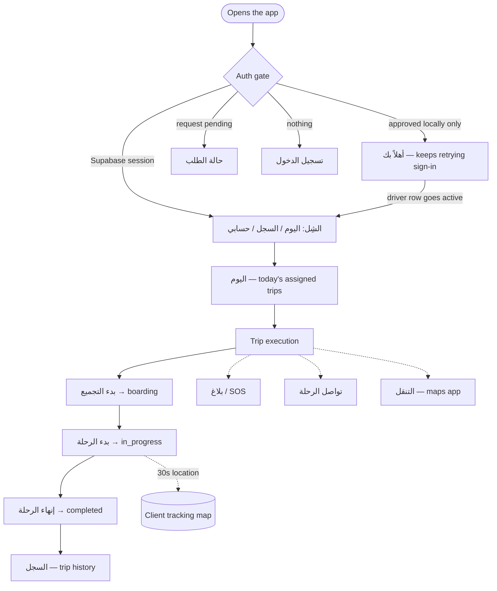

The spine is deliberately short. A captain is driving; every extra decision is a decision
taken with their eyes off the road. Everything not on the spine — incidents, chat,
navigation, the manifest — hangs off the trip-execution screen and is reachable without
scrolling while under way.

---

## 2. Authentication & session restoration

**Who.** A captain already approved by an office.
**Precondition.** An active `drivers` row bound to their auth user.

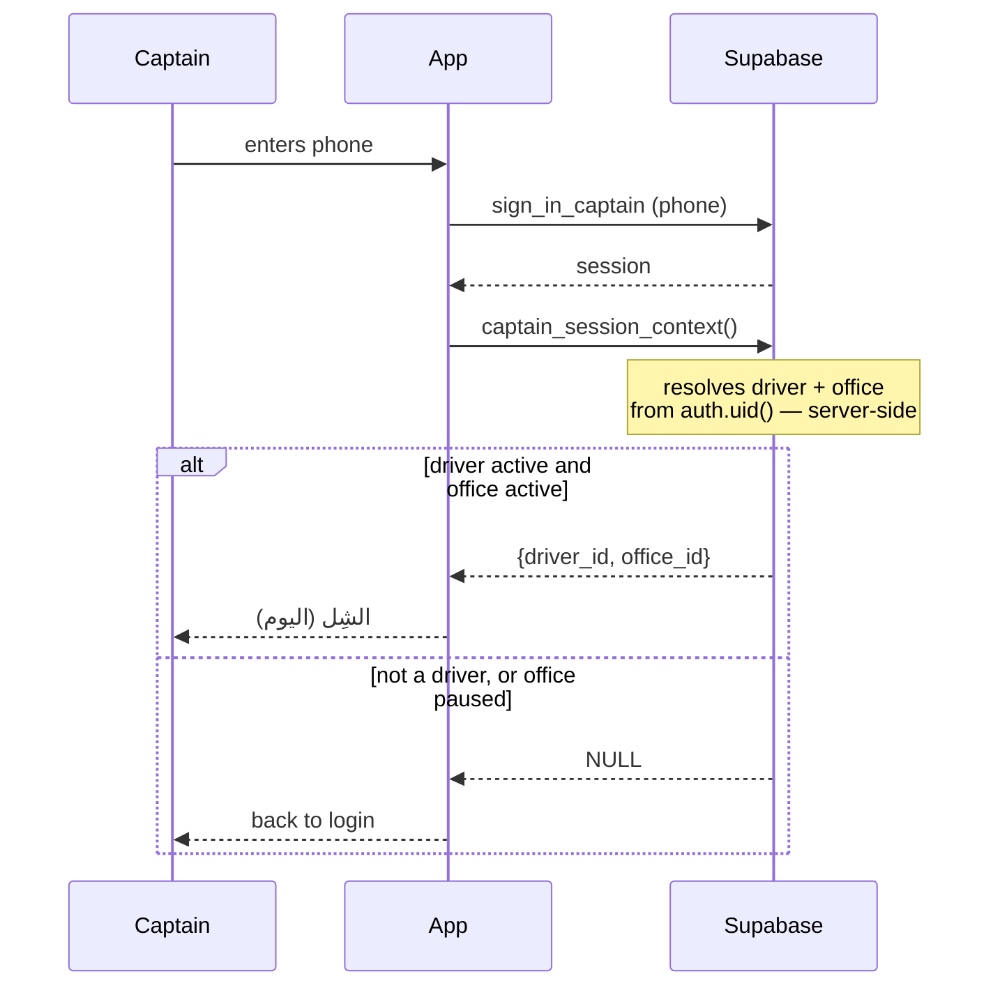

**Why it matters.** Identity is never client-supplied. No screen sends a `driver_id` or
`office_id` it chose; every one is resolved from `auth.uid()` on the server. A second
captain signing in on the same device cannot inherit the first's identity.

| State | What the captain sees |
| --- | --- |
| Success | The shell, on اليوم |
| Wrong / unknown phone | Inline error on the login field |
| Office paused | Returned to login — the app fails **closed**, never into a half-working shell |
| Offline | Connectivity banner; the session cache still opens the shell |

**Remember me** caches the phone locally, decoupled from sign-in itself so the activation
poll cannot clobber it. **Signing out never clears it** — the next sign-in is one tap.

**Sign-out** clears the Supabase session *and* the local session, and deactivates the FCM
token. The clear runs in a `finally`: a failed network sign-out must not leave the device
holding an identity the app still treats as current (BUG-209).

---

## 3. Onboarding — self-service access request

**Who.** A new captain with no account. No SMS is involved anywhere.

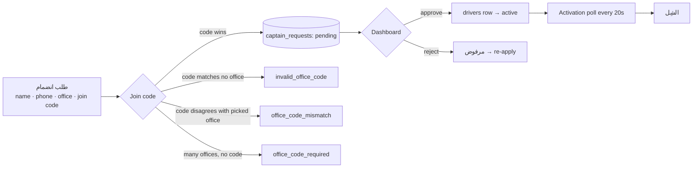

**The join code is authoritative.** If a code is supplied and the office picked in the UI
disagrees with the office the code resolves to, the request is **rejected** — a tampered
office id cannot ride along with a valid code. With more than one active office and no
code, the RPC refuses to guess rather than landing the request in an arbitrary queue.

**Onboarding cannot be bypassed.** Without an active `drivers` row, `captain_session_context()`
yields nothing and no trips load. A captain cannot approve themselves: approval is an
office-user action under office-scoped RLS.

---

## 4. The day — assigned trips

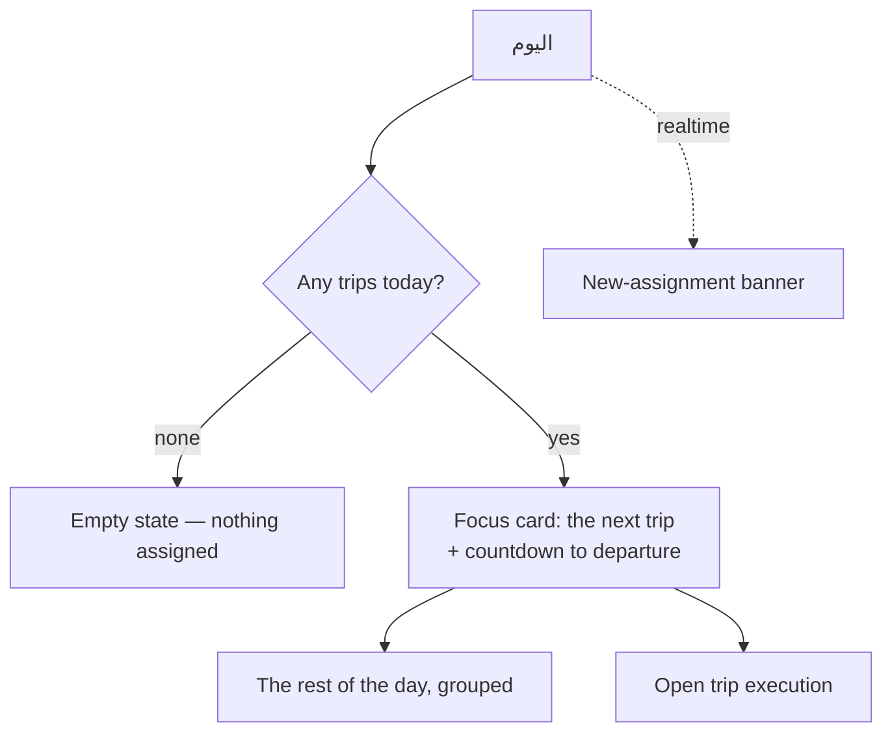

The screen answers one question — *what am I doing next* — before it answers any other.
A realtime subscription on the driver's own trips means a dispatcher assigning a trip
mid-shift surfaces as a banner rather than requiring a pull-to-refresh.

---

## 5. Trip execution — the spine

This is where a captain spends the working day.

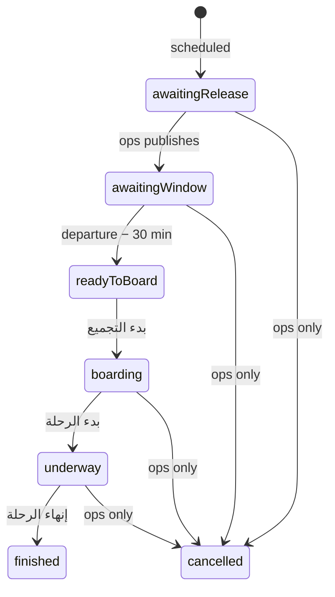

The captain vocabulary splits the two pre-departure backend states so the app never offers
"start" on a trip operations has not yet published.

**Transitions are server-validated.** Each one calls `captain_update_trip_status`, which
asserts the caller owns the trip **and** that the target status is one a captain may set —
`boarding`, `in_progress`, `completed`. Cancellation and publishing stay with operations
(BUG-303).

**The watch stream is the source of truth.** A realtime channel over `operation_trips`,
`trip_passengers`, `trip_events` and `trip_live_locations` re-fetches the snapshot, so
status and counts never freeze at their tapped-in values. Local state is optimistic only
for immediate button feedback.

| Failure | What the captain sees |
| --- | --- |
| Illegal transition | «حالة الرحلة لا تسمح بهذا الانتقال» |
| Not their trip | «غير مصرح لك بتعديل هذه الرحلة» |
| Trip missing | «الرحلة غير موجودة» |
| Offline | Connectivity banner; the stream reconciles on reconnect |

---

## 6. Live location — the 30-second cadence

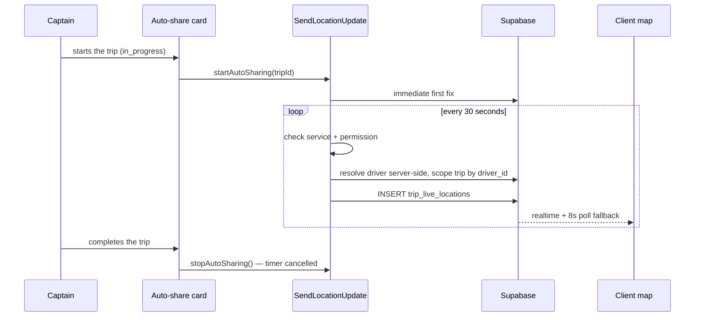

**Why immediate-then-interval.** A trip that has just departed should not sit unlocated
for a full interval.

**Ownership is server-side.** The driver stamped on each fix is the signed-in captain, not
whoever the trip row names, and the trip lookup is scoped by `driver_id` — so a captain
cannot push positions onto another captain's or another office's trip. This is the
compensating control for `trip_live_locations` having no RLS (RISK-305).

**Sharing survives scrolling** — it did not before BUG-301, which stopped the cadence
silently whenever the captain scrolled down to check the route.

| Condition | Behaviour |
| --- | --- |
| Automatic tick fails | Last good fix stays on screen, reason shown inline, next tick retries |
| Manual send fails | Surfaces as an error — it was the captain's own action |
| Permission denied / service off | Distinct Arabic message for each |
| Slow fix overlapping the next tick | Tick skipped, not queued |
| Started twice | Idempotent — the rate does not double |
| Trip ends, screen closed, app killed | Timer cancelled |
| **App backgrounded** | **Sharing stops** — foreground-only, by design (see limitation #1) |

---

## 7. Navigation to the next stop

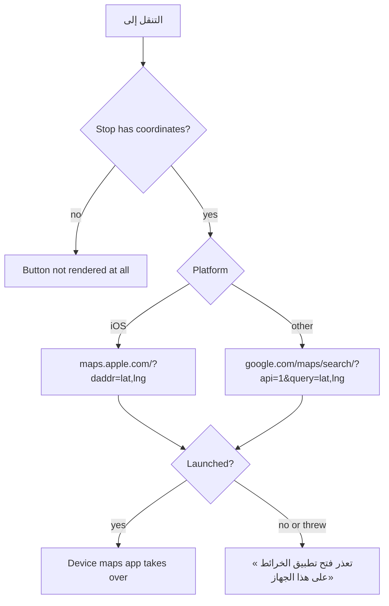

The app hands turn-by-turn to the device rather than rendering it — the maps app does it
better, and a captain already knows theirs. The target is the next stop they have not yet
reported arriving at.

Where a stop has no saved coordinates the button is **not rendered**, rather than offered
and then failing. `launchUrl` both returns `false` *and* throws on a device with no
handler; both are handled.

---

## 8. Incidents and SOS

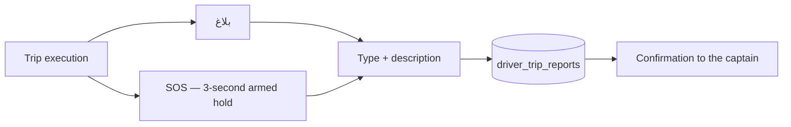

The SOS control requires a **three-second hold** — reachable without scrolling while
under way, but not triggerable by a pocket. Submission is confirmed, so the captain knows
it left the device.

Reports are now RLS-scoped: a captain reads and writes only their own, and an office sees
only reports on its own trips (BUG-302).

**Known gap.** No Dashboard surface reads these reports yet. A filed incident waits for
someone to query the table. See recommendation #2.

---

## 9. Communication

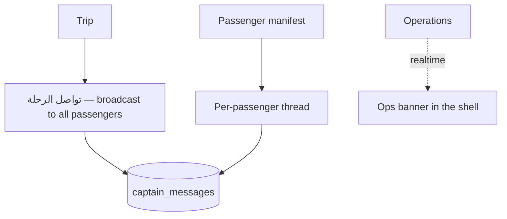

Authorship comes from the row's `sender_type`, never from a display label — the bubble
knows which side it belongs on because the data says so (BUG-201).

RLS scopes threads both ways: a driver sees only their own trips' threads, an operator
only their own office's.

**Known gap.** The trip chats page lists only the broadcast thread; per-passenger threads
are reachable from the manifest. See recommendation #9.

---

## 10. Notifications

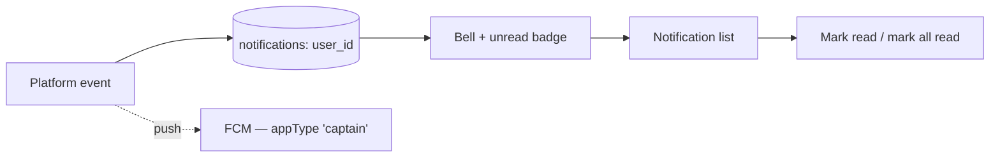

Scoped `user_id = auth.uid()` — a captain sees only their own. `markAsRead` is fired from
a tap handler that never awaits it, so failures are contained deliberately: the live
stream re-emits the true read state, and the only thing an error could add is a dialog
over a notification list about a notification.

An operations broadcast surfaces as a dismissible snackbar. The stream's **first**
emission is treated as the "already seen" baseline, so launching the app no longer
re-announces a message read days ago (BUG-204).

---

## 11. Trip history

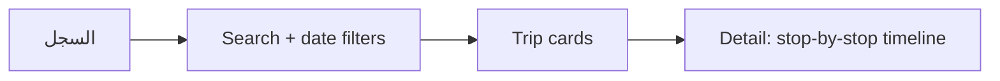

Read-only. What happened, when, and at which stops.

---

## 12. Sign-out

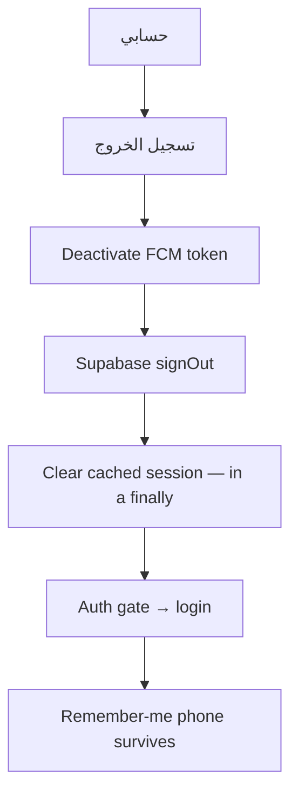

---

## 13. Journeys verified in this audit

| # | Journey | How it was verified | Result |
| --- | --- | --- | --- |
| A | Sign in → assigned trip → board → depart → 30 s tracking → complete → history | Cubit + layout suites; cadence asserted against the constant under `fakeAsync` | ✅ |
| B | Tracking survives the captain scrolling mid-trip | Widget test reproducing the real sliver structure | ✅ **fixed this pass** |
| C | Captain starts an invalid transition | Live RPC — rejected `invalid_transition` | ✅ |
| D | Captain crafts a `cancelled` call | Live RPC — rejected `status_not_allowed_for_captain` | ✅ **fixed this pass** |
| E | Captain touches another captain's trip | Live RPC — rejected `not_your_trip` | ✅ |
| F | Non-captain calls the captain RPC | Live RPC — rejected `not_a_captain` | ✅ |
| G | Anonymous visitor reads/deletes/forges incident reports | Live SQL as `anon` — all denied after fix | ✅ **fixed this pass** |
| H | Captain files a report as another driver | Live SQL — RLS violation | ✅ |
| I | Navigation with missing coordinates | Code path — button not rendered | ✅ |
| J | Enlarged fonts (1.0 / 1.3 / 1.6) across 320/390/430 pt | Layout + overflow sweep suites | ✅ |
| K | RTL drill-in direction | Rendered-direction test | ✅ **fixed this pass** |
| L | Captain loses network mid-trip | Inspected: banner, retry on next tick, stream reconciles | ⚠️ inspected, not device-tested |
| M | App killed and reopened mid-trip | Inspected: session restores, watch stream re-establishes | ⚠️ inspected, not device-tested |
| N | Background / screen locked | Known limitation — sharing stops | ⚠️ by design |

Rows L, M and N need a device to close honestly. Nothing in this document claims a device
test that was not run.
