# Client App — User Journeys

> **Scope.** The passenger journeys through `lib/apps/client`, drawn end to end.
> For what each feature *is*, see [`CLIENT_APP_FEATURES.md`](CLIENT_APP_FEATURES.md).
> For the engineering conventions, see
> [`.claude/docs/CLIENT_APP.md`](../../.claude/docs/CLIENT_APP.md).
>
> **Last revised.** 2026-07-23.

---

## 1. The shape of a passenger's trip

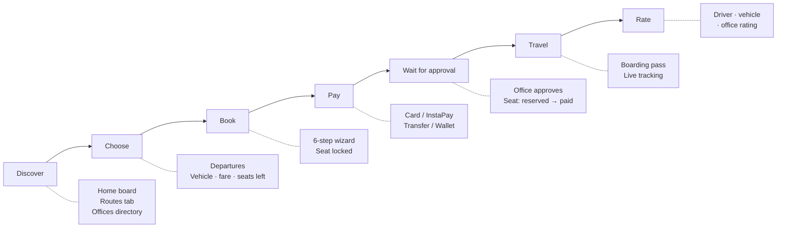

The one thing that shapes every screen: **a booking is not confirmed when it is paid.**
An office still has to approve it. Every surface that shows a booking distinguishes
"under review" from "confirmed", and tracking stays locked until this rider's own payment
clears.

---

## 2. First launch and landing

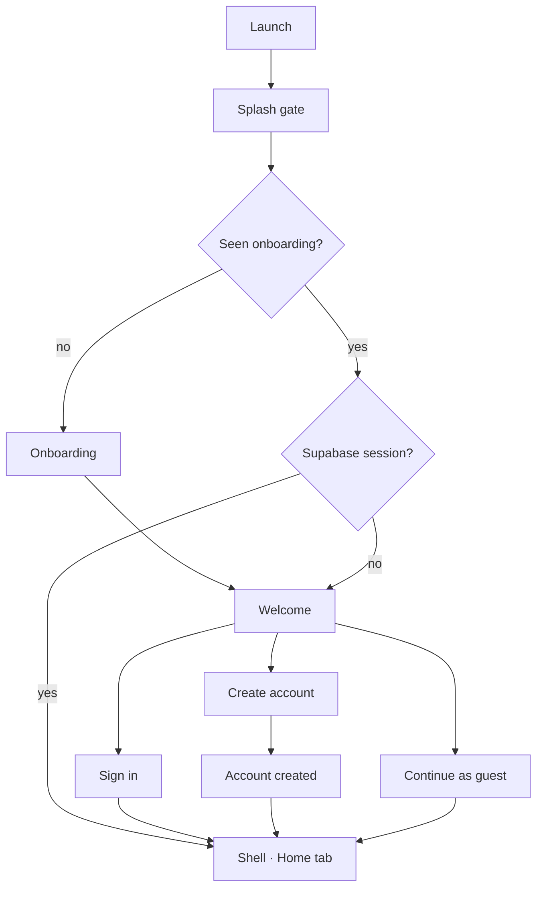

The splash holds until onboarding status resolves. The session check reads
`currentSession` as well as the auth stream, so a restored session lands on the shell
without a flash of the welcome screen.

**Guest mode is real.** A guest browses Home, Routes, offices and departures. The wall is
at booking, not at launch.

---

## 3. Discovery — three ways in

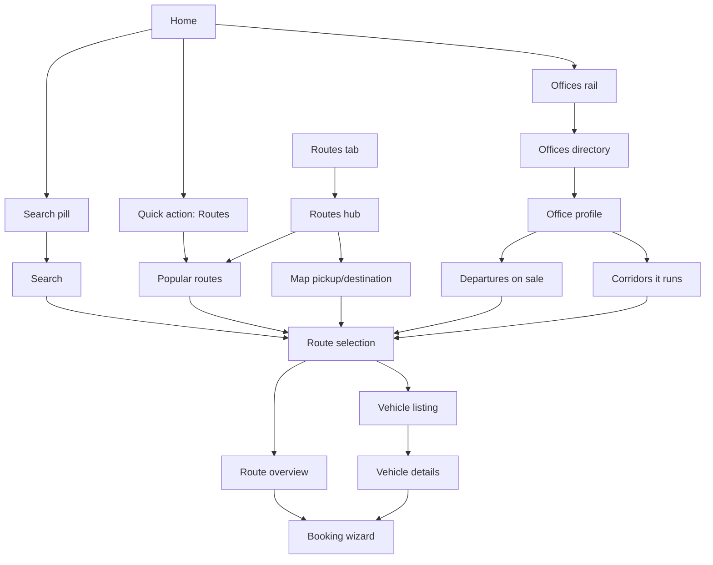

All roads converge on the same route-selection surface, so there is one booking entry
point rather than four. An office departure carries route + date + time with it, so the
rider lands with those already chosen.

### 3.1 Offices directory search

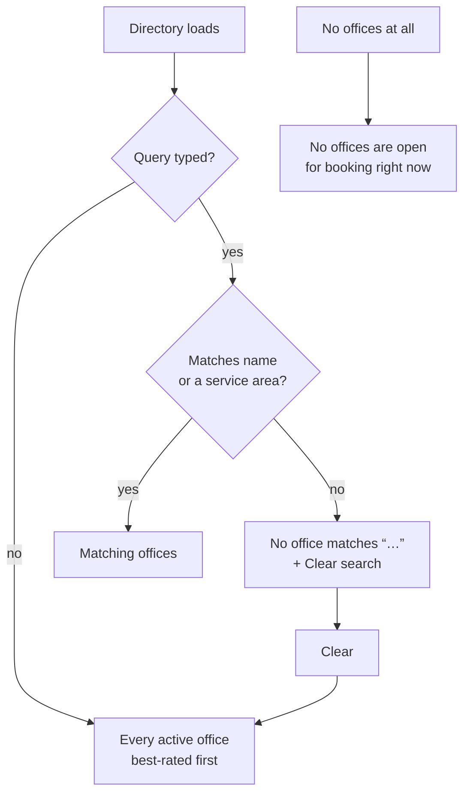

"Nothing matched your search" and "no offices exist" are deliberately different messages —
only one of them is the rider's to fix. A refresh keeps the query applied.

---

## 4. The booking wizard

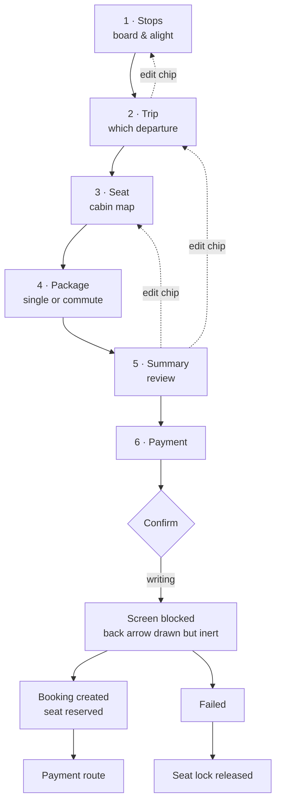

- The **system back gesture walks the wizard backwards** before leaving it.
- Edit chips on the summary jump straight back to the step that owns the choice.
- A failed confirm **hands the seat lock back**; a seat that already carries a booking is
  never released.

---

## 5. Payment and approval

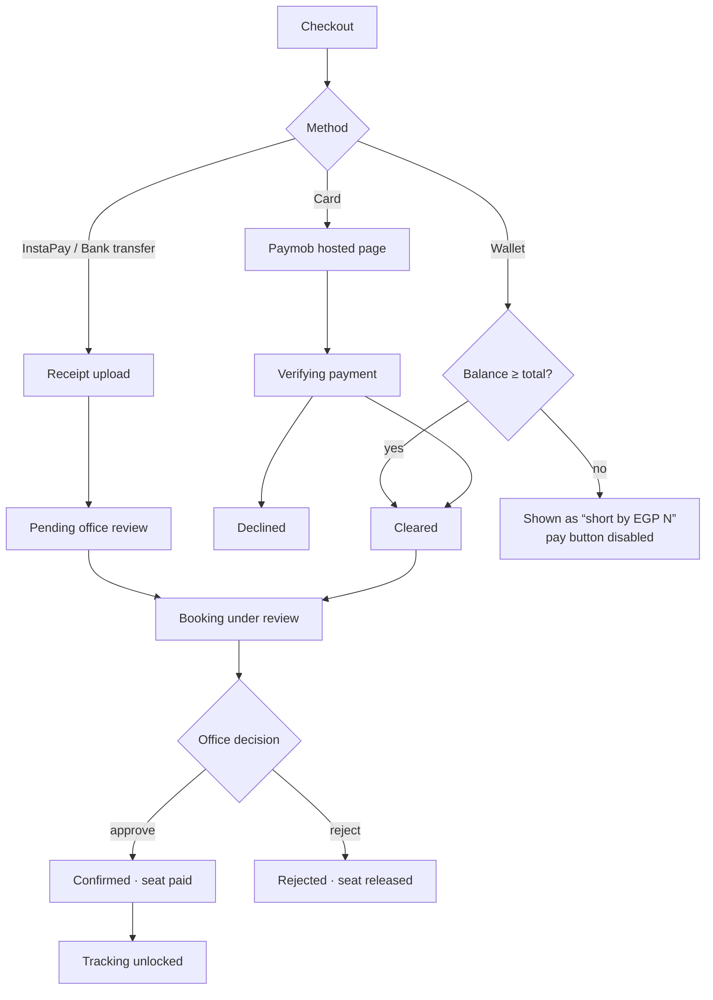

The rider is never dropped into an unexplained state: an underfunded wallet says how short
it is *before* the tap, a transfer says it is waiting on review, and a card that has not
been verified yet keeps the screen blocked rather than claiming success.

---

## 6. My Trips and trip details

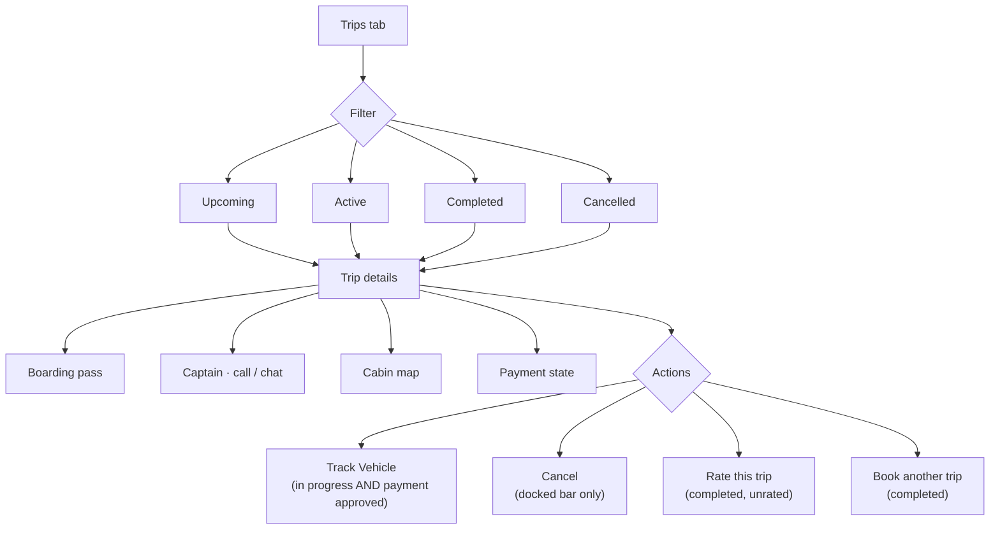

The gate on **Track Vehicle** is the subtle one: the trip being in progress is not enough,
because a trip runs for other passengers while this rider's payment may still be under
review.

---

## 7. Live tracking

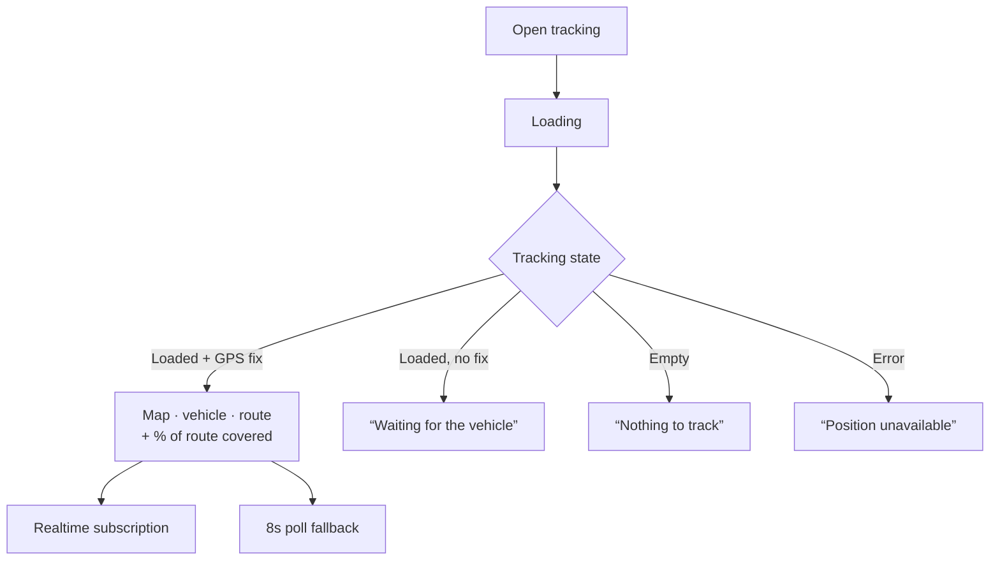

Every branch renders a sentence. Nothing here fabricates a percentage, and no state
crashes the card — the `TrackingEmpty` branch used to, taking the whole trip-details list
with it.

---

## 8. Notifications

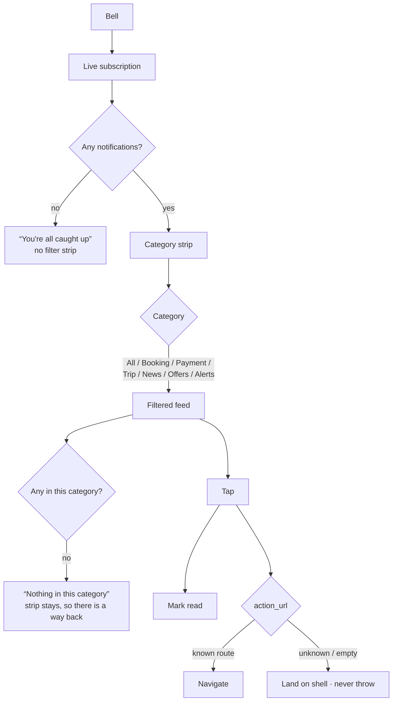

---

## 9. Packages

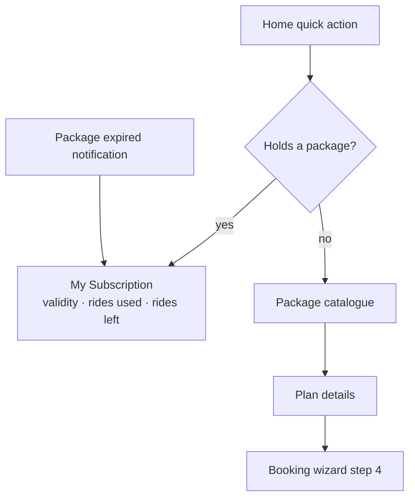

The expiry notification is the one that used to crash: it carries `/subscriptions`, which
was never a registered route.

---

## 10. Support

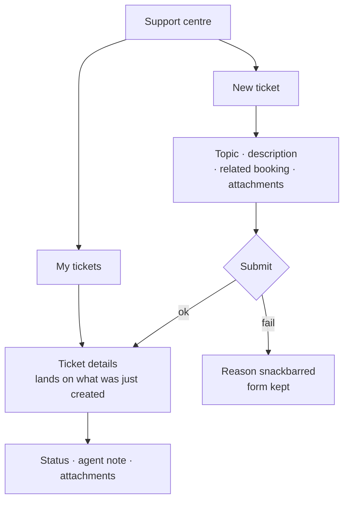

---

## 11. Sign-out

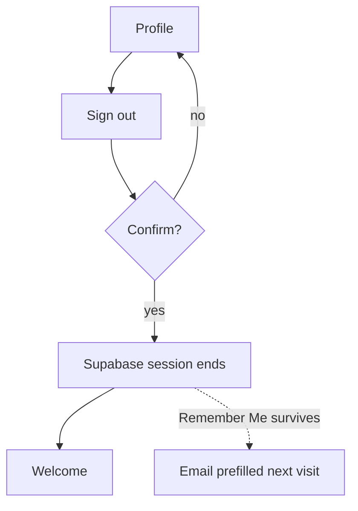

Signing out ends the session but never clears Remember Me — the rider asked the app to
remember them, not to stay logged in forever.

---

## 12. Journeys verified in this pass

| Journey | How |
|---|---|
| Route table completeness | `client_router_test` — every declared constant registered, every registered path declared, no duplicates |
| Header behaviour across all screens | `client_app_bar_test` — back visibility, custom back, disabled back, long titles, RTL |
| Offices search incl. empty vs no-match | `offices_directory_search_test` (9 tests) |
| Notification filtering incl. empty category | `notifications_screen_test` (4 tests) |
| Tracking states never crash the trip screen | `trip_progress_summary_test` |
| RTL arrow mirroring | `directional_icon_test` |
| Trip actions per status & payment state | `trip_details_view_test`, `trip_details_presentation_test` |
| Checkout: totals, transfer, underfunded wallet, promo | `payment_checkout_screen_test`, `payment_widgets_test` |
| Wizard steps, summary, payment | `wizard_*_step_test` |

**Suite status: 475 passing, 0 failing** (baseline before this pass: 247 passing,
59 failing).
