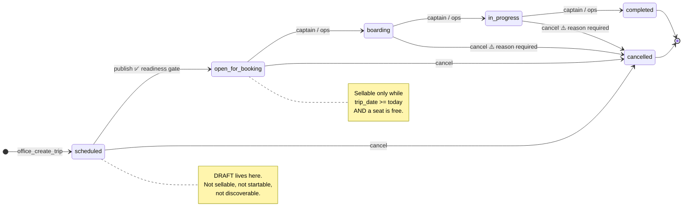

# Trip Lifecycle — Audit & Design

**Phase 3 of the Dashboard Re-Ownership Program.**
Audited against the live database and all three Flutter apps on **2026-07-27**.

Phase 1 (Live Operations, `92208f3`) and Phase 2 (Booking & Payment Control, `0578b33`) are
treated as source of truth and are not revisited here except where the trip lifecycle touches
them.

---

## 0. Scope and method

Everything below was read from the **live database** (`supabase db query --linked`) and from the
**current source**, not from prior documentation. Where an earlier document disagrees with what
the database actually contains, the database wins and the document is corrected.

| Surface | What was read |
|---|---|
| Database | `operation_trips` columns/constraints/triggers/RLS/grants; `trip_seats`, `trip_passengers`, `trip_events`, `trip_pricing`, `trip_route_points`, `route_stations`, `operation_bookings`; `public_trips` view; every function whose body references `operation_trips` (34 of them) |
| Dashboard | `features/trips/**` (creation wizard, list, details workspace, seats, passengers, pricing, events), `features/live_ops/**`, `features/dashboard_home/**` |
| Captain | `features/trip_execution/**`, `features/assigned_trips/**`, `features/passenger_manifest/**`, `features/trip_history/**`, `core/trips/captain_trip_stage.dart` |
| Client | `core/utils/bookable_trip.dart`, `features/booking/**`, `features/trips/**`, `features/tracking/**`, `features/profile/**`, `features/home/**` |

### Live data snapshot (2026-07-27)

9 trips exist: 6 `completed`, 2 `cancelled`, 1 `open_for_booking`. **No `boarding` or
`in_progress` trip exists**, so every claim about those states below is derived from code and
from rollback-scoped fixtures, never from observation of production rows.

Four contradictions are visible in that data before any change:

1. `TR-763985` is `open_for_booking` with `trip_date = 2026-07-20` — seven days in the past.
   It is invisible to riders (the client filters `trip_date >= today`) but the dashboard still
   counts it as sellable inventory.
2. `TR-423791` is `completed` with `trip_date = 2026-07-29` — **completed five days before its
   own departure date**, `actual_start_time = 2026-07-14`.
3. `booked_seats = 0` on every single trip, including trips with occupied seats
   (`TR-96036`: 1 taken, `TR-645659`: 2 taken). The counter is dead.
4. Three completed trips still carry `confirmed` (not `completed`) bookings — 4 rows total.

---

## 1. The central finding

> `operation_trips.status` is a single `text` column that is currently being asked to answer
> five different questions, and it can only answer one of them at a time.

| Question | Who asks | How it is answered today |
|---|---|---|
| **Operational state** — where is this trip in its physical life? | Dashboard, Captain | `status` |
| **Booking availability** — can a seat be sold right now? | Client, booking RPCs | `status = 'open_for_booking'` **plus** a date check that exists only in Dart |
| **Marketplace visibility** — may a stranger see this trip? | `public_trips` view | `status IN (5 values)` + `office_is_listed()` |
| **Payment state** — has the money settled? | Dashboard, Finance | `operation_bookings.payment_status` (correct — Phase 2) |
| **Tracking state** — is the vehicle reporting? | Live Ops | freshness of `trip_live_locations` (correct — Phase 1) |

Payment and tracking are already on their own axes and are correct. The damage is concentrated
in the first three, which are welded together:

- **Closing sales requires lying about the trip.** The only way to stop selling seats is to move
  the trip to `boarding`, which fires *"بدأ صعود الركاب"* to every passenger and arms the
  captain's "start trip" button. An operator who simply wants a departure cut-off cannot have
  one.
- **Un-publishing is impossible.** A trip published by mistake can only be `cancelled`, which
  cancels every booking and notifies everyone. There is no `open_for_booking → scheduled` edge,
  and there should not be one — but that means publication must be *gated*, since it cannot be
  *undone*.
- **Booking availability is enforced client-side.** `BookableTrip.isUpcoming` lives in Dart.
  `lock_trip_seat` has **no trip-status check at all**, and `confirm_seat_booking_v2` checks
  status but not date. The server will happily lock a seat on a cancelled trip.

---

## 2. Current state machine (as built)

### 2.1 The database's own matrix — `public.update_trip_status`

```
scheduled        → open_for_booking | cancelled
open_for_booking → boarding         | cancelled
boarding         → in_progress      | cancelled
in_progress      → completed        | cancelled
completed        → (terminal)
cancelled        → (terminal)
```

`operation_trips_status_check` permits exactly these six values. Default on insert: `'scheduled'`.

### 2.2 Per-state reference

Legend for *Client visibility*: **Discover** = appears in search/home; **Read** = a rider
holding a booking can still open it.

---

#### `scheduled`

| | |
|---|---|
| **Meaning** | Created and fully provisioned (route snapshot, seat inventory), but **not released for sale**. This is the system's de-facto draft. |
| **Who enters** | `create_trip` only — hardcoded `'scheduled'`, no other writer. |
| **Who leaves** | Office operator (`office_update_trip_status`). The captain is explicitly barred: `captain_update_trip_status` rejects anything outside `{boarding, in_progress, completed}`. |
| **Allowed next** | `open_for_booking`, `cancelled` |
| **Forbidden** | `boarding`, `in_progress`, `completed` |
| **Side effects on entry** | `trip_route_points` + `trip_seats` inserted; `trip_events` row *"إنشاء الرحلة"*. **`trip_pricing` is NOT created here** — see §3.4. |
| **Booking** | `confirm_seat_booking_v2` raises `trip_not_available`. |
| **Seats** | All `available`. **But `lock_trip_seat` will still lock one** — no status guard. |
| **Payment** | n/a |
| **Captain** | Sees the trip in `assigned_trips`, mapped to `CaptainTripStage.awaitingRelease` — a disabled "waiting for operations" panel. Correct. |
| **Vehicle** | Assigned at creation; nothing reserves it beyond the creation-time conflict check. |
| **Tracking** | Not started. |
| **Client visibility** | **Discover: no** (Dart filters `status = 'open_for_booking'`). **Read: yes** — `public_trips` exposes `scheduled`, so an anonymous caller can read the trip, its `trip_pricing` and its `trip_seats`. An unpublished trip's fares leak. |
| **Dashboard** | Listed under "قادمة"; the primary action is "فتح الحجز". |
| **Notifications** | Captain gets *"تم إسنادك لرحلة جديدة"* on driver assignment. |

---

#### `open_for_booking`

| | |
|---|---|
| **Meaning** | Published. Simultaneously "visible in the marketplace", "sellable", and "pre-boarding". Three facts, one value. |
| **Who enters** | Office operator only. |
| **Who leaves** | Office operator, **or the captain** (`boarding`). |
| **Allowed next** | `boarding`, `cancelled` |
| **Forbidden** | `scheduled` (no un-publish), `in_progress`, `completed` |
| **Side effects on entry** | `trip_events` *"فتح الحجز"*. **No readiness check whatsoever.** |
| **Booking** | The only sellable state. `confirm_seat_booking_v2` requires it. |
| **Seats** | `available → reserved` (5-min lock) → `paid` on approval, or `subscription`. |
| **Payment** | `booking_payments` row created `submitted`/`pending`; desk reviews. |
| **Captain** | `awaitingWindow` until T−30min, then `readyToBoard`. The clock, not ops, arms boarding. |
| **Vehicle** | Assigned. |
| **Tracking** | Not started. |
| **Client visibility** | Discover: **yes**, if `trip_date >= today`. Read: yes. |
| **Dashboard** | "قادمة"; primary action "بدء صعود الركاب". |
| **Notifications** | None on publish (riders can't have bookings yet). |

---

#### `boarding`

| | |
|---|---|
| **Meaning** | Passengers are being loaded at the origin. |
| **Who enters** | Captain (normal) or office operator (force-start). |
| **Who leaves** | Both. |
| **Allowed next** | `in_progress`, `cancelled` |
| **Forbidden** | Back to `open_for_booking`; straight to `completed` |
| **Side effects on entry** | `actual_start_time = now()` if null — **this stamps at *boarding*, not departure**, so "trip duration" reports include loading time. `trip_events` *"بدء التجميع"*. |
| **Booking** | **Sales close** (side effect of leaving `open_for_booking`). `cancel_booking` starts refusing: `cancellation_not_allowed`. |
| **Seats** | Frozen in practice; nothing enforces it. |
| **Payment** | Desk can still approve a payment — `approve_payment` never looks at trip status. A payment approved during boarding inserts a `trip_passengers` row for someone who may not be on the bus. |
| **Captain** | Manifest becomes the boarding door: `trip_passengers.status → 'confirmed'` per rider. Live location sharing starts. |
| **Vehicle** | In service. |
| **Tracking** | **Starts** — captain publishes a fix every 30s. Live Ops shows LIVE/STALE/OFFLINE. |
| **Client visibility** | Discover: no. Read: yes; `upcoming_trip_model` flags `isLive`. Tracking screen active. |
| **Dashboard** | "نشطة"; appears in Live Ops. |
| **Notifications** | Riders: *"بدأ صعود الركاب"*. Captain: same. |

---

#### `in_progress`

| | |
|---|---|
| **Meaning** | Departed and en route. |
| **Who enters** | Captain (normal) or operator. |
| **Who leaves** | Both. |
| **Allowed next** | `completed`, **`cancelled`** |
| **Forbidden** | Back to `boarding` |
| **Side effects on entry** | `trip_events` *"انطلاق الرحلة"*. `actual_start_time` **not** re-stamped. |
| **Booking** | Closed. |
| **Seats** | Frozen. |
| **Payment** | Still approvable — same gap as `boarding`. |
| **Captain** | Per-station arrival markers into `trip_events` (`'وصول محطة'`); SOS; manifest. |
| **Vehicle** | In service. |
| **Tracking** | Active. |
| **Client visibility** | Read + live map. |
| **Dashboard** | "نشطة"; Live Ops with delay detection. |
| **Notifications** | Riders: *"انطلقت رحلتك"* (high). Captain: *"بدأت الرحلة"*. |

---

#### `completed`

| | |
|---|---|
| **Meaning** | Terminal — the trip ran. |
| **Who enters** | Captain (with confirm dialog) or operator. |
| **Who leaves** | Nobody. |
| **Allowed next** | none |
| **Side effects on entry** | `actual_end_time = now()` **only if `actual_start_time` is not null**. `trip_events` *"اكتمال الرحلة"*. `trip_passengers` not in `{confirmed, cancelled, no_show, completed}` → `no_show`. |
| **Booking** | **Nothing happens.** Bookings stay `confirmed` forever; `operation_bookings.status = 'completed'` is a permitted value that no writer in the system ever produces. |
| **Seats** | Left as-is (`paid`/`subscription`) — correct as a record. |
| **Payment** | Unchanged. |
| **Captain** | Trip moves to history; location sharing stops. |
| **Tracking** | Stops (client-side timer only — no server enforcement). |
| **Client visibility** | Read; unlocks `submit_trip_review` (which checks *trip* status only, never booking status). |
| **Dashboard** | "مكتملة"; drops out of Live Ops. |
| **Notifications** | Riders: *"اكتملت رحلتك"*. Captain: **none**. |

---

#### `cancelled`

| | |
|---|---|
| **Meaning** | Terminal — the trip will not run. |
| **Who enters** | Office operator only in practice (the captain wrapper forbids it). |
| **Who leaves** | Nobody. |
| **Allowed next** | none |
| **Side effects on entry** | `actual_end_time` stamped **only if already started**. `trip_events` *"إلغاء الرحلة"*. `trip_seats` not in `{available, blocked}` → `available`, `passenger_id = NULL`. `operation_bookings` not in `{cancelled, rejected}` → `cancelled`. |
| **Booking** | Cancelled — but `payment_status` is left untouched, so a paid rider's booking becomes `cancelled` + `payment_status = 'approved'`. Phase 2 deliberately kept this state *representable* and flags it in `booking_state_contradictions`. |
| **Seats** | Released — but `held_at` / `hold_expires_at` / `lock_expires_at` are **not** cleared. |
| **Passengers** | **`trip_passengers` is not touched at all.** Every rider stays `reserved`/`confirmed` on a cancelled trip. This is the clearest orphan in the system. |
| **Tracking** | Not stopped server-side. |
| **Client visibility** | **Removed from `public_trips` entirely** — a rider who booked it can no longer read the trip row. Their booking still resolves to `TripStatus.cancelled` via the booking's own status, so the app is not broken, but the trip detail is gone. |
| **Dashboard** | "ملغاة". |
| **Notifications** | Riders with a `trip_passengers` row: *"تم إلغاء رحلتك"* (high). Captain: *"تم إلغاء الرحلة"*. Ops alert: `trip_cancelled` → `/live-trips`. |

---

## 3. Findings

Ordered by severity. **S1** = data/money/security integrity. **S2** = operator or rider is
misled. **S3** = correctness debt.

### 3.1 — S1 — The state machine is not server-authoritative

`update_trip_status` is a real state machine and is correctly **not granted** to `authenticated`
(only `postgres`/`service_role`). Both wrappers (`office_update_trip_status`,
`captain_update_trip_status`) authorise properly.

**And all of it is bypassable**, because RLS grants direct table access:

```
trips_office_manage   ALL    USING (office_id = current_office_id())    -- all columns
trips_captain_update  UPDATE USING (office_id = captain_office_id()
                                    AND driver_id = current_driver_id())
```

PostgreSQL RLS cannot restrict *columns*. Any office operator can
`UPDATE operation_trips SET status = 'completed'` on any of their trips through PostgREST,
skipping every transition rule, every side effect, and every notification. A **captain** can do
the same on their assigned trip — and can also rewrite `ticket_price`, `capacity`, `trip_date`
and `driver_id`.

The dashboard's own code already does this: `SupabaseTripsDatasource.updateTripInfo`
(`supabase_trips_datasource.dart:224`) writes `'status': trip.status.dbValue` in a plain table
update.

> The system has a good state machine and no way to compel anyone to use it.

### 3.2 — S1 — `lock_trip_seat` has no trip guard

`lock_trip_seat` is granted to `authenticated` and checks only for a duplicate active booking. It
never reads `operation_trips`. A seat can be locked on a `scheduled`, `boarding`, `in_progress`,
`completed` or **`cancelled`** trip. On a cancelled trip this re-occupies seats that
`update_trip_status` just released — the release is not final.

`confirm_seat_booking_v2` checks `status = 'open_for_booking'` but **not `trip_date`**. The
"don't sell a departed trip" rule exists only in `BookableTrip.isUpcoming` — Dart, client-side,
and therefore advisory.

### 3.3 — S1 — Trip cancellation leaves passengers and holds orphaned

On cancel, `update_trip_status` handles seats and bookings but never touches `trip_passengers`.
Riders remain `confirmed` on a trip that will not run. Consequences: the captain's manifest for a
cancelled trip still lists them; `notify_trip_passengers` still targets them for any future trip
notification; and passenger counts in reports include them.

Seat hold timestamps (`held_at`, `hold_expires_at`, `lock_expires_at`) survive the release, so a
released seat can still look "held" to any reader that inspects those columns.

### 3.4 — S1 — Publishing has no readiness gate

`scheduled → open_for_booking` is unconditional. A trip can be published with:

- **no `trip_pricing` rows** — `create_trip` does not create them. Pricing is expanded
  **client-side** in `CreateTripUseCase`, as N² separate `upsertTripPricing` calls made *after*
  the creation RPC has already committed. A crash or a dropped connection mid-loop leaves a
  committed trip with partial or zero pricing. `confirm_seat_booking_v2` then silently falls back
  to `transport_packages.price` — the **catalogue** price, not the operator's fare. The office
  sells seats at a price it never set.
- **a past `trip_date`** — invisible to riders, permanently "open" on the dashboard.
- **no driver or no vehicle** — both FKs are nullable and `office_create_trip` treated them as
  optional. *Closed by `20260731090000_driver_vehicle_authority`*: the RPC now requires a driver
  (`driver_required`), derives the vehicle from that driver's active assignment, and refuses a
  driver who has none (`driver_has_no_vehicle`). A trip with a driver and no vehicle can no
  longer be written to `operation_trips` at all.
- **no seats** — nothing requires `trip_seats` to be non-empty.

### 3.5 — S2 — The dashboard offers an operation that can never succeed

`trips_screen.dart:679` — the stale-trip banner offers **"إنهاء الرحلة"**
(`→ completed`) on a trip that is `open_for_booking` or `scheduled`. Both the Dart matrix
(`trips_repository_impl.dart:328`) and the database reject that edge. The call always throws, and
`_changeStatus` swallows the real message and shows a fixed *"تعذر تحديث حالة الرحلة."*

The operator is told the system failed, when in fact the button was never valid.

### 3.6 — S2 — The dashboard cannot cancel a healthy trip

`OperationTripStatus.cancelled` is reachable from exactly one place in the entire dashboard UI:
the stale-trip banner. A trip that is simply not going to run — vehicle broke down, driver sick,
weather — has **no cancel action**. Operators' only recourse is `deleteTrip`.

### 3.7 — S2 — `deleteTrip` is a hard delete with no guard

`trip_row_card.dart:243` → `DELETE FROM operation_trips`. `operation_bookings.trip_id` is
`ON DELETE SET NULL`, so deleting a trip with bookings leaves paid bookings pointing at nothing —
no trip, no route, no refund trail, and no cancellation notification to the rider. The
confirmation dialog says *"سيتم حذف رحلة … نهائياً"* and nothing else.

### 3.8 — S2 — Completion does not close bookings

`operation_bookings.status` permits `boarded` and `completed`. **Neither is ever written by any
code path in the system.** `boarded` is fully dead; `completed` is dead because completion stamps
the trip, not the booking. Four live bookings on completed trips still read `confirmed`.

`profile_queries.dart` documents this in a comment and works around it by counting through the
trip's status instead. The workaround is correct; the underlying data is still wrong.

### 3.9 — S2 — `booked_seats` is dead and `public_trips.available_seats` lies

`booked_seats` reads `0` on all nine trips, including trips with occupied seats. `public_trips`
computes `available_seats = GREATEST(capacity - booked_seats, 0)` — so the marketplace view
reports **every trip as completely empty**. The Client is immune only because `BookableTrip`
deliberately ignores the column and counts `trip_seats` instead. Any other consumer of the view
gets a wrong number.

`cancel_booking` still decrements the counter, which will drive it negative-then-clamped once
anything starts incrementing it.

### 3.10 — S2 — Unpublished trips leak to anonymous callers

`public_trips` exposes `scheduled`. `trip_pricing_marketplace_read` and
`trip_seats_marketplace_read` are keyed on `trip_office_is_listed(trip_id)` with **no status
condition**. An anonymous caller can therefore read the fares and seat map of a trip the office
has not published. Not a booking hole (the RPC refuses), but a pricing leak.

### 3.11 — S3 — Dart and SQL matrices disagree

`in_progress → cancelled` is **allowed** by the database and **forbidden** by
`_canTransitionTripStatus`. The dashboard cannot reach it; a direct table write can. Two
definitions of one machine.

### 3.12 — S3 — `approve_payment` ignores trip status

A payment can be approved on a `boarding`, `in_progress`, `completed` or `cancelled` trip. On a
cancelled trip this re-creates a `trip_passengers` row and flips the seat to `paid` — partially
undoing the cancellation.

### 3.13 — S3 — Cancellation notifies only some affected riders

`notify_trip_passengers` selects from `trip_passengers`, which only gains a row once payment is
**approved**. A rider whose booking is `reserved` (payment under review) has their booking
cancelled by the trip cancellation and is **never told**.

### 3.14 — S3 — `trip_events.event_code` is unused

169 of 175 rows are `'other'`. `update_trip_status` writes no code. The audit trail is matched by
Arabic title string — `kStationArrivalEventTitle` is compared literally in
`core/tracking/progress/arrival_events.dart`.

### 3.15 — S3 — `actual_start_time` means "boarding started"

Stamped on entry to `boarding`, not `in_progress`. Every duration derived from it includes
loading time. Live Ops' delay detection uses it, so the semantics must be preserved, but the
column name is a trap.

### 3.16 — Out of scope, flagged — one trip per driver per day

`create_trip` rejects a second trip for the same driver **or** the same vehicle on the same
`trip_date`, at *whole-day* granularity and with no office scoping:

```sql
WHERE driver_id = p_driver_id AND trip_date = p_trip_date AND status != 'cancelled'
```

The Dart layer checks the finer `date + departure_time`, so the app believes a second departure is
legal and the database refuses it. A shuttle route running four departures a day with one driver
is impossible to schedule. **This is a trip-scheduling defect, not a lifecycle defect** — it is
recorded here and recommended for the next phase rather than changed under Phase 3.

### Answers to the ten questions posed

| # | Question | Answer |
|---|---|---|
| 1 | Missing states | **None.** See §4.1 — `scheduled` already *is* DRAFT. What is missing is a *gate*, not a state. |
| 2 | Incorrect states | None incorrect; `open_for_booking` is *overloaded* (§1). |
| 3 | Ambiguous states | `open_for_booking` (publication + availability + pre-boarding). `actual_start_time` (§3.15). |
| 4 | Duplicate states | `operation_bookings.status` `boarded` and `completed` are both dead (§3.8). |
| 5 | Invalid transitions | Every transition, via direct table UPDATE (§3.1). |
| 6 | Dangerous transitions | `in_progress → cancelled` with no reason and no protection for boarded riders. Hard `DELETE` (§3.7). |
| 7 | Missing business rules | Publish readiness (§3.4); booking cut-off; completion→booking closure (§3.8); refund exposure at cancel. |
| 8 | Missing DB constraints | No column-level protection on `status`; planning fields mutable after departure; `booked_seats` unmaintained. |
| 9 | Missing RPC protections | `lock_trip_seat` (§3.2); `confirm_seat_booking_v2` date; `approve_payment` trip status (§3.12). |
| 10 | UI that fakes success | Stale-banner "إنهاء الرحلة" (§3.5); generic error swallowing the real reason; `deleteTrip` presented as routine. |

---

## 4. Design decisions

### 4.1 Should DRAFT be a new state? — **No. Unnecessary.**

The question was posed four ways; the audit answers it decisively.

`scheduled` already carries every property a DRAFT state would need:

- it is the **default** on insert and the only status `create_trip` produces;
- it is **not sellable** (`confirm_seat_booking_v2` refuses it);
- it is **not startable** (`captain_update_trip_status` refuses it, and the captain app renders
  `awaitingRelease`);
- it is **not discoverable** by riders;
- its only exits are *publish* and *cancel* — exactly a draft's exits.

Adding a `draft` value would require a new `CHECK` value, a rewrite of `public_trips`, a sweep of
every `NOT IN ('completed','cancelled')` filter across three apps, a data migration, and a new
`draft → scheduled` edge that carries no information. It would buy nothing.

**What is actually missing is the publish gate** (§3.4). The reason `scheduled` doesn't *feel*
like a draft is that leaving it costs nothing — an operator can publish an unpriced, driverless,
past-dated trip with one click. Gate the exit and `scheduled` becomes a real draft.

One genuine sub-problem remains: trip creation is **not atomic end-to-end**, because pricing is
written client-side after the creation RPC commits (§3.4). Rather than model that with a second
status, the publish gate refuses to release a trip whose pricing never landed — which is the same
protection, without new vocabulary.

### 4.2 Which axis does each concept belong to?

| Concept | Axis | Representation |
|---|---|---|
| `scheduled` | **Operational** | `status` — and it doubles, correctly, as DRAFT |
| `open_for_booking` | **Operational** | `status`; booking availability is *derived from it*, not equal to it |
| `boarding` | **Operational** | `status` |
| `in_progress` | **Operational** | `status` |
| `completed` | **Operational** (terminal) | `status` |
| `cancelled` | **Operational** (terminal) | `status` |
| Booking availability | **Derived — server-side** | `trip_is_bookable(id)`: `status = 'open_for_booking'` **AND** `trip_date >= current_date` **AND** a free seat exists. Today this lives in Dart. |
| Marketplace visibility | **Derived — view** | `public_trips` + `office_is_listed()`. Tighten to drop `scheduled`. |
| Payment state | **Separate column** | `operation_bookings.payment_status` + `booking_payments.status` — **already correct (Phase 2), untouched** |
| Tracking state | **Derived — freshness** | `trip_live_locations.recorded_at` age — **already correct (Phase 1), untouched** |

**No new status column is introduced.** The separation is achieved by making the derived axes
*server-enforced functions* instead of Dart conventions. A concept that can be computed from
existing truth must not become a second column that can drift from it — that is precisely the
mistake Phase 2 found in `payment_review_status`.

### 4.3 Proposed lifecycle

Identical vocabulary to today. The changes are the **gate on publish**, the **reason on
emergency cancel**, and the fact that **every edge is now the only way to move**.



**Publish readiness gate** — `scheduled → open_for_booking` requires all five:

| # | Requirement | Error |
|---|---|---|
| 1 | `driver_id IS NOT NULL` | `trip_not_publishable:no_driver` |
| 2 | `vehicle_id IS NOT NULL` | `trip_not_publishable:no_vehicle` |
| 3 | ≥ 1 `trip_seats` row | `trip_not_publishable:no_seats` |
| 4 | ≥ 1 active `trip_pricing` row | `trip_not_publishable:no_pricing` |
| 5 | `trip_date >= current_date` | `trip_not_publishable:past_date` |

### 4.4 Side-effect contract

Each transition's complete effect, after Phase 3.  **bold** = new or changed.

| Transition | Seats | Bookings | Passengers | Notifications | Other |
|---|---|---|---|---|---|
| `→ open_for_booking` | — | — | — | — | event `trip_published` |
| `→ boarding` | — | — | — | riders + captain | `actual_start_time` if null; event `boarding_started` |
| `→ in_progress` | — | — | — | riders (high) + captain | event `trip_departed` |
| `→ completed` | — | **`confirmed` → `completed`** | `confirmed` → **`completed`**; others → `no_show` | riders | `actual_end_time`; event `trip_completed` |
| `→ cancelled` | released **+ holds cleared** | → `cancelled` (`payment_status` untouched) | **→ `cancelled`** | **every affected rider**, captain, ops alert | `actual_end_time` if started; event `trip_cancelled` **with reason + refund exposure count** |

`payment_status` is deliberately **not** rewritten on cancellation. The money has not moved;
claiming `refunded` would be a lie. The paid-but-cancelled pair stays representable and stays
visible in Phase 2's `booking_state_contradictions` view, which is where a refund is actioned
from.

### 4.5 Enforcement design — how the machine becomes authoritative

RLS cannot restrict columns, so the guard is a **`BEFORE UPDATE` trigger** plus a transaction-local
flag that only `update_trip_status` can set:

```
update_trip_status()                      enforce_trip_write_authority()  [BEFORE UPDATE]
  set_config('bmt.trip_transition',  ──▶    status changed?
             trip_id, /*local*/ true)         └─ flag matches this row? ─ yes ─▶ allow
  UPDATE operation_trips SET status…                                     └─ no ──▶ raise
  set_config(…, '', true)                   planning column changed?
                                              └─ trip already departed? ─ yes ─▶ raise
                                            writer is a captain?
                                              └─ any direct change ─────────────▶ raise
```

The flag is `set_local`, so it cannot escape the transaction, and PostgREST cannot set it (it is
not in the exposed settings whitelist and would be reset by the pooler anyway). Every legitimate
caller already goes through the RPC.

This keeps existing RLS **exactly as it is** — office isolation and captain scoping are
untouched. The trigger adds a second, orthogonal check.

---

## 5. Current flow vs proposed flow

| Concern | Current | Proposed |
|---|---|---|
| Transition authority | RPC exists; direct UPDATE bypasses it | RPC is the **only** path (trigger-enforced) |
| Publish | Unconditional | 5-point readiness gate |
| Booking availability | Dart-only date check; `lock_trip_seat` unguarded | `trip_is_bookable()` enforced in both seat RPCs |
| Cancel from dashboard | Only on stale trips | Any pre-terminal trip, reason captured |
| Emergency cancel (`boarding`/`in_progress`) | Silent, one click | Reason **required** |
| Stale trip "complete" | Button that always fails | Two honest outcomes: *operated* (audited fast-forward) or *cancelled* |
| Completion | Bookings left `confirmed` | Bookings + passengers → `completed` |
| Cancellation | Passengers orphaned; holds survive; part of the riders notified | Passengers cancelled; holds cleared; **all** affected riders notified; refund exposure recorded |
| Delete | Unconditional hard delete | Refused unless `scheduled` **and** no bookings |
| `booked_seats` | Dead → `public_trips.available_seats` always wrong | Maintained by trigger; view becomes true |
| `event_code` | `'other'` | Real codes per transition |
| Dart matrix | Second, divergent copy | Single `TripLifecycle` table mirroring the server |
| Unpublished trips | Fares readable by anon | `scheduled` dropped from `public_trips` |

---

## 6. Impact analysis

### 6.1 Migration impact

One migration: `20260727160000_trip_lifecycle_authority.sql`. Additive and idempotent
(`create or replace`, `drop trigger if exists`). No column is dropped, no status value is added or
removed, no RLS policy is replaced.

Backfills, each defensible and non-inventing:

| Backfill | Rows | Justification |
|---|---|---|
| `booked_seats` ← count of non-available seats | 9 trips | Recomputes a value that was always a function of `trip_seats` |
| `operation_bookings.status` `confirmed` → `completed` where trip is `completed` | 4 | Applies the completion rule retroactively to trips that already ran |
| `trip_passengers.status` → `cancelled` where trip is `cancelled` | 0 today | Same, for cancellation |

`actual_start_time` / `actual_end_time` are **not** touched — they are observations, not
derivations. `TR-423791`'s completed-before-departure anomaly is left in place and reported.

### 6.2 Captain App impact — **none functionally**

The captain already transitions exclusively through `captain_update_trip_status`. The new trigger
allows RPC-driven writes and blocks the direct writes the captain app never makes. `p_reason` is
added as an optional parameter with a 2-arg overload retained, so the existing call site compiles
and behaves identically.

The captain **gains** protection: they can no longer rewrite `ticket_price`, `capacity` or
`trip_date` on their assigned trip through a crafted PostgREST call.

Verified call sites: `trip_execution_datasource.dart:208` (only transition path),
`passenger_manifest_datasource.dart:74` (writes `trip_passengers`, not `operation_trips`),
`trip_execution_datasource.dart:196` (writes `trip_events`).

### 6.3 Client App impact — **none functionally**

The client already filters `status = 'open_for_booking'` and `trip_date >= today` via
`BookableTrip`. The server now enforces the same rule, so the client's behaviour is unchanged and
its guarantees become real.

Two changes are visible only in edge cases:

- `lock_trip_seat` on a non-bookable trip now fails fast with `trip_not_bookable` instead of
  succeeding and failing later at confirm. The client already surfaces lock errors.
- `public_trips` drops `scheduled`. No rider can hold a booking on a `scheduled` trip (it is
  unsellable), so no existing booking loses its trip row. `ProfileQueries.upcomingTripStatuses`
  keeps `'scheduled'` in its list where it will simply never match — harmless, and left alone.

### 6.4 Dashboard impact

New: a **Cancel trip** action with a reason on any pre-terminal trip; a publish button that
**explains** what is blocking it; a stale-trip banner with two outcomes that both work; real
server errors surfaced instead of a fixed string; delete refused with a reason.

Removed: the always-failing "إنهاء الرحلة" on stale trips; the `status` write inside
`updateTripInfo`.

### 6.5 Notification impact

| Event | Before | After |
|---|---|---|
| Publish | none | none (unchanged) |
| Boarding | riders w/ passenger row + captain | unchanged |
| Departure | riders w/ passenger row + captain | unchanged |
| Completion | riders w/ passenger row | unchanged |
| **Cancellation** | riders w/ passenger row only | **+ riders holding a `reserved` booking who previously got nothing** |

Each transition fires its notifications from exactly one place — the `AFTER UPDATE` trigger
`on_operation_trip_change`, which is unchanged. Because the status guard makes the RPC the only
way to change `status`, and the RPC changes it in a single `UPDATE`, each transition fires
**exactly once**. An idempotent re-call (same status) short-circuits before the `UPDATE` and fires
nothing.

---

## 7. Test strategy

| Layer | Approach |
|---|---|
| **Dart unit** | `TripLifecycle` transition table + publish gate: every valid edge, every invalid edge, both terminal states |
| **Dart cubit/repo** | Fake datasource: cancel-with-reason, stale close, delete guard, error surfacing |
| **Database** | A single SQL script run against the live database inside `BEGIN … ROLLBACK`. Fixtures are created, exercised and discarded within the transaction — **nothing is left behind**. `set local role authenticated` + `request.jwt.claims` impersonates a real office user, a real captain, and a foreign-office user so RLS and RPC authorisation are exercised as they are in production. |

Because production has no `boarding` or `in_progress` trip, those states are reached inside the
transaction by driving a fixture trip through the real RPC — the same code path production uses.

DB cases: every valid transition · every invalid transition · publish gate (all 5 reasons) ·
direct-UPDATE bypass blocked (office **and** captain) · planning-column freeze · cross-office
denial · captain-on-someone-else's-trip denial · captain forbidden statuses · seat lock on each
non-bookable status · past-date booking · cancellation side effects (seats, bookings, passengers,
holds) · completion side effects · idempotent re-call · concurrent transition serialisation ·
delete guard · `booked_seats` maintenance.

---

## 8. Risks and rollback

| Risk | Likelihood | Mitigation |
|---|---|---|
| The write trigger blocks a legitimate writer nobody catalogued | Low | Every writer of `operation_trips` in all three apps was enumerated (§6.2). The trigger blocks only `status` and post-departure planning columns — assignment edits on a pre-departure trip stay allowed. |
| Publish gate blocks an operator mid-workflow | Medium | The gate mirrors what the creation wizard already produces. The dashboard shows the blocking reason *before* the click. |
| `booked_seats` trigger fights `cancel_booking`'s manual decrement | Medium | The trigger recomputes from `trip_seats` rather than incrementing, so a stale decrement cannot accumulate drift. |
| Dropping `scheduled` from `public_trips` hides a trip someone reads | Low | No booking can exist against a `scheduled` trip. Verified against live data: zero bookings on `scheduled` trips. |
| Backfilling booking status changes a report | Low | Only `confirmed → completed` on trips already `completed`. Every consumer was checked and already treats both as travelled. |

**Rollback.** The migration is one file and every object is `create or replace`. Reverting is:
`drop trigger trg_enforce_trip_write_authority on public.operation_trips;` — which restores the
previous (permissive) behaviour immediately — plus re-applying the prior bodies of
`update_trip_status`, `lock_trip_seat`, `confirm_seat_booking_v2` and `public_trips` from
migration history. Backfilled data is derived and can be recomputed at will; nothing is deleted.

---

## 9. Implementation status — ✅ complete (2026-07-27)

Migration `20260727160000_trip_lifecycle_authority.sql`, applied to the live database.
Regression suite `supabase/tests/trip_lifecycle_regression.sql`: **106 / 106 green**, run
both against the migration in a rolled-back transaction *and* against the applied schema.

### What shipped

| # | Change | Finding closed |
|---|---|---|
| 1 | `trg_enforce_trip_write_authority` — status changes only from inside `update_trip_status`; planning fields freeze after departure; captains cannot write the table directly | §3.1 |
| 2 | `trip_publish_blocker` — five-point readiness gate on publish | §3.4 |
| 3 | `trip_is_bookable` + `lock_trip_seat` guard | §3.2 |
| 4 | Cancellation cancels passengers, clears holds, notifies every affected rider, records refund exposure | §3.3, §3.13 |
| 5 | Completion closes bookings and passengers | §3.8 |
| 6 | `trg_sync_trip_booked_seats` + backfill; `public_trips.available_seats` becomes true | §3.9 |
| 7 | `public_trips` no longer exposes `scheduled` | §3.10 |
| 8 | `trg_enforce_trip_delete_guard` | §3.7 |
| 9 | `office_cancel_trip`, `office_close_stale_trip` | §3.5, §3.6 |
| 10 | `event_code` written per transition | §3.14 |
| 11 | `TripLifecycle` — one transition table, Dart mirrors SQL | §3.11 |
| 12 | Server errors translated to operator-facing Arabic; `updateTripInfo` no longer writes `status` | §3.5, §3.1 |

### Found *during* implementation, by the suite

Three defects the audit had not predicted, each caught by a failing test before it could
reach the live database:

1. **The `booked_seats` maintenance trigger cascaded into the captain guard.** A seat
   change fired a write to `operation_trips` under whichever user moved the seat, so a
   maintenance trigger could be rejected for having been fired by a captain. Fixed by
   exempting writes where only derived columns changed — nothing a person authored has
   changed, so there is nothing to authorise.
2. **Ordering bug: the captain guard ran before the status guard**, which blocked
   captains from transitioning their own trips at all — the exact path the Captain app
   depends on. Fixed by checking the transition flag first: a legitimate transition is
   authorised by the wrapper that started it, not by who the writer happens to be.
3. **`office_update_trip_status` let a captain exceed their own allowlist.** It accepted
   the trip's driver as an authorised caller for *any* status, so a captain could reach
   cancellation and publishing simply by calling that wrapper instead of
   `captain_update_trip_status`. The allowlist was advisory; it is now binding on both
   paths. **This was a pre-existing authorisation hole, not one introduced by this phase.**

Plus one semantic correction: `actual_end_time` was stamped on completion only when
`actual_start_time` was already set, so a trip that reached `in_progress` without a
boarding stamp — which the old direct-UPDATE hole made possible — completed with no end
time. Completion now always stamps it; cancellation keeps the conditional, because a trip
cancelled before it ever moved never ran.

### Deliberately not done

- **`confirm_seat_booking_v2` was not modified.** It already refuses anything but
  `open_for_booking`, and every path into it requires a lock `lock_trip_seat` granted — so
  gating the lock gates both, without retyping 200 lines of money handling.
- **No refund rows are auto-created on cancellation.** `payment_status` is left untouched
  and the paid-but-cancelled pair stays visible in Phase 2's `booking_state_contradictions`,
  which is where a refund is actioned from. Auto-raising refund requests belongs to the
  finance workstream.
- **The one-trip-per-driver-per-day limit (§3.16) was not changed.** It is a trip
  *scheduling* defect, not a lifecycle one, and altering it changes what an operator can
  book. Recorded for Phase 4.

### Verification

| Check | Result |
|---|---|
| `flutter analyze` | 0 issues (baseline: 0) |
| `flutter test` | **1352 passed / 3 failed** — the same 3 pre-existing failures as the baseline of 1279/3, so **+73 new tests, 0 new failures** |
| Database regression suite | 106 / 106, all fixtures rolled back; `TEST-%` trip count after the run: 0 |
| Migration history | `20260727160000` recorded in `supabase_migrations.schema_migrations` |
| Backfill | `booked_seats` now matches `trip_seats` on all 9 trips; 5 bookings moved `confirmed → completed` |

The 3 failing tests are `fleet_vehicle_form_vehicle_type_test.dart` (×2) and
`support_ticket_details_test.dart` (×1) — unrelated to trips, tracked as B1/B2 in
`DASHBOARD_STATUS.md`.
