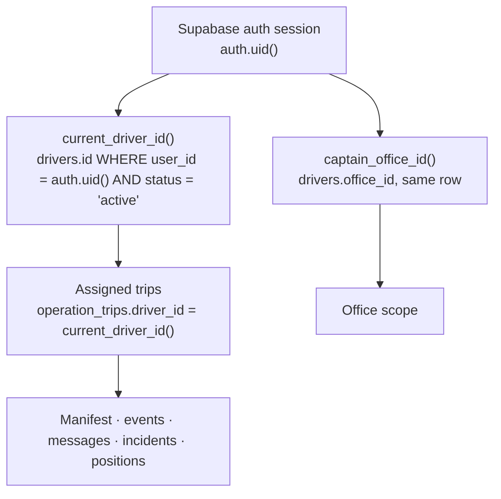
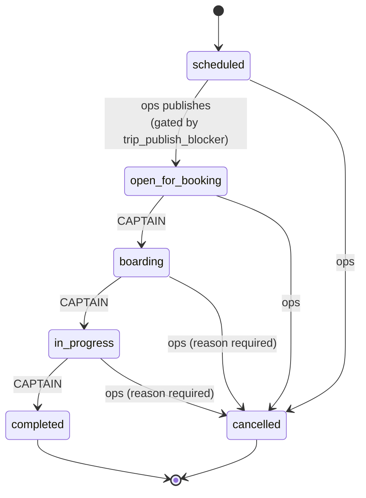
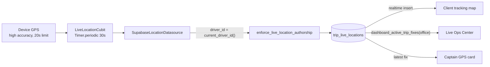

# Captain Lifecycle — identity, authority, trip state and tracking

> **Scope.** The captain as an operational actor: who the system decides they are, what they
> are permitted to change, how a trip moves under them, and how their position reaches the
> customer. Written from the live database on **2026-07-28** (Phase 5 audit), not from
> intent.
>
> **Companions.** [`CAPTAIN_USER_STORIES.md`](CAPTAIN_USER_STORIES.md) ·
> [`CAPTAIN_USER_FLOWS.md`](CAPTAIN_USER_FLOWS.md) ·
> [`CAPTAIN_OPERATIONAL_STATUS.md`](CAPTAIN_OPERATIONAL_STATUS.md) · architecture record in
> [`../architecture/CAPTAIN_APP.md`](../architecture/CAPTAIN_APP.md).
>
> **Verification.** `supabase/tests/captain_authority_regression.sql` reproduces every
> claim in §4–§6 against the linked database inside `BEGIN … ROLLBACK`.

---

## 1. Identity — established by the server, never asserted by the app

Nothing the Captain App sends is trusted to say who the captain is. Every identity question
resolves from `auth.uid()` through a `SECURITY DEFINER` helper:



Consequences that are load-bearing:

- **A paused or removed driver row revokes everything instantly.** Both helpers filter
  `status = 'active'`, so deactivating a captain in the dashboard closes their access on the
  next request — there is no cached client-side identity to outlive it.
- **`driver_id` and `office_id` are never read from a request payload.** The one place a
  fix could have carried a client-supplied driver — `trip_live_locations` — now has the
  value overwritten server-side (§6).
- **A captain is not an `office_user`.** `current_office_id()` returns null for them, which
  is what distinguishes the two actors inside shared triggers.

### Session restore

The app holds no captain identity of its own between launches; it restores the Supabase
session and re-resolves identity from it. `CaptainTripRemoteDataSource.watchTripUpdates`
reads the driver from the session on every subscribe for the same reason — an earlier
version cached it in a lazy singleton, so the next captain to sign in on a shared device
subscribed with the previous captain's id.

---

## 2. Trip state machine

Six states. The captain may cause three of the transitions; operations owns the rest.



**The captain-legal subset is exactly `boarding`, `in_progress`, `completed`.** It is
enforced in three independent places, so removing any one of them does not open the door:

| Layer | Mechanism |
| --- | --- |
| `captain_update_trip_status` | allowlist + `not_your_trip` ownership assert |
| `office_update_trip_status` | same allowlist re-applied when the caller is the trip's driver |
| `update_trip_status` | not granted to `authenticated` at all |

`trg_enforce_trip_write_authority` additionally rejects any direct `UPDATE` of
`operation_trips.status`; the transition function signals itself with a transaction-local
flag. The Captain App issues **no direct writes to `operation_trips`** — verified by
inventory, it only reads that table.

### The clock is the second gate

A published trip is not immediately boardable. `CaptainTripStage` combines the backend
status with the departure clock:

| Backend status | Captain stage | Docked action |
| --- | --- | --- |
| `scheduled` | `awaitingRelease` | disabled panel — waiting on operations |
| `open_for_booking`, departure > 30 min away | `awaitingWindow` | disabled panel — waiting on the clock |
| `open_for_booking`, within 30 min | `readyToBoard` | **بدء صعود الركاب** |
| `boarding` | `boarding` | **انطلاق الرحلة** |
| `in_progress` | `underway` | **إنهاء الرحلة** (confirmed) |
| `completed` / `cancelled` | `finished` / `cancelled` | terminal label, not a button |

Both waiting states render a disabled panel that names what is being waited on, rather than
a live button whose only possible outcome is `invalid_transition`.

### Side effects the captain triggers

`completed` is not a status flip — it settles the trip:

```
completed →  operation_bookings  confirmed → completed
             trip_passengers     confirmed → completed
             trip_passengers     everything else → no_show
             trip_events         + coded 'trip_completed' row
             operation_trips     actual_end_time = now()
```

**This is why the manifest matters financially.** A rider the captain never boards is
recorded as a no-show by the act of completing the trip.

`cancelled` (operations only) cancels every open booking, releases every seat, notifies
riders — including those whose payment was still under review and who therefore have no
`trip_passengers` row — and notifies the captain.

---

## 3. What the captain may never do

Recorded because each was reachable at some point and is now closed:

| Action | Blocked by |
| --- | --- |
| Cancel a trip | status allowlist (both wrappers) |
| Publish a trip (`scheduled → open_for_booking`) | status allowlist |
| Move another driver's trip | `not_your_trip` in the wrapper |
| Call `update_trip_status` directly | never granted to `authenticated` |
| Resolve or dismiss their own incident | no captain `UPDATE` policy |
| Delete their own incident | no captain `DELETE` policy |
| Forge or delete a lifecycle audit event | `event_code` denylist; no `DELETE` policy |
| Add, remove or rewrite a manifest row | no captain `INSERT`/`DELETE`; column trigger |
| Board a cancelled or completed rider | `USING` clause on the update policy |
| Post as operations | `sender_type = 'driver'` in `WITH CHECK` |
| Publish a position onto another trip | `enforce_live_location_authorship` trigger |
| Erase the tracking feed | `UPDATE`/`DELETE` revoked from `authenticated` |

---

## 4. Row-level security, per table

RLS is the boundary; Flutter filtering is never relied on. Established by
`20260721090200`, tightened by `20260728120000`.

| Table | Captain | Office | Notes |
| --- | --- | --- | --- |
| `operation_trips` | SELECT own | full | write authority trigger on top |
| `trip_passengers` | SELECT own trips, UPDATE `status` only | full | column trigger + status allowlist |
| `trip_events` | SELECT own trips, INSERT non-lifecycle | full | append-only to the captain |
| `driver_trip_reports` | SELECT own, INSERT as `pending` | full | triage is an operator verdict |
| `captain_messages` | SELECT own trips, INSERT as self | full | authorship not client-assertable |
| `trip_live_locations` | **RLS off by design** | via definer RPC | see §6 |

### Why `trip_passengers` needs two guards

An RLS policy sees rows, not columns. The policy decides *which row* and *which status
value*; `enforce_captain_manifest_scope()` decides *which columns* — a captain may change
`status` and nothing else. Without it, a captain legitimately updating a rider's boarding
state could also rewrite that rider's name, phone or seat.

---

## 5. Live tracking pipeline



**Cadence: 30 seconds**, declared once as `kAutoLocationInterval` in the domain and used by
both the timer and the staleness rule, so the two cannot drift apart.

| Property | Behaviour |
| --- | --- |
| Start | On entry to `in_progress`, plus an immediate first fix |
| Stop | On leaving `in_progress` — completion **or** an operations cancellation — and on screen close |
| Overlap | A tick is skipped, never queued, while a send is in flight (GPS has a 20 s limit against a 30 s interval) |
| Failure | Automatic ticks keep the last good fix on screen and retry on the next tick; a manual send surfaces an error |
| Scope | Foreground only — no background permission is claimed (§7) |
| Survives scrolling | `AutomaticKeepAliveClientMixin` while the trip is underway |

### Tracking health is derived from freshness

The reporting card no longer says "every 30 seconds" because a timer exists. It reports
what the trip has actually achieved:

| Health | Condition | Headline |
| --- | --- | --- |
| `off` | not sharing | المشاركة التلقائية متوقفة |
| `acquiring` | sharing, no fix yet | جارٍ تحديد موقعك... |
| `live` | last fix < 90 s | يتم إرسال موقعك كل 30 ثانية |
| `stale` | last fix ≥ 90 s | تعذّر إرسال موقعك — آخر إرسال … |

90 s is `kAutoLocationInterval × 3` — one missed tick is a bad moment, two in a row means
the sends are not landing.

---

## 6. `trip_live_locations` — the one table without RLS

It runs without row-level security **deliberately**, so realtime delivery to client
tracking maps works. That decision is about **reads**. Writes are now closed:

- `INSERT`/`UPDATE`/`DELETE`/`TRUNCATE` **revoked from `anon`** — the anon key ships inside
  the client app, so this was previously reachable by anyone holding it: erase the table and
  every customer map goes dark; insert rows and a customer watches their bus drive somewhere
  it is not.
- `UPDATE`/`DELETE`/`TRUNCATE` revoked from `authenticated`. Positions are append-only.
- `enforce_live_location_authorship()` replaces the missing policy on the write path: a
  signed-in caller must resolve to an active captain, must own the trip, and has `driver_id`
  **overwritten** with the server-resolved value rather than trusted.

`SELECT` is untouched for both roles, so delivery is byte-for-byte what it was.

**Residual, accepted:** any reader can still see every vehicle position platform-wide. That
is the open item (R1) and is unchanged by this phase — closing it means enabling RLS, which
cannot be proven safe for realtime delivery from a SQL session.

---

## 7. Known limitations by design

| # | Limitation | Why |
| --- | --- | --- |
| 1 | Foreground-only location | No background permission claimed; battery and privacy |
| 2 | `trip_live_locations` readable platform-wide | Realtime delivery to client maps |
| 3 | Captain cannot cancel or publish | Financial consequences; operations decisions |
| 4 | No in-app turn-by-turn | The device's maps app does it better |
| 5 | No offline queue | Fixes and transitions are delayed on a dead signal, never lost |
| 6 | No notification deep links into a specific trip | `action_url` is plumbed but unconsumed; see the status doc |

---

## 8. Notifications reaching the captain

Fired by `on_operation_trip_change` and `on_trip_passenger_insert`, targeted at
`drivers.user_id`:

| Event | Title | `action_url` |
| --- | --- | --- |
| Assigned to a trip | تم إسنادك لرحلة جديدة | `/trips` → captain shell (aliased) |
| Boarding started | بدأ صعود الركاب | — |
| Trip departed | بدأت الرحلة | — |
| Trip cancelled by ops | تم إلغاء الرحلة | — |
| New passenger booked | راكب جديد على رحلتك | — |

`FcmService` pushes `action_url` verbatim, so `/trips` — which matches no captain route —
threw "Could not find a generator for route" on the app's most frequent push. It is now
aliased to the captain shell in `CaptainRoutes.assignmentAlias`.
