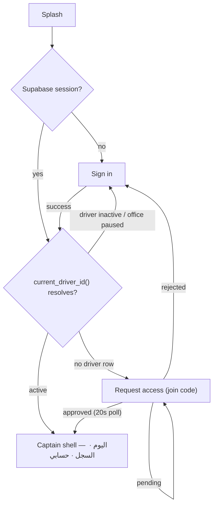
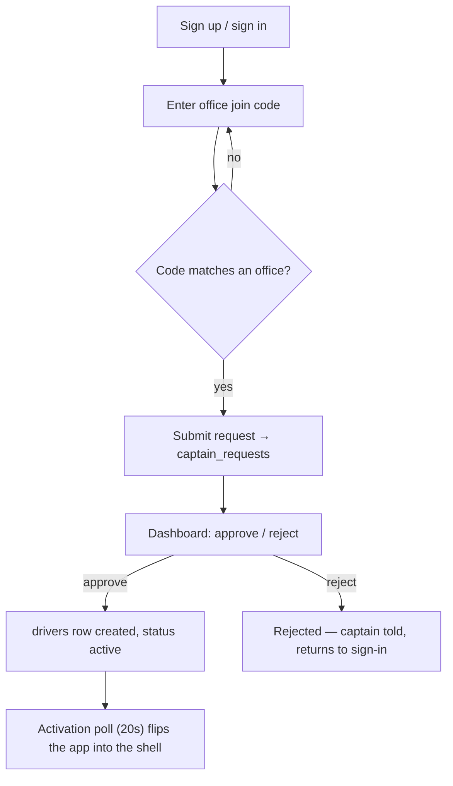
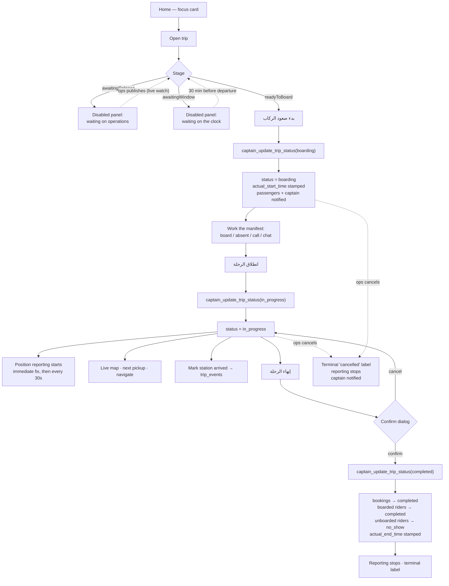
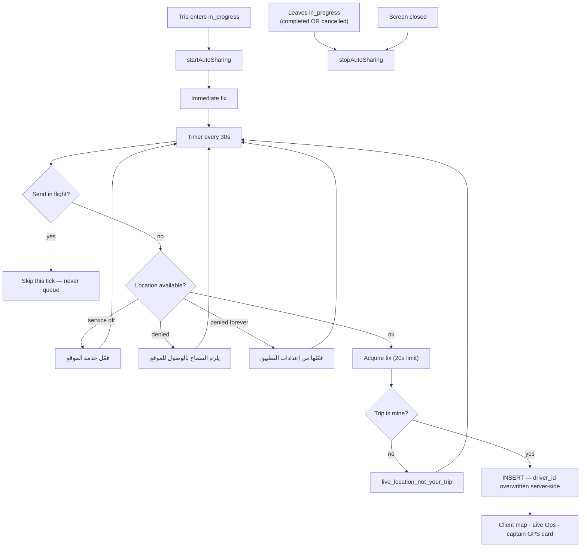
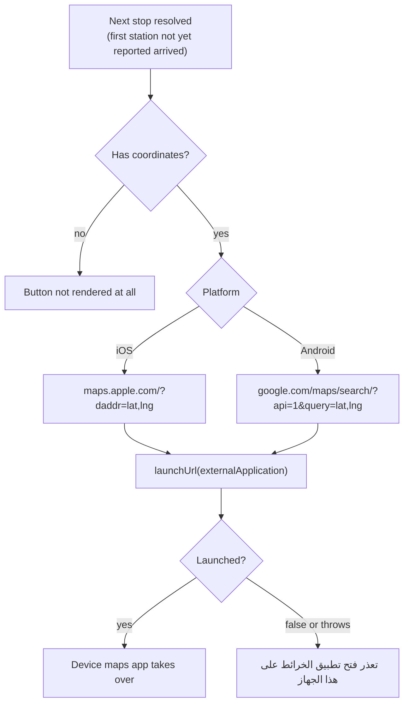
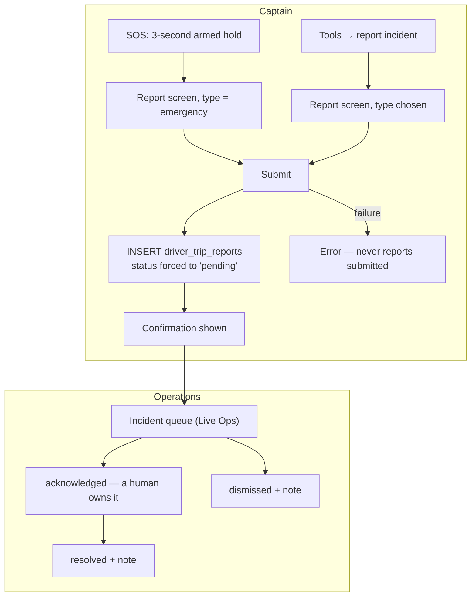
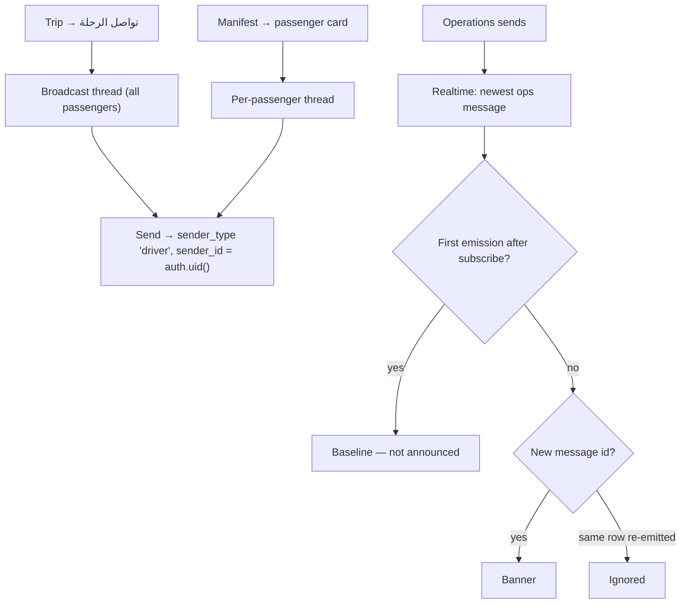
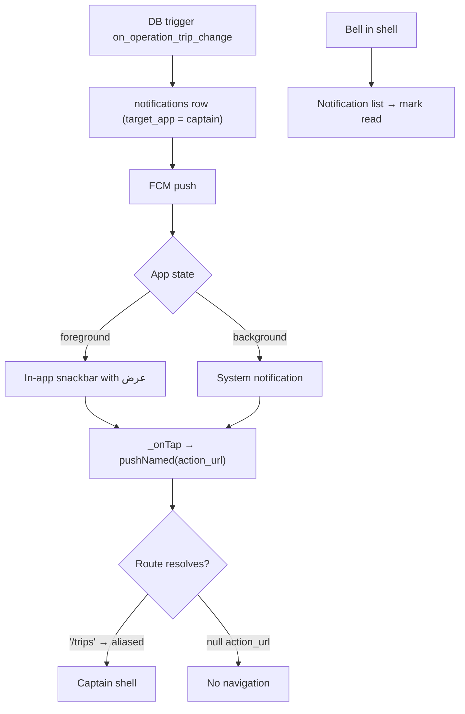
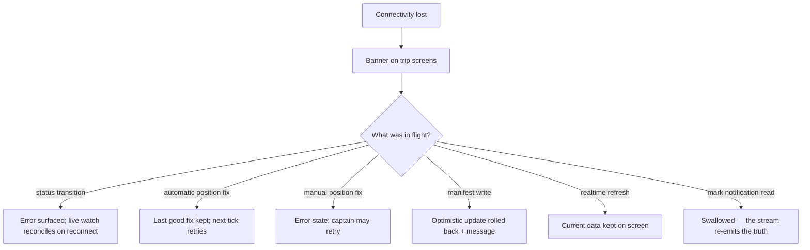

# Captain — User Flows

> **Scope.** The journeys a captain actually walks, with the failure branches drawn rather
> than implied. Verified against the code and the live database on **2026-07-28**.
>
> **Companions.** [`CAPTAIN_LIFECYCLE.md`](CAPTAIN_LIFECYCLE.md) ·
> [`CAPTAIN_USER_STORIES.md`](CAPTAIN_USER_STORIES.md) ·
> [`CAPTAIN_OPERATIONAL_STATUS.md`](CAPTAIN_OPERATIONAL_STATUS.md)

---

## 1. Launch and routing gate

Four roots, no bypass. Identity is re-resolved server-side on every launch, so a captain
deactivated overnight lands back on sign-in rather than in a stale shell.

---

## 2. Onboarding — self-service access request

The join code is authoritative — the office is not chosen from a list the captain can get
wrong.

---

## 3. Trip execution — the main journey

**Every button corresponds to a real backend transition.** There are no controls that only
write a log, and none that offer a transition the state machine would reject.

### Failure branches on a transition

| Backend error | What the captain sees |
| --- | --- |
| `invalid_transition` | حالة الرحلة لا تسمح بهذا الانتقال |
| `trip_not_found` | الرحلة غير موجودة |
| `not_your_trip` / `not_a_captain` / `status_not_allowed_for_captain` | غير مصرح لك بتعديل هذه الرحلة |

The screen's live watch is the source of truth, so a failed optimistic action reconciles
back to the real status rather than leaving the UI ahead of the database.

---

## 4. Live tracking

An automatic failure keeps the last good fix on screen and retries on the next tick — the
captain is driving, and a dropped tick is not worth interrupting them over. The **card's
headline** reflects the age of the last landed fix, so a run of failures reads as
"تعذّر إرسال موقعك" rather than as a healthy cadence.

---

## 5. Navigation to the next stop

A stop without coordinates renders no button rather than one that fails. `launchUrl` both
returns `false` and throws on a device with no handler, and both are handled — the failure
is spoken aloud, never swallowed to the console.

---

## 6. Incident and SOS

A plain tap on the SOS control explains the gesture instead of firing it. The captain
**cannot** move a report out of `pending` — no update or delete path exists for them, so a
filed incident cannot be withdrawn by the person who filed it.

---

## 7. Communication

De-duplication is on message **identity**. Operations repeating the same sentence is two
banners, because a repeated instruction usually means the first was not acted on.

---

## 8. Notifications

Deep-linking into a **specific trip** is not implemented: `action_url` and `data.trip_id`
are carried into the domain entity and then dropped, and tapping an in-app notification only
marks it read. Recorded as a gap, not described as working.

---

## 9. Offline and failure

There is **no offline queue**. Nothing is lost, but a transition or fix attempted with no
signal is delayed until the captain retries or the next tick fires.
