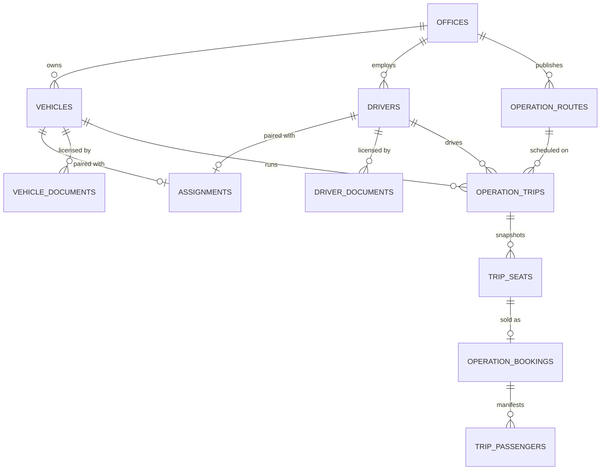
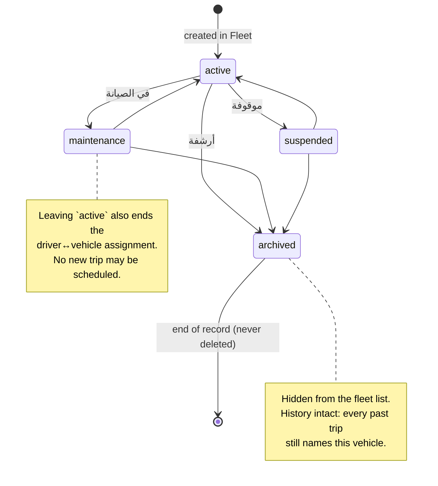
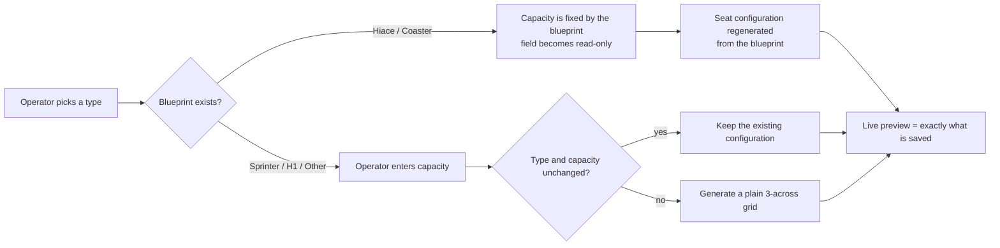
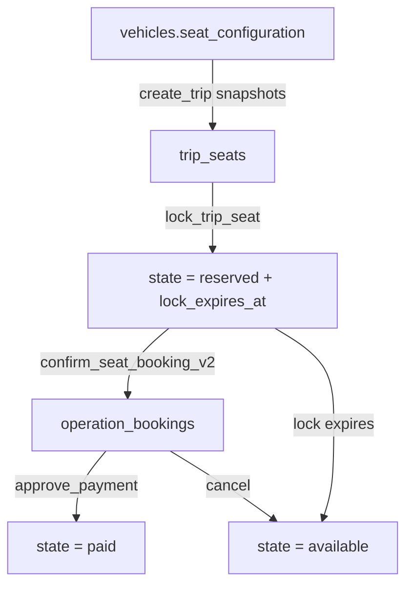

# Fleet Management

Phase 4 of the Dashboard Re-Ownership Program. This documents the fleet domain **as it is
after 2026-07-28**, including the things that are still wrong. Where a rule is enforced, the
file and line of the enforcement is named; where it is only a convention, it says so.

Companion artefacts:

| Artefact | Path |
|---|---|
| Migration | `supabase/migrations/20260728090000_fleet_authority.sql` |
| DB regression suite | `supabase/tests/fleet_authority_regression.sql` (54 cases) |
| Flutter tests | `test/apps/dashboard/features/fleet/` (76 cases) |
| Seat blueprints (shared by all three apps) | `lib/core/vehicles/` |

---

## 1. The model



### Who owns which truth

This is the part that matters most, and the part that was wrong before this phase.

| Fact | Owner | Enforced by |
|---|---|---|
| Which office a vehicle/driver belongs to | `vehicles.office_id` / `drivers.office_id` | RLS `*_office_manage`, FK to `offices` |
| Cabin **geometry** (where seats sit, aisle, door) | `lib/core/vehicles/vehicle_seat_layouts.dart` | Dart, shared by Dashboard + Client + Captain |
| A vehicle's **seat data** (which seats exist, labels, positions) | `vehicles.seat_configuration` | `vehicles_seat_configuration_wellformed` CHECK |
| A vehicle's **capacity** | `vehicles.capacity`, and it must equal the layout | `vehicles_capacity_matches_seat_configuration` CHECK |
| A trip's **seat inventory** | `trip_seats`, snapshotted from the vehicle at creation | `create_trip` derives it; `uq_trip_seats_trip_label` |
| A trip's **capacity** | `operation_trips.capacity`, set from the snapshot | `create_trip` |
| Whether a vehicle/driver is free at a time | `operation_trips.service_window` | `operation_trips_{vehicle,driver}_no_overlap` EXCLUDE |
| Whether a vehicle/driver may be scheduled | `vehicles.status` / `drivers.status` | `enforce_trip_resource_availability` trigger |
| Which seat a booking holds | `operation_bookings.seat_id` | `uniq_active_booking_per_seat` (pre-existing) |

**Geometry stays in Dart on purpose.** Three apps draw the same cabin; a second copy of the
blueprints in SQL is how they drift apart. What moved into the database in this phase is
strictly the part the database can *prove*: counts, uniqueness, ownership, availability and
overlap.

---

## 2. Vehicle lifecycle

`vehicles.status` already existed with four values and they were already meaningful — this
phase did not invent states, it made them binding.



### Archive, never erase

`operation_trips.vehicle_id` and `.driver_id` are `ON DELETE SET NULL`. Deleting a retired
bus therefore did not fail — it silently rewrote history, and every completed trip it had
ever run lost the record of which vehicle carried those passengers. Worse, the dashboard's
delete path removed the assignments and documents *first*, specifically so the `RESTRICT`
foreign keys would stop objecting.

Two guards now:

1. `enforce_fleet_delete_guard` (BEFORE DELETE on `vehicles` and `drivers`) refuses when any
   trip references the row. This is the authority.
2. `SupabaseFleetDatasource._assertNoTripHistory` refuses *before* deleting the assignments
   and documents, and returns an Arabic sentence naming the number of trips.

Deletion remains available for a row that never carried anything, which is the only case
where it is safe.

---

## 3. Vehicle types and seat layouts

### The registry

`lib/core/vehicles/vehicle_seat_layouts.dart` holds one blueprint per type, written as a
text grid (`S` seat · `D` driver · `^` door · `|` aisle · `.` blank):

| Type | `dbValue` | Capacity | Cabin |
|---|---|---|---|
| Toyota Hiace | `Hiace` | 14 | 3 across, right-hand aisle, flush 4-seat rear bench |
| Toyota Coaster | `Coaster` | 30 | 2+2 across a centre aisle, front entrance, 5-seat rear bench |
| Mercedes Sprinter | `Sprinter` | operator-entered | derived from the seat grid |
| Hyundai H1 | `H1` | operator-entered | derived from the seat grid |
| Other | `Other` | operator-entered | derived from the seat grid |

`vehicles.vehicle_type` is free text with no DB enum. Every app parses it through
`VehicleTypeParser.fromDatabase`, which is deliberately tolerant (`Hiace`, `hiace`,
`Toyota Hiace`, `هايس` all resolve to the same van) and falls back to `Other` rather than
guessing a layout that could be wrong.

### Type → capacity → layout



`VehicleSeatConfigurator.resolve` is called by **both** the preview and the save path, from
the same function, so the cabin the operator approves is byte-for-byte the one persisted.
Regenerating rather than merging is what makes a Hiace → Coaster switch leave no seats
behind and create no duplicates.

### What the client and captain draw

`VehicleSeatLayouts.resolve` uses a predefined blueprint **only when it fits the seat data**.
A vehicle typed `Coaster` that still carries a 14-seat configuration would otherwise render
as a 30-slot Coaster frame with sixteen holes in it, so in that case the layout is derived
from the seat coordinates instead — plainer, but truthful.

---

## 4. Seat persistence lifecycle

The chain the whole feature rests on, and where each link is now checked:

```mermaid
sequenceDiagram
    participant Op as Operator
    participant Form as FleetVehicleFormView
    participant DB as vehicles
    participant RPC as office_create_trip → create_trip
    participant Seats as trip_seats
    participant Client as Client app

    Op->>Form: pick type / capacity
    Form->>Form: VehicleSeatConfigurator.resolve()
    Note over Form: preview and payload are the same call
    Form->>DB: seat_configuration + capacity
    Note over DB: CHECK capacity = passenger count<br/>CHECK layout well-formed, labels unique
    Op->>RPC: create trip on this vehicle
    RPC->>DB: vehicle_trip_seats(vehicle_id)
    Note over RPC: capacity and seats are DERIVED here;<br/>the client's p_seats is ignored
    RPC->>Seats: one row per bookable seat
    Note over Seats: UNIQUE (trip_id, seat_label)
    Client->>Seats: read the seat map
    Op->>DB: later — edit the vehicle's layout
    Note over Seats: unchanged. The trip is a snapshot.
```

### The snapshot rule

A trip's seats are a snapshot of the vehicle **at the moment the trip was created**. Editing
a vehicle afterwards never moves seats under a rider who already booked one. This was already
true (nothing wrote `trip_seats` on a vehicle edit) and is now true *and* deliberate:

- `create_trip` builds `trip_seats` from `vehicle_trip_seats(p_vehicle_id)`.
- A mid-service vehicle swap is allowed (swapping a broken-down bus is a real operation) but
  the replacement must have **at least** as many seats as the trip already sold a map of —
  `vehicle_too_small` in `enforce_trip_resource_availability`.

### Seat identity

A seat's identity within its trip is its **label**, not its array index. Labels are `'1'..'N'`
in cabin reading order, produced by `SeatLayoutBlueprint.seatDefinitions()`, and are what the
rider's ticket, the captain's manifest and `trip_seats.seat_label` all agree on. Three checks
protect it:

- `vehicles_seat_configuration_wellformed` — no blank labels, no duplicate passenger labels,
  every seat has a `(row, column)`.
- `uq_trip_seats_trip_label` — no two seats on one trip answer to the same name.
- `create_trip` re-checks `count(distinct seat_label) = capacity` before inserting.

---

## 5. Assignment and conflict rules

### Driver ↔ vehicle pairing

`assignments` pairs one driver with one vehicle. Enforced by two pre-existing partial unique
indexes, `uniq_active_assignment_per_driver` and `uniq_active_assignment_per_vehicle`, both
`WHERE status = 'active'`. This was already correct.

### Trip overlap — the rule that changed

**Before:** `create_trip` rejected a second trip for the same vehicle *or* driver on the same
`trip_date`, regardless of time. On the 53-minute Marg ↔ New Cairo route that capped each bus
at one departure a day.

**Now:** each trip carries a generated `service_window`:

```
start = trip_date + departure_time
end   = trip_date + arrival_time   (+1 day when the trip runs past midnight)
        + 30 minutes turnaround
```

and two GiST exclusion constraints forbid overlap per vehicle and per driver, over all
non-cancelled trips. Because only the *end* is extended, the effective rule is "the next
departure must be at least 30 minutes after the previous arrival" — the allowance is counted
once between two trips, not twice.

```mermaid
gantt
    title One bus, one day — allowed under the new rule, refused under the old one
    dateFormat HH:mm
    axisFormat %H:%M
    section RGX-A1
    Trip 1 08:00 → 10:00      :done, t1, 08:00, 120m
    Turnaround                :crit, tr1, 10:00, 30m
    Trip 2 14:00 → 16:00      :active, t2, 14:00, 120m
    Refused — 10:15 departure :crit, bad, 10:15, 45m
```

**Why an exclusion constraint and not a trigger:** the old check was a `LIMIT 1` SELECT inside
one RPC. It did not cover direct PostgREST writes, and two concurrent transactions could each
see no conflict and both commit. The constraint holds in both cases.

**Scope note:** the prompt asked whether this belongs to Fleet or Scheduling. It is a *fleet
resource contention* invariant — one bus and one driver are one physical resource that can be
in one place at a time — so it lives with the fleet. The trip wizard consumes it; it does not
own it.

### Availability at assignment

`enforce_trip_resource_availability` (BEFORE INSERT OR UPDATE OF `vehicle_id`, `driver_id`)
refuses when the vehicle or driver is not `active`, is not in the trip's office, or (on a
swap) is too small. `FleetOperationalStatus.canTakeNewTrip` mirrors this in Dart so the
dashboard can grey the option out rather than let the operator fill in a whole wizard and be
refused at the end.

---

## 6. Operational status

`vehicles.status` answers "may this bus be used?" — an *intent* the operator sets. It has
never answered "is this bus on the road right now?", which only `operation_trips` knows. The
fleet screens now show both, side by side, and let them disagree.

| Chip | Source | Meaning |
|---|---|---|
| متاح | `vehicles.status = active`, no upcoming trip | free to schedule |
| مُعيّن | a `scheduled` / `open_for_booking` trip, `trip_date >= today` | committed to a departure |
| في رحلة | a `boarding` / `in_progress` trip | physically out |
| في الصيانة | `vehicles.status = maintenance` | in the workshop |
| غير متاح | `vehicles.status = suspended` | withdrawn from service |
| متقاعد | `vehicles.status = archived` | retired, history intact |

Precedence is deliberate: **an in-flight trip outranks the record's intent**, so a bus that is
genuinely carrying passengers never reads "متاح" or "في الصيانة". Because the lifecycle chip
is still rendered next to the operational one, a bus marked for maintenance while under way
shows *both* — which is the contradiction a dispatcher needs to see, not one the UI should
launder away.

No status is invented. Every value above is derived from a column that already exists.

---

## 7. Booking relationship



Invariants across this chain:

- **One physical seat, one live booking** — `uniq_active_booking_per_seat` on
  `(trip_id, seat_id)` and `uniq_active_booking_per_seat_label` on `(trip_id, seat)`, both
  partial on `status not in ('cancelled','rejected')`. Both pre-existed; this phase verified
  them against the live database rather than assuming them, and re-verifies them in section G
  of the regression suite. Nothing was added — a third overlapping index would be write cost
  for no additional guarantee.
- **The rider cannot outrun the lock** — `confirm_seat_booking_v2` takes the seat `FOR UPDATE`
  and requires `state = 'reserved'` held by that client with an unexpired lock.
- **`booked_seats` is derived** — `sync_trip_booked_seats` recomputes it from `trip_seats`
  on every seat state change.
- **Reassignment works again** — `reassign_booking` had never once run successfully: it read
  `trip_seats.status` (the column is `state`), wrote the state `'booked'` (not in the CHECK
  constraint), and updated `operation_bookings.seat_label` (the column is `seat`). It also
  read capacity from `vehicles.capacity` — today's vehicle — instead of the trip's own
  snapshot. All four are fixed.

---

## 8. Security model

### RLS

Every fleet base table has RLS enabled with office-scoped policies. This was already correct
and is **not** altered by this phase:

| Table | Policy | Rule |
|---|---|---|
| `vehicles` | `vehicles_office_manage` (ALL) | `office_id = current_office_id()` |
| `vehicles` | `vehicles_captain_read` (SELECT) | `office_id = captain_office_id()` |
| `drivers` | `drivers_office_manage` (ALL) | `office_id = current_office_id()` |
| `drivers` | `drivers_self_read` (SELECT) | `user_id = auth.uid()` |
| `assignments` | `assignments_office_manage` (ALL) | `office_id = current_office_id()` |
| `vehicle_documents` / `driver_documents` | `*_office_manage` (ALL) | owner's `office_id` matches |
| `trip_seats` | `trip_seats_office_manage` / `_captain_read` / `_marketplace_read` | via the parent trip |

### The hole this phase closed — CRITICAL

`public_vehicle_profiles` and `public_driver_profiles` are single-table views with a `WHERE`
clause, which makes them **auto-updatable**. They are owned by `postgres` and were created
without `security_invoker`, so a write through them executes as the view owner — and RLS on
`vehicles` / `drivers` is never consulted. `INSERT`, `UPDATE` and `DELETE` were granted on
them to `anon`.

Proven against the live database before the fix (inside a rolled-back transaction):

```
set local role anon;
update public.public_vehicle_profiles set color = color;
-- PROOF: anon updated 4 vehicles rows through the view
```

Any client holding the public anon key could deface or delete every listed office's fleet.
`public_offices` had the identical hole.

**The fix is to remove the write privilege, not to flip the views to `security_invoker`.** The
whole point of these views is to let a caller who *cannot* read `vehicles` read its public
subset; making them invoker views would instead require opening the base tables to `anon`,
which is the opposite of the fix. A view confers no privilege its caller was not granted on
the view itself, so revoking the write bits closes it completely.

Also revoked: `TRUNCATE` on the fleet base tables from `anon` **and** `authenticated`.
PostgreSQL row security does not apply to `TRUNCATE` at all, so that grant was a real
privilege rather than a redundant one.

### RPC authorisation

| Function | Executable by | Checks |
|---|---|---|
| `office_create_trip` | `authenticated` | route, driver and vehicle must all be in `current_office_id()` |
| `create_trip` | `service_role` only | called through the wrapper above |
| `reassign_booking` | `service_role` only | called through `office_reassign_booking`, which asserts both offices match |
| `vehicle_trip_seats` | `authenticated` | reads a vehicle the caller can already see |
| `seat_config_*` | `anon`, `authenticated` | pure functions over a supplied payload |

**Flutter filtering is not a security boundary anywhere in this module.** Every claim above
is enforced in the database and exercised by sections A and B of the regression suite, which
impersonate `anon`, office A and office B with real JWT claims.

---

## 9. User flows

### Adding a vehicle

1. Fleet → المركبات → **إضافة مركبة**.
2. Pick a type. Hiace and Coaster set the capacity themselves and make the field read-only;
   the others leave it to the operator.
3. The cabin preview below redraws immediately — it is the same computation that will be
   saved.
4. A driver is required. Only active drivers with no expired documents and no other active
   assignment are offered.
5. **حفظ** is in a docked bar at the bottom of the dialog, always on screen.

### Retiring a vehicle

1. Fleet → المركبات → row menu → **أرشفة**.
2. The vehicle leaves the list, its assignment ends, and no new trip can be scheduled on it.
3. Every past trip still names it. Attempting **حذف** on a vehicle with history is refused
   with the trip count.

### Scheduling around the fleet

1. Trips → new trip wizard → pick a vehicle.
2. The seat count comes from the vehicle; the wizard cannot override it.
3. If the bus or driver is busy in an overlapping window, the wizard names the conflicting
   trip and its departure time.

---

## 10. Edge cases and how they behave

| Case | Behaviour |
|---|---|
| Vehicle edited after a trip is published | Trip seats unchanged. The trip is a snapshot. |
| Vehicle swapped mid-service | Allowed if the replacement has ≥ the trip's seat count; seats unchanged. |
| Vehicle sent to maintenance while a trip is under way | Allowed. The row shows في الصيانة **and** في رحلة so the contradiction is visible. |
| Vehicle deleted with trip history | Refused, twice (Dart pre-check + DB trigger). Archive instead. |
| Trip cancelled | Its vehicle and driver are released immediately — the exclusion constraints exclude cancelled trips. |
| Overnight trip (22:00 → 01:00) | `service_window` rolls the end to the next day. |
| Trip with no `arrival_time` | Assumed to occupy one hour. No row in the database has this; the wizard always computes an arrival. |
| Vehicle with the default `{}` seat configuration | Loads as unconfigured instead of crashing the Fleet screen. Cannot be saved from the form, and `create_trip` refuses it with `vehicle_has_no_seats`. |
| Plate typed in Arabic-Indic digits (`٣٣٠٠ ق ل`) | Accepted. See §11. |

---

## 11. Bugs fixed in this phase

| ID | Severity | Defect | Root cause | Fix |
|---|---|---|---|---|
| F-1 | **Critical** | `anon` could UPDATE/DELETE any listed office's vehicles, drivers and offices | Auto-updatable SECURITY DEFINER views with write grants to `anon`; RLS never consulted | Revoked INSERT/UPDATE/DELETE/TRUNCATE/REFERENCES/TRIGGER on all three views |
| F-2 | **High** | `anon` held `TRUNCATE` on every fleet table | Blanket `grant all`; RLS does not filter TRUNCATE | Revoked from `anon` and `authenticated` |
| F-3 | **High** | A trip's seats and capacity were whatever the client posted | `create_trip` inserted `p_seats` and `p_capacity` verbatim | Both derived from `vehicles.seat_configuration` inside the RPC |
| F-4 | **High** | One vehicle = one trip per day | `create_trip` compared `trip_date` only | `service_window` + GiST exclusion constraints |
| F-5 | **High** | Deleting a vehicle silently erased it from every past trip | `ON DELETE SET NULL`; dashboard cleared the RESTRICT FKs first | `enforce_fleet_delete_guard` + a Dart pre-check that refuses before destroying anything |
| F-6 | **High** | Egyptian plates in Arabic-Indic digits could not be saved at all | `\d` is ASCII-only, and `[؀-ۿ]` *contains* `٠..٩`, so `٣٣٠٠` read as letters with no digits | `normalizeDigits` + a letter class that excludes both Arabic digit blocks |
| F-7 | **High** | Dashboard booking reassignment had never worked | `reassign_booking` used `trip_seats.status`, state `'booked'`, and `operation_bookings.seat_label` — none of which exist | Rewritten against the real columns; capacity read from the trip snapshot |
| F-8 | Medium | A vehicle in the workshop could be scheduled | Nothing checked `vehicles.status` at assignment | `enforce_trip_resource_availability` trigger |
| F-9 | Medium | `capacity` could disagree with `seat_configuration` | No constraint | `vehicles_capacity_matches_seat_configuration` CHECK |
| F-10 | Medium | Two seats on one trip could share a label | No constraint | `uq_trip_seats_trip_label` |
| F-11 | Medium | The vehicle form's save button sat below the fold | Action bar was the last child of a ~2400px scroll view | Docked in a fixed footer, in both fleet forms |
| F-12 | Medium | The cabin was mirrored under Arabic RTL | Plain `Row` inherits the ambient direction | Cabin grid pinned to LTR in the dashboard visualiser and `ClientSeatMap`; labels still RTL |
| F-13 | Medium | A row with the default `{}` seat config crashed the whole Fleet screen | `json['rows'] as int` on a null | Defensive parsing, geometry derived from the seats |
| F-14 | Low | Removing a vehicle's last photo or clearing a note did nothing | `_onlyAllowed` dropped every empty string | Empty is honoured for `image_url`, `profile_image_url`, `notes` |
| F-15 | Low | Image drop zone clipped at text scale 1.6 | Fixed `height: 140` | `minHeight` constraint |

---

## 12. Known limitations

| Severity | Item |
|---|---|
| **High** | **`vehicles.vehicle_type` can still disagree with the layout.** One live row (`ijmklkm`, plate `kjmkm8787`) is typed `Coaster` but carries a 14-seat Hiace configuration, and has an `open_for_booking` trip on it. `capacity = seat count` holds, so the trip's seats are correct and the client draws a truthful grid; but the *type* is wrong. It is not auto-corrected because the physical truth is unknowable from here — the fix is for the operator to open the vehicle and re-save it with the right type, which regenerates the layout. A DB-level type↔capacity registry would require guessing this row first. |
| Medium | **25 orphaned bookings** (`trip_id IS NULL`, 22 of them not cancelled) predate Phase 3's trip delete guard. They are booking-domain wreckage, not fleet, and are listed here because they surfaced during this audit. |
| Medium | **Plate numbers are stored as typed.** `٣٣٠٠ ق ل` and `3300 ق ل` are two different rows under the global `vehicles_plate_number_key` unique index. Normalising on write is a product decision (it changes stored data), so validation accepts both and storage was left alone. |
| Medium | **The 30-minute turnaround is a constant.** It is baked into the generated column because a generated column must be immutable. Making it per-office would mean replacing the exclusion constraint with a trigger and giving up the concurrency guarantee. |
| Low | **`vehicles.plate_number`, `drivers.national_id` and `drivers.license_number` are globally unique.** Correct for the values themselves, but a collision tells office B that office A already holds that plate. |
| Low | **`operation_trips.revenue` remains dead** (documented in earlier phases); fleet reports sum approved bookings instead. |
| Low | **Driver operational status is not surfaced.** `FleetVehicleDuty` carries `driverId`, so the data is loaded and the drivers screen could show the same chip; only the vehicles screen renders it today. |

---

## 13. Verification

| Check | Result |
|---|---|
| `flutter analyze lib` | 0 issues |
| `test/apps/dashboard/features/fleet` | 76 passing |
| `test/apps/dashboard` | 531 passing, 0 failing |
| `supabase/tests/fleet_authority_regression.sql` (live DB) | 54 passing, 0 failing |
| Migration dry-run (BEGIN…ROLLBACK on the live DB) | clean; 4/4 existing vehicles and 9/9 existing trips satisfy every new constraint |
| Fixture leakage after the live run | 0 `RGX-*` rows in `vehicles`, `drivers`, `operation_trips`, `operation_bookings` |
| Row counts after migration | vehicles 4, drivers 11, trips 9, trip_seats 142, bookings 32 — unchanged |
