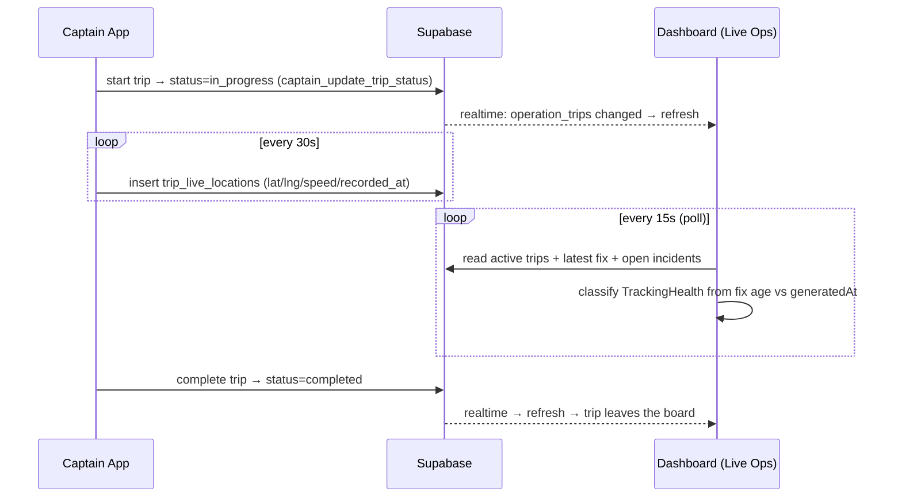
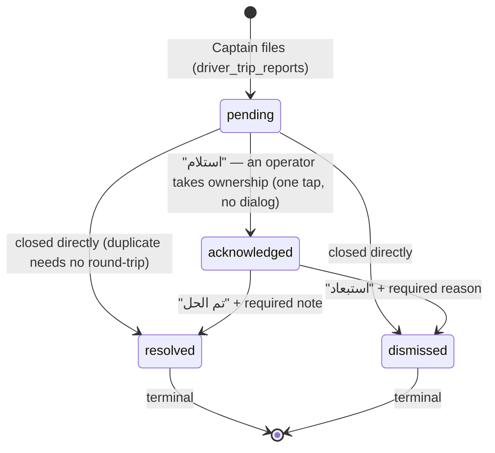
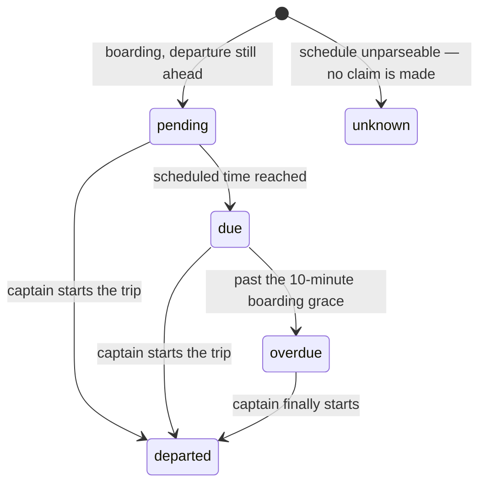

# Live Operations Center — Design & Reference

**Module:** `lib/apps/dashboard/features/live_ops/`
**Route:** `DashboardRoutes.liveOps` (`/live-ops`) · sidebar **العمليات المباشرة** (first item under التشغيل)
**Added:** 2026-07-27

The Live Operations Center is the dashboard's answer to the operator's most urgent
question — *"what is happening on the road right now?"*. Before it, the dashboard could
plan and reconcile trips but went **blind the moment a trip left the yard**: the Client
and Captain apps had full live tracking end-to-end, yet the office had no window onto it.
This module closes that gap, and pairs it with the office's first **incident queue**.

> **Accuracy note.** Written against the code as of 2026-07-27. Every number the screen
> shows is a live count off real backend rows — nothing is estimated or mocked.

---

## 1. Why it exists (the gap it closes)

| Capability | Client app | Captain app | Dashboard (before) | Dashboard (now) |
|---|---|---|---|---|
| See a vehicle's live position | ✅ (`tracking`) | ✅ publishes every 30s | ❌ | ✅ |
| Know if a captain's feed went stale | ~ | — | ❌ | ✅ LIVE/STALE/OFFLINE/UNKNOWN |
| See captain-filed incidents / SOS | — | ✅ files them | ❌ *(table read by no one)* | ✅ open queue + resolve |

The backend was already built for this. `trip_live_locations` has been in the
`supabase_realtime` publication since `20260704130000`, and `driver_trip_reports` had its
office-scoped RLS restored in `20260723120000` with a comment that says it verbatim:
*"The office policy below is written now so the Dashboard's future incident view is already
scoped."* This module **is** that future view.

---

## 2. Actors & permissions

| Actor | Access | Rationale |
|---|---|---|
| Owner (`المالك` / `dashboard_admin`) | Full | Runs the office. |
| Support agent (`خدمة العملاء`) | **Read-only** | *"What is affecting a customer or a captain right now"* is precisely their remit while a passenger is on the phone, so `DashboardPermission.liveOps` is in the support-agent set. Closing a report is not: that is an operations call with a permanent audit trail attached to whoever made it. |
| Platform admin | Per-office | Sees it inside whichever office context they operate; the module reaches across nothing. |

Two permissions, deliberately separate:

- **`liveOps`** — see the board: active trips, tracking health, the fleet map, the incident
  queue. Owner + support agent.
- **`liveOpsIncidentAction`** — acknowledge / resolve / dismiss a report. Owner only. A
  support agent's cards render with no action buttons at all rather than disabled ones, since
  a greyed "resolve" only invites repeated clicking.

The capability is resolved from the **signed-in** office role, not the shell's debug-switchable
`_role`, because the write leaves a permanent record of who made it.

Isolation is **not** enforced in Dart — it is enforced by RLS on every table the module
reads, and by the office check inside the position RPC (see §5). The screen passes no
`office_id` to any table query.

---

## 3. What the screen shows

```
مركز العمليات المباشر                                   [ تحديث ]
┌───────────────── KPI strip (live counts) ─────────────────┐
│  على الطريق  │  صعود الركاب  │  تتبّع متعثّر  │  بلاغات مفتوحة │
└───────────────────────────────────────────────────────────┘
[ 🔴 بلاغ طوارئ نشط — يتطلب تدخلاً فورياً ]   ← only if a critical incident is open

الرحلات على الطريق (flex 3)          │   البلاغات المفتوحة (flex 2)
┌───────────────────────────┐        │   ┌───────────────────────┐
│ Route · status   [حية ●]  │        │   │▌طوارئ      منذ 3 د     │
│ 👤 driver · phone         │        │   │ route·driver·vehicle  │
│ 🚌 vehicle · الانطلاق 08:00│        │   │ description           │
│ الإشغال      7 / 14  ▓▓▓░░ │        │   │            [ تم الحل ] │
│ 📍 آخر تحديث منذ 20 ث · 36كم/س│     │   └───────────────────────┘
└───────────────────────────┘        │   …
```

Below 1080px the two panels stack (trips first, then incidents). Each trip card sits in a
1- or 2-column `Wrap` depending on width. No fixed pixel layout, no overflow.

---

## 4. Tracking health — the core model

The captain publishes a fix roughly **every 30 s** while a trip runs
(`kAutoLocationInterval`). Health is classified purely from the **age of the latest fix**,
in `TrackingHealth.fromFixAge`, with thresholds expressed as multiples of that cadence so a
single dropped update never demotes a healthy captain:

| State | Arabic | Condition | Meaning |
|---|---|---|---|
| `live` | حية | age ≤ **75 s** | Genuinely current (pulsing green dot). |
| `stale` | متأخرة | 75 s – **4 min** | Feed slipped; glance, don't alarm. |
| `offline` | غير متصلة | > 4 min | Lost signal / app closed. |
| `unknown` | غير معروفة | **no fix ever** | Never shared — likely a permission problem. Distinct from `offline`: there is nothing to be stale. |

Health is computed against a **single clock** — `LiveOpsSnapshot.generatedAt`, stamped when
the snapshot is read — so every badge, KPI and "updated N ago" label on the page agrees, and
the logic is deterministic under test. A fix stamped slightly in the future (clock skew)
reads as fresh, never as a negative age.

**The rule the mission demands is honoured:** a trip is never shown as "live" when its last
fix is old. `trackingAtRiskCount` counts exactly the trips that are *not* `live`.

---

## 5. Data & isolation

All reads are office-scoped. `trip_live_locations` has no RLS by design (it is kept open so
realtime delivery to *client* maps works), so the dashboard does not query it directly at all —
positions come from a `SECURITY DEFINER` RPC that applies the office check server-side.

| Read | Source | Scoping |
|---|---|---|
| Active trips | `operation_trips` where `status ∈ {boarding, in_progress}` | `office_id` filter **+** `trips_office_manage` RLS |
| Latest position per trip | `dashboard_active_trip_fixes(p_office_id)` RPC | office check *inside* the function: `p_office_id = current_office_id() or is_platform_admin()` |
| Open incidents | `driver_trip_reports` where `status ∈ {pending, acknowledged}`, **inner**-joined to `operation_trips` | `driver_trip_reports_office_manage` RLS + the mandatory join |
| Incident transition | `update driver_trip_reports set status/…_at/…_by/resolution_note` | same RLS policy authorises the write; a foreign id matches zero rows |

The inner join on the incident read matters for isolation as well as for data: it makes the
join mandatory, so a report whose trip is not visible to this office drops out of the result
rather than arriving stripped of context.

**Why the RPC replaced the direct query.** The original read pulled *every* fix row for every
active trip with no bound. At the captain's 30s publish cadence a 3-hour trip is ~360 rows, so
a desk watching 20 trips re-downloaded ~7,200 rows every 15s poll to use 20 of them. The RPC
does one `DISTINCT ON (trip_id) … ORDER BY recorded_at DESC` against the existing
`(trip_id, recorded_at DESC)` index and returns exactly one row per trip. A failure is
swallowed: positions are an enrichment, and a desk that can still see *which* trips are
running — with tracking marked unknown — beats an error screen.

### Verified against the live database, 2026-07-27

Migration `20260727090000_live_ops_incident_lifecycle.sql`, applied and confirmed:

- 4 lifecycle columns present on `driver_trip_reports`.
- `driver_trip_reports_status_check` present and `convalidated = true` (pre-flight found 0
  violating rows).
- `dashboard_active_trip_fixes` is `prosecdef = true`, granted to `authenticated` only —
  `anon` and `public` explicitly revoked.

Office isolation was proven, not assumed, with a transactional test (seed → assert →
`ROLLBACK`), acting as a real office-E0 operator via `set local request.jwt.claims`:

| Scenario | Rows visible |
|---|---|
| Own office | 1 |
| **Foreign office** | **0** |
| Direct `trip_live_locations` read (what the RPC replaces) | 15 (all offices) |

Rollback was verified afterwards: row counts and trip statuses returned to their pre-test
values. That third row is the standing platform-wide gap — recorded in the
`DASHBOARD_STATUS.md` security register — which the dashboard no longer depends on.

### Freshness: realtime **and** poll (defence in depth)

Mirrors the client tracking layer's resilient pattern:

- **Realtime trigger** — a channel on `operation_trips` (this office) + `driver_trip_reports`
  fires a refresh the instant a trip status flips or an incident is filed. Location fixes are
  deliberately *not* subscribed to (every ~30 s per trip = cross-office noise); the poll
  covers them.
- **Poll** — every **15 s** the cubit re-reads the snapshot, which both catches anything the
  socket missed *and* re-stamps `generatedAt` so health badges age correctly even when
  nothing else changes.

Neither path ever blanks a good screen: a failed refresh keeps the last snapshot. Only the
very first load can surface a full error state.

---

## 6. Flows

### 6.1 Live tracking (dashboard side)



### 6.2 Incident lifecycle

Reworked in the 2026-07-27 pass. The original flow was a single irreversible click
(`pending → resolved`), which collapsed a real workflow: an operator who had *seen* an SOS
and was already calling the captain had no way to say so, so a colleague saw the same
untouched-looking alarm and called again. There was also no record of who closed a report
or why.



Rules, all enforced in the domain (`IncidentStatus.canTransitionTo`) **before** any write,
and independently backed by the `driver_trip_reports_status_check` allowlist in the database:

- **Nothing reopens.** `acknowledged → pending` is illegal — it would erase the record of who
  took ownership. `resolved` and `dismissed` are terminal.
- **Acknowledged reports stay on the board.** They are still open work; they merely sink below
  untouched ones of the same severity. Claiming a report must never make it vanish from the
  operator handling it.
- **Closing requires a note.** A closed incident with no account of the fix is
  indistinguishable from a mis-click, and the note is the only record a supervisor has when
  the same captain reports the same fault next week.
- **`dismissed` is the honest exit** for a duplicate, a test, or a captain mis-tap — it keeps
  such reports out of resolved-work statistics instead of inflating them.
- **A stale queue cannot overwrite a colleague.** If operator B resolved a report while
  operator A's screen was mid-poll, A's action is refused with an explanation rather than
  silently clobbering B's resolution.

Every transition stamps only its own moment and actor (`acknowledged_at`/`acknowledged_by`,
`resolved_at`/`resolved_by`), so a report closed straight from `pending` truthfully carries no
acknowledgement time rather than a synthesized one.

**Triage order** is severity → unowned-before-owned → oldest-first. An SOS filed a minute ago
outranks an hours-old delay report; within one severity, "nobody has looked at this" floats to
the top.

Severity is **derived**, not captain-entered, so triage order is consistent:
`emergency → critical`, `vehicle_issue|route_blockage → warning`, everything else `info`.
`IncidentType.fromDb` also absorbs the legacy shorthand the original schema documented
(`flat_tire`, `traffic`, `passenger_no_show`, `sos`) so historical rows never fall through
to *other*.

### 6.3 Departure delay detection

`operation_trips` has carried `trip_date`, `departure_time` and `actual_start_time` all along;
nothing read them. A trip sitting in `boarding` forty minutes past its scheduled departure was
invisible to the desk.



- **`boardingGrace` is 10 minutes.** Loading a 14-seat Hiace routinely runs a few minutes past
  the clock; flagging that as late would train operators to ignore the flag.
- **A departed trip reports the delay it *actually* had** (`actual_start_time − scheduled`),
  not a delay that keeps growing. Three hours later it still reads "انطلقت متأخرة 25 د".
- **Unknown is never rendered as zero.** A departed trip with no recorded start time, or a trip
  whose schedule could not be parsed, shows no delay badge at all rather than "0 minutes late".
- **Only boarding trips are "overdue."** A trip already on the road is late, which is reported;
  it is not an action item, which is alarmed.
- Overdue trips **lead the trip list** and drive a dedicated KPI tile.

### 6.4 The fleet map

Every active trip that has reported a position, drawn at once, coloured by tracking health.
Reuses the shared `core/widgets/maps` stack (`EasyWayTileLayer`, `RouteCameraAnimator`,
`MapStyle`) rather than introducing a second mapping approach.

- **Tap a vehicle** to focus its trip; tap it again, or tap empty map, to zoom back out.
  Selection is shared with the trip cards, so map and list are one idea of "current".
- **The camera re-fits when the fleet changes, not on every position nudge.** A map that
  re-frames itself twice a minute is unusable for watching.
- **Trips with no fix are absent from the map and present in the list.** Drawing them at a
  guessed location would be a lie; the legend states how many are unplaced so an operator
  seeing three buses never assumes three trips.
- **Selection survives a background refresh**, and a selected trip that ends resolves to
  `null` through the snapshot rather than leaving a dangling id.

---

## 7. Edge cases handled

| Case | Behaviour |
|---|---|
| Nothing running **and** nothing reported | One all-clear card («الوضع هادئ») replaces both panels, naming each fact once and stating the refresh cadence and how current the read is — a blank live board with no timestamp is indistinguishable from a frozen one. Driven by `LiveOpsSnapshot.isQuiet`. |
| No active trips, reports open | Calm panel empty state: *"لا توجد رحلات على الطريق حالياً…"* — not an error. |
| No open incidents, trips running | Positive panel empty state: *"لا توجد بلاغات مفتوحة"*. Both use the shared `DashboardEmptyState`, so the two panels never speak in two different shapes side by side. |
| Captain never shared location | `unknown` badge + *"لم يُشارك الموقع بعد"* — never a fake "live". |
| Dropped socket / failed poll | Last good snapshot stays; next tick retries silently. |
| First-load failure | Full error card with **إعادة المحاولة**. |
| Resolve fails (e.g. RLS) | Screen preserved; error surfaced via snackbar + `actionError`, queue not blanked. |
| Two operators act on one report | Second action refused by `canTransitionTo` before any write, with an explanation — never a silent clobber. |
| Closing with an empty note | Refused by the dialog's validator; the report stays open. |
| Support agent opens the module | Full read-only view: queue and map visible, no action buttons rendered at all. |
| Trip overdue but never tracked | Both facts shown independently: `unknown` tracking badge **and** the overdue badge. |
| Departed trip with no `actual_start_time` | No delay claim at all — never rendered as "0 minutes late". |
| Trip active but no position | Absent from the map, present in the list, counted in the map legend as *بلا موقع*. |
| Selected trip completes mid-session | Selection resolves to `null` through the snapshot; the map falls back to fit-all. |
| Non-live tracking badge disposed | Fixed: the pulse controller is built eagerly in `initState` (see §10). |
| Zero-capacity trip | Occupancy ratio guarded to 0 (no divide-by-zero). |
| Clock skew (future fix) | Age floored at zero → reads fresh. |
| Concurrent refreshes (realtime + poll) | `_refreshing` guard prevents overlapping fetches. |

---

## 8. Architecture (Clean, matching the dashboard's own conventions)

No freezed / no codegen (the dashboard's deliberate house style): sealed-class state,
hand-written `fromJson` models, datasource → repository → use cases → cubit.

```
live_ops/
├── domain/entities/       live_ops_snapshot.dart (TrackingHealth, LiveFix, LiveTrip, LiveOpsSnapshot)
│                          trip_incident.dart      (IncidentType, IncidentSeverity, IncidentStatus, TripIncident)
├── domain/repositories/   live_ops_repository.dart
├── domain/usecases/       GetLiveOpsSnapshot · WatchLiveOps · UpdateIncidentStatus (+ InvalidIncidentTransition)
├── data/models/           live_trip_model.dart · trip_incident_model.dart
├── data/datasources/      live_ops_datasource.dart · supabase_live_ops_datasource.dart
├── data/repositories/     live_ops_repository_impl.dart
├── presentation/cubit/    live_ops_cubit.dart (poll + realtime) · live_ops_state.dart
├── presentation/screens/  live_ops_screen.dart
├── presentation/widgets/  summary_bar · live_trip_card · tracking_health_badge · incident_queue_section
│                          live_ops_map · departure_status_badge · incident_resolution_dialog · live_ops_format
└── live_ops_di.dart
```

**Tests:** 99 across two files.

`live_ops_test.dart` (44) — health-threshold boundaries, clock skew, snapshot counts,
departure-delay rules (grace boundary, departed-late-by-actual-start, unknown-never-zero),
overdue ordering, the full `IncidentStatus` transition matrix, db round-tripping,
triage ordering, `UpdateIncidentStatusUseCase` refusing illegal moves without touching the
repository, model mapping (embeds, seat counting, m/s→km/h, schedule parsing), and the
cubit's load / error / acknowledge / resolve-with-note / illegal-transition / failure /
selection paths.

`live_ops_widgets_test.dart` (55) — the delay badge's rendering rules, the action set offered
per lifecycle state, note-required-before-submit, the read-only support-agent view, RTL
lead/trail ordering, and a no-overflow sweep of the summary bar, trip card and incident queue
across **5 widths × 3 text scales** (320–1440px, 1.0×–1.6×).

---

## 9. Delivered in the 2026-07-27 pass

| Item | Was | Now |
|---|---|---|
| Fleet map | none — "the board" only | `LiveOpsMap` over the shared `core/` map stack, health-coloured, selectable, camera-stable |
| Incident lifecycle | `pending → resolved`, one click, no actor | 4 states, guarded transitions, required note, actor + timestamp per transition |
| Delay detection | none | `DepartureStatus` + delay badge + overdue KPI + overdue-first list ordering |
| Position reads | every fix row for every active trip, every 15s | one row per trip via `dashboard_active_trip_fixes` RPC |
| Position isolation | client-side (`in (ids)`) against an RLS-free table | server-side office check inside a `SECURITY DEFINER` RPC |
| Incident write authority | any dashboard role with the module | `liveOpsIncidentAction` — owner only; support agents read-only |

## 10. Bugs found and fixed during the audit

1. **`_HealthDot` crashed on dispose for every non-live badge.** The `AnimationController` was
   a `late final` lazy field. A non-pulsing dot (stale / offline / unknown — precisely the
   states this screen exists to surface) never touched the field in `initState`,
   `didUpdateWidget` or `build`, so the *first* access was `dispose()`. That constructed a
   controller against an already-deactivated element and threw *"Looking up a deactivated
   widget's ancestor is unsafe"*, crashing teardown whenever the operator navigated away with
   any non-live trip on screen. Now built eagerly in `initState` with a resting value of 1.
2. **`_MetaRow` overflowed by up to 33px** at narrow widths and large text scales: the
   secondary text (phone number, departure time) was an unconstrained `Text` beside an
   `Expanded`. Now `Flexible` with ellipsis.
3. **Unbounded position query** — see the table above.

Both UI bugs were caught by the new width × text-scale sweep, not by inspection.

## 11. Still out of scope (candidates for next iterations)

- **Captain call-out from the card** (tel: link / in-app message to the captain).
- **Route geometry on the map** — the fleet map plots vehicles but does not draw each trip's
  planned path; `trip_route_points` and `RouteGeometryService` make this cheap when wanted.
- **Incident history view.** Closed reports now carry notes and actors, but there is no screen
  that reads them back; they are audit data waiting for a report.
- **`trip_live_locations` RLS.** Still disabled platform-wide (see `DASHBOARD_STATUS.md`
  security register). The dashboard no longer depends on it being open, which is a
  precondition for closing it.
