# Operations Dashboard — User Flows

Every journey an operator can take through the dashboard, in the order they actually
happen. Companion to [DASHBOARD_FEATURES.md](DASHBOARD_FEATURES.md), which describes what
each module *is*; this document describes what people *do*.

**Actors**

| Actor | Role | Sees |
|---|---|---|
| **المالك** (Owner) | `admin` | Everything. |
| **خدمة العملاء** (Support agent) | `supportAgent` | Home, Bookings, Payment Verification, Tickets, Reports, Notifications. |
| **Platform admin** | `admin` + `isPlatformAdmin` | Everything, plus مكاتب المنصة across all offices. |

---

## 1. Access flows

### 1.1 First run — onboarding a new office

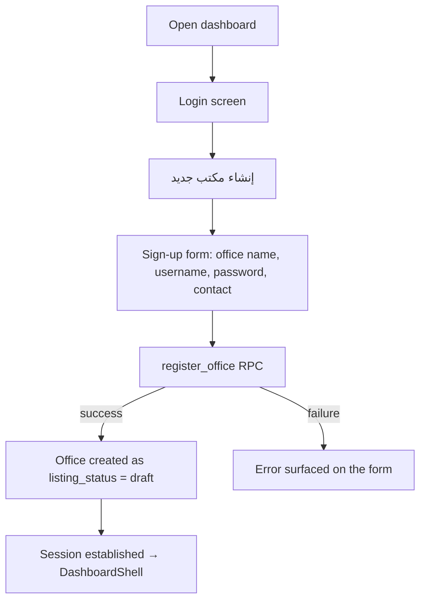

A freshly registered office is `draft`: **fully workable by its own staff, invisible to
passengers** until the platform publishes it (§5.2). The creator becomes its `admin`.

### 1.2 Sign in

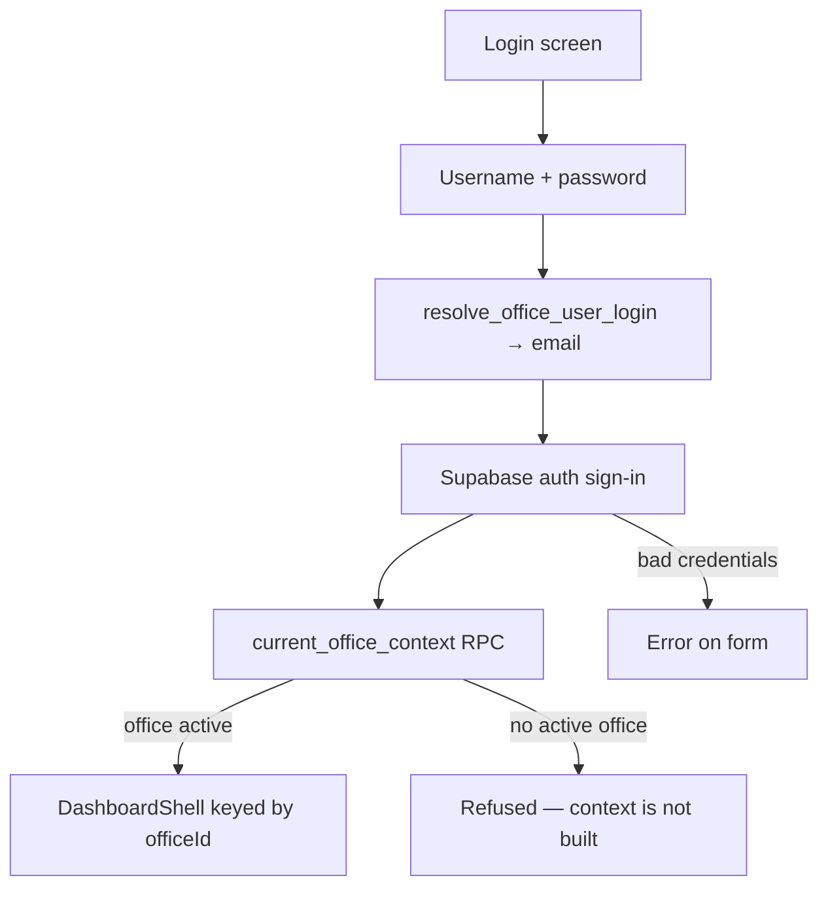

Operators sign in with a **username**, not an email; the datasource resolves it to the
underlying auth email first. Sessions restore automatically on reload via `restore()`.

### 1.3 Session, role and sign-out

- The shell is keyed on `officeId`, so switching identity rebuilds the whole workspace.
- The role chip in the top bar shows the active role at all times.
- Sign-out lives in **الإعدادات**, behind a confirmation dialog.
- Theme (light/dark) is toggled from the top bar and persists across sessions.

---

## 2. The daily operations loop

### 2.1 Morning triage — Home as the work queue

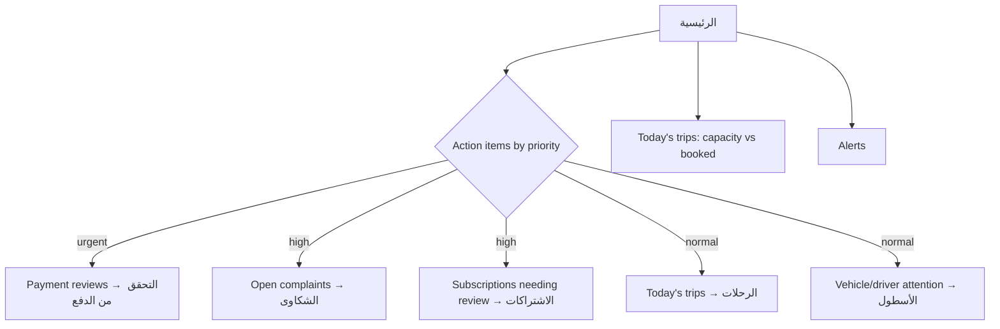

Home is the intended starting point: it aggregates six live feeds and every card deep-links
into the module that resolves it. The bell in the top bar carries the unread operational
alert count in parallel.

### 2.2 Trip lifecycle — from schedule to completion

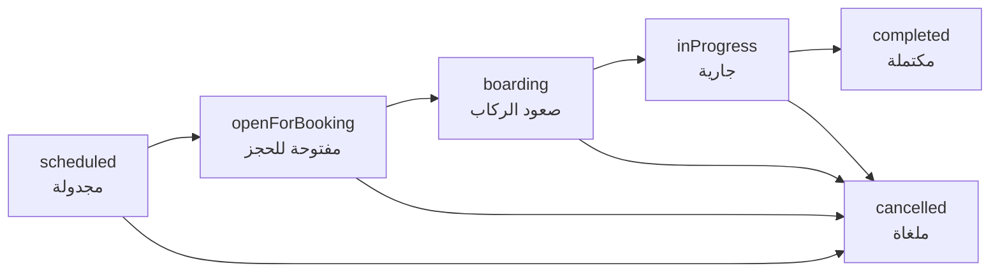

**Creating a trip** (owner only):

1. الرحلات → **رحلة جديدة** opens the creation wizard.
2. Pick route → driver → vehicle → date, departure/arrival time → capacity → fare.
3. Submit calls `office_create_trip`. The trip code is minted **server-side**.
4. The new trip appears in the list; the wizard closes and the list reloads.

**Running a trip:** open the trip to reach its workspace, then work the tabs —
overview, passengers, seats, pricing, payments, history — and advance status via
`office_update_trip_status`. The list and details stay current through a realtime
subscription plus a periodic refresh; a failed background refresh keeps the last good
data rather than throwing the operator out.

**Finding trips:** three view modes (list / grouped / timeline), a quick-filter chip
row (today, active, upcoming, completed, stale), debounced search, and advanced filters
on status, route, driver, vehicle, occupancy and date.

> Past-dated trips still open for booking are flagged **فات موعدها** for the operator to
> deal with. Nothing closes them automatically — that is a deliberate business decision.

### 2.3 Booking and payment review — the core money flow

This is the flow the dashboard exists for. A passenger books in the Client app; the
office decides whether the money is real.

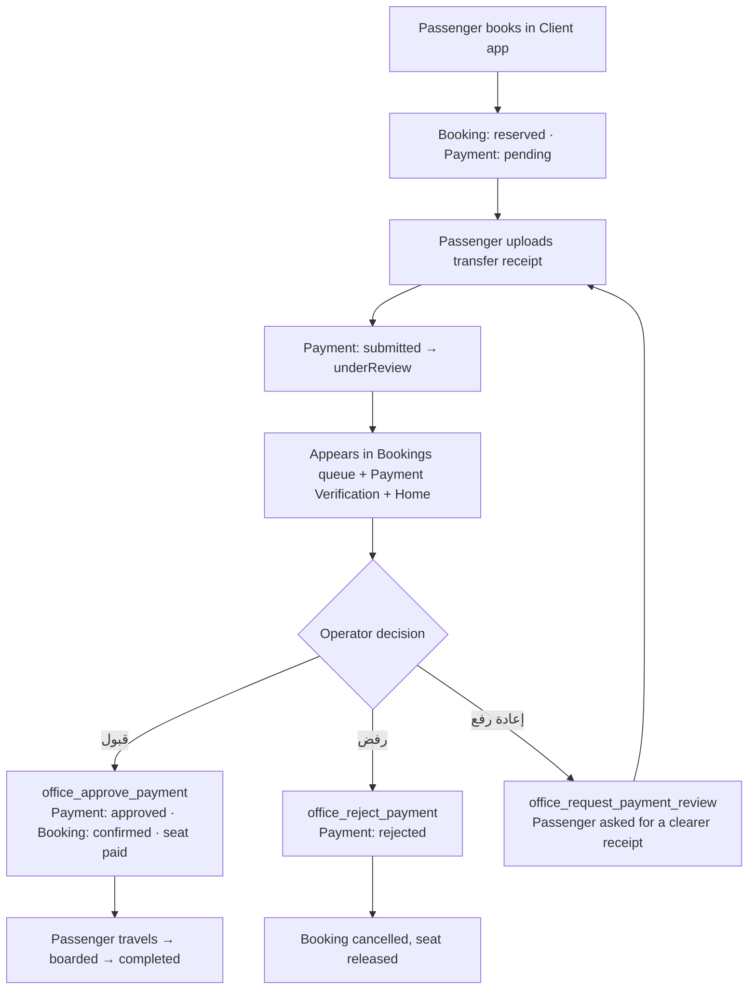

**Booking status** — `draft` → `reserved` → `confirmed` → `boarded` → `completed`, or `cancelled`.
**Payment status** — `pending` → `submitted` → `underReview` → `approved` / `rejected` / `refunded` / `failed`.

**Working the queue:**

1. الحجوزات opens on the status tabs with KPI tiles and an analytics strip.
2. Narrow with search, route, date and payment-method filters.
3. Open a row → details panel: customer (including their total booking count), trip,
   payment, receipt viewer, notes, and a full timeline.
4. Act — approve, reject, or request re-upload; each requires its note or reason.
5. Or **multi-select** rows and use the bulk bar to approve/reject many at once.

If an action fails, the failure appears as a snack bar and **the workspace stays intact** —
filters, selection and the open row survive, and the message carries the real reason
(`seat_taken`, `cross_office_reassignment_denied`, …).

### 2.4 Moving a passenger to another trip

The recovery path when a trip is cancelled or delayed, or the customer asks to travel on
a different date.

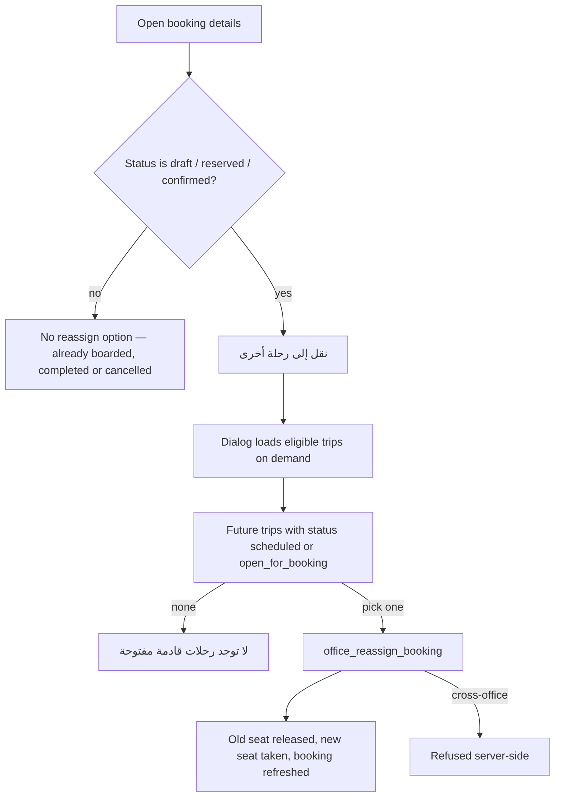

Eligible trips are fetched only when the dialog opens — the picker is rarely used, so
pre-fetching every candidate on each bookings refresh would be wasted work.

### 2.5 Focused verification queue

Support agents who only handle receipts use **التحقق من الدفع** instead of the full
Bookings workspace: filter (all / pending / review requested / approved / rejected),
search across customer, phone, booking number, route and reference, inspect the receipt
with zoom, then approve / reject / request review / add an internal note.

> **Navigation gap:** this module has no sidebar entry. It is reachable only from a Home
> action item, so an agent who clears Home has no way back to it.

---

## 3. Network and fleet flows

### 3.1 Building the network — routes before trips

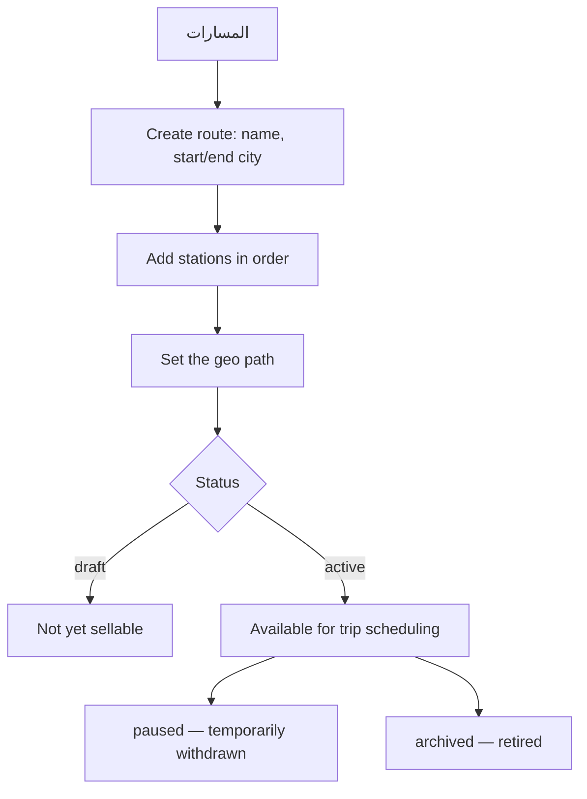

Stations can be added, edited, deleted and **reordered by dragging**. An existing route
can be **duplicated** as the basis for a similar one. A route must exist before any trip
can be scheduled against it.

### 3.2 Fleet readiness

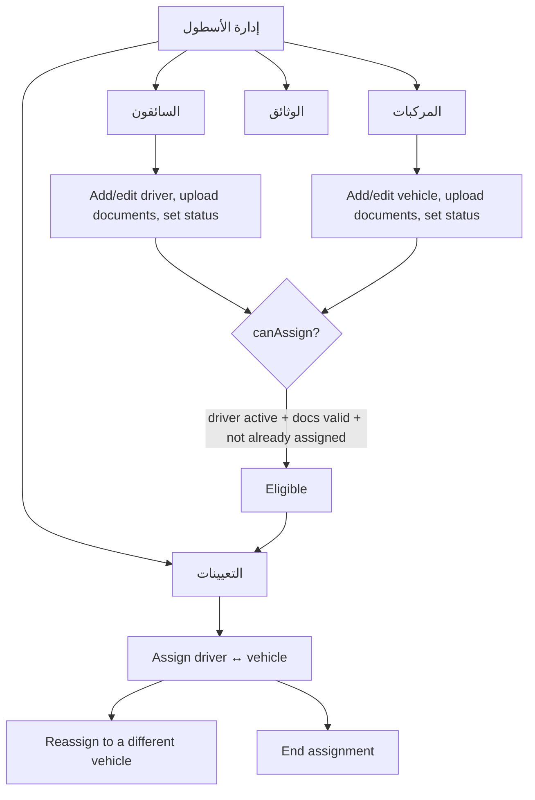

**Statuses** — driver `active` / `suspended` / `archived`; vehicle `active` /
`maintenance` / `suspended` / `archived`; assignment `active` / `ended`;
document `valid` / `expiringSoon` / `expired`.

The four KPI tiles (drivers, vehicles, active assignments, documents needing follow-up)
and the two readiness charts sit above the tabs, so the operator sees fleet health before
drilling in. Bulk actions: archive drivers, suspend vehicles.

**Vehicle breakdown recovery:** set the vehicle to `maintenance` → end the active
assignment → assign the driver to a backup vehicle → reassign affected bookings (§2.4).

### 3.3 Onboarding a captain

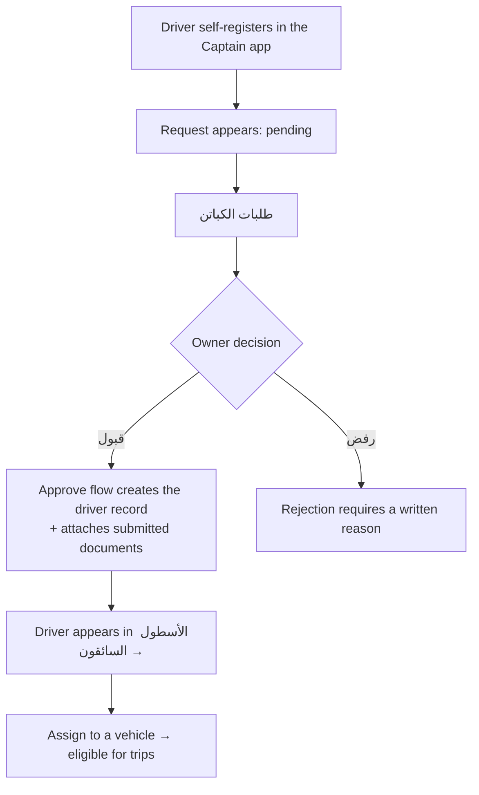

The list is live, so newly submitted requests appear without a manual refresh.

---

## 4. Money and reporting flows

### 4.1 Finance workspace

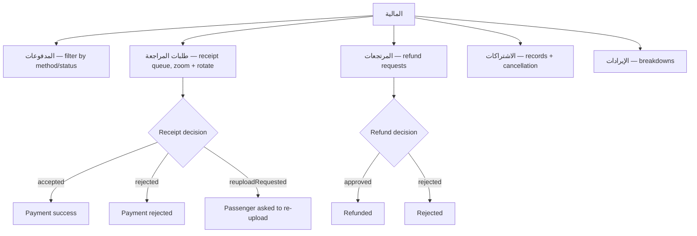

### 4.2 Subscription lifecycle

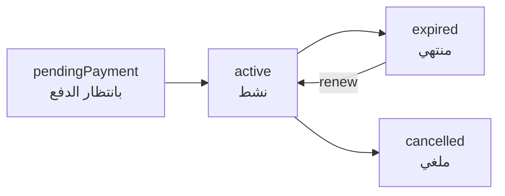

Operator actions: create a subscription manually, confirm payment
(`office_confirm_subscription_payment`), renew
(`office_request_subscription_renewal`), consume a ride
(`office_consume_subscription_ride`), cancel. Overdue subscriptions are swept by
`office_expire_overdue_subscriptions`.

The **plans** sub-module maintains the catalogue itself: create, update, pause/activate
(`active` / `paused` / `archived`), delete. Types run from a single ride to three months.

> Package pricing is a **flat multiple of the single fare** (×3.5 / ×3.75 / ×4 / ×4.5),
> not rides × fare. There is one fare input per trip, expanded to all stop pairs — never
> add a second price field.

### 4.3 Referral programme

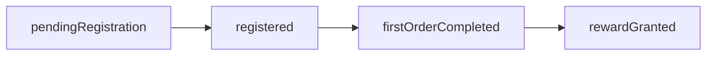

The owner reviews performance across five tabs (overview, reward settings, leaderboard,
referral history, reward transactions). The **only** write is saving the reward
configuration; everything else is reporting.

### 4.4 Reporting and export

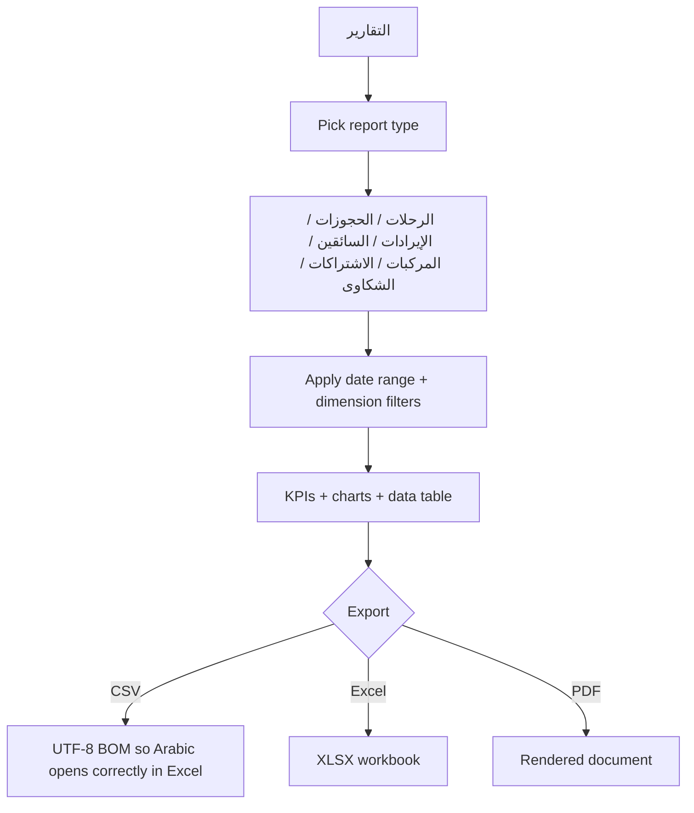

Exports produce real files — this is not a stubbed preview.

### 4.5 Owner's executive view

**نظرة المالك** is read-only: subscription revenue, booking revenue (total / today /
month), client counts by state, active subscriptions, renewals, a revenue trend series
and a per-plan breakdown.

---

## 5. Support, communication and administration

### 5.1 Complaint handling

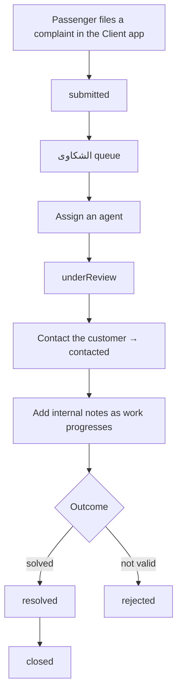

Priority runs `low` → `medium` → `high` → `urgent`. The KPI strip tracks new, under
review, resolved, and **delayed** — unresolved for more than 24 hours, which is the
number that should drive the shift's attention.

### 5.2 Reviews

The owner opens **التقييمات** to read passenger trip reviews, filtered by all / needs
attention / with comments. Read-only, live-updating, and owner-only: aggregate driver and
vehicle ratings are public platform-wide, but individual written feedback is not.

### 5.3 Notifications — inbound and outbound

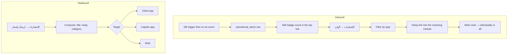

Alert types: payment review, captain request, support ticket, refund request, trip
cancelled, general — each with a priority from `low` to `urgent`.

### 5.4 Managing dashboard staff

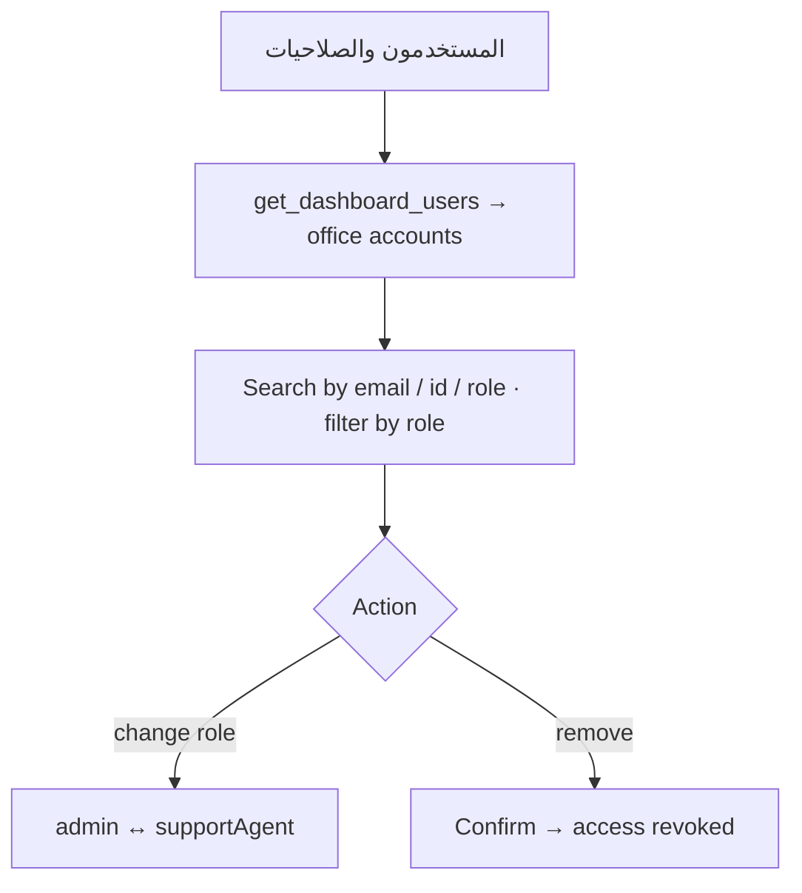

This screen *is* the access-control surface; there is no separate permissions matrix.
Changing someone to **خدمة العملاء** immediately narrows them to Bookings, Payment
Verification, Tickets, Reports and Notifications.

### 5.5 Office profile

The owner maintains the office's marketplace record — identity, logo, contact,
description. Editing is available only when the *signed-in* role is `admin`, matching what
the `offices_operator_update` RLS policy will accept.

### 5.6 Platform administration (platform admins only)

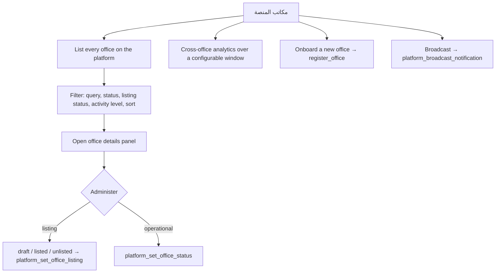

Publishing an office is exactly the `draft → listed` transition: until then the office
works normally for its own staff but is invisible to passengers. Every RPC here re-checks
`is_platform_admin()` server-side, so the client-side gate is convenience, not security.

---

## 6. Cross-module dependency order

Nothing downstream works until its prerequisites exist:

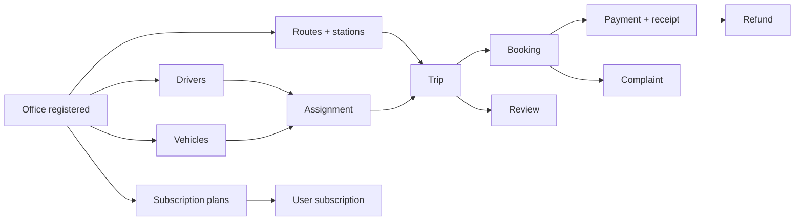

**Setup order for a brand-new office:** register → build routes and stations → add
drivers and vehicles → assign them → (optionally) define subscription plans → schedule
trips → open for booking → work the payment queue.

---

## 7. State machines at a glance

| Entity | States |
|---|---|
| **Trip** | `scheduled` → `openForBooking` → `boarding` → `inProgress` → `completed` · `cancelled` from any pre-completion state |
| **Trip seat** | `available` · `reserved` · `paid` · `subscription` · `blocked` |
| **Booking** | `draft` → `reserved` → `confirmed` → `boarded` → `completed` · `cancelled` |
| **Payment** | `pending` → `submitted` → `underReview` → `approved` / `rejected` / `refunded` / `failed` |
| **Payment verification** | `pending` → `approved` / `rejected` / `reviewRequested` |
| **Receipt review** | `pending` → `accepted` / `rejected` / `reuploadRequested` |
| **Refund** | `pending` → `approved` / `rejected` |
| **Route** | `draft` · `active` ⇄ `paused` · `archived` |
| **Driver** | `active` ⇄ `suspended` · `archived` |
| **Vehicle** | `active` ⇄ `maintenance` ⇄ `suspended` · `archived` |
| **Assignment** | `active` → `ended` |
| **Document** | `valid` → `expiringSoon` → `expired` |
| **Captain request** | `pending` → `approved` / `rejected` |
| **Subscription** | `pendingPayment` → `active` → `expired` / `cancelled` |
| **Subscription plan** | `active` ⇄ `paused` · `archived` |
| **Ticket** | `submitted` → `underReview` → `contacted` → `resolved` → `closed` · `rejected` |
| **Referral** | `pendingRegistration` → `registered` → `firstOrderCompleted` → `rewardGranted` |
| **Office listing** | `draft` → `listed` ⇄ `unlisted` |

---

## 8. Behaviour operators can rely on

- **Loading** shows skeletons, not a bare spinner.
- **A failed load** shows an error with a retry button — never a dead end.
- **A failed action** shows a message and keeps the workspace: filters, selection and the
  open row all survive, and the message states the real reason.
- **Search is debounced** (300 ms) with a clear button, everywhere.
- **Live modules** (bookings, trips, captain requests, reviews, alerts) update without a
  manual refresh; a dropped background refresh silently keeps the last good data.
- **Every module** shares the same header, KPI tiles, panels, tables and empty states —
  and every screen lays out without overflow from 360 px upward, enforced by
  `test/apps/dashboard/core/dashboard_design_system_overflow_test.dart`.
