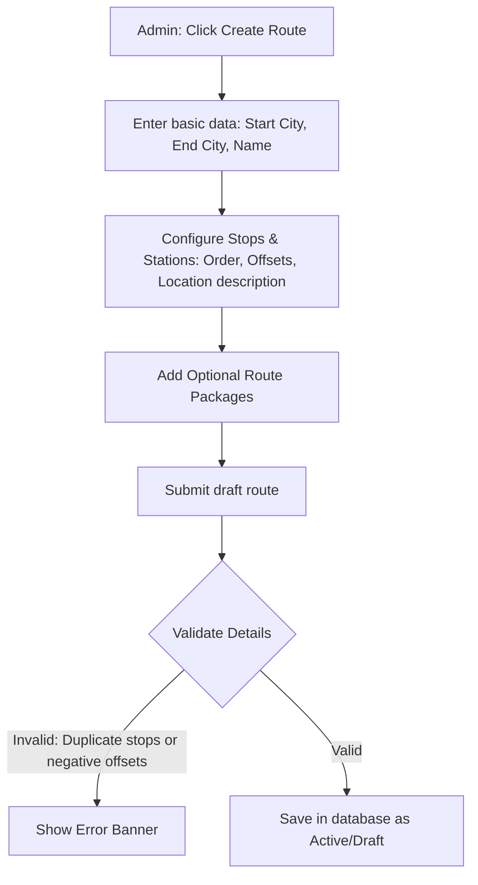
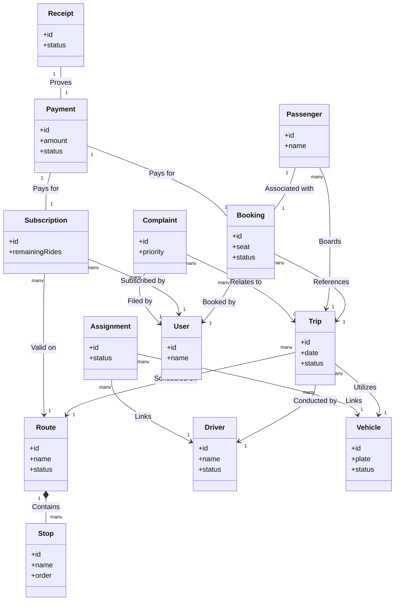

# Operations Dashboard Analysis & Technical Audit Report

## 1. Executive Summary

### Dashboard Purpose
The **Operations Dashboard (لوحة التشغيل)** is the central control center for the Bus Transit Management (BMT) system. It is designed to empower transit supervisors, fleet managers, customer service agents, and executive admins to manage daily operations, track passenger transit, resolve support tickets, audit financial transactions, and review analytics.

### Main User Roles
1. **Admin (المسؤول)**: Has full read-write privileges, system settings access, permission overrides, and comprehensive financial reports.
2. **Customer Service Agent (خدمة العملاء)**: Responsible for passenger bookings, tracking live trips, resolving customer complaints, and verifying transaction receipts.

### Main Workflows
* **Route & Station Management**: Defining transit lines, scheduling stopovers, and configuring regional networks.
* **Fleet Allocation & Tracking**: Managing drivers, vehicles, assignments, and documents, with real-time tracking of active trips.
* **Ticketing & Booking**: Registering passengers, matching them to routes, and verifying seat assignments.
* **Financial Auditing**: Approving digital payment receipts (e.g., InstaPay, Vodafone Cash), processing refunds, and tracking subscription renewals.
* **Customer Support Desk**: Handing complaints regarding drivers, vehicles, and timing, and communicating directly with passengers.

### Business Goals
* **Maximize Occupancy Rate**: Structuring schedules to fill bus seats and optimize revenue.
* **Zero Departure Delays**: Live monitoring of fleet drivers to ensure punctuality.
* **Reconciliation Automation**: Streamlining manual receipt uploads to match client bookings.
* **Painless Issue Escalation**: Solving customer tickets and complaints before they affect brand loyalty.

---

## 2. Roles & Permissions

The dashboard divides system authority into two distinct roles.

### Admin (المسؤول)
* **Accessible Modules**: All modules (الرئيسية, الحجوزات, الرحلات المباشرة, إدارة الأسطول, المسارات, المالية, الشكاوى, التقارير, الإعدادات, الصلاحيات).
* **Allowed Actions**:
  * Create, modify, and delete routes/stations.
  * Assign vehicles to drivers and terminate assignments.
  * Override payment receipt verification status.
  * Adjust system configurations (theme modes, notification triggers).
  * Manage user profiles and roles.
  * Export PDF/Excel summaries of all data layers.
* **Restricted Actions**: None.

### Customer Service Agent (خدمة العملاء)
* **Accessible Modules**: Operations modules (الرئيسية, الحجوزات, الرحلات المباشرة, إدارة الأسطول, المسارات, المالية, الشكاوى, التقارير).
* **Allowed Actions**:
  * View active routes and stations.
  * Monitor live trips, view alert logs, and request driver pings.
  * Manage client booking states (Confirm, Cancel, Place under review).
  * Review transaction receipts (Approve, Reject, Request Re-upload).
  * Chat with passengers via complaint support threads and assign agents.
  * Review operational reports.
* **Restricted Actions**:
  * Cannot access the "Settings" (الإعدادات) page.
  * Cannot access the "Permissions" (الصلاحيات) matrix.
  * Cannot edit system roles or modify underlying driver/vehicle registration files.

### Permissions Matrix

| Feature Module | Admin Access | CS Agent Access | Allowed Actions (Admin) | Allowed Actions (CS Agent) |
| :--- | :---: | :---: | :--- | :--- |
| **الرئيسية (Home)** | Yes | Yes | View KPIs, Switch Roles | View KPIs |
| **الحجوزات (Bookings)** | Yes | Yes | Add/Edit/Confirm/Cancel Bookings | Confirm/Cancel Bookings, Reassign Trips |
| **الرحلات المباشرة (Live Trips)** | Yes | Yes | Track Live GPS, Resolve Alerts, Call Driver | Track Live GPS, Flag Alerts, Chat with Driver |
| **إدارة الأسطول (Fleet)** | Yes | Yes | Add/Edit Drivers/Vehicles, End Assignments | View Driver/Vehicle Status, Log Incidents |
| **المسارات (Routes)** | Yes | Yes | Add/Edit/Reorder/Delete Stations | View Stops, Check Offsets |
| **المالية (Finance)** | Yes | Yes | View Revenue, Process Refunds, Cancel Subs | Audit Payments, Cancel Subs, Toggle Presets |
| **التحقق من الدفع (Payment Ver.)**| Yes | Yes | Approve/Reject/Request Re-upload Receipts | Approve/Reject/Request Re-upload Receipts |
| **الشكاوى (Complaints/Tickets)** | Yes | Yes | Open/Assign/Resolve/Escalate/Close Tickets| Assign/Resolve/Escalate Tickets, Chat |
| **التقارير (Reports)** | Yes | Yes | View KPIs, Charts, Export PDF/Excel/CSV | View KPIs, Charts, Mock Export Previews |
| **الإعدادات (Settings)** | Yes | No | Change Peak Hours, Toggle Theme, Save configs | None (Hidden) |
| **الصلاحيات (Permissions)** | Yes | No | Add Admin Users, Change Role Matrices | None (Hidden) |

---

## 3. Feature Inventory

### 1. Routes (المسارات)
* **Purpose**: Defines transit route structures, cities, stopovers, distances, duration, and associated package options.
* **Current Status**: Dedicated Clean Architecture feature ([routes_screen.dart](file:///Users/mahmoud/bmt_app/lib/apps/dashboard/features/routes/presentation/screens/routes_screen.dart)). Includes interactive station reordering, station forms, and stats.
* **Missing Functionality**: Map Integration. Currently, routes are defined by string entries (e.g., Cairo to Alexandria). There is no geographic polygon editor.
* **Required Improvements**: Add a visual GIS map builder to plot routes and station pins dynamically.

### 2. Fleet (الأسطول)
* **Purpose**: Monitors physical bus inventory, model specs, maintenance checklists, and document expiry logs (licenses, insurance).
* **Current Status**: Dedicated Clean Architecture feature ([fleet_screen.dart](file:///Users/mahmoud/bmt_app/lib/apps/dashboard/features/fleet/presentation/screens/fleet_screen.dart)). Uses sub-tabs for Drivers, Vehicles, Assignments, and Documents.
* **Missing Functionality**: Integration with telematics or hardware sensors (fuel levels, engine logs).
* **Required Improvements**: Create a central visual calendar view showing vehicle schedules and scheduled downtime for maintenance.

### 3. Trips (الرحلات)
* **Purpose**: Orchestrates individual daily schedules, dispatching specific drivers and vehicles onto route timelines.
* **Current Status**: Dedicated Clean Architecture feature ([trips_screen.dart](file:///Users/mahmoud/bmt_app/lib/apps/dashboard/features/trips/presentation/screens/trips_screen.dart)). Includes pricing grids, status lifecycle buttons, and passenger rosters.
* **Missing Functionality**: Bulk scheduler. Currently, trips are generated individually. No recurring scheduler exists (e.g., schedule route CAI-ALX at 7:00 AM daily for next month).
* **Required Improvements**: Implement a recurrence rule engine (Cron-like scheduler UI).

### 4. Bookings (الحجوزات)
* **Purpose**: Tracks individual passenger seat reserves, ticket payments, and boarding codes.
* **Current Status**: Dedicated Clean Architecture feature ([bookings_screen.dart](file:///Users/mahmoud/bmt_app/lib/apps/dashboard/features/bookings/presentation/screens/bookings_screen.dart)). Renders a tabular list of transactions, seat maps, and historical logs.
* **Missing Functionality**: Real-time seat locking mechanism. Multiple agents can open the same screen and book the same seat simultaneously without lock synchronization.
* **Required Improvements**: Introduce a short-duration locking state (WebSocket-driven) when a seat map is opened for booking.

### 5. Live Trips (الرحلات المباشرة)
* **Purpose**: Real-time tracking of dispatched buses, passenger check-ins, and emergency road alerts.
* **Current Status**: Dedicated Clean Architecture feature ([live_trips_screen.dart](file:///Users/mahmoud/bmt_app/lib/apps/dashboard/features/live_trips/presentation/screens/live_trips_screen.dart)). Offers alert resolving, mock GPS movement, and check-in timelines.
* **Missing Functionality**: Live Google Maps rendering. Currently uses a simulated progression line and text checklists.
* **Required Improvements**: Integrate Google Maps SDK/Mapbox to show real-time moving markers and ETA calculations.

### 6. Packages & Subscriptions (الاشتراكات)
* **Purpose**: Manages multi-ride client subscription cards, prices, and remaining trips balance.
* **Current Status**: Integrated inside the [FinanceScreen](file:///Users/mahmoud/bmt_app/lib/apps/dashboard/features/finance/presentation/screens/finance_screen.dart) sub-sections.
* **Missing Functionality**: Auto-renewal subscription billing integration (direct card charge).
* **Required Improvements**: Add a dedicated settings panel to define new package templates (price, duration, rides count, route restrictions) rather than relying on hardcoded types.

### 7. Payments & Verification (المالية والتحقق)
* **Purpose**: Audits money flow, verifies manual digital transfer screenshots, and tracks client refunds.
* **Current Status**: Split between `FinanceScreen` and `PaymentVerificationScreen`. Highly interactive queue with receipt image rotate/zoom tools.
* **Missing Functionality**: Automatic receipt text recognition (OCR) and bank portal API reconciliation.
* **Required Improvements**: Integrate an AI receipt scanner (e.g. Google Cloud Vision OCR) to automatically highlight references and names on manual uploads.

### 8. Complaints & Tickets (الشكاوى)
* **Purpose**: Customer service ticketing portal to resolve passenger feedback, missing items, and scheduling complaints.
* **Current Status**: Dedicated Clean Architecture feature ([tickets_screen.dart](file:///Users/mahmoud/bmt_app/lib/apps/dashboard/features/tickets/presentation/screens/tickets_screen.dart)).
* **Missing Functionality**: Live chat socket. Message updates only refresh on state re-fetching.
* **Required Improvements**: Implement WebSockets for instant messaging between agent and passenger.

### 9. Suggestions (المقترحات)
* **Purpose**: Collects and catalogs passenger ideas for new routes, schedule shifts, or feature additions.
* **Current Status**: **Completely Missing**. No suggesting database, usecases, or UI panels exist.
* **Missing Functionality**: All database models and frontend layouts.
* **Required Improvements**: Build a dedicated feedback forum screen where agents can group suggestions by category and upvote popular routes.

### 10. Users (المستقبلين)
* **Purpose**: Database explorer of registered passenger profiles and trip histories.
* **Current Status**: Generic workspace using the `DashboardOperationsScreen` placeholder.
* **Missing Functionality**: User blocking/suspension actions, account deletion tools, and loyalty points configuration.
* **Required Improvements**: Upgrade to a dedicated Clean Architecture feature with search indices, active session management, and device binding controls.

### 11. Reports (التقارير)
* **Purpose**: Aggregates operations data to present executive summary KPIs, trend charts, and mock downloads.
* **Current Status**: Fully complete Clean Architecture feature ([reports_screen.dart](file:///Users/mahmoud/bmt_app/lib/apps/dashboard/features/reports/presentation/screens/reports_screen.dart)).
* **Missing Functionality**: Real document generation (PDF/Excel sheets).
* **Required Improvements**: Add server-side rendering for PDF exports using templates with official headers.

### 12. Settings (الإعدادات)
* **Purpose**: Manages global parameters such as peak hours, currency formats, and visual themes.
* **Current Status**: Semi-generic screen containing theme selectors combined with a generic `DashboardOperationsScreen` placeholder.
* **Missing Functionality**: Role-based access configuration and feature toggles.
* **Required Improvements**: Convert into a structured settings repository mapping to secure server endpoints.

---

## 4. Business Workflows

### Route Creation Workflow

* **Required Data**: Route Name, Start City, End City, List of Stations (Stop Name, Order Index, Arrival/Departure Offsets).
* **Validation Rules**:
  * Route Name must be unique.
  * Start and End Cities must match the first and last stops in the station list.
  * Time offsets must be cumulative and positive.
* **Dependencies**: A Route must exist before any Trip can be scheduled or Subscriptions can be bound.

### Fleet Workflow
* **Driver Creation**: Admin registers driver profile, inputs national ID, uploads driver's license details, and sets status to `active`.
* **Vehicle Creation**: Admin registers license plate, seating capacity, model specs, and technical inspection dates.
* **Assignment**: Admin links an active driver to a ready vehicle. An assignment record is logged with an active status.
* **Replacement**: If a vehicle breaks down, the active assignment is terminated, the vehicle status shifts to `maintenance`, and a new assignment is registered using a backup vehicle.
* **Suspension**: If a driver violates system policies, their status is set to `suspended` which auto-terminates active assignments.

### Trip Creation Workflow
* **Orchestration Step**:
  1. Operator selects an active **Route**.
  2. Operator chooses an available **Driver** (must be `active` and not assigned to another concurrent trip).
  3. Operator selects an available **Vehicle** (must be `active` and has enough seats to match the route capacity).
  4. Scheduled departure/arrival times are defined.
* **Seat Availability**: Seat count defaults to the assigned vehicle capacity. Initial seat status is `available`.
* **Trip Lifecycle**:
  `Scheduled (مجدولة) ➔ Open for Booking (مفتوحة للحجز) ➔ In Progress (جارية) ➔ Completed (مكتملة) / Cancelled (ملغاة)`

### Booking Workflow
1. **User Booking**: Customer requests a seat on a specific trip via client application. The seat status changes from `available` to `reserved` (pending payment).
2. **Payment Submission**: Customer chooses payment method. If manual (e.g. mobile cash transfer), they upload proof of transfer receipt.
3. **Review Process**: Receipt falls into the CS Review Queue. The booking status remains `underReview`.
4. **Confirmation**: Agent validates the transfer. Once approved, the booking status transitions to `confirmed` and seat state updates to `paid` or `subscription`.
5. **Cancellation**: If cancelled by user or rejected by agent, seat resets to `available` and booking logs status as `cancelled`.

### Package Workflow
1. **Creation**: Admin creates subscription package template (e.g., "Student 30-Trip Pass") with price and validity limits.
2. **Route Binding**: Package is associated with specific routes.
3. **Activation**: Customer purchases the package. Once payment is verified, status becomes `active` with `remainingRides` set to the purchase limit.
4. **Renewal**: Customer submits renewal payment, adding ride balance and extending the expiration date.
5. **Expiration**: If the end date is passed, the status shifts to `expired` and remaining rides are locked.

### Payment Review Workflow
* **Receipt Upload**: Passenger uploads receipt image containing digital transaction info.
* **Verification Queue**: Payment falls into `PaymentVerificationCubit` list with `pending` status.
* **Decisions**:
  * **Approve (قبول)**: Transitions receipt to `accepted`, triggers transaction payment status to `success`, and activates the user subscription/booking.
  * **Reject (رفض)**: Transitions receipt to `rejected` and sends a rejection alert.
  * **Request Re-upload (إعادة رفع)**: Prompts user via client app to re-upload clear proof.
* **Refund Process**: If a trip is cancelled, a refund ticket is generated. Once approved, the cash is returned and status shifts to `refunded`.

### Complaint Workflow
1. **Creation**: User registers a complaint from the client app (logs category, description, and target trip code).
2. **Assignment**: CS Agent assigns the ticket to themselves or escalates it to Admin.
3. **Resolution**: Agent interacts with client via message thread. Once resolved, agent logs actions (e.g., issuing promo code or warning driver).
4. **Closure**: Status transitions to `resolved` and is closed after client confirmation.

### Live Operations Workflow
* **Trip Monitoring**: Interactive panel showing active bus coordinates, speeds, and stops.
* **Driver Communication**: Quick buttons to call driver phone or send instant alerts to the driver terminal.
* **Issue Handling**: If speed drops to zero or route deviation occurs, an automated system alert is flagged (e.g., `warning` or `critical`). The agent must resolve the alert after communicating with the driver.

---

## 5. Domain Entities

### 1. Route (OperationRoute)
* **Purpose**: Logical path layout of transit service.
* **Fields**:
  * `id`: String (UUID)
  * `name`: String (e.g., "القاهرة - الإسكندرية")
  * `startCity`: String
  * `endCity`: String
  * `duration`: String
  * `distance`: String
  * `status`: OperationRouteStatus (active, paused, draft, archived)
  * `stations`: List<RouteStation>
* **Relationships**: Has many `RouteStation`, `RouteActiveTrip`, and `RoutePackage`.
* **Example**:
  ```json
  {
    "id": "ROT-101",
    "name": "CAI-ALX-01",
    "startCity": "القاهرة",
    "endCity": "الإسكندرية",
    "status": "active"
  }
  ```

### 2. Stop (RouteStation)
* **Purpose**: Intermediate stopover where passengers board or exit.
* **Fields**:
  * `id`: String
  * `name`: String
  * `area`: String
  * `arrivalOffset`: String (time index)
  * `order`: Integer (1-indexed order)
* **Relationships**: Belongs to `OperationRoute`.
* **Example**:
  ```json
  {
    "id": "STN-401",
    "name": "محطة الرماية",
    "area": "الجيزة",
    "order": 2
  }
  ```

### 3. Trip (OperationTrip)
* **Purpose**: A scheduled occurrence of a Route on a specific date.
* **Fields**:
  * `id`: String
  * `route`: String
  * `driver`: String (Driver Name)
  * `vehicle`: String (License Plate)
  * `date`: String
  * `departure`: String
  * `status`: OperationTripStatus
  * `seats`: List<TripSeat>
* **Relationships**: References `OperationRoute`, assigned `FleetDriver`, and `FleetVehicle`. Has many `TripSeat` and `TripPassenger`.
* **Example**:
  ```json
  {
    "id": "TRP-5001",
    "route": "CAI-ALX-01",
    "driver": "أحمد رأفت",
    "vehicle": "أ ب ج 123",
    "status": "openForBooking"
  }
  ```

### 4. Driver (FleetDriver)
* **Purpose**: System record of a transit vehicle driver.
* **Fields**:
  * `id`: String
  * `name`: String
  * `phone`: String
  * `nationalId`: String
  * `licenseNumber`: String
  * `status`: FleetDriverStatus (active, suspended, archived)
* **Relationships**: Linked to an active `FleetAssignment` and referenced by `OperationTrip`.
* **Example**:
  ```json
  {
    "id": "DRV-2001",
    "name": "أحمد رأفت",
    "phone": "01012345678",
    "status": "active"
  }
  ```

### 5. Vehicle (FleetVehicle)
* **Purpose**: Technical profile of an active transport bus.
* **Fields**:
  * `id`: String
  * `plateNumber`: String
  * `model`: String
  * `seatsCount`: Integer
  * `status`: FleetVehicleStatus (active, maintenance, suspended)
* **Relationships**: Linked to an active `FleetAssignment` and referenced by `OperationTrip`.
* **Example**:
  ```json
  {
    "id": "VEH-3001",
    "plateNumber": "أ ب ج 123",
    "model": "تويوتا هايس 2023",
    "seatsCount": 14,
    "status": "active"
  }
  ```

### 6. Assignment (FleetAssignment)
* **Purpose**: Logical connection binding a driver to a vehicle.
* **Fields**:
  * `id`: String
  * `driverId`: String
  * `vehicleId`: String
  * `assignedAt`: String
  * `status`: FleetAssignmentStatus
* **Relationships**: Links `FleetDriver` to `FleetVehicle`.
* **Example**:
  ```json
  {
    "id": "ASM-6001",
    "driverId": "DRV-2001",
    "vehicleId": "VEH-3001",
    "status": "active"
  }
  ```

### 7. Booking (OperationBooking)
* **Purpose**: Ticket registry and seat lock transaction.
* **Fields**:
  * `id`: String
  * `passengerName`: String
  * `route`: String
  * `seat`: String
  * `paymentMethod`: BookingPaymentMethod
  * `status`: BookingStatus
* **Relationships**: References `OperationTrip` and passenger `User`.
* **Example**:
  ```json
  {
    "id": "BKG-10002",
    "passengerName": "سارة أحمد",
    "route": "CAI-ALX-01",
    "seat": "A3",
    "status": "confirmed"
  }
  ```

### 8. Passenger (TripPassenger)
* **Purpose**: Boarding record of a passenger on an active trip.
* **Fields**:
  * `id`: String
  * `name`: String
  * `seat`: String
  * `pickup`: String
  * `dropoff`: String
  * `status`: String (boarded, absent)
* **Relationships**: References `OperationTrip` and passenger `User`.
* **Example**:
  ```json
  {
    "id": "PSG-7001",
    "name": "سارة أحمد",
    "seat": "A3",
    "pickup": "محطة البداية",
    "status": "boarded"
  }
  ```

### 9. Package (RoutePackage)
* **Purpose**: Bundle template for subscriptions on a specific route.
* **Fields**:
  * `name`: String
  * `type`: String
  * `price`: String
  * `status`: String
* **Relationships**: Bound to `OperationRoute`.
* **Example**:
  ```json
  {
    "name": "الباقة الشهرية القاهرة",
    "type": "monthly",
    "price": "500",
    "status": "active"
  }
  ```

### 10. Subscription (UserSubscription)
* **Purpose**: Purchase record of a package by a user.
* **Fields**:
  * `id`: String
  * `userName`: String
  * `routeName`: String
  * `price`: Double
  * `remainingRides`: Integer
  * `status`: SubscriptionStatus
* **Relationships**: Links passenger `User` to `RoutePackage`.
* **Example**:
  ```json
  {
    "id": "SUB-8001",
    "userName": "سارة أحمد",
    "routeName": "CAI-ALX-01",
    "remainingRides": 12,
    "status": "active"
  }
  ```

### 11. Payment (PaymentRecord / FinancePayment)
* **Purpose**: Logs financial cash flow audits.
* **Fields**:
  * `id`: String
  * `clientName`: String
  * `amount`: Double
  * `paymentMethod`: FinancePaymentMethod
  * `status`: PaymentStatus
* **Relationships**: References `OperationBooking` or `UserSubscription`.
* **Example**:
  ```json
  {
    "id": "TXN-9001",
    "clientName": "سارة أحمد",
    "amount": 120.0,
    "status": "success"
  }
  ```

### 12. Receipt (ReceiptReview)
* **Purpose**: Visual upload of transfer receipts for CS verification.
* **Fields**:
  * `id`: String
  * `transactionId`: String
  * `receiptUrl`: String
  * `status`: ReceiptReviewStatus
* **Relationships**: Binds to `PaymentRecord`.
* **Example**:
  ```json
  {
    "id": "REC-9501",
    "transactionId": "TXN-9001",
    "receiptUrl": "assets/receipts/proof_1.jpg",
    "status": "accepted"
  }
  ```

### 13. Complaint (Complaint)
* **Purpose**: A support ticket file for customer support.
* **Fields**:
  * `id`: String
  * `clientName`: String
  * `category`: ComplaintCategory
  * `priority`: ComplaintPriority
  * `status`: ComplaintStatus
  * `conversation`: List<ComplaintMessage>
* **Relationships**: References passenger `User` and optionally `OperationTrip`.
* **Example**:
  ```json
  {
    "id": "CMP-1100",
    "clientName": "خالد محمود",
    "category": "paymentIssue",
    "priority": "high",
    "status": "inProgress"
  }
  ```

### 14. Suggestion
* **Purpose**: Passenger feedback containing suggestions for optimization.
* **Fields**:
  * `id`: String
  * `clientName`: String
  * `category`: String
  * `description`: String
  * `status`: String
* **Relationships**: References user account.
* **Example**:
  ```json
  {
    "id": "SUG-1200",
    "clientName": "رنا يوسف",
    "category": "مسار جديد",
    "description": "يرجى إضافة مسار مباشر من الشيخ زايد إلى المعادي."
  }
  ```

### 15. User
* **Purpose**: Customer account baseline.
* **Fields**:
  * `id`: String
  * `name`: String
  * `phone`: String
  * `accountStatus`: String
* **Relationships**: Has many `OperationBooking`, `UserSubscription`, and `Complaint`.
* **Example**:
  ```json
  {
    "id": "USR-1300",
    "name": "سارة أحمد",
    "phone": "01012345678",
    "accountStatus": "active"
  }
  ```

---

## 6. Entity Relationship Mapping



### Dependency Tree
1. **User**, **Driver**, **Vehicle** (Root Nodes - no dependencies).
2. **Assignment** (Depends on `Driver` + `Vehicle`).
3. **Route** (Contains `Stops`).
4. **Trip** (Depends on `Route` + `Driver` + `Vehicle`).
5. **Subscription** (Depends on `User` + `Route`).
6. **Booking** (Depends on `User` + `Trip`).
7. **Passenger** (Depends on `Booking` + `Trip`).
8. **Payment** (Depends on `Booking` or `Subscription`).
9. **Receipt** (Depends on `Payment`).
10. **Complaint** (Depends on `User` + optional `Trip`).

---

## 7. API Readiness Analysis

### Feature: Routes
* `GET /api/v1/dashboard/routes`  
  * *Description*: Retrieve list of all routes.
  * *Parameters*: `status` (active/paused/draft)
* `POST /api/v1/dashboard/routes`  
  * *Description*: Create a new route.
  * *Payload*: `name`, `startCity`, `endCity`, `duration`, `distance`, `stations` list.
* `PUT /api/v1/dashboard/routes/{id}`  
  * *Description*: Update basic route configuration.
* `PUT /api/v1/dashboard/routes/{id}/stations`  
  * *Description*: Reorder or edit station listings.
  * *Payload*: New ordered list of `RouteStation` objects.
* `DELETE /api/v1/dashboard/routes/{id}`  
  * *Description*: Soft-delete/archive a route.

### Feature: Fleet (Drivers & Vehicles)
* `GET /api/v1/dashboard/drivers`  
  * *Parameters*: `status`, `search`
* `POST /api/v1/dashboard/drivers`  
  * *Payload*: `name`, `phone`, `nationalId`, `licenseNumber`, `licenseExpiry`
* `PUT /api/v1/dashboard/drivers/{id}`  
  * *Payload*: Updated details or suspension status.
* `GET /api/v1/dashboard/vehicles`
* `POST /api/v1/dashboard/vehicles`
* `PUT /api/v1/dashboard/vehicles/{id}`
* `POST /api/v1/dashboard/assignments`  
  * *Description*: Assign a driver to a vehicle.
  * *Payload*: `driverId`, `vehicleId`
* `DELETE /api/v1/dashboard/assignments/{id}`  
  * *Description*: Terminate an active assignment.

### Feature: Trips
* `GET /api/v1/dashboard/trips`  
  * *Parameters*: `routeId`, `date`, `status`
* `POST /api/v1/dashboard/trips`  
  * *Payload*: `routeId`, `driverId`, `vehicleId`, `date`, `departureTime`, `capacity`
* `PUT /api/v1/dashboard/trips/{id}/status`  
  * *Payload*: `status` (scheduled, inProgress, completed, cancelled)
* `PUT /api/v1/dashboard/trips/{id}/seats/{seatId}`  
  * *Description*: Block/unblock seat for maintenance.
  * *Payload*: `state` (available, blocked)

### Feature: Bookings
* `GET /api/v1/dashboard/bookings`  
  * *Parameters*: `status`, `tripId`, `passengerName`
* `POST /api/v1/dashboard/bookings`  
  * *Payload*: `passengerName`, `phone`, `tripId`, `seatLabel`, `paymentMethod`
* `PUT /api/v1/dashboard/bookings/{id}/status`  
  * *Payload*: `status` (confirmed, cancelled)

### Feature: Live Trips
* `GET /api/v1/dashboard/live-trips`  
  * *Description*: Returns active coordinates and statuses of all in-progress trips.
* `GET /api/v1/dashboard/live-trips/{id}`  
  * *Description*: Detail tracking log of a single active trip.
* `PUT /api/v1/dashboard/live-trips/{id}/stations/{stationId}/arrive`  
  * *Description*: Mark station stop completed.
* `PUT /api/v1/dashboard/live-trips/{id}/alerts/{alertId}/resolve`  
  * *Description*: Clear emergency alert flags.

### Feature: Payments & Verification
* `GET /api/v1/dashboard/payments`  
  * *Parameters*: `status`, `paymentMethod`, `dateRange`
* `GET /api/v1/dashboard/payment-verifications`  
  * *Description*: Review queue for screenshots.
* `PUT /api/v1/dashboard/payment-verifications/{id}`  
  * *Payload*: `status` (accepted, rejected, reuploadRequested), `notes`
* `POST /api/v1/dashboard/payments/{id}/refund`  
  * *Payload*: `amount`, `reason`

### Feature: Complaints
* `GET /api/v1/dashboard/complaints`  
  * *Parameters*: `status`, `priority`, `category`
* `PUT /api/v1/dashboard/complaints/{id}/assign`  
  * *Payload*: `assignedTo` (agentId)
* `POST /api/v1/dashboard/complaints/{id}/messages`  
  * *Payload*: `content`, `attachments` (file paths)
* `PUT /api/v1/dashboard/complaints/{id}/status`  
  * *Payload*: `status` (resolved, closed)

---

## 8. Mock Data Audit

### Active Mock Sources
* `mock_reports_datasource.dart`: Generates static operational stats.
* `mock_finance_datasource.dart`: Feeds 500 fake payment rows and 200 receipt verification items.
* `mock_bookings_datasource.dart`: Simulates client reservations.
* `mock_drivers_datasource.dart` & `mock_vehicles_datasource.dart`: Feeds driver profiles and vehicle statuses.
* `mock_dashboard_operations_datasource.dart`: Configures metrics, columns, and rows for generic screens (Users, Settings, Permissions).

### Missing Mock Scenarios
* **Telematics Failures**: Simulated situations where GPS locks drop off entirely during active route execution.
* **Driver Work Limit Overrides**: Warnings when a driver exceeds maximum shifts per week.
* **Overlapping Bookings**: Double reserve locks on a single seat before verification processes complete.
* **Complex Refund Chains**: Multi-seat bookings where only a single seat refund is requested.

### Missing States
* **Connection Error Fallback**: Network offline layouts.
* **Stripe/Paymob Direct Gateway Processing**: Dynamic payment state (processing, payment failed, 3D secure pending).

---

## 9. UX Audit

### Excessive Complexity Screens
* **Live Operations Roster**: The sidebar containing active check-ins can overflow on medium-sized screens.
* **Fleet Documents Page**: A simple tabular view that does not visually differentiate between critical document expirations (e.g. expired license vs insurance expiring in 2 weeks).

### Missing Workflows & Shortcuts
* **Instant Reassignment**: If a vehicle breaks down mid-route, there is no quick action button on the Live Map to spawn a replacement trip. The agent must manually navigate to the fleet screen, end the assignment, and create a new trip.
* **Direct Booking from Chat**: CS Agents resolving a booking complaint cannot directly issue/modify a booking within the complaint window.

### Missing Validations & Empty States
* **Seat Map Validation**: Agents can manually confirm bookings without verifying if the seat was blocked for maintenance.
* **Empty State Actions**: The empty search results page does not offer a "Clear filters" shortcut button.

---

## 10. Production Readiness Score

| Feature | UI | UX | Architecture | Backend | Testing | Summary / Action Required |
| :--- | :---: | :---: | :---: | :---: | :---: | :--- |
| **Routes** | 90% | 80% | 95% | 0% | 80% | UI/UX ready. Needs database model connection. |
| **Fleet** | 95% | 85% | 95% | 0% | 85% | Complete Clean Arch. Needs CRUD API integration. |
| **Trips** | 90% | 80% | 95% | 0% | 90% | Needs automated pricing calculation endpoints. |
| **Bookings** | 92% | 85% | 95% | 0% | 90% | Needs WebSockets integration for seat maps. |
| **Live Trips** | 85% | 75% | 90% | 0% | 80% | Needs replacement of mock tracking with GIS map. |
| **Subscriptions**| 90% | 85% | 90% | 0% | 85% | Needs connection to billing gateways. |
| **Payments** | 95% | 90% | 95% | 0% | 90% | Verification flow is solid. Needs API linking. |
| **Complaints** | 95% | 90% | 95% | 0% | 90% | Needs live chat WebSockets. |
| **Reports** | 95% | 90% | 95% | 0% | 95% | Reports layout ready. Needs real PDF renderers. |
| **Users** | 40% | 30% | 30% | 0% | 0% | Generic placeholder. Needs complete rewrite. |
| **Settings** | 50% | 40% | 40% | 0% | 0% | Generic placeholder. Needs configuration API. |
| **Permissions** | 50% | 40% | 40% | 0% | 0% | Generic placeholder. Needs integration with JWT. |
| **Suggestions** | 0% | 0% | 0% | 0% | 0% | **Not Implemented**. Needs entity, repository, and UI. |

---

## 11. Missing Features

The following features must be built before backend deployment:

1. **Suggestions (المقترحات) Module**: Required to gather route feedback.
2. **WebSocket Integration Layer**: Essential for real-time live map coordination, passenger chat updates, and seat mapping states.
3. **Receipt OCR (Optical Character Recognition)**: Speeds up the manual receipt verification flow.
4. **Google Maps SDK / OpenStreetMap Integration**: Replaces textual checklist progression with live mapping vectors.
5. **PDF/Excel Generation Library**: Implements server-side or client-side report exports.

---

## 12. Recommended Implementation Order

### Phase 1: Core Assets & Network Architecture (Priority 1)
* **Goal**: Establish baseline entities and relationships.
* **Deliverables**:
  1. API for Users, Drivers, Vehicles.
  2. API for Routes and Station Stopovers.
  3. UI database binding for Routes and Fleet management.

### Phase 2: Booking Lifecycle & Live Operations (Priority 2)
* **Goal**: Enable ticketing and transit management.
* **Deliverables**:
  1. API for Trips Scheduling and Bookings.
  2. WebSocket gateway for real-time location pings.
  3. Integration of Google Maps SDK into Live Trips UI.
  4. Real-time seat lock orchestration.

### Phase 3: Finance Reconciliation & Support Portal (Priority 3)
* **Goal**: Secure payments and passenger support channels.
* **Deliverables**:
  1. Receipt review queue API integration.
  2. WebSockets for Complaint Tickets messaging.
  3. Subscriptions payment gateway link (auto-debit).
  4. Build the suggestions database and UI dashboard.

### Phase 4: System Configurations & Advanced Analytics (Priority 4)
* **Goal**: Operational tuning and reporting exports.
* **Deliverables**:
  1. Reports PDF/Excel generator integration.
  2. Settings values mapped to backend configurations.
  3. Secure role permissions integration (JWT scoping).
