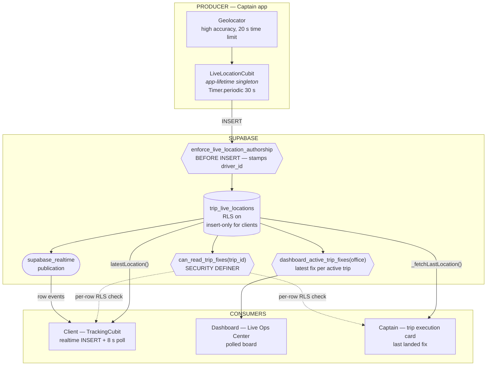
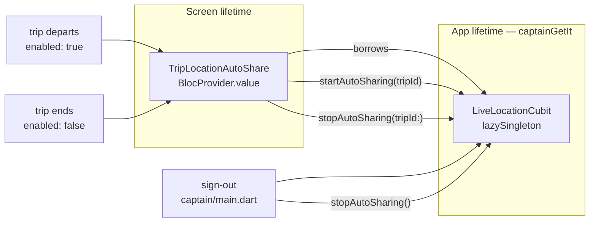
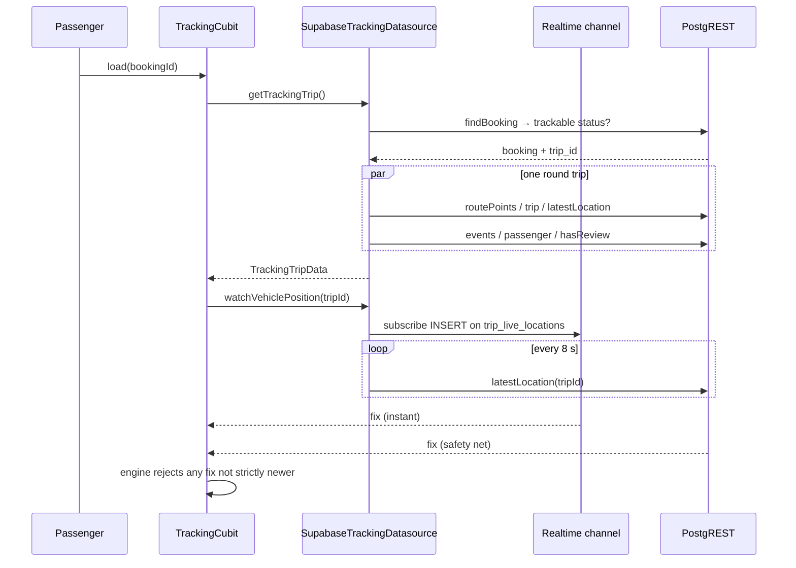

# Tracking Architecture

Everything that answers "where is the vehicle?" — across the Captain app, the Client app, the
Live Operations Center and Supabase.

Phase 6 audit, 2026-07-29. Companion documents: [TRACKING_SECURITY.md](TRACKING_SECURITY.md),
[TRACKING_USER_STORIES.md](TRACKING_USER_STORIES.md),
[TRACKING_USER_FLOWS.md](TRACKING_USER_FLOWS.md), [TRACKING_STATUS.md](TRACKING_STATUS.md).

> **Superseded in part, 2026-08-17.** The producer is no longer a 30-second pull, the
> client consumer is no longer a Cubit polling alongside realtime, and **the dashboard
> is no longer a polled board**. All three were rebuilt into a validated, throttled
> pipeline feeding Blocs:
> **[TRACKING_LIVE_PIPELINE.md](TRACKING_LIVE_PIPELINE.md)** is now the authority on
> the producer (§2 below), the client consumer (§3 below), the dashboard consumer
> (§3 below) and the cadences. The data model and the security boundary are unchanged.

---

## 1. The shape of it

There is exactly one producer and three consumers. Everything hangs off one table.



**One producer.** The captain's phone is the only thing on the platform that knows where a
vehicle is. Nothing infers, interpolates server-side, or backfills.

**One table.** `trip_live_locations` is append-only from every client's point of view: no
UPDATE grant, no DELETE grant, no policy for either. A position that was reported is a fact
about where the vehicle was, and nothing on the client side may rewrite it.

---

## 2. The producer

### Ownership



The publisher's life is the **trip's** life, not the screen's. Before Phase 6 it was a
`registerFactory`, which meant:

- every mount of the card built its own cubit and its own timer — two live publishers meant two
  GPS acquisitions and two inserts per interval;
- reporting died with whichever widget happened to hold it, so a captain who opened the map,
  answered the office in chat, or backed out to the trip list took the passenger's map down
  with them, silently.

It is now a singleton, provided with `BlocProvider.value` so no widget disposal can close it.

### Rules the publisher holds

| Rule | Where | Why |
|---|---|---|
| Starting an already-running trip is a no-op | `startAutoSharing` | rebuilds are constant; a second timer would double the battery cost and write duplicate fixes |
| Switching trips cancels the old timer | `startAutoSharing` | a captain drives one trip at a time |
| A stop names its trip | `stopAutoSharing({tripId})` | a card finishing for trip A must not silence trip B |
| A send in flight skips the next tick | `_sending` guard | a 20 s GPS acquisition can run into the 30 s tick |
| Resume publishes at once if the last fix is stale | `resumeIfStale` | closes the backgrounding gap instead of waiting out the interval |
| A failed send keeps the last good fix on screen | `_ready(...)` | the captain is driving; a dropped tick is not worth an interruption |
| Consecutive failures are counted and surfaced | `consecutiveFailures` | a *run* of failures is a different fact from one |

### Cadence

> **Changed 2026-08-17.** Publishing is now movement-driven: a validated GPS stream
> behind a 10-second latest-value throttle, with `kAutoLocationInterval` demoted to a
> *heartbeat* floor for a stationary vehicle. `kLocationStaleAfter` is still
> `3 × interval` for the captain's own card, but the client's freshness threshold is
> now an independent 45 s — see
> [TRACKING_LIVE_PIPELINE.md §4](TRACKING_LIVE_PIPELINE.md#4-throttle-not-debounce)
> for why that derivation was deliberately broken.

`kAutoLocationInterval = 30 s`, declared in the domain
(`domain/entities/location_sharing_health.dart`) beside the staleness threshold derived from it
(`kLocationStaleAfter = 3 × interval`), so the two cannot drift apart.

### What it is not

**Foreground only.** Dart timers do not survive iOS suspension and Android will doze them. A
minimised captain app stops reporting. This is a platform limit, and the design's response is
to never lie about it: health is computed from *when a fix last landed*, never from whether a
timer object exists — so a suspended app reads `stale`, in red, with the age of the last fix.

See [TRACKING_STATUS.md](TRACKING_STATUS.md) for what true background tracking would cost.

---

## 3. The client consumer

> **Rebuilt 2026-08-17.** `TrackingCubit` now owns only the trip document and the
> boarding action; positions, link health, freshness and route progress belong to
> `LiveTrackingBloc`. The 8-second poll still exists but is **gated on socket
> health** — while realtime is connected there are no periodic queries at all. The
> sequence below still describes the trip fetch correctly; for the live half read
> [TRACKING_LIVE_PIPELINE.md §5](TRACKING_LIVE_PIPELINE.md#5-the-client-stream-and-the-poll-that-is-no-longer-a-fixture).



**Two paths, merged.** Realtime delivers a fix the instant the captain shares it; the 8-second
poll is the safety net for a dropped socket, an expired realtime token, or a single missed
event. Re-emitting an already-seen fix is harmless — the vehicle engine only moves the marker
for a strictly newer fix.

That redundancy is also what makes the Phase 6 RLS change safe to ship: even in the worst case
where realtime delivery regressed under the new policy, the map degrades to 8-second updates
rather than going dark.

**Subscriptions are bookkept.** `TrackingSubscriptions` keeps exactly one location stream and
one change stream alive, keyed by trip id, and drops the location channel entirely once the
trip finishes — a finished trip has no more positions and an open socket costs a connection for
nothing.

**`operation_trips` is deliberately not subscribed.** Clients hold no read policy on it, so its
events would never be delivered. Status flips reach the rider through `trip_events`.

---

## 4. The dashboard consumer

The Live Operations Center polls `dashboard_active_trip_fixes(office_id)`, a `SECURITY DEFINER`
function returning one latest fix per active (`boarding`/`in_progress`) trip via `distinct on`.

It is not a realtime subscriber. That is the right call for an operations board — one query per
refresh for the whole fleet, rather than N channels — but it means the board's freshness is its
poll interval, and the tracking-health badge is computed from `recorded_at` rather than from
socket liveness.

---

## 5. Data model

```
trip_live_locations
  id           uuid pk
  trip_id      uuid → operation_trips    (cascade)
  driver_id    uuid → drivers            (cascade, stamped by trigger)
  vehicle_id   uuid → vehicles           (cascade)
  latitude     double precision  not null
  longitude    double precision  not null
  heading      double precision
  speed        double precision
  accuracy     double precision
  recorded_at  timestamptz  default now()

  idx_trip_live_locations_trip_id       (trip_id)
  idx_trip_live_locations_trip_recent   (trip_id, recorded_at desc)   ← every read uses this
```

Every consumer asks the same question — *the latest fix for this trip* — which
`idx_trip_live_locations_trip_recent` answers as an index-only descending scan with `limit 1`.

**Growth.** One captain publishing every 30 s is ~120 rows/hour, ~1,400 over a twelve-hour
service day. Fifty vehicles is ~70,000 rows/day and ~25M/year, none of it read after the trip
ends. `prune_trip_live_locations(retain_days)` exists to bound this; it is **not yet scheduled**
(no `pg_cron` on this project) — see [TRACKING_STATUS.md](TRACKING_STATUS.md).

---

## 6. Where the code lives

| Concern | Path |
|---|---|
| **Live pipeline: throttle, validation, shared cadences** | `lib/core/tracking/{latest_value_throttle,valid_fix_filter,live_tracking_config}.dart` |
| **Client live tracking Bloc** | `lib/apps/client/features/tracking/presentation/bloc/` |
| Captain publisher | `lib/apps/captain/features/live_location/` |
| Captain cadence + health rules | `.../live_location/domain/entities/location_sharing_health.dart` |
| Captain in-trip map (device GPS, display only) | `lib/apps/captain/features/trip_map/` |
| Client tracking screen | `lib/apps/client/features/tracking/` |
| Client realtime + poll merge | `.../tracking/data/datasources/supabase_tracking_datasource.dart` |
| Dashboard Live Ops | `lib/apps/dashboard/features/live_ops/` |
| Shared vehicle marker engine | `lib/core/tracking/vehicle_tracking_engine.dart` |
| Write authorship (Phase 5) | `supabase/migrations/20260728120000_captain_authority.sql` |
| Read boundary + retention (Phase 6) | `supabase/migrations/20260729090000_tracking_authority.sql` |
| DB regression suite | `supabase/tests/tracking_authority_regression.sql` |
