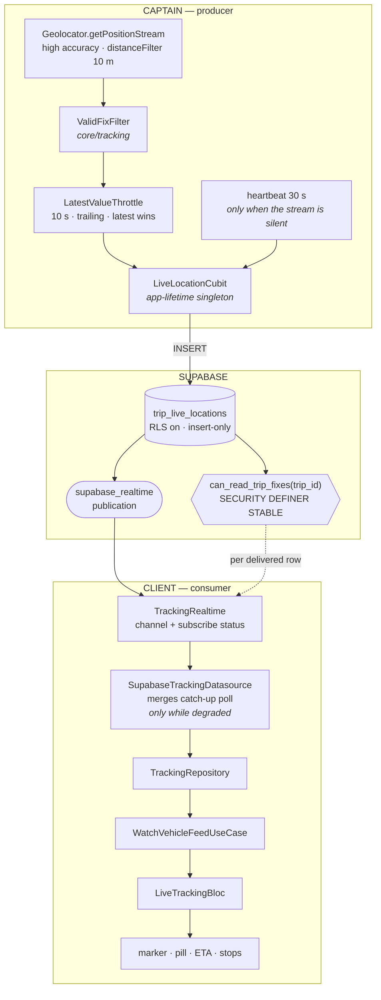
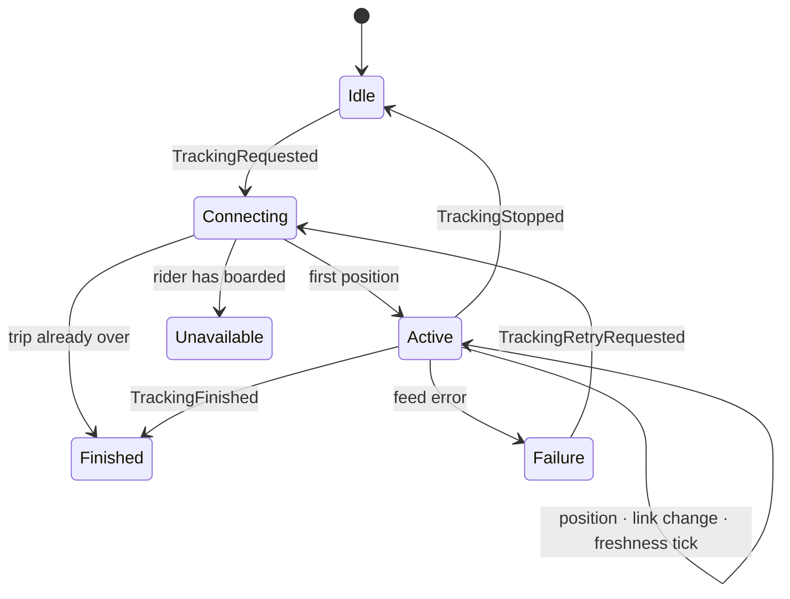

# The Live Tracking Pipeline

How a position gets from the captain's GPS chip to a passenger's marker, why it is
rate-limited the way it is, and why the client half of it is the one Bloc in an
application otherwise built entirely on Cubits.

Built 2026-08-17. Companion documents:
[TRACKING_ARCHITECTURE.md](TRACKING_ARCHITECTURE.md) (the map),
[TRACKING_SECURITY.md](TRACKING_SECURITY.md) (the boundary),
[TRACKING_STATUS.md](TRACKING_STATUS.md) (what is still open).

---

## 1. The whole thing, once



Two things are worth reading off that diagram before anything else.

**The rate limit is on the producer, and only on the producer.** Nothing downstream
throttles: the datasource, the repository, the use case and the Bloc all pass
positions through as fast as they arrive. That is deliberate, and §4 is about why.

**Nothing above the data layer knows Supabase exists.** `VehicleFeedEvent`,
`TrackingLink` and `TrackingFreshness` are plain Dart enums and sealed classes in
`domain/entities/`. The Bloc holds no `SupabaseClient`, opens no channel, names no
table, and issues no PostgREST call.

---

## 2. The captain's pipeline

### What it replaced

Until this phase the publisher was a **pull**, not a stream:
`Timer.periodic(30 s)` woke up and called `Geolocator.getCurrentPosition(timeLimit:
20 s)`. That had one real virtue — the GPS radio only ran when a write was wanted —
and two costs:

- a fixed 30-second grid, blind to whether the vehicle was moving at all;
- up to 20 seconds of acquisition latency baked into each fix, so a "live" position
  could be a third of a minute old before it was even sent.

### What it is now

```
getPositionStream(distanceFilter: 10 m)
        ▼
ValidFixFilter        drops (0,0), non-finite, accuracy > 100 m,
        ▼             non-advancing timestamps (which is also duplicates),
                      and displacements implying > 55 m/s
LatestValueThrottle   at most one publish per 10 s, carrying the newest fix
        ▼
PublishTripLocationUseCase → repository → INSERT
```

with a **heartbeat** alongside it: if the stream has published nothing in 30 seconds,
the publisher acquires one position itself.

The heartbeat is not redundancy. `distanceFilter` means a stationary vehicle emits
**no stream events at all**, so without it a bus parked at a station and a phone
whose GPS had died would look identical to a watching passenger. It is skipped
whenever movement has already published inside the window, so a moving vehicle never
pays for it — and it is set to exactly the old 30-second cadence, which makes the
new pipeline strictly additive: worst case, the publisher behaves as it always did.

### Where each rule lives, and why there

| Concern | Home | Why not elsewhere |
|---|---|---|
| Acquiring a position | `DeviceGpsDatasource` | it talks to a device sensor; that is data-layer work |
| Writing a position | `SupabaseLocationDatasource.publishFix` | acquiring and writing had to be **separable** before anything could be throttled between them — that is the whole unlock |
| Which fixes deserve a write, and how often | `WatchPublishableLocationUseCase` | it is a business rule about what the platform promises a passenger and what it costs a captain's battery, so it belongs where it can be read and tested without a device |
| When the pipeline runs, and what the captain is told | `LiveLocationCubit` | lifecycle and presentation |

The publisher stays a **Cubit**, deliberately. Its ownership rules — idempotent
start, named stop, resume-if-stale, consecutive-failure counting — took a whole
phase to get right and are covered by nine tests; they are lifecycle invariants, not
an event vocabulary. GPS does not raise events in the sense §3 means. The
requirement was that *live tracking must not be a Cubit*, and live tracking is the
client-side feature that follows.

One efficiency note: the trip → vehicle lookup is now cached per trip. It used to be
a second query on every publish, which was tolerable at one write per 30 s and would
not have been at the throttled cadence — to re-learn something that cannot change
while the trip runs.

---

## 3. Why the client half is a Bloc

Five independent producers push at this feature, and they interleave in orders
nobody chooses:

| Producer | What it pushes |
|---|---|
| the screen | open, stop, retry |
| the transport | socket up / degraded / gone |
| the captain | positions |
| a timer | freshness decay, ETA decay |
| the operation | the trip ending |

A Cubit models this as methods, and a method call cannot express two things this
feature needs. First, **ordering**: positions fold into a stateful progress engine,
so they must be applied in sequence, and a `restored` must never overtake the `lost`
it followed. Second, **per-source back-pressure policy**: a retry must be *dropped*
while one is in flight, and a position must *never* be dropped. Events plus
transformers say both, in one line each, at the point of registration.

### Events

| Event | Why it exists | Transformer | Why |
|---|---|---|---|
| `TrackingRequested(trip)` | open or re-target the feed; carries the trip because the progress engine is built from its stops, schedule and confirmed arrivals | `restartable()` | a request for a different trip must abandon the previous setup rather than race it — two completed handlers would mean two live feeds |
| `TrackingStopped` | the rider left, or boarded | `sequential()` | dropping a stop leaks a socket |
| `VehicleFixReceived(fix)` | a position landed — the high-frequency one | `sequential()` | see below |
| `TrackingLinkReported(link)` | the transport reporting on itself | `sequential()` | rare and strictly order-critical |
| `TrackingFreshnessEvaluated` | time passed; re-decide whether the last position can still be believed | `droppable()` | a second tick while one is in flight recomputes an identical value |
| `TrackingRetryRequested` | the rider asking again after a failure | `droppable()` | "ignore while in flight" is exactly what stops a hammered button opening N sockets |
| `TrackingFinished` | the trip ended | `sequential()` | terminal; must not race |
| `TrackingFeedFailed(message)` | the feed itself fell over | `sequential()` | ordered against recovery |

**The fix event is the interesting one.** `concurrent()` would fold positions into a
stateful engine out of order. `droppable()` would discard the *newest* fix, which is
the exact opposite of what tracking wants. `restartable()` could cancel a handler
mid-emit. The handler does no I/O — it folds into `RouteProgressEngine` and emits —
so strict ordering costs nothing and is the only thing actually needed.

Deliberately **not** events: zoom, follow-mode, camera. Those are widget-local state
and live in `TrackingMapCamera`, where they always were. An event that wraps a
setter buys a name and loses directness.

### States

```
LiveTrackingState (sealed, Equatable, `progress` on the base)
├── LiveTrackingIdle          before the first request, and after a clean stop
├── LiveTrackingConnecting    feed opening; may already carry real progress
├── LiveTrackingActive        fix · receivedAt · freshness · link · progress
├── LiveTrackingUnavailable   this rider boarded — not an error, not empty
├── LiveTrackingFinished      trip over; feed released, last progress kept
└── LiveTrackingFailure       message · canRetry · progress
```

Three decisions inside that worth stating:

**`stale` and `reconnecting` are fields, not sibling states.** A stale-but-connected
feed and a fresh-but-reconnecting feed are independent axes. Modelling them as
states needs a 2×3 explosion, or it forces the UI to pick which of the two facts to
forget. `Active(freshness: stale, link: lost)` is one honest state.

**Freshness is measured from `receivedAt`, not the fix's own timestamp.** A captain's
device with a skewed clock could otherwise stamp a fix into the future and keep a
dead feed looking alive forever.

**The trip document is not in here.** Stops, captain, vehicle, seat and booking stay
with `TrackingCubit`, which owns them. Duplicating them would give the screen two
answers to the same question.

### Lifecycle

Everything the Bloc holds open is released in one place — `_release()` — which
cancels the feed subscription and the freshness timer. `TrackingStopped`,
`TrackingFinished`, `TrackingFeedFailed`, `TrackingRetryRequested` and `close()` all
route through it, so none of them can get it half right. Re-targeting to a new trip
cancels the old subscription explicitly *and* relies on `restartable()`; the two
overlap on purpose.

### Where the two state holders meet

`TrackingFeedBridge` — a widget, not logic inside either holder. The wiring is
one-directional in each direction: the trip document tells the feed which trip to
follow; the feed tells the trip document the one thing a position can prove about it
(the bus is moving, so a trip the operation still calls "not started" is promoted to
"driver on the way"). Neither reads the other's state. Keeping this in a widget is
what stops it becoming a two-way coupling — which is what would make both holders
untestable.

---

## 3b. The dashboard half — one feed for a whole fleet

The operations desk watches the same table through the same transport, and until
this phase it did so by **refetching everything on a 15-second timer**: the joined
roster query, the incident queue, and the fixes RPC, all three, forever, because
moving a marker was the only way to move a marker.

That had four costs, and they compound:

| | Before | After |
|---|---|---|
| Queries per open desk | 3 every 15 s, always | 0 while the socket is healthy |
| Position latency | up to 15 s + query time | the socket's own latency |
| Marker motion | teleports between polls | interpolated by `VehicleTrackController` |
| Rebuild on a position | the entire board | the marker layer, one card, one KPI |

### One socket, not one per trip

`trip_live_locations` is keyed by trip and carries no office column, so there is
nothing to filter a subscription on server-side. Subscribing per trip would mean a
channel per vehicle, torn down and rebuilt at every departure and arrival — N
sockets and a reconnect storm at shift change.

So the desk opens **one** filterless subscription, and what scopes it is RLS:
`can_read_trip_fixes(trip_id)`'s office arm admits exactly the trips this office
operates, and Realtime evaluates that policy against each WAL row as this
subscriber before delivering it. Rows for other offices are never sent. The
security boundary and the query optimisation are the same mechanism.

### Why this one is also a Bloc, and what stayed a Cubit

The same argument as §3, with a different roster of producers: trips starting and
ending, the transport, every captain on the road, a freshness timer, the operator.
The tell that this was always event-shaped is that the old Cubit had grown a
`bool _refreshing` guard — a hand-rolled `droppable()`.

But only the *feed* became a Bloc. `LiveOpsCubit` keeps the roster and the incident
queue, which are genuinely request/response work. That split is not tidiness: it is
what makes a bus moving unable to rebuild the incident queue.

| Holder | Owns | Cadence |
|---|---|---|
| `LiveOpsCubit` | roster, incidents, selection | realtime trigger + 2-minute safety poll |
| `FleetTrackingBloc` | positions, link health, freshness | realtime, + 8 s catch-up only while degraded |

`FleetTrackingScope` joins them, one-directionally: the roster hands the feed its
trip list and their backfilled positions; the feed hands the roster nothing.

### One state class, not a union — the opposite of §3

The rider's Bloc is a sealed union because a rider watches one vehicle, so
`Connecting` / `Unavailable` / `Finished` are whole-screen answers. A desk watches
many, and they are never all in the same condition: one bus is live, one went
stale, one never reported. Per-vehicle condition therefore lives *in a map*, and
only genuinely screen-wide facts (link, failure) are top-level fields. A union here
would force the board to elect one vehicle's condition to stand for all of them.

### The seed, and why `receivedAt` is the fix's own time

The roster's fixes RPC still runs — twice: to paint the board before the first
INSERT arrives, and as the catch-up read while the socket is unhealthy. Seeded
vehicles take `receivedAt = fix.recordedAt`, **not** `now`. Stamping them `now`
would launder a position that was already ten minutes old at page load into a fresh
one, and the desk would open onto a board of confidently green badges describing
buses nobody had heard from since breakfast.

### One definition of "live"

`TrackingHealth.liveWindow` now reads `kLiveTrackingConfig.staleAfter` instead of a
local 75 seconds. That 75 s was derived from a captain cadence of 30 s that no
longer exists, and it had become a visible contradiction: a rider already being
shown «تأخر الإشارة» could watch the operator's board still read «حية» for another
half-minute, about the same bus, at the same moment.

`staleWindow` (4 min → `offline`) stays dashboard-local on purpose. It answers a
different question — not "is this position current?" but "is this captain still
there at all?" — which only the desk acts on, and which must not flap.

---

## 4. Throttle, not debounce

This is the decision most likely to be revisited by someone who has not thought
about it, so it is worth being blunt.

**Debounce publishes only after the input goes quiet.** A vehicle in motion emits GPS
fixes continuously, so the quiet period never arrives. A debounced publisher would
therefore **never publish while the bus was moving** — it would report only once the
vehicle stopped. That is the requirement exactly inverted: the feed would go silent
precisely while passengers were watching it, and wake up when there was nothing to
see.

Debounce answers *"the input has settled, act now"* — a search box. Tracking asks
*"the input never settles, report at a bounded rate"* — a throttle.

### The shape chosen: leading edge, then trailing latest

```
in:   A(0s) B(1s) C(2s) … J(9s) │ K(10s) L(11s) …
                                │
out:  A ─────────────────────────▶ J        (the newest, not the oldest)
      ^ fires at once            ^ trailing edge flushes the freshest value
```

- The **leading edge** matters: the first fix after departure reaches the map
  immediately instead of waiting out a window.
- Everything arriving inside the window **replaces** the pending value, so what is
  finally published is the most recent position known — never one the vehicle has
  already left. This is the property the spec calls "do not blindly discard the
  newest location", and it is what makes this a *latest-value* throttle rather than a
  plain one.
- A sparse source is untouched: once a window closes empty, the next fix is a leading
  edge again.

### Configuration

All of it in one place, `LiveTrackingConfig` (`core/tracking/`), because the
producer's cadence and the consumer's freshness threshold are two halves of one
promise. Split across two features, a publisher slows down and nothing notices that
"live" started meaning something else.

| Field | Value | Reasoning |
|---|---|---|
| `publishInterval` | **10 s** | derived below |
| `heartbeatInterval` | 30 s | proof of life while parked; equals the old cadence |
| `distanceFilterMeters` | 10 m | suppresses standing-still jitter |
| `minimumAccuracyMeters` | 100 m | **shares** `TrackingConfig.defaultMaxAccuracyMeters` so producer and consumer cannot come to disagree about what a usable fix is |
| `staleAfter` | 45 s | independent constant — see below |
| `reconnectPollInterval` | 8 s | catch-up poll, only while the socket is unhealthy |
| `etaRefreshInterval` | 30 s | an ETA decays on its own; re-read costs no network |

### Why 10 seconds

From this app's own numbers, not from taste:

1. **The marker engine already declares what "live" looks like.**
   `TrackingConfig.maxAnimation` is 6 s, clamping marker interpolation. At the old
   30 s cadence the marker glided for 6 s and then sat **frozen for 24** — a
   slideshow. At 10 s it animates 6 of every 10 s.
2. **Station arrival was not observable at 30 s, and the code was compensating.**
   `arrivalRadiusMeters` is 150 m. A bus at 80 km/h (22 m/s) crosses that 300 m
   diameter in **13.5 s**, so at 30 s it could enter and leave a station's radius
   entirely between two fixes. That is precisely why `passedStopSlackMeters` (300 m)
   and the "rolled past without a detected dwell" branch exist — compensators for a
   cadence too coarse to see an arrival. At 10 s the bus covers 222 m per window and
   lands a fix inside the radius, which promotes arrival from *inferred* to
   *observed* and demotes the slack to a genuine backstop.
3. **Not faster**, because below 10 s the added fidelity is invisible to someone
   watching a bus on a 40 km corridor while write volume and GPS duty cycle keep
   climbing linearly.

### Why `staleAfter` is no longer derived from the interval

The captain's own `kLocationStaleAfter` is deliberately `3 × kAutoLocationInterval`,
so the two cannot drift apart. That coupling stops being safe at a 10-second
interval: 3 × 10 s = 30 s would announce a tracking failure for one tunnel or one
traffic-light shadow. Staleness is a claim about whether the rider should still trust
the dot, which is a different question from how often the bus reports. It gets its
own value, and the reason the derivation was broken is recorded next to it.

---

## 5. The client stream, and the poll that is no longer a fixture

The datasource used to merge realtime with an **unconditional** 8-second PostgREST
poll, forever. That was the right fix for a real bug — riders were watching frozen
maps — but it was made blind: `subscribe()` was called with no status callback
anywhere in the codebase, so nothing could tell a healthy socket from a dead one, and
the only safe move was to poll regardless.

`TrackingRealtime` now reports channel status, mapped into a domain enum:

| `RealtimeSubscribeStatus` | `TrackingLink` | Why |
|---|---|---|
| `subscribed` | `connected` | rows are expected as they happen |
| `closed` | `degraded` | the client library closes and re-opens while reconnecting; treating every close as death would flap the rider's pill on an ordinary blip |
| `timedOut` | `degraded` | same |
| `channelError` | `lost` | |

and the poll is gated on it: **while the link is `connected` there are no periodic
queries at all.** The moment it is not, the poll fires immediately and keeps pace
until the socket returns.

This is free because a re-delivered position costs nothing: the Bloc runs every
incoming fix through `FixValidator` against the last accepted one, so a fix that is
not strictly newer produces **no state at all** — no emit, no rebuild. Overlapping
the poll with the socket cannot cost a frame.

One asymmetry worth knowing: the consumer does **not** enforce accuracy. The producer
rejects a coarse fix because a better one is seconds away; down here a coarse fix is
the only fix there is, and refusing it would freeze route progress rather than
improve it. Whether a position is precise enough to *draw* stays the marker engine's
decision.

---

## 6. Stale, and reconnection



**Live means fresh *and* connected** — `LiveTrackingActive.isLive` is the
conjunction, because that is the question a rider is actually asking about the dot.

**A stale marker is never removed.** It stays and is labelled; the pill reads
"Signal delayed" with the age of the fix. Taking the marker away would answer "where
is my bus" with silence, when the honest answer is "here, a minute ago". When
positions resume, the next accepted fix returns the state to `live` in one step.

**Ranking in the pill**, worst news first: no fix → stale → reconnecting → off-route
→ live. A stale fix outranks a degraded socket deliberately: that the *position*
cannot be trusted matters more to the rider than *why*.

**Link news before the first position changes nothing on screen.** With nothing
drawn there is nothing for link health to qualify, and `connecting` is the honest
answer either way.

**Freshness is a timer-driven event, not a getter.** Going stale is a transition the
rider must be told about; derived lazily it would only be noticed when some unrelated
rebuild happened to recompute it. The timer runs at `staleAfter / 3`, so the
transition is announced within a third of the window rather than up to a full window
late — and the handler emits **only** when the verdict changed or an ETA refresh is
due, so a tick that learned nothing repaints nothing.

---

## 7. Rebuild boundaries

A position lands every few seconds. Almost nothing on the screen is about the
vehicle: the booking card, the seat, the crew, the boarding button and the sheet
chrome are all facts about the *trip*.

| Widget | Rebuilds on a position? | How |
|---|---|---|
| vehicle marker | yes | `BlocBuilder` inside the map's scope; the marker itself is animated by `VehicleTrackController`, whose ticker only runs during interpolation |
| signal pill | yes | `BlocBuilder` on the feed |
| status header, stops list + ETAs | yes | `LiveProgressBuilder` — one `BlocSelector` per section |
| booking card, crew card, boarding card, grabber, sheet chrome | **no** | built from the cubit's trip document, which a position does not touch |
| whole screen scaffold | **no** | `buildWhen: previous.runtimeType != current.runtimeType` |

`LiveProgressBuilder` earns its keep in both directions. `RouteProgressSnapshot` has
no value equality, so a genuinely new snapshot always rebuilds — and when the Bloc
emits a state carrying the *same* snapshot object (a link flapping, freshness ticking
over), the selector sees an identical reference and skips the rebuild entirely. Both
directions are covered by tests.

---

## 8. Security

Unchanged by this phase, and re-verified: see
[TRACKING_SECURITY.md](TRACKING_SECURITY.md). The boundary is
`can_read_trip_fixes(trip_id)`, a `SECURITY DEFINER STABLE` helper called from the
RLS policy on `trip_live_locations`.

Two things this phase established about it:

**The boarding rule is enforced server-side, and always was.** The deployed helper
admits a passenger only while their booking is `confirmed`; `boarded` and
`completed` do not qualify. So a rider who boards loses the feed at the database, not
merely in the app — while the captain keeps publishing, so every rider still waiting
down the route keeps their map. The Bloc dropping its subscription at the same moment
is the courteous half.

**The migration history had drifted from that.**
`20260729090000_tracking_authority.sql` still recorded the wider
`in ('confirmed','boarded','completed')`. A security boundary that lives only in a
deployed function and not in the history is one `db reset` away from being gone, so
`20260817120000_tracking_boundary_drift_repair.sql` restates the deployed definition
verbatim. It is a **no-op against the linked database** — verified by probing inside
`begin … rollback` before it was written.

New regression coverage:
`supabase/tests/boarding_tracking_boundary_regression.sql` — 14 probes over the
boarding rule, the other three arms of the helper, the definer/stable shape both
policies depend on, and the Phase 6 grants.

The app's `TrackingTripQuery.trackableStatuses` is wider on purpose
(`confirmed`/`boarded`/`completed`): it decides who may **open** the tracking screen
and see their own stops and boarding confirmation, not who may read positions.

---

## 9. Performance

### Writes

| | Before | After |
|---|---|---|
| Moving vehicle | 2 / min (fixed) | ~6 / min (throttled) + 0 heartbeat |
| Parked vehicle | 2 / min | 2 / min (heartbeat only) |
| Rows per 12 h service day | ~1,400 | ~2,000–4,300 depending on how much of it is moving |
| 50 vehicles / day | ~70,000 | ~100,000–216,000 |

Measured by test rather than asserted: a minute of once-a-second GPS produces
**7 writes, not 60** (`publish_pipeline_test.dart`), and a moving vehicle spends
**zero** heartbeat acquisitions.

**This makes retention load-bearing.** `prune_trip_live_locations()` exists and
**nothing calls it** — there is no `pg_cron` on this project
([TRACKING_STATUS.md](TRACKING_STATUS.md) §R2). Tripling the write rate turns a
documented medium risk into a real one. It is the top follow-up.

### Reads

| | Before | After |
|---|---|---|
| Per watching passenger | 1 socket + 1 query / 8 s, always | 1 socket + **0** queries while healthy |
| Per passenger while degraded | — | 1 query / 8 s until the socket returns |
| Query shape | `limit 1` on `idx_trip_live_locations_trip_recent` | unchanged |

At 100 active trips × 10 passengers that removes roughly **7,500 PostgREST queries a
minute**, which dwarfs the added writes.

### Scale

Fan-out is Realtime's job, not the app's: one WAL row per trip is replicated by the
server to N subscribers, so the per-passenger cost is one `STABLE` definer call per
delivered row, index-backed on every arm — not a query. Writes scale with *vehicles*
(600/min at 100 moving trips); reads scale with *subscribers* but only in socket
count.

**1 captain / 1 trip / 10 passengers:** 1 GPS subscription, ~6 writes/min, 6 WAL
rows/min, 10 sockets, 60 policy evaluations/min, ~6 Bloc events/min per passenger,
and rebuilds confined to marker + pill + header + stops.

**The honest limit** is socket count, not CPU: every watching passenger holds one
realtime channel for positions and one for trip changes. Hundreds of concurrent
watchers is a Realtime capacity question to measure, not a Dart one.

### Leaks

Covered by tests rather than inspection: the throttle cancels its window on
unsubscribe and arms no timer past the end of its source; the Bloc's `_release()`
drops the feed subscription and the freshness timer on stop, finish, failure, retry
and close; the publisher releases the GPS subscription and the heartbeat on stop,
trip switch and close. `fakeAsync` fails a test that ends with a pending timer, which
is how this class of bug is caught here.

---

## 10. Where the code lives

| Concern | Path |
|---|---|
| Throttle | `lib/core/tracking/latest_value_throttle.dart` |
| Validation filter | `lib/core/tracking/valid_fix_filter.dart` |
| Shared cadences | `lib/core/tracking/live_tracking_config.dart` |
| Captain GPS stream | `lib/apps/captain/features/live_location/data/datasources/device_gps_datasource.dart` |
| Captain pipeline assembly | `.../live_location/domain/usecases/watch_publishable_location_usecase.dart` |
| Captain publisher lifecycle | `.../live_location/presentation/cubit/live_location_cubit.dart` |
| Client feed + link status | `lib/apps/client/features/tracking/data/datasources/tracking_realtime.dart` |
| Client health-gated poll | `.../tracking/data/datasources/supabase_tracking_datasource.dart` |
| Feed domain types | `.../tracking/domain/entities/vehicle_feed.dart` |
| **The Bloc** | `.../tracking/presentation/bloc/live_tracking_bloc.dart` |
| Cubit ↔ Bloc wiring | `.../tracking/presentation/widgets/tracking_feed_bridge.dart` |
| Rebuild boundary | `.../tracking/presentation/widgets/live_progress_builder.dart` |
| Drift repair | `supabase/migrations/20260817120000_tracking_boundary_drift_repair.sql` |
| Boundary probes | `supabase/tests/boarding_tracking_boundary_regression.sql` |

### Tests

| Suite | Covers |
|---|---|
| `test/core/tracking/latest_value_throttle_test.dart` | leading edge, latest-value preservation, rate, sparse sources, trailing flush, cleanup, error pass-through, per-subscription isolation |
| `test/core/tracking/valid_fix_filter_test.dart` | junk coordinates, accuracy ceiling, duplicates, out-of-order, teleports, per-subscription history |
| `test/apps/captain/features/live_location/publish_pipeline_test.dart` | end-to-end rate, latest-wins, validation, heartbeat on/off, lifecycle |
| `test/apps/client/features/tracking/live_tracking_bloc_test.dart` | every event, subscription count, authorization, duplicate suppression, freshness both ways, link transitions, stop/finish/close, retry droppability, 50-fix ordering, trip re-targeting |
| `test/apps/client/features/tracking/live_tracking_widgets_test.dart` | pill states, rebuild boundaries in both directions, unavailable and failure states |
