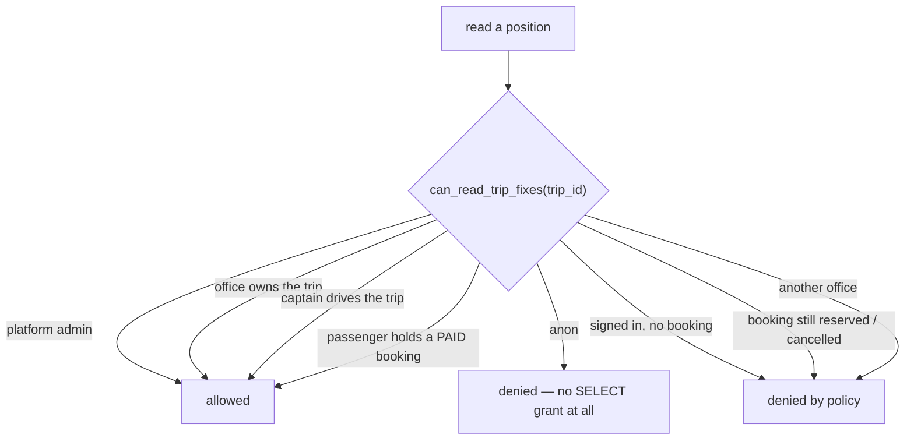

# Tracking Security

Every boundary around "where is the vehicle?", the threat model behind it, and the attacks that
were open before Phase 6.

Verified against the linked database on 2026-07-29 with
`supabase/tests/tracking_authority_regression.sql` — 17 probes, all green.

---

## 1. What is being protected

A live vehicle position is not neutral telemetry. It reveals:

| Disclosure | Who is harmed |
|---|---|
| Where a specific bus is, right now | passengers on board — their location, in real time |
| Where a captain is, all shift | the captain — a stalking and physical-safety exposure |
| Where a competitor's fleet runs, and how well | the operating office — a commercial exposure |
| Which routes actually run, at what frequency | the platform — its operational shape |

The reasonable expectation is that a live position is visible to **the people on that trip and
the office running it**, and to nobody else. That is the boundary this document is about.

---

## 2. The boundary

One question, answered once, server-side:

```sql
public.can_read_trip_fixes(p_trip_id uuid) returns boolean
```

| Party | Admitted when | Why |
|---|---|---|
| Platform admin | `is_platform_admin()` | deliberate; the only unscoped reader on the table |
| Operating office | `trip.office_id = current_office_id()` | the Live Operations Center's fleet |
| Assigned captain | `trip.driver_id = current_driver_id()` | they authored the rows |
| Passenger | a booking of theirs on the trip is `confirmed`/`boarded`/`completed` | they paid for the journey |
| **Everyone else** | — | **no** |



Writes are the mirror image:

```sql
public.can_publish_trip_fix(p_trip_id uuid) returns boolean   -- the assigned captain, only
```

plus the `enforce_live_location_authorship` BEFORE INSERT trigger, which **overwrites**
`driver_id` with the server-resolved captain rather than trusting the payload. Both are kept:
the policy is the boundary, the trigger is what makes the stored row honest.

There is **no UPDATE and no DELETE** — no grant and no policy. A position that was reported is a
fact about where the vehicle was.

### Why the boundary is a `SECURITY DEFINER` function and not an inline policy

This is the design decision that made the whole fix possible, and it is worth stating plainly
because getting it wrong is what left the table open for five phases.

A policy's subqueries are **themselves subject to RLS** on the tables they read. Written the
obvious way:

```sql
using (exists (select 1 from operation_trips t where t.id = trip_id and ...))   -- WRONG
```

this returns `false` for every passenger, because clients hold no read policy on
`operation_trips` at all. The map goes dark, RLS gets blamed for breaking realtime, and the
table gets left open "so realtime works". Answering the question inside a definer function means
the joins run without RLS interference, and the policy body touches nothing but the row's own
`trip_id` — which is also exactly what Realtime needs, since it evaluates the policy per
delivered WAL row.

---

## 3. Threat model

| # | Actor | Capability assumed |
|---|---|---|
| T1 | Anyone who installs the Client app | holds the shipped `anon` key; can issue arbitrary PostgREST calls and open realtime subscriptions |
| T2 | Any registered passenger | T1 plus a valid `authenticated` JWT and their own bookings |
| T3 | A captain | T2 plus an active `drivers` row and assigned trips |
| T4 | A competing office's operator | T2 plus an active `office_users` row in a different office |
| T5 | A curious or malicious employee of the operating office | legitimate access, unbounded appetite |

Trip ids are **not secret**: `public_trips` publishes them to the whole marketplace by design.
No boundary here may rest on a trip id being hard to obtain.

---

## 4. Attack scenarios

### A1 — Track any bus on the platform with no account *(was open; closed)*

**Before.** `trip_live_locations` ran with RLS disabled and `anon` held `SELECT`. Measured:

```
set local role anon;
select count(*), count(distinct trip_id) from public.trip_live_locations;
-- 14 rows, 5 trips
```

An attacker reads trip ids off the public marketplace, subscribes to
`trip_live_locations` filtered by `trip_id` — the table is in the `supabase_realtime`
publication — and follows any vehicle on the platform, in any office, live. No account, no
booking, no interaction with an office at all.

**Now.** `revoke select … from anon`, RLS enabled, `trip_live_locations_read` in force.
Probes 01 and 07: blocked.

### A2 — Track a trip you have not paid for *(was open; closed)*

Register, book nothing (or book and never pay), read positions for any trip id.

**Now.** The policy admits a passenger only for `confirmed`/`boarded`/`completed` — the same
status set the Client app checks in `TrackingTripQuery.trackableStatuses`. A `reserved`
(payment pending) or `cancelled` (payment rejected) booking reads nothing. Probe 07: blocked.

### A3 — Cross-office fleet surveillance *(was open; closed)*

Office B watches Office A's entire fleet move all day, and learns their routes, frequencies and
utilisation.

**Now.** The office arm of the policy matches `current_office_id()` against the trip's own
office. Probe 15: blocked.

### A4 — Forge a vehicle's position *(closed in Phase 5; re-verified)*

Insert fixes for someone else's trip so a passenger watches their bus drive somewhere it is not
— or so an operations board sees a delayed vehicle as on time.

**Now.** `anon` has no INSERT grant; a signed-in non-captain fails `can_publish_trip_fix`; a
captain inserting for another captain's trip is rejected; and a forged `driver_id` in the
payload is overwritten server-side. Probes 03, 08, 10, 11.

### A5 — Erase the fleet's positions *(closed in Phase 5; re-verified)*

`delete from trip_live_locations` and every customer's map goes dark mid-trip.

**Now.** No DELETE or UPDATE grant for either client role, and no policy for either. Probes 04,
12, 13.

### A6 — Empty the incident queue with TRUNCATE *(found in Phase 6; closed for tracking tables)*

**Row-level security does not gate TRUNCATE.** It covers SELECT, INSERT, UPDATE and DELETE
only. Supabase's default grants gave `anon` and `authenticated` TRUNCATE on tables created in
`public`, and every phase of this audit had been reasoning in terms of policies. Measured:

```
set local role authenticated;
truncate public.driver_trip_reports;   -- accepted
truncate public.operation_bookings;    -- privilege check passed; stopped only by a
                                       -- foreign key, which CASCADE bypasses
```

`driver_trip_reports` is the sole feed behind the Live Operations Center's incident board:
emptying it makes every open SOS and breakdown report on the platform disappear from the
operators' screens at once, silently.

**Reachability, honestly.** PostgREST issues no TRUNCATE, so this is *not* reachable with the
anon key over REST the way A1 was. It becomes reachable the moment anything runs
caller-supplied SQL, any `SECURITY INVOKER` function uses dynamic SQL, or the database port is
reachable directly.

**Now.** Revoked on `driver_trip_reports`, `trip_events`, `trip_route_points`,
`trip_passengers` (migration `20260729093000`). Probe 17: blocked.

**Still open elsewhere:** roughly forty-five other tables in `public` — including
`operation_bookings`, `booking_payments`, `clients`, `notifications`, `office_users`,
`user_roles` and `admins` — still carry the same grant. See
[TRACKING_STATUS.md](TRACKING_STATUS.md) §R1.

### A7 — A malicious insider at the operating office *(accepted)*

Not mitigated, and deliberately so: an operator watching their own fleet is the product. The
control is organisational (office staff are named, invited users), not technical.

### A8 — Unbounded movement history *(partially mitigated)*

`trip_live_locations` had no retention. Every fix ever published stays forever, which is a
per-journey movement archive of every passenger the platform has carried — a liability nobody
decided to accept, growing at roughly 25M rows/year for a fifty-vehicle fleet.

`prune_trip_live_locations(retain_days)` now exists (service_role only, skips trips still
running). It is **not yet scheduled** — there is no `pg_cron` on this project. See
[TRACKING_STATUS.md](TRACKING_STATUS.md) §R2.

---

## 5. Grants, as they now stand

| Table | anon | authenticated |
|---|---|---|
| `trip_live_locations` | — (references/trigger only) | `SELECT`, `INSERT` — both policy-gated |
| `trip_progress_events` | — | `SELECT`, `INSERT` — both policy-gated |
| `driver_trip_reports` | — | `SELECT`, `INSERT`, `UPDATE`, `DELETE` — policy-gated; no TRUNCATE |

Functions:

| Function | Executable by |
|---|---|
| `can_read_trip_fixes(uuid)` | `authenticated` |
| `can_publish_trip_fix(uuid)` | `authenticated` |
| `dashboard_active_trip_fixes(uuid)` | `authenticated` (office-gated inside) |
| `prune_trip_live_locations(int)` | `service_role` only |

---

## 6. Running the verification

```bash
supabase db query --linked -f supabase/tests/tracking_authority_regression.sql
```

Runs inside `BEGIN … ROLLBACK`; writes one fix and throws it away. Safe against the
production-bound development database. Every row should read `OK`. Anything reading
`STILL EXPLOITABLE`, `LEAK` or `BROKEN` is a regression.

The suite resolves its cast — captain, paid passenger, outsider, office user, foreign office
user — out of the live database rather than hardcoding ids, and aborts loudly if no trip has
live fixes rather than passing vacuously.

**One trap it encodes.** Forgery probes must not build their row with
`insert … select … from operation_trips`: an outsider holds no read policy there, so the SELECT
returns zero rows, the INSERT stores nothing, and the probe reports "accepted" when nothing
happened. Identities are resolved into a temp `fixture` table as superuser first, and the
probes assert on `row_count`. The first draft of this suite had exactly that false positive.
