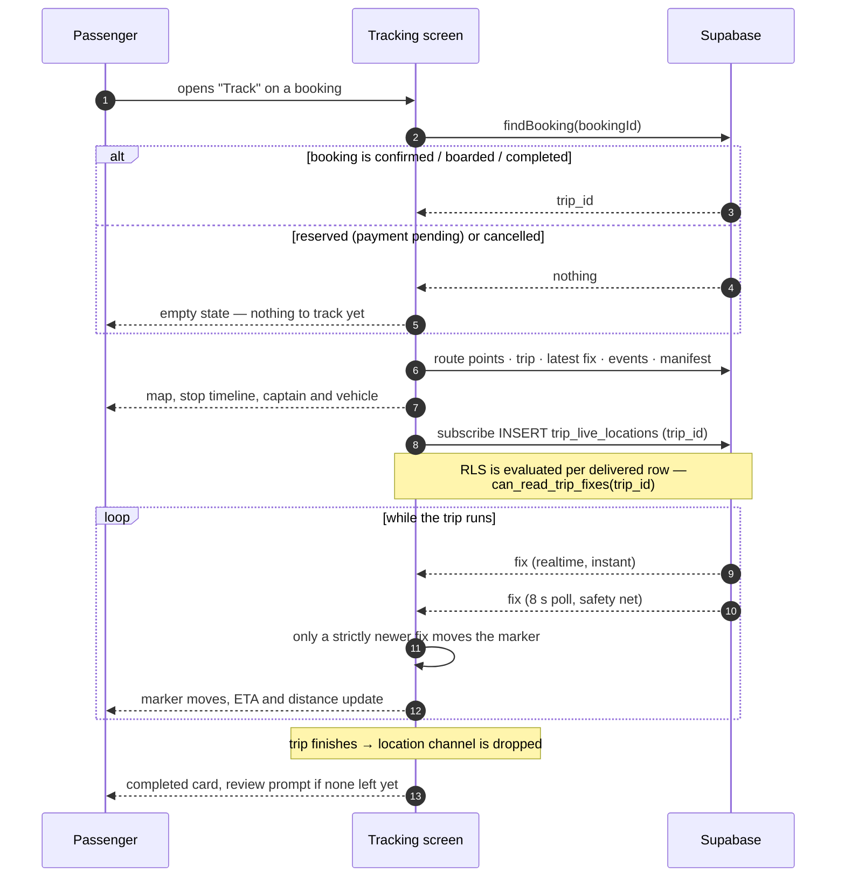
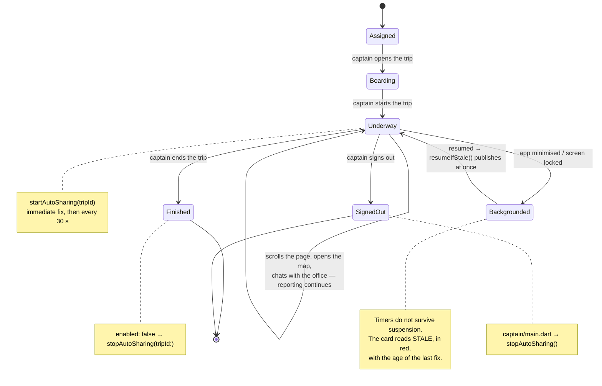
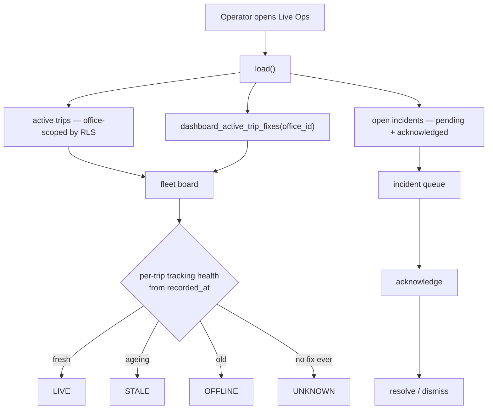

# Tracking User Flows

The journeys, end to end, including the ones that go wrong. Every branch below is a state the
system can actually reach.

---

## 1. Passenger — watching a vehicle arrive

### Where it degrades, and to what

| What happens | What the passenger sees |
|---|---|
| Realtime socket drops | map keeps updating on the 8 s poll — no visible change beyond a slightly coarser step |
| Both paths fail | last known position stays on the map; the signal pill ages and says so |
| Captain stops reporting (tunnel, dead battery, app suspended) | pill goes stale with the age of the last fix; the marker does not lie by drifting |
| Booking not yet paid | empty state, not a map — enforced in the database, so no entry point bypasses it |
| A background refetch fails mid-journey | the screen keeps its good data; the failure does not blank it |

---

## 2. Captain — a trip from departure to arrival

### What the card says, and when

| Health | Condition | Line the captain reads |
|---|---|---|
| `off` | not sharing | «المشاركة التلقائية متوقفة» |
| `acquiring` | sharing, no fix landed yet | «جارٍ تحديد موقعك...» |
| `live` | last fix < 90 s old | «يتم إرسال موقعك كل 30 ثانية» |
| `stale` | last fix ≥ 90 s old | «تعذّر إرسال موقعك — آخر إرسال منذ …» + red border |
| — | ≥ 2 consecutive failed sends | «فشل آخر N محاولات إرسال — خريطة الركاب متوقفة» |

The threshold is `3 × kAutoLocationInterval`, derived from the cadence rather than written as a
literal, so changing the cadence cannot silently leave the staleness rule behind.

**The rule this encodes:** health is computed from *when a fix last landed*, never from whether
a timer object exists. A captain in a tunnel, with permission revoked mid-trip, or on a dead
signal used to read a card claiming "every 30 seconds" while every send had failed for twenty
minutes.

### Failure branches

| What happens | What the captain sees | What the system does |
|---|---|---|
| Location services off | «فعّل خدمة الموقع في الهاتف ثم حاول مرة أخرى.» | next tick retries |
| Permission denied | «يلزم السماح بالوصول للموقع…» | next tick retries; permission is re-requested |
| Permission denied forever | «صلاحية الموقع مرفوضة نهائياً. فعّلها من إعدادات التطبيق.» | retries stay honest — the card never claims live |
| No network | the failure text, inline, under the last good fix | next tick retries; ≥ 2 in a row escalates to the failure line |
| GPS acquisition exceeds 20 s | that tick is skipped, not queued | `_sending` guard prevents overlap |
| Trip is not this captain's | «لم يتم تعيين سائق ومركبة لهذه الرحلة.» | the database refuses it too |

---

## 3. Office operator — the live board

`UNKNOWN` and `OFFLINE` are different facts and are shown as such: a trip that never reported
once is a captain who has not started sharing; a trip that reported and stopped is a captain who
has lost signal, lost battery, or backgrounded the app. Collapsing them would cost the operator
the only clue about which one to call.

### Where it degrades

| What happens | What the operator sees |
|---|---|
| A trip has no fixes at all | `UNKNOWN`, not a missing row — the trip stays on the board |
| Every trip is quiet | the board renders with health badges, not an empty state — quiet is information |
| The fixes RPC fails | trips still render; positions are absent rather than the board failing |
| Signed-out race | the RPC returns an empty set, never an error — the board degrades to "no positions" rather than a red screen |

---

## 4. Platform admin — investigating

1. Reads any office's positions — `is_platform_admin()` is the one unscoped arm of
   `can_read_trip_fixes`.
2. Runs `supabase/tests/tracking_authority_regression.sql` to confirm the boundaries still hold
   after any schema change.
3. Calls `prune_trip_live_locations(days)` as `service_role` to bound retention — **manually**,
   because nothing schedules it yet.

---

## 5. The flows that do not exist yet

Named here so they are not mistaken for oversights in the diagrams above:

- **Arrival proximity push** — no notification when a vehicle nears a passenger's stop.
- **Background publishing** — a minimised captain app stops reporting.
- **Offline fix queue** — a fix taken with no signal is dropped, not stored and replayed.
- **Breadcrumb history** — no flow draws where a vehicle *has been* over a trip.
- **Tracking-loss alerting** — health is displayed on the board, never pushed to an operator.

See [TRACKING_STATUS.md](TRACKING_STATUS.md) for what each would cost.
